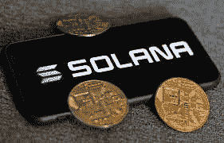

# 如何在 2022 年成为 Solana 区块链开发者

> 原文：<https://medium.com/coinmonks/how-to-become-a-solana-blockchain-developer-in-2022-cfc38f1370b9?source=collection_archive---------8----------------------->

我已经和 Solana 接触了一分钟——主要是把东西分解，看看网络是如何工作的。以下是我遇到的一些免费资源，如果你正准备开始兔子洞之旅，这些资源会对你有用。

## 技能组合

> 这个技能列表并不详尽，并且会根据你所从事的项目类型而有所不同。这些完全基于我在生态系统中的经验，并不意味着你需要学习所有列出的技能。

因为 Solana 开发者生态系统还很年轻，目前存在严重的资源短缺。我设想，随着采用的增加和更多的开发人员接受 Solana，这将在不久的将来发生巨大的变化。

**核心技能**

1.  Javascript — React 或 NextJs
2.  以打字打的文件
3.  Rust——如果你正在构建任何严肃的东西，尤其是定制合同，你需要对 Rust 有一个健康的理解。事情就是这样。Rust 是一种很酷的语言，但是提前抱歉。
4.  Solana 区块链技术——你需要了解东西是如何工作的，比如账户的有用性，以及数据的状态是如何管理的。学会它或者以后受苦。
5.  测试——你必须知道如何测试你的合同。这相当简单，类似于单元测试的工作方式。如果你有这样的背景，你应该觉得很有家的感觉。
6.  耐心。很有耐心。这不言而喻。当我写这篇文章时，索拉纳区块链已经是一年内第八次衰退了。这导致了所有涉及非功能性甲状腺炎的交易在夏季结束前暂停。不用说，这阻碍了开发人员的生产力。然而，你必须记住，索拉纳仍然处于它的早期。如果你已经选择了索拉纳作为你的主链，你应该准备好戴上一顶先锋的帽子。请耐心一杯，我的朋友。

**值得注意的提及**

1.  Python。一些比我聪明的人已经开始用 Python 来访问 solana。我尝试过它们，但正如可以从这样一个年轻的技术中预料到的，这个难题有许多缺失的部分。我坚信，随着时间的推移，事情会变得更好，在几个月后，你可能不需要学习 Javascript(如果你还不知道的话)来参与在索拉纳区块链上开发你的 dApp。
2.  [Solana-py](https://michaelhly.github.io/solana-py/)——Solana-py 的创造者迈克尔简直太棒了。他的工作有据可查，易于使用！如果你喜欢冒险，你可以和 anchor.py 一起尝试他的图书馆。

## 证明文件

1.[**索拉纳**](https://docs.solana.com/?utm_source=solana.com)

[这个](https://docs.solana.com/?utm_source=solana.com)应该是你的切入点。当你一头扎进去的时候，有很多胡言乱语，但是很明显这些文档是经过深思熟虑的，写得非常好。我会从这里开始。

2.[**Metaplex**](https://docs.metaplex.com/?utm_source=solana.com) **[**Metaplex**](https://docs.metaplex.com/?utm_source=solana.com)很牛逼，会让你的生活轻松很多。它是一个工具、智能契约的集合，旨在简化创建和启动 NFTs 的过程。**

**3.[**Arweave**](https://www.arweave.org/build)
Arweave 网络提供上传数据到永久网(permaweb)的协议。您可以通过简单的 HTTP 调用，使用社区开发的流行语言库与网络进行交互。**

**4.如果没有 Anchor，你将不得不从头开始开发你所有的智能合约，如果你不熟悉 Rust 的话，这会有点麻烦。Anchor 抽象了许多令人头痛的问题，并附带了许多开发人员工具。**

**5.SolanaPay 是那些你知道将会大受欢迎的项目之一。开发者可以很容易地将分散支付整合到他们的应用和服务中。你也可以用它建立一个服务点支付系统。相信我，这是毒品。如果你想开始，请查看 buildspace 的这个教程，它展示了如何在 Next.js 中用 Solana Pay 实现你自己的商店！以后谢谢我。**

**6. [**幻影钱包**](https://docs.phantom.app/)
[幻影](https://docs.phantom.app/)是一款非常受欢迎的钱包，用于在索拉纳区块链上处理资产和访问分散的应用程序。**

## **书**

1.  **[索拉纳食谱](https://solanacookbook.com/#how-to-read-the-cookbook)**
2.  **[锈郎](https://doc.rust-lang.org/book/title-page.html)**
3.  **[铁锈食谱](https://rust-lang-nursery.github.io/rust-cookbook/)**
4.  **[货物指南](https://doc.rust-lang.org/cargo/)**

**我喜欢书。他们描绘了整个故事，而不是视频。现在，我只完成了上面列出的前两个，我正在积极阅读其他两个，但我可以向你保证，所花的时间是非常值得的！**

## **视频资源**

1.  **[索拉纳基金会](https://www.youtube.com/c/SolanaFndn/playlists)**
2.  **[与索拉纳建立智能合同&拉斯特朗](https://www.youtube.com/watch?v=gA7hFdq2h9Q&list=PL41Cw3fN3CfdbmhgxADwyDyIoDrxc22v2)**
3.  **[亨利·E 的索拉纳视频](https://www.youtube.com/user/hendazzler/videos)**
4.  **[锈郎书预排](https://www.youtube.com/watch?v=OX9HJsJUDxA&list=PLai5B987bZ9CoVR-QEIN9foz4QCJ0H2Y8)**

**这些都是不同长度的顶级物品。不适合胆小的人。但是，嘿，你正在读这篇文章，所以你肯定不是胆小。**

## **必读文章**

1.  **[索拉纳发育完全指南](https://dev.to/edge-and-node/the-complete-guide-to-full-stack-solana-development-with-react-anchor-rust-and-phantom-3291)**
2.  **[介绍索拉纳·区块链的概念](https://2501babe.github.io/posts/solana101.html)**
3.  **[通过 5 个简单的步骤创建索拉纳令牌](https://moralis.io/how-to-create-a-solana-token-in-5-steps/)**
4.  **虚构的东西！！！！**
5.  **[索拉纳杜撰的文章](https://learn.figment.io/tutorials)**
6.  **[与 Paul 一起构建托管服务](https://paulx.dev/blog/2021/01/14/programming-on-solana-an-introduction/)**
7.  **[索拉纳新闻](https://solana.com/news)**

**我能说的是，这些文章在我的旅程中帮助了我，我强烈建议你一遍又一遍地阅读它们，以理清 web3 的泥潭。**

## **您必须加入的社区**

1.  **[Sol Dev](https://soldev.app/?utm_source=solana.com)**
2.  **[索拉纳科技](https://discord.com/invite/pquxPsq)**
3.  **[索拉纳论坛](https://forums.solana.com/)**
4.  **[建筑空间不和](https://discord.gg/w7YJ6Q3n)**
5.  **[幻影 Dev](https://docs.google.com/forms/d/e/1FAIpQLSfKRU4Xj3sFYnF0mj8lEo-eUPzIn4-wrnCFi8k7ibidClM7pQ/viewform) (需要申请加入)**

**你应该加入这些社区的原因是因为这是所有奇迹发生的地方。我注意到，当谈到 web3 时，想法在公开发布到 github repos 之前就在 discord 频道中被烹饪了。大多数为区块链构建基础设施的人(至少对于 solana 来说)更喜欢使用 discord 服务器来解决问题和建立社区存在。我不能过分强调加入这些服务器的重要性。你可能会与真正塑造索拉纳·区块链未来的人们实时互动，解决数小时的谷歌搜索无法解决的问题。**

## **灵感——社区项目**

1.  **[茄属生态系统](https://solana.com/ecosystem)**

**我不知道人们是如何做到的，但你会惊讶于人们在这个领域所做的应用和项目的份额。向所有开发者致敬，通过提供这些即插即用的基础设施，我们的生活变得更加轻松！有借贷系统、市场、浏览器、游戏赚取、入口系统等等。**

## **您必须了解的服务**

1.  **[RPC 基础设施](https://solana.com/rpc)**

**嗯，整个 Solana 基础设施是通过 RPC 端点公开提供的，RPC 端点是 all 的缩写。老实说，这让我百思不得其解，在这一点上，我认为只有当你从零开始构建你的代码库，而不依赖于诸如 metaplex 和 anchor 之类的设置来与你的区块链合同进行交互时，它才是有用的。**

> **加入 Coinmonks [电报频道](https://t.me/coincodecap)和 [Youtube 频道](https://www.youtube.com/c/coinmonks/videos)了解加密交易和投资**

## **职业机会**

1.  **[靠虚构的东西挣钱](https://learn.figment.io/protocols/solana)**
2.  **[索拉纳招聘](https://jobs.solana.com/jobs)**
3.  **[Buildspace 合作伙伴](https://buildspace.so/jobs)**

**我接触过的大多数关于 web3 的人似乎认为，web3verse 的工作空间只属于那些对区块链如何运作有技术知识的人。这与事实相去甚远。事实上，我认为 web2 和 web3 之间的唯一区别是所使用的认证系统的种类。这太简单了，但问题的关键是要构建的东西本质上是一样的。web3verse 仍然需要产品经理、UI 和 UX 设计师、Scrum masters、Android 开发人员、文案、前端开发人员等等。好的一面是，如果你已经掌握了这些技能，并把它们引入了一个 web3 企业，你就真的早到了，而且会立即得到回报，因为有技能的人的数量是相当有限的。**

**所以，今天就开始你的 web3 之旅吧！**

**如果你建立了一些很酷的东西，一定要标记我！**