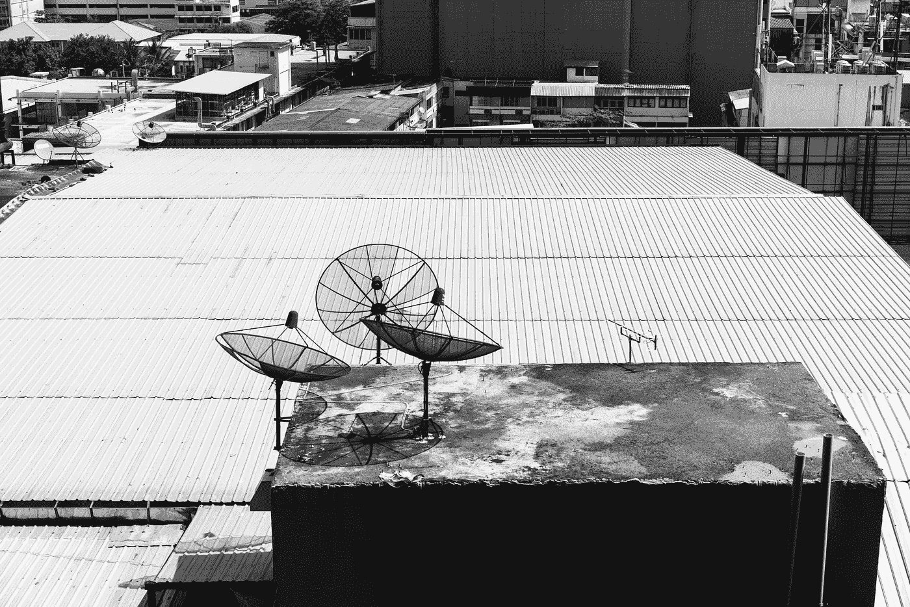

# 如何在 2022 年成为 Web3 开发者

> 原文：<https://medium.com/coinmonks/how-to-become-a-web3-developer-in-2022-8882e683213c?source=collection_archive---------1----------------------->

Web3 是区块链的技术，旨在提供数据和代码的去中心化和开源。这是一项面向未来的技术，将在许多方面改变我们的生活。借助其提供的智能合约，Web3 正在社会上留下自己的印记。由于这些合同，用户将能够购买股票，转移资产，或在没有任何中间人的情况下创办公司。