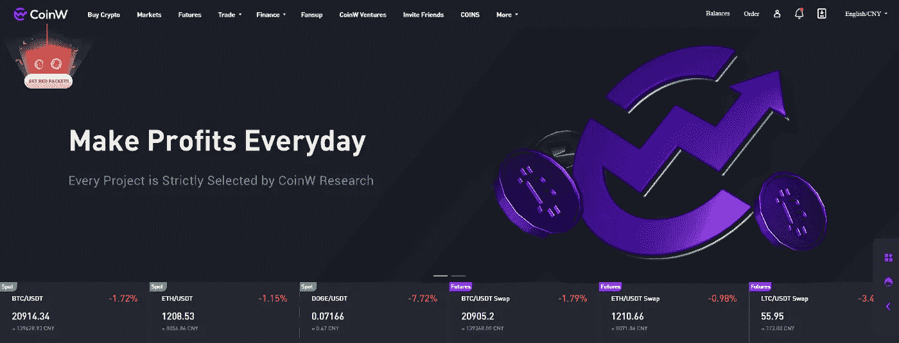
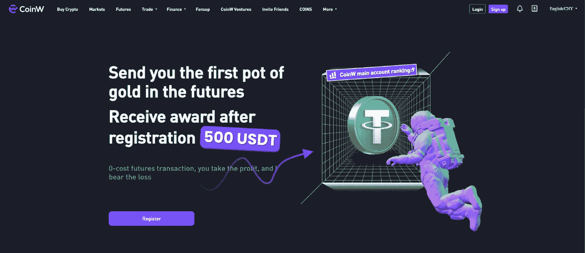
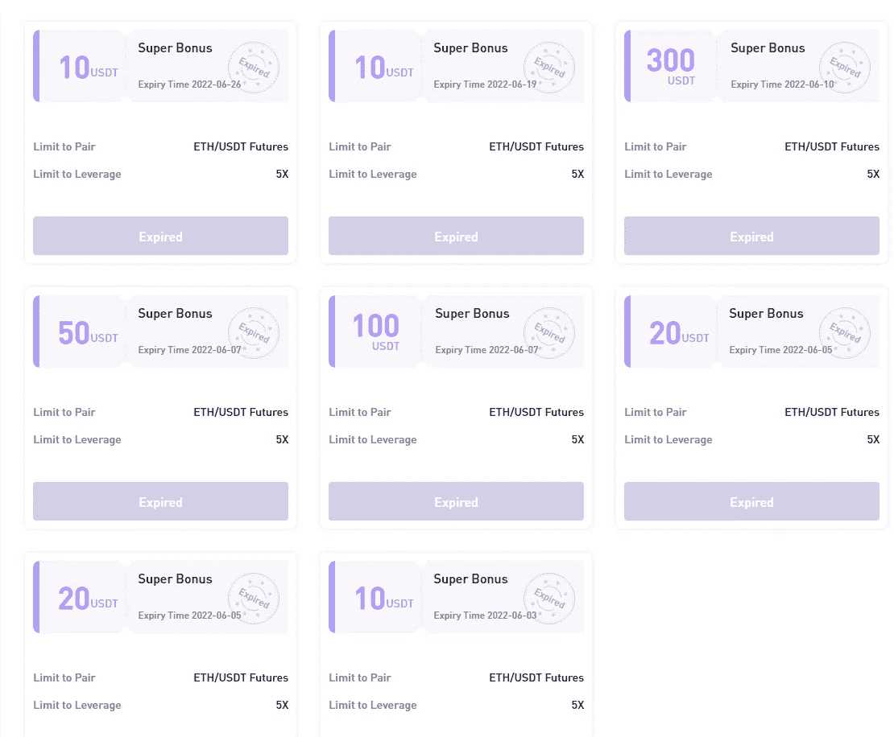
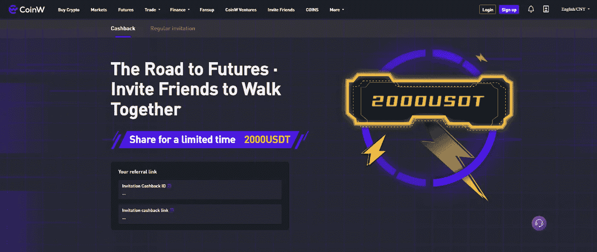

# 如何成为大使，并在 CoinW 交易所从“零”美元到“十万美元”赚钱

> 原文：<https://medium.com/coinmonks/how-to-become-ambassador-and-make-money-from-zero-usd-to-hundred-thousand-usd-on-the-coinw-e80cab45575c?source=collection_archive---------9----------------------->

在市场低迷的情况下，大多数投资者和交易者没有从市场交易点获得被动收入。然而，尽管市场低迷，他们仍有策略赚取其他被动收入，而不是交易点。阐明他们的过程，知道他们的过程是什么？**如何成为大使，在 CoinW 交易所从“零”美元到“十万美元”赚钱？**下面来看看这个帖子吧！

# 什么是 CoinW exchange？

CoinW.com

CoinW exchange 是一家成立于 2017 年的中央交易所，为全球超过 800 万用户提供期货交易和许多其他服务。到目前为止，CoinW exchange 已经支持四种不同的语言，即越南语、中文、韩语和英语。

此外，CoinW 交易所目前支持超过 304 种货币和 353 个交易对，并且这一数字还在不断增长。

# 通过成为 CoinW 的大使获得

CoinW exchange 创建了大使计划，以鼓励投资者参与并为许多人创造就业机会。参与者通过推荐客户、追随者和朋友来赚钱，并通过使用您的推荐链接或小工具完成的每一次成功购买来赚钱。对于每笔交易费，大使将从您的代码交易费中获得 50%的佣金。一旦你有了这些，你就可以开始了。

# 这个程序是如何工作的？

要完成这个程序，我们必须完成以下四个步骤:

# 第一步:创建你的大使账户

要成为 CoinW 交流大使，您需要通过[这个链接](https://www.coinw.com/front/invitePublicity?r=1632236&language=en_US)注册您的帐户，然后点击注册。

Step 1

# 第二步:KYC 自己，并收到 50 USDT 在期货钱包

注册成功后，您可以 KYC 自己，以获得如下图所示的奖金。

Step 2

# 第三步:通过链接邀请你的朋友或会员

最后一步是点击“邀请朋友”并带着你的“邀请返现链接”发送给你的客户和你的朋友。

Step 3

# 佣金率和退款/折扣

在第一个月，您将从每笔交易中获得 50%的参考代码交易。如果您的代码有超过 300.000 USDT 的交易量，您将从您的代码中获得 70%的交易费。如果您的交易量更大，您可以获得 100 到 1000 美元的稳定币奖励。

# 结论

硬币交易所在中国、印度和韩国非常受欢迎。意思是在其他国家。CoinW 交流是相当新的，所以大使们将有更多的机会工作。努力工作会让你有更多的钱。我们先试试这个，我会在下一个帖子里给你展示更多不同的赚钱方法。我的一个朋友在一个月内从这个项目中获得了超过 10000 美元。因为你不会失去任何东西，你应该尝试一次。祝你投资之旅成功。祝您愉快！！！

以上就是**如何成为大使，如何在 CoinW 交易所从“零”美元赚到“十万美元”**。如果你对我有任何问题，请在本帖下方评论；我会为你写下他们。别忘了跟随我的媒介。祝你投资之旅成功。

> 加入 Coinmonks [电报频道](https://t.me/coincodecap)和 [Youtube 频道](https://www.youtube.com/c/coinmonks/videos)了解加密交易和投资

# 另外，阅读

*   [分散交易所](https://coincodecap.com/what-are-decentralized-exchanges) | [比特 FIP](https://coincodecap.com/bitbns-fip) | [Pionex 评论](https://coincodecap.com/pionex-review-exchange-with-crypto-trading-bot)
*   [用信用卡购买密码的 10 个最佳地点](https://coincodecap.com/buy-crypto-with-credit-card)
*   [最好的卡达诺钱包](https://coincodecap.com/best-cardano-wallets) | [Bingbon 副本交易](https://coincodecap.com/bingbon-copy-trading)
*   [如何给 MetaMask 钱包添加 Arbitrum？](https://coincodecap.com/how-to-add-arbitrum-to-metamask-wallet)
*   [KuCoin vs 北海巨妖 vs BitYard](https://coincodecap.com/kucoin-vs-kraken-vs-bityard)
*   [加密交易的最佳 VPN](https://coincodecap.com/best-vpns-for-crypto-trading)