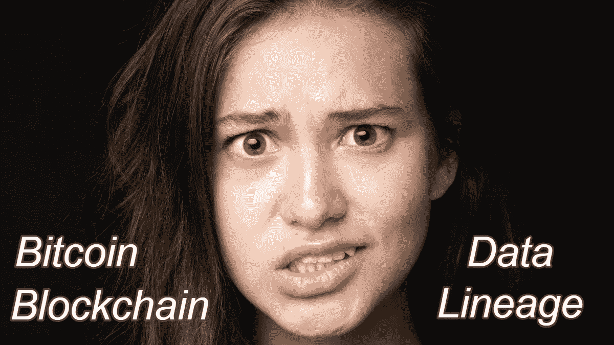

# 如何分解区块链，展现数据血统的价值

> 原文：<https://medium.com/coinmonks/how-to-break-down-blockchain-and-show-the-value-of-data-lineage-1177a91fa574?source=collection_archive---------6----------------------->

比特币、区块链和数据血统。

追踪数据可能是一项相当棘手的挑战。毕竟，数据是通过门飞进来的，一旦进入大楼，它就会四处移动。它从一个系统传到另一个系统，然后又回到客户、监管者和供应商那里。数据沿袭是指在信息的无数旅程中对其进行跟踪…