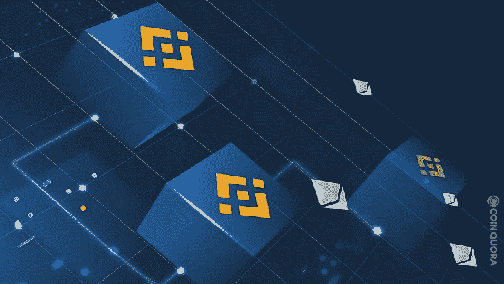

# 如何在以太坊和币安智能链之间搭建去中心化的令牌桥？

> 原文：<https://medium.com/coinmonks/how-to-build-a-decentralized-token-bridge-between-ethereum-and-binance-smart-chain-58de17441259?source=collection_archive---------0----------------------->



区块链技术不断发展，自 2008 年中本聪向世界推出第一种加密货币比特币以来，它已经发生了重大变化。比特币带来了区块链技术。此后，多个区块链平台相继推出。每个区块链都有独特的特性和功能，以填补区块链技术与其现实世界之间的差距。尽管区块链有着惊人的好处，比如它的去中心化性质、记录的不变性、分布式分类账和智能合约技术，但一个主要障碍仍然影响着区块链的大规模采用，这就是缺乏互操作性。

尽管公共区块链保持了链上数据的透明性，但它们的孤岛性质限制了区块链在分散金融和许多其他行业中的整体利用。区块链具有用户经常希望一起使用的独特功能。然而，这似乎是不可能的，因为这些区块链在他们孤立的生态系统中独立工作，并遵守他们自己独特的共识规则。独立的区块链不能相互交流信息或价值。

由于区块链网络的扩展和越来越多的 DeFi 项目跨链进行，互操作性问题变得至关重要。与此同时，区块链这种封闭的本质与去中心化的核心原则相矛盾，去中心化的核心原则是让每个人都能接触到区块链。这种互操作性的缺乏有什么解决办法吗？以太坊网络的人如何访问像币安这样的不同区块链上的数据和资源？这就是桥接解决方案或区块链桥的发展方向。

让我们在本文中探索桥接解决方案及其工作机制。此外，我们还将学习在以太坊和币安智能链这两个流行的区块链之间建立一个去中心化的令牌桥。

> *交易新手？试试* [*密码交易机器人*](/coinmonks/crypto-trading-bot-c2ffce8acb2a) *或* [*复制交易*](/coinmonks/top-10-crypto-copy-trading-platforms-for-beginners-d0c37c7d698c)

# 什么是区块链桥？

区块链桥实现了在不同共识机制下运作的两个独特的区块链之间的互操作性和连通性。更明确地说，区块链大桥允许两个不同的区块链相互影响。区块链可以在两个独立的区块链之间来回共享智能合同执行指令、传输令牌以及共享数据和资源，因为它们不再受来源的限制。这些区块链甚至可以访问链外数据，比如访问股票市场的实时图表。一些广泛使用的区块链大桥有 xPollinate、Matic Bridge、币安大桥。块链桥为用户提供了以下好处:

*   用户可以利用两个独立的区块链的优势来创建 dApps，而不仅仅是来自托管的区块链。这意味着用户可以在 Solana 上部署 dApp，并且可以使用 Ethereum 的智能合同技术驱动 dApp。
*   用户可以将代币从一个交易成本高的区块链转移到另一个交易成本相对较低的区块链。
*   凭借即时转移令牌的能力，用户可以在不需要中介帮助的情况下，快速从易变性密码货币转换为稳定货币。
*   人们也可以在不同区块链的分散应用程序上托管数字资产。例如，您可以在区块链卡达诺创建 NFT，并在 Ethereum 市场托管它们。
*   桥接允许用户跨多个区块链生态系统执行 dAPPs。

# 什么是块链桥？

要了解区块链桥是如何工作的，我们首先需要知道有多少种类型存在。目前，有两种类型的区块链桥；联邦桥和不可信桥。现在，让我们了解他们的工作机制。

## 联邦桥

联邦桥也被称为集中桥。它本质上是一种集中交换，用户与一个池交互，池有时可以是公司或中间人。如果对 Ether 和 BNB 进行令牌传输，将会有两个大池；一种含有 BNB，另一种含有乙醚。发送方一使用 Ether 启动传输，就会将 Ether 添加到池中，然后池会从第二个池中向发送方发送等量的 BNB。中央权力机构收取少量费用来规范这一过程。然而，这个费用很小，用户可以很方便地支付。

## 不可靠的桥梁

这些纯粹是分散的桥梁，消除了任何第三方的作用。无信任的区块链·布里奇斯甚至不使用 API 来管理燃烧和铸造令牌的过程。相反，智能合同在这方面起着关键作用。当用户通过无信任桥启动令牌传输时，智能合同会冻结他当前的密码，并在新网络上向他提供等效令牌的副本。智能合同然后铸造令牌，因为它知道用户已经冻结或烧毁了另一个网络上的令牌。

# 桥接解决方案的主要特征是什么？

## 锁和薄荷

代币并不是真的通过区块链大桥转移的。当用户将令牌转移到另一个区块链时，会发生两个阶段的过程。首先，令牌在当前区块链上被冻结。然后，在接收区块链上铸造等值的代币。因此，如果用户想要兑换令牌，桥就烧掉等价的令牌来解锁原始值。

## 基于信任的解决方案

基于信任的分散式区块链桥很受欢迎，尽管它们包括“商家”或受信任的保管人。托管人通过钱包控制资金(代币),并帮助简化代币转移过程。因此，在许多区块链网络中保持了高度的灵活性。

## 辅助侧链

一座桥连接着两个不同的区块链，一座侧链桥连接着父区块链和子区块链。由于父区块链和子存在于不同的链上，它们需要一个区块链桥来通信或共享数据。

## 稳健的管理

网桥验证器充当网络操作者。这些运营商发布相应的令牌，以换取他们通过特殊的智能合约从另一个网络收到的令牌。

## 交叉链侧枝

跨链担保品帮助用户以较低的费用将资产从一个有重大价值的区块链转移到另一个。早些时候，用户只允许从他们的本地链借用资产。现在，他们可以通过需要额外流动性的区块链桥进行跨链借贷。

## 效率

区块链桥授权监管自发的微转移。这些转移在不同的区块链之间以可行的名义利率瞬间发生。

# 为什么需要桥接解决方案？

以下是区块链桥或桥接解决方案至关重要的三大原因:

## 多区块链令牌传输

区块链大桥最明显也是最关键的作用是它使得跨区块链的交流成为可能。用户可以立即在想要的区块链上铸造代币，而无需使用任何昂贵或耗时的交换过程。

## 发展

区块链桥通过利用彼此的能力来帮助各种区块链发展。例如，以太坊的功能在 BSC 上是不可用的。桥接解决方案让他们作为团队成员一起工作和成长，以解决区块链领域出现的挑战。

## 交易费用

有人需要过渡性解决方案背后的最后一个重要原因是交易费，在流行的区块链交易费通常很高。相比之下，较新的区块链不会强加很高的交易成本，尽管它们缺乏安全性和其他主要功能。因此，网桥允许人们以相对较低的成本访问新网络、向该网络传送令牌以及处理交易。

# 如何在以太坊和币安智能链之间搭建去中心化的令牌桥？


通过这个循序渐进的过程，你将学习如何使用 solidity 编程语言在以太坊和币安智能链之间建立一个完全去中心化的桥梁。虽然许多区块链桥使用 API 来传输令牌和信息，但 API 很容易受到黑客攻击，一旦被黑客攻击，就会发送虚假的交易。因此，我们将通过从机制中移除 API 来使桥完全去中心化。

我们允许桥脚本生成一个已签名的消息，契约将在验证签名后接收该消息来铸造令牌。该契约还确保消息是唯一的，并且以前没有被使用过。通过这种方式，您将签名的消息交给用户，他们负责将消息提交给区块链，进行造币和支付交易费用。

## 首先，使用以下函数为桥基设置智能合同

```
import '@openzeppelin/contracts/token/ERC20/IERC20.sol';
import './Itoken.sol';
contract BridgeBase {
address public admin;
IToken public token;
mapping(address => mapping(uint => bool)) public processedNonces;
enum Step { Burn, Mint }
event Transfer(
address from,
address to,
uint amount,
uint date,
uint nonce,
bytes signature,
Step indexed step
);
constructor(address _token) {
admin = msg.sender;
token = IToken(_token);
}
function burn(address to, uint amount, uint nonce, bytes calldata signature) external {
require(processedNonces[msg.sender][nonce] == false, 'transfer already processed');
processedNonces[msg.sender][nonce] = true;
token.burn(msg.sender, amount);
emit Transfer(
msg.sender,
to,
amount,
block.timestamp,
nonce,
signature,
Step.Burn
);
}
function mint(
address from,
address to,
uint amount,
uint nonce,
bytes calldata signature
) external {
bytes32 message = prefixed(keccak256(abi.encodePacked(
from,
to,
amount,
nonce
)));
require(recoverSigner(message, signature) == from , 'wrong signature');
require(processedNonces[from][nonce] == false, 'transfer already processed');
processedNonces[from][nonce] = true;
token.mint(to, amount);
emit Transfer(
from,
to,
amount,
block.timestamp,
nonce,
signature,
Step.Mint
);
}
function prefixed(bytes32 hash) internal pure returns (bytes32) {
return keccak256(abi.encodePacked(
'\x19Ethereum Signed Message:\n32',
hash
));
}
function recoverSigner(bytes32 message, bytes memory sig)
internal
pure
returns (address)
{
uint8 v;
bytes32 r;
bytes32 s;
(v, r, s) = splitSignature(sig);
return ecrecover(message, v, r, s);
}
function splitSignature(bytes memory sig)
internal
pure
returns (uint8, bytes32, bytes32)
{
require(sig.length == 65);
bytes32 r;
bytes32 s;
uint8 v;
assembly {
// first 32 bytes, after the length prefix
r := mload(add(sig, 32))
// second 32 bytes
s := mload(add(sig, 64))
// final byte (first byte of the next 32 bytes)
v := byte(0, mload(add(sig, 96)))
}
return (v, r, s);
}
}
```

## 在构建和部署桥基础代码之后，使用下面的代码部署币安桥

```
pragma solidity ^0.8.0;
import './BridgeBase.sol';
contract BridgeBsc is BridgeBase {
constructor(address token) BridgeBase(token) {}
}
```

## 接下来，部署分散令牌桥的另一个组件；以太坊令牌桥使用以下代码。

```
pragma solidity ^0.8.0;
import './BridgeBase.sol';
contract BridgeEth is BridgeBase {
constructor(address token) BridgeBase(token) {}
}
```

## 完成合同后，使用以下代码铸造并烧毁 IToken:

```
pragma solidity ^0.8.0;
interface IToken {
function mint(address to, uint amount) external;
function burn(address owner, uint amount) external;
}
```

## 接下来，在创建并烧录 IToken 之后，对迁移进行编程:

```
// SPDX-License-Identifier: MIT
pragma solidity >=0.4.22 <0.9.0;
contract Migrations {
address public owner = msg.sender;
uint public last_completed_migration;
modifier restricted() {
require(
msg.sender == owner,
"This function is restricted to the contract's owner"
);
_;
}
function setCompleted(uint completed) public restricted {
last_completed_migration = completed;
}
}
```

## 现在，为令牌库编写智能合约。

```
pragma solidity ^0.8.0;
import '@openzeppelin/contracts/token/ERC20/ERC20.sol';
contract TokenBase is ERC20 {
address public admin;
constructor(string memory name, string memory symbol) ERC20(name, symbol) {
admin = msg.sender;
}
function updateAdmin(address newAdmin) external {
require(msg.sender == admin, 'only admin');
admin = newAdmin;
}
function mint(address to, uint amount) external {
require(msg.sender == admin, 'only admin');
_mint(to, amount);
}
function burn(address owner, uint amount) external {
require(msg.sender == admin, 'only admin');
_burn(owner, amount);
}
}
```

## 部署令牌库后，使用给定代码在币安智能链上部署令牌:

```
pragma solidity ^0.8.0;
import './TokenBase.sol';
contract TokenBsc is TokenBase {
constructor() TokenBase('BSC Token', 'BTK') {}
}
```

## 接下来，使用给定的代码在以太坊上部署令牌:

```
pragma solidity ^0.8.0;
import './TokenBase.sol';
contract TokenEth is TokenBase {
constructor() TokenBase('ETH Token', 'ETK') {}
}
```

## 在币安智能链和以太坊上部署令牌后，我们将对迁移功能进行编程:

```
const Migrations = artifacts.require("Migrations");
module.exports = function (deployer) {
deployer.deploy(Migrations);
};
```

## 现在，部署以太坊和币安智能链之间的桥梁。

```
const TokenEth = artifacts.require('TokenEth.sol');
const TokenBsc = artifacts.require('TokenBsc.sol');
const BridgeEth = artifacts.require('BridgeEth.sol');
const BridgeBsc = artifacts.require('BridgeBsc.sol');
module.exports = async function (deployer, network, addresses) {
if(network === 'ethTestnet') {
await deployer.deploy(TokenEth);
const tokenEth = await TokenEth.deployed();
await tokenEth.mint(addresses[0], 1000);
await deployer.deploy(BridgeEth, tokenEth.address);
const bridgeEth = await BridgeEth.deployed();
await tokenEth.updateAdmin(bridgeEth.address);
}
if(network === 'bscTestnet') {
await deployer.deploy(TokenBsc);
const tokenBsc = await TokenBsc.deployed();
await deployer.deploy(BridgeBsc, tokenBsc.address);
const bridgeBsc = await BridgeBsc.deployed();
await tokenBsc.updateAdmin(bridgeBsc.address);
}
};
```

## 一旦部署了桥，就部署分散式桥:

```
const TokenBsc = artifacts.require('./TokenBsc.sol');
module.exports = async done => {
const [recipient, _] = await web3.eth.getAccounts();
const tokenBsc = await TokenBsc.deployed();
const balance = await tokenBsc.balanceOf(recipient);
console.log(balance.toString());
done();
}
```

## 接下来，编写侦听传输事件的桥 API:

```
const Web3 = require('web3');
const BridgeEth = require('../build/contracts/BridgeEth.json');
const BridgeBsc = require('../build/contracts/BridgeBsc.json');
const web3Eth = new Web3('url to eth node (websocket)');
const web3Bsc = new Web3('https://data-seed-prebsc-1-s1.binance.org:8545');
const adminPrivKey = '';
const { address: admin } = web3Bsc.eth.accounts.wallet.add(adminPrivKey);
const bridgeEth = new web3Eth.eth.Contract(
BridgeEth.abi,
BridgeEth.networks['4'].address
);
const bridgeBsc = new web3Bsc.eth.Contract(
BridgeBsc.abi,
BridgeBsc.networks['97'].address
);
bridgeEth.events.Transfer(
{fromBlock: 0, step: 0}
)
.on('data', async event => {
const { from, to, amount, date, nonce, signature } = event.returnValues;
const tx = bridgeBsc.methods.mint(from, to, amount, nonce, signature);
const [gasPrice, gasCost] = await Promise.all([
web3Bsc.eth.getGasPrice(),
tx.estimateGas({from: admin}),
]);
const data = tx.encodeABI();
const txData = {
from: admin,
to: bridgeBsc.options.address,
data,
gas: gasCost,
gasPrice
};
const receipt = await web3Bsc.eth.sendTransaction(txData);
console.log(Transaction hash: ${receipt.transactionHash});
console.log( Processed transfer: - from ${from} - to ${to} - amount ${amount} tokens - date ${date} - nonce ${nonce} );
});
```

## 现在，将私钥函数部署到以太坊桥。

```
const BridgeEth = artifacts.require('./BridgeEth.sol');
const privKey = 'priv key of sender';
module.exports = async done => {
const nonce = 1; //Need to increment this for each new transfer
const accounts = await web3.eth.getAccounts();
const bridgeEth = await BridgeEth.deployed();
const amount = 1000;
const message = web3.utils.soliditySha3(
{t: 'address', v: accounts[0]},
{t: 'address', v: accounts[0]},
{t: 'uint256', v: amount},
{t: 'uint256', v: nonce},
).toString('hex');
const { signature } = web3.eth.accounts.sign(
message,
privKey
);
await bridgeEth.burn(accounts[0], amount, nonce, signature);
done();
}
```

## 最后，为网桥编程令牌平衡功能:

```
const TokenEth = artifacts.require('./TokenEth.sol');
module.exports = async done => {
const [sender, _] = await web3.eth.getAccounts();
const tokenEth = await TokenEth.deployed();
const balance = await tokenEth.balanceOf(sender);
console.log(balance.toString());
done();
}
```

# 要运行演示，请遵循给定的步骤:

## 要在以太坊上部署桥接智能合约，请在以太坊测试网络中键入以下代码

```
~ETB/code/screencast/317-eth-bsc-decenrealized-bridge $ truffle migrate --reset --network ethTestnet
```

## 要在币安智能链上部署桥接智能合约，请在 BSC testnet 中键入以下代码

```
~ETB/code/screencast/317-eth-bsc-decenrealized-bridge $ truffle migrate --reset --network bscTestnet
```

# 结论

区块链桥的出现使区块链成为一种更主流的技术。桥接解决方案也有助于 DeFi 应用程序的设计，增强了分散式金融系统的招股说明书。通过实现不同区块链之间的连接或协同工作，区块链桥帮助用户走向下一代分散系统。因此，它旨在结束商业生态系统中央集权制的统治。然而，区块链计划带来许多新的范例，以彻底改造现有的桥梁，并促进更大的创新和技术相关性。

> *加入 Coinmonks* [*电报频道*](https://t.me/coincodecap) *和* [*Youtube 频道*](https://www.youtube.com/c/coinmonks/videos) *了解加密交易和投资*

# 另外，阅读

*   [CBET 评论](https://coincodecap.com/cbet-casino-review) | [库科恩 vs 比特币基地](https://coincodecap.com/kucoin-vs-coinbase)
*   [折叠 App 回顾](https://coincodecap.com/fold-app-review) | [LocalBitcoins 回顾](/coinmonks/localbitcoins-review-6cc001c6ed56) | [Bybit vs 币安](https://coincodecap.com/bybit-binance-moonxbt)
*   [加密保证金交易交易所](/coinmonks/crypto-margin-trading-exchanges-428b1f7ad108) | [赚取比特币](/coinmonks/earn-bitcoin-6e8bd3c592d9) | [Mudrex 投资](https://coincodecap.com/mudrex-invest-review-the-best-way-to-invest-in-crypto)
*   [WazirX vs coin dcx vs bit bns](/coinmonks/wazirx-vs-coindcx-vs-bitbns-149f4f19a2f1)|[block fi vs coin loan vs Nexo](/coinmonks/blockfi-vs-coinloan-vs-nexo-cb624635230d)
*   [比斯勒评论](https://coincodecap.com/bitsler-review)|[WazirX vs coin switch vs coin dcx](https://coincodecap.com/wazirx-vs-coinswitch-vs-coindcx)
*   [7 大副本交易平台](https://coincodecap.com/copy-trading-platforms) | [BuyCoins 点评](https://coincodecap.com/buycoins-review)
*   《XT.COM 评论》的|[T42](https://coincodecap.com/xt-com-review)
*   [SmithBot 评论](https://coincodecap.com/smithbot-review) | [4 款最佳免费开源交易机器人](https://coincodecap.com/free-open-source-trading-bots)
*   [杠杆代币](/coinmonks/leveraged-token-3f5257808b22) | [最佳密码交易所](/coinmonks/crypto-exchange-dd2f9d6f3769) | [Paxful 点评](/coinmonks/paxful-review-4daf2354ab70)
*   [加密套利](/coinmonks/crypto-arbitrage-guide-how-to-make-money-as-a-beginner-62bfe5c868f6)指南| [如何做空比特币](/coinmonks/how-to-short-bitcoin-568a2d0b4ae5)
*   [币安期货交易](https://coincodecap.com/binance-futures-trading)|[3 comas vs Mudrex vs eToro](https://coincodecap.com/mudrex-3commas-etoro)