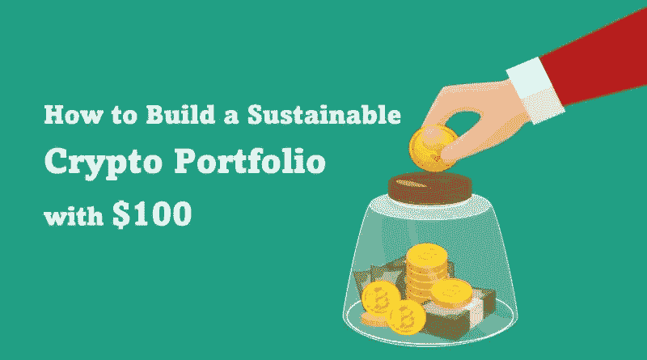
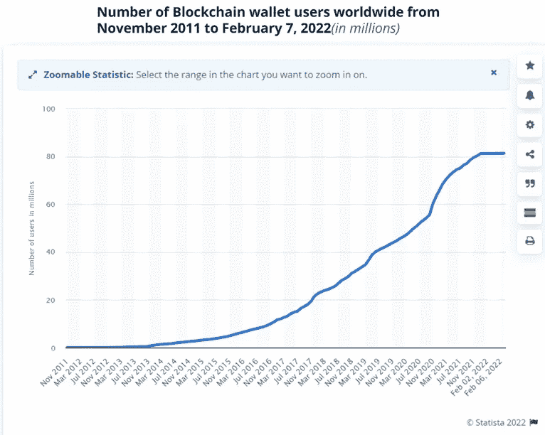
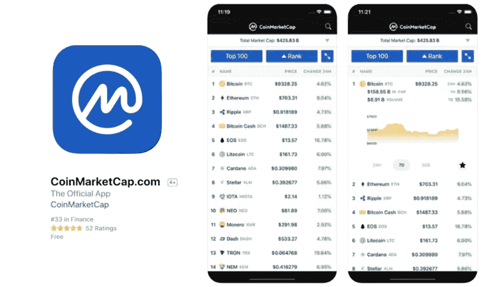
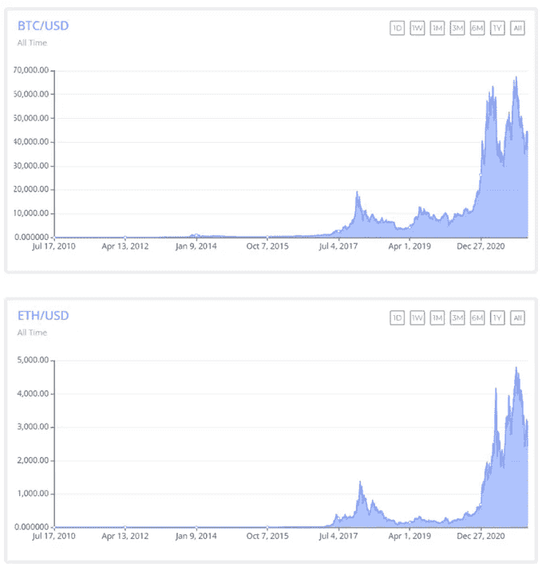
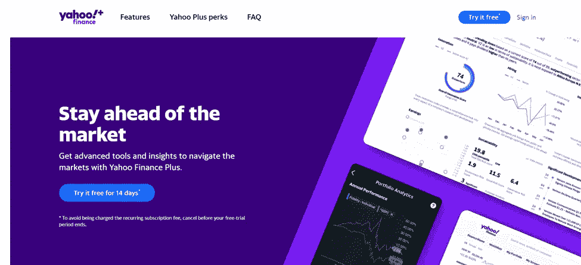
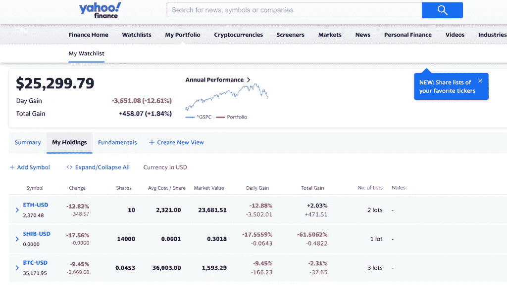
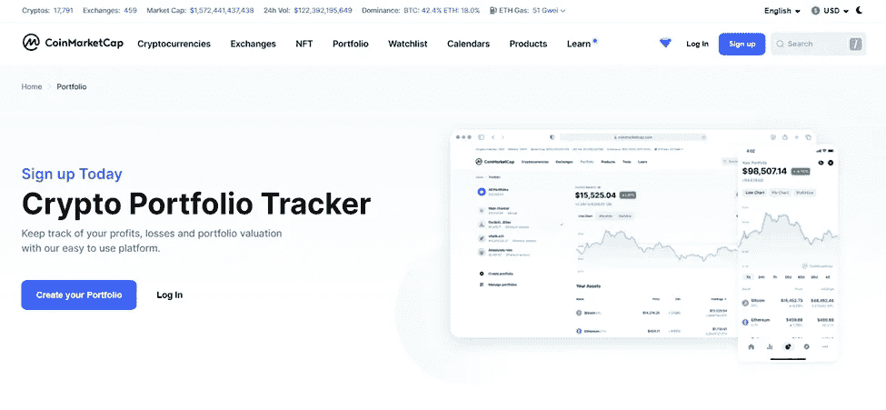
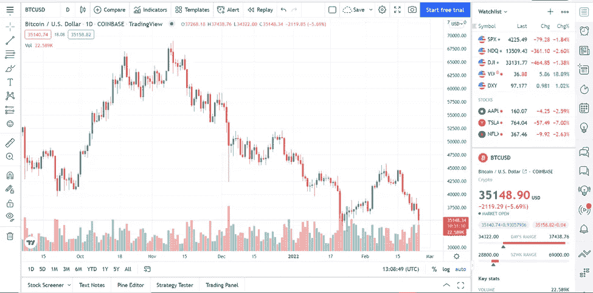
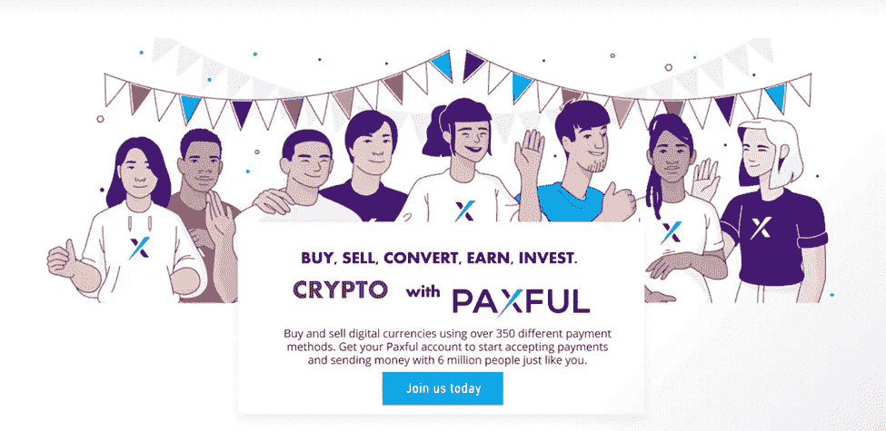

# 如何用 100 美元建立一个可持续的加密组合

> 原文：<https://medium.com/coinmonks/how-to-build-a-sustainable-crypto-portfolio-with-100-90beac125269?source=collection_archive---------10----------------------->

建立一个可持续的金融投资组合是每个投资者的梦想。

但是光有梦想并不会让这些资产按照你想要的方式堆积起来。如果没有健全的金融教育，将资本用于投资仍然是不够的。

金融顾问通常建议**在不同的市场分散金融工具**，以对冲市场下跌的风险。

自 2009 年比特币问世以来，投资者对将比特币加入他们的投资组合持怀疑态度，因为区块链技术相对较新且难以理解。

如今，情况有所不同，大多数投资者希望“加入”加密货币行动。拥有“一个比特币”现在是**的一件大事**，因为许多人购买分数来建立他们的加密组合。

你可以在币安或比特币基地[购买你的第一枚比特币](https://www.coinbase.com/join/XXNIW6)[。(今天获得币安](https://accounts.binance.com/en/register?ref=T5WYL75X)5%的[返利)。](https://accounts.binance.com/en/register?ref=T5WYL75X)

加密技术的发展在全球流通的区块链钱包的数量上也很明显。

尽管投资 crypto 伴随着风险，但自 2014 年以来，持有 crypto 的人数一直呈上升趋势。

加密货币仍然是持有的最不稳定的金融资产之一。**交易或持有加密货币并不适合所有人**。在冒险之前明确你的风险偏好是很重要的。

此外，专家说，“用你能承受的损失来交易”。你可以开始投资任何金额的加密。

在这篇文章中，我将分享从 100 美元开始构建加密组合的见解。

# 关键要点

●每日加密交易量回升至接近 5000 亿美元。

●现有的加密货币超过 1 万种，其中许多仍缺乏流动性。

●关注市场上市值和市场深度较大的顶级加密货币。

●使用加密组合跟踪器实时跟踪您的加密性能。

●建立一个加密组合是一个旅程，而不是“冲刺”，逐步建立你的。

●在您的交易和投资决策中应用合理的风险管理原则。

# 为什么要建立加密组合？

加密投资组合是一桶你最喜欢的不同度量(价格&数量)的[代币和硬币](https://ox-currencies.com/best-10-erc20-tokens-on-the-market/)。您的投资组合是对加密或加密衍生资产的投资集合。

随着您的加密资产开始增长，您将需要根据您的短期战术目标或长期战略目标(这取决于您更喜欢哪一个)，推出一种更有效的方法来跟踪或监控其价格变动。

好消息是,**有许多免费的加密投资组合跟踪工具**,请看这篇关于[如何用 CoinMarketCap 有效跟踪你的投资组合的文章。](https://ox-currencies.com/best-10-erc20-tokens-on-the-market/)

有效地监控你的加密投资会有所不同。这些跟踪工具**通过一个非常互动的仪表板和一些其他附加功能简化了您的跟踪能力**。

另一个建议是让**不同的** **区块链资产**均衡组合。

例如，使用[工作证明](https://ox-currencies.com/how-does-proof-of-stake-improves-proof-of-work/#What_is_Proof-of-Work_PoW) (PoW)和[利益证明](https://ox-currencies.com/how-does-proof-of-stake-improves-proof-of-work/#What_is_Proof-of-Stake_PoS) (PoS)机制对硬币/代币进行余额投资。这意味着你的一些硬币可以被开采，而一些只能被下注。

拥有这些独特类型区块链的硬币让你有机会在单独交易之外赚取被动收入(T21)。

可开采的**币** (PoW)的例子有比特币、Dogecoin、柴犬、莱特币等。

可以下注的**币** (PoS)的例子有以太坊、索拉纳、卡尔达诺、特佐斯、阿尔格兰德等。参见[比特币基地上可以下注的硬币的完整列表](https://ox-currencies.com/what-cryptos-can-be-staked-on-coinbase/)。

其次，人们应该留意那些价格轨迹相同的硬币。

比如**比特币和以太坊遵循彼此的价格模式**。随着 ETH 上升，BTC 也会上升，反之亦然。

**下图显示了 BTC 和 ETH 之间的价格相关性。**

问题是… **你会想投资同时上涨和下跌的硬币&代币吗？**

跟踪你的加密组合可以**手动完成**，但是当你的端口增长时，这**不是一个有效的**方式。

# 如何使用加密投资组合跟踪器

**加密投资组合跟踪器是一个在线软件**，它跟踪与您的加密资产相关的市场动向和表现。

这些工具中的大部分都是免费使用的，如果你想做一些高级的跟踪或技术分析，一些工具带有高级功能。

**著名的加密跟踪工具**有:

1.雅虎！金融

2.共同市场资本

3.交易视图(无内部投资组合)

这里有一个帖子来看看你可以用 CoinMarketCap 做的[聪明的事情。](https://ox-currencies.com/5-smart-things-you-can-do-on-coinmarketcap/)

[**雅虎！金融**](https://finance.yahoo.com/portfolio) 和**[**coin market cap**](https://coinmarketcap.com/portfolio-tracker/)允许您**将您的加密组合**集成到他们的门户网站中，从而实现无缝监控。**

****

**这些跟踪工具帮助你分析一个人离他/她设定的财务目标有多远或多近。**

**有了查看任何你想要的硬币、市场新闻、突发事件和经济新闻的实时统计数据的特权，投资可能会容易得多。**

**例如，下面的截图是一个**演示账户(不是真实的)，**展示了在 Yahoo！上用内置的跟踪器**建立你的投资组合**是多么容易！融资并开始建立你的投资组合。这是免费使用的。**

****

**这也适用于 **CoinMarketCap。****

**在 [CoinMarketCap](https://coinmarketcap.com/portfolio-tracker/) 上，您的**投资组合估值会实时为您完成**。投资组合的收益和损失可以直接计算出来，帮助你迅速做出明智的决定。**

****

****TradingView** 是另一个出色的市场追踪器，它的交互工具令人惊叹，具有完善的图表功能。**

****

**[TradingView](https://www.tradingview.com/crypto-screener/) 工具是对各种金融工具进行技术分析的完美工具，它还在其门户网站上提供经济和市场新闻。**

**回顾了这些工具之后，接下来，让我们看看你如何开始投资 100 美元。**

# **投资 100 美元加密货币**

**在建立加密投资组合之前，通过回答以下问题来定义您的投资策略:**

**1.我是短期投资还是长期投资？**

**2.我计划用 crypto 每天、每周、每月赚多少钱？**

**3.什么加密硬币或代币可以带我去那里？**

**4.如果市场下跌，我能承受的最大损失是多少？**

**5.我的退出计划是什么？**

**6.我想加入什么加密交换？**

**7.我想如何保存和保护我购买的硬币(冷钱包或热钱包)？**

**问这些关键的问题并回答它们应该能够定义你的投资策略。**

**由于我不能推荐硬币投资于特定的领域，我将建议你[在**大盘股中分配资金**](https://www.investopedia.com/terms/c/capital_allocation.asp#:~:text=Capital%20allocation%20means%20distributing%20and,as%20possible%20for%20its%20shareholders.)(以百分比表示)在十大稳定硬币中。**

**在开始疯狂购买之前……花点时间通过研究你选择投资的这些密码(问题 3)的价格趋势来做一些市场分析。**

**做几天的分析看看为什么价格会以某种方式发展。研究历史图表，看看它们的 52 周高点和低点分别是什么。这将让你了解平均价格，并知道价格是被低估还是被高估。**

**大多数投资者注重技术分析，而**忽视基本面分析**。这也不好，因为一条经济新闻可能会改变加密的方向。**

**当你有信心时，你可以创建一个帐户开始。加密交易所很少像外汇经纪人一样提供模拟账户。**

**有了密码交易所，你就开了一个**真实账户**。当你与币安签约时，你可以获得 100 美元的 5%的回扣，这意味着**你向你的账户注入 100 美元**并且**可以获得 105 美元的信用点数**。**

# **将菲亚特转换为加密**

**首先，你需要**将你的 100 美元**转换成你想要投资的代币(BTC、瑞士联邦理工学院、阿达等等)。**

**有很多交易所可以做到这一点。参见我们今年的十大加密交易所名单。**

**将一种加密货币换成另一种加密货币将比每次都使用你的借记卡更容易。**

**一些司法管辖区(如尼日利亚)不喜欢加密，并限制了它在系统内的使用。因此，你不会希望 crypto 出现在你的银行对账单的交易描述中，以避免你的账户被封(T3)。**

**查看更多[不接受交易和采矿加密的国家。](https://ox-currencies.com/16-countries-where-bitcoin-is-illegal-to-trade-or-mine/)**

**Paxful 是另一个密码交易平台，在这里你可以非常快速地将你的菲亚特转换成密码。由于平台上有超过 600 万用户，该平台的流动性非常强。交易可以通过 300 多种支付方式进行。**

****

# **投资基本面强劲的加密货币**

**多年来，比特币、以太坊、Dogecoin、Cardano 都表现出强劲且令人印象深刻的增长。您的加密投资的一部分应该包括这些的组合。**

**这不是金融建议，但我可以说，这些硬币经历了各种市场压力，今天仍然屹立不倒。**

**这些硬币波动性很大，在特定的时间点显示涨跌。**

# **参与 ico(但要小心)**

**高风险投资会带来巨大的回报，同时，损失也可能是巨大的。**

**ico 让普通投资者变成了千万富翁。但是这是**加密 ICO 骗局**发生最多的地方，因为泵和转储方案。**

**为了平衡这一点，在你参与他们的 ICO 之前，要对有高潜力的新项目持怀疑态度。阅读白皮书，找到项目的目的，目标，以及他们计划如何实现它。**

**许多较小的加密项目仍在出现，并越来越受欢迎。由于区块链和 DeFi 的可能性几乎是无限的，这些新人有可能很快达到顶峰。**

**你应该能够从既定的想法和计划中辨别出一个可行的项目。这将需要做大量的研究，但考虑到初始价格非常低，回报是非常高的。**

# **将一定比例的投资组合投资于稳定的债券**

**这些加密货币与法定货币美元的价值挂钩。所以它们的价值实际上一直保持不变。一个例子是**系绳(USDT)。****

**它们对你的投资控制至关重要。比方说，你需要退出一项南下投资，你可以把密码换成稳定的硬币，而不是把 100 美元取出来，这样花费更多，程序也更长。**

**你需要将你的利润转换成稳定的收入，以锁定它们，等待进一步决定将它们再投资到哪里。市值的进一步波动不会影响稳定的收入。**

**交易者喜欢波动性，这使他们能够赚钱，所以看看投资系绳的利弊，知道它是否符合你的投资目标。**

# **关注监管政策**

**加密货币目前在许多国家不受监管。**

**例如，在美国，加密货币交易是合法的，属于[银行保密法](https://www.occ.treas.gov/topics/supervision-and-examination/bsa/index-bsa.html) (BSA)的监管范围。**

**监管变化可能会对加密价值产生影响。在这种情况下，你必须采取必要的调整行动。**

# **加密货币的意图**

**创造代用币的目的也是其市场表现的一部分。**

**有些是作为**公用代币**创造的，有些是作为支付手段，还有一些只是为了储值，这样的例子不胜枚举。**

****确定当前面临的问题**以及是否有内嵌解决方案的替代方案。**

**例如， [Axie Infinity 令牌](https://coinmarketcap.com/currencies/axie-infinity/) (AXS)，Axie Infinity 游戏的治理令牌，找到了一种激励游戏的方法。**

**于 2020 年末推出，这是 covid 19 之前的早期，当时人们开始对在线游戏感兴趣。**

**2020 年 11 月，AXS 推出时，每枚代币的价格约为 3 美元，到第二年 11 月，即 2021 年，创下了 164.9 美元的历史新高。投资者获得了大量利润。**

**因此，看看新加密货币的目的和对未来的可能预见，可以帮助你制作一个非常有利可图的加密投资组合。**

# **购买具有良好市场表现的加密资产**

**老实说，大多数加密货币不会从一开始就价格飙升。他们逐渐开始，增值多于亏损。**

**这种情况发生得越多，就会有越多的人投资它，导致价值上升更多。因此，请留意图表上表现良好的**加密货币**。**

# **长期持有加密货币以获得低风险收益**

**密码市场非常不稳定，交易可能是高风险的。交易时，几秒钟可能是双倍盈利或血本无归的差别。**

**你可以通过购买和持有一些加密货币来对抗这种高风险。随着时间的推移，当你持有资产时，你可以在一些平台上获得回报。**

**这是一项低风险投资，应该成为你投资组合的一部分。稳定的硬币可以达到这个目的。但是你可以选择任何一枚硬币，只要你持有的平台能给你回报。**

# **监控和跟踪您的加密组合**

**观察市场和你的加密组合。你的投资组合有多成功取决于你的消息灵通程度。你需要知道哪里需要重新调整，哪里需要集中更多的资产。利润随时都会增加，亏损也一样。**

**所以你需要知道如何获得最大的利润和最小的损失。加密投资组合跟踪是你如何能有效地做到这一点。不要只是创建一个，而是要抽出时间定期查看。**

# **常见问题(FAQ)**

# **Q1。我能投资 100 美元在密码上吗？**

**是的，你可以在密码上投资 100 美元，甚至更少。加密货币有很多种，所以即使你不能购买一枚硬币或代币，你也可以购买少量的。**

**但是，你投资的金额取决于目的。如果你正在尝试，试图了解一两件关于密码市场的工作，你应该用较低的数量来减少损失。**

# **Q2。把 100 美元投入比特币值得吗？**

**向比特币注入 100 美元是否值得，取决于对比特币在运行时间内会上涨还是下跌的分析。**

**投资后价值下跌可能会导致亏损。然而，由于密码市场总是波动不定，因此可以获利。**

**直到资产被出售，人们才能确切地获利或亏损，因此**亏损是名义上的**。可以等待更有利的时机再卖出获利。**

# **最后的想法**

**如果你知道正确的衡量标准，知道投资什么样的加密应该不是一件困难的事情。**增加你的投资组合也是一个旅程**而不是冲刺，所以享受这个过程，在这个过程中学习。采取预防措施并应用合理的风险管理。**

**然而，有数以千计的选择，尽管它看起来很不稳定，你仍然可以做出一个长期平衡的选择。**

> ***加入 Coinmonks* [*电报频道*](https://t.me/coincodecap) *和* [*Youtube 频道*](https://www.youtube.com/c/coinmonks/videos) *了解加密交易和投资***

# **另外，阅读**

*   **[Bookmap 点评](https://coincodecap.com/bookmap-review-2021-best-trading-software) | [美国 5 大最佳加密交易所](https://coincodecap.com/crypto-exchange-usa)**
*   **最佳加密[硬件钱包](/coinmonks/hardware-wallets-dfa1211730c6) | [Bitbns 评论](/coinmonks/bitbns-review-38256a07e161)**
*   **[新加坡十大最佳加密交易所](https://coincodecap.com/crypto-exchange-in-singapore) | [购买 AXS](https://coincodecap.com/buy-axs-token)**
*   **[红狗赌场评论](https://coincodecap.com/red-dog-casino-review) | [Swyftx 评论](https://coincodecap.com/swyftx-review) | [CoinGate 评论](https://coincodecap.com/coingate-review)**
*   **[投资印度的最佳密码](https://coincodecap.com/best-crypto-to-invest-in-india-in-2021)|[WazirX P2P](https://coincodecap.com/wazirx-p2p)|[Hi Dollar Review](https://coincodecap.com/hi-dollar-review)**
*   **[加拿大最佳加密交易机器人](https://coincodecap.com/5-best-crypto-trading-bots-in-canada) | [库币评论](https://coincodecap.com/kucoin-review)**
*   **[用于 Huobi 的加密交易信号](https://coincodecap.com/huobi-crypto-trading-signals) | [HitBTC 审查](/coinmonks/hitbtc-review-c5143c5d53c2)**
*   **[如何在 FTX 交易所交易期货](https://coincodecap.com/ftx-futures-trading) | [OKEx vs 币安](https://coincodecap.com/okex-vs-binance)**