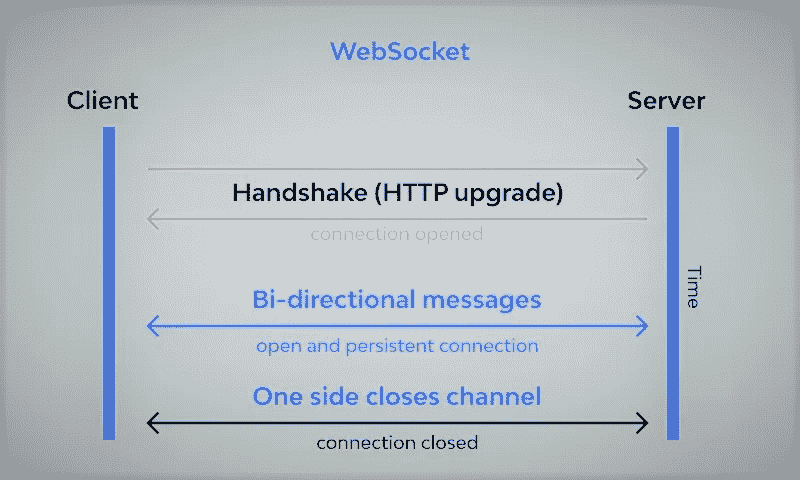
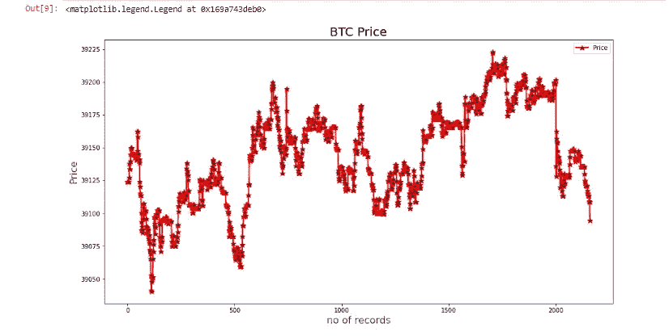

# 如何用 Python 和 SQlite 搭建交易机器人？

> 原文：<https://medium.com/coinmonks/how-to-build-a-trading-bot-with-python-and-sqlite-5daeeda29451?source=collection_archive---------1----------------------->

你好，欢迎来到另一篇关于 python 算法交易的文章。

在 [**上一篇文章**](/@shadyshfk/algorithmic-trading-a-beginners-guide-series-7ecb4cdd4281) 中我对算法交易做了一个浅显的介绍，我们开发了一个简单的交易机器人，

今天，我们将开发另一个交易机器人，使用 SQlite 来保存数据并处理这些数据以执行交易。

## 让我们从连接币安和套接字管理器开始



websocket connection

WebSocket 是一种通信协议，是客户端的 web 浏览器和服务器之间的双向连接全双工通信通道。

我正在使用 Jupyter notebook、python 和 sqlite。

```
import pandas as pd
!pip install python-binance
from binance import Client
from binance import BinanceSocketManager
```

导入熊猫，安装 python 币安，导入客户端和套接字管理器。

```
APIKEY= 'Your API Key'
SECRETKEY = 'Your Secret Key'client = Client(APIKEY,SECRETKEY)
client.API_URL = '[https://testnet.binance.vision/api'](https://testnet.binance.vision/api')
```

获取 API 密钥和秘密密钥，将这两个密钥提供给客户端函数以建立连接。

**当事人。API_URL** =这里我们提供了币安测试网的 URL，用于测试网环境。

要生成 API 密钥和秘密密钥，请使用 GitHub 登录币安现场测试网络，并生成 HMAC SHA256 密钥。
最后，用实际的键替换代码中的 APIKEY 和 SECRETKEY 变量。

```
 from sqlalchemy import create_engine
engine = create_engine(‘sqlite:///SqlDb.db’)
```

从**sqlalchemy**(Python SQL toolkit 和对象关系映射器)导入 create_engine，然后定义新的数据库 **sqlDB.db.**

## 使用币安套接字管理器获取数据

我将通过打印接收到的数据来测试币安套接字管理器连接。

```
 bsm = BinanceSocketManager(client)
 ts = bsm.trade_socket(‘BTCUSDT’)
 await ts.__aenter__()
 msg = await ts.recv()
 print(msg) {‘e’: ‘trade’, ‘E’: 1645890024494, ‘s’: ‘BTCUSDT’, ‘t’: 1271100538, ‘p’: ‘39317.92000000’, ‘q’: ‘0.00051000’, ‘b’: 9560827435, ‘a’: 9560827538, ‘T’: 1645890024493, ‘m’: True, ‘M’: True}
```

现在我们可以看到我们将收到什么，这是一个字典，其中**的'**为
货币**符号**， **p'** 为**价格**和 **'E'** 为**时间**(UNIX 格式)，这三个是我们关心的。

下一步是获取实时数据流，并将这些数据发送给一个函数，以生成一个数据帧，我们将从后者开始。

```
 def dframe(msg):

 df = pd.DataFrame([msg])
 df = df.loc[:,[‘s’,’E’,’p’]] 
 df.columns = [‘Symbol’,’Time’,’Price’]
 df.Price = df.Price.astype(float)
 df.set_index(‘Time’) return df
```

我定义了一个函数，它将接收到的字典，转换成熊猫数据帧切片符号，时间和价格。

```
 while True:
 bsm = BinanceSocketManager(client)
 ts = bsm.trade_socket(‘BTCUSDT’)
 await ts.__aenter__()
 msg = await ts.recv()
 frame = dframe(msg)
 frame.to_sql(‘BTCUSDT’,engine,if_exists=’append’,index=False)
 print(frame)
```

为了获得数据流，我将无限循环地请求数据，在获得 **msg** 字典后，它将被发送到 **dframe** 函数以更新数据帧。

然后 **to_sql()** 将数据帧中存储的记录写入 sql 数据库。

这就是这个无限循环的输出，每秒钟用接收到的数据更新一个数据帧，并将记录写入 SQl 数据库中的 BTCUSDT 表。

```
 Symbol           Time     Price
0  BTCUSDT  1645891574400  39268.11
    Symbol           Time     Price
0  BTCUSDT  1645891576796  39268.89
    Symbol           Time     Price
0  BTCUSDT  1645891578340  39262.33
    Symbol           Time     Price
0  BTCUSDT  1645891579856  39262.33
    Symbol           Time     Price
0  BTCUSDT  1645891581334  39262.32
    Symbol           Time    Price
0  BTCUSDT  1645891582679  39250.4
    Symbol           Time    Price
0  BTCUSDT  1645891584140  39250.4
    Symbol           Time     Price
0  BTCUSDT  1645891585365  39250.39
    Symbol           Time     Price
0  BTCUSDT  1645891586707  39258.25
    Symbol           Time    Price
0  BTCUSDT  1645891587986  39262.4
    Symbol           Time    Price
0  BTCUSDT  1645891589897  39262.4
    Symbol           Time     Price
0  BTCUSDT  1645891591257  39262.39
    Symbol           Time     Price
0  BTCUSDT  1645891593257  39253.68
    Symbol           Time     Price
0  BTCUSDT  1645891594699  39253.68
    Symbol           Time     Price
0  BTCUSDT  1645891596403  39253.68
    Symbol           Time     Price
0  BTCUSDT  1645891597752  39253.68
    Symbol           Time     Price
0  BTCUSDT  1645891599107  39253.69
    Symbol           Time     Price
```

让我们画一个图来形象化 btc 价格。

```
import matplotlib.pyplot as pltdf = pd.read_sql('BTCUSDT',engine)plt.figure(figsize=(15, 8))
plt.plot(df.Price,color='red',label = "Price", linewidth = 2, marker='*', markerfacecolor='black',markersize=9)plt.title('BTC Price', color='black',size=20)
plt.ylabel('Price', color='blue',size=16)
plt.xlabel('no of records', color='blue',size=16)
plt.legend()
```



BTC price plot

## 趋势跟踪策略

我将定义一个足够简单的趋势跟踪策略，即如果价格上涨了一个百分比(0.1%)，就买入；如果价格上涨或下跌了一个百分比(+0.2%，-0.2%)，就卖出。

```
def strategy(in_position=False):
    percen = 0.001
    periods = 100

    while True:
        df = pd.read_sql('BTCUSDT', engine)
        df1 = df.tail(periods)
        cumret = (df1.Price.pct_change() + 1).cumprod() - 1
        if not in_position:
            if cumret[cumret.last_valid_index()] > percen:
                buyOrder = client.create_order(symbol='BTCUSDT', 
                                              side='BUY', 
                                              type='MARKET' ,
                                              quantity=0.001)
                print(buyOrder)
                in_position = True
                break
   if in_position:
        while True:
            df = pd.read_sql('BTCUSDT', engine)
            orderPrice = df.loc[df.Time > buyOrder['transactTime']] if len(orderPrice) > 1 : postionRet = 
                      (orderPrice.Price.pct_change()+1).cumprod()-1 lastRet = postionRet[postionRet.last_valid_index()] 

                if lastRet > 0.002 or lastRet < -0.002: sellOrder =   
                               client.create_order(symbol='BTCUSDT',
                                                   side='SELL' ,
                                                   type='MARKET' ,
                                                   quantity=0.001 ) print(sellOrder)            
                    break
```

从计算最后一笔记录开始，计算累计回报，当累计回报超过一定比例时，就会触发买单，然后打破 while 循环。

买入订单将返回一个包含交易时间的字典，因此，我们将从该时间开始对数据帧进行切片，并等待切片数据帧的累计回报超过或低于卖出百分比，然后将触发卖出订单。

## 执行交易的时间到了…

是时候调用策略函数了。

```
strategy()
```

我们得到一个价格为 39166.91 的订单

## **购买订单**

```
`{‘symbol’: ‘BTCUSDT’, ‘orderId’: 10940581, ‘orderListId’: -1, ‘clientOrderId’: ‘XCAVbax0xaQxRs0erpds5P’, ‘transactTime’: 1645895549187, ‘price’: ‘0.00000000’, ‘origQty’: ‘0.00100000’, ‘executedQty’: ‘0.00100000’, ‘cummulativeQuoteQty’: ‘39.16691000’, ‘status’: ‘FILLED’, ‘timeInForce’: ‘GTC’, ‘type’: ‘MARKET’, ‘side’: ‘BUY’, ‘fills’: [{‘price’: ‘39166.91000000’, ‘qty’: ‘0.00100000’, ‘commission’: ‘0.00000000’, ‘commissionAsset’: ‘BTC’, ‘tradeId’: 3562682}]}`
```

我们得到一个价格为 39097.37 的卖单

## 卖出订单

```
`{‘symbol’: ‘BTCUSDT’, ‘orderId’: 10945890, ‘orderListId’: -1, ‘clientOrderId’: ‘txnRsAuc1gcMs3aRiQ6YGc’, ‘transactTime’: 1645896773538, ‘price’: ‘0.00000000’, ‘origQty’: ‘0.00100000’, ‘executedQty’: ‘0.00100000’, ‘cummulativeQuoteQty’: ‘39.09737000’, ‘status’: ‘FILLED’, ‘timeInForce’: ‘GTC’, ‘type’: ‘MARKET’, ‘side’: ‘SELL’, ‘fills’: [{‘price’: ‘39097.37000000’, ‘qty’: ‘0.00100000’, ‘commission’: ‘0.00000000’, ‘commissionAsset’: ‘USDT’, ‘tradeId’: 3564175}]}`
```

我们的交易亏损了 0.18，这个策略是有效的，当然，如果你了解交易，你就不会对亏损感到惊讶，因为你不可能每次都赢，你只是想有一个好的胜率，总的来说会有利润。

## 下一步是什么？！

您可以通过更改参数或操纵策略来优化这个机器人，使它变得更好。

我将在接下来的文章中分享更多

这就是这篇文章，我希望你最好的。

> 加入 Coinmonks [电报频道](https://t.me/coincodecap)和 [Youtube 频道](https://www.youtube.com/c/coinmonks/videos)了解加密交易和投资

[](/coinmonks/crypto-trading-bot-c2ffce8acb2a) [## 加密交易机器人——21 款最佳免费加密交易机器人

### 2022 年币安、比特币基地、库币和其他密码交易所的最佳密码交易机器人。Pionex，Bitsgap…

medium.com](/coinmonks/crypto-trading-bot-c2ffce8acb2a) [](https://coincodecap.com/free-crypto-portfolio-trackers) [## 2022 年 5 个最佳免费加密投资组合追踪器

### 在这篇文章中，我们将带你通过一些最好的免费加密投资组合追踪器，让你选择最好的…

coincodecap.com](https://coincodecap.com/free-crypto-portfolio-trackers)