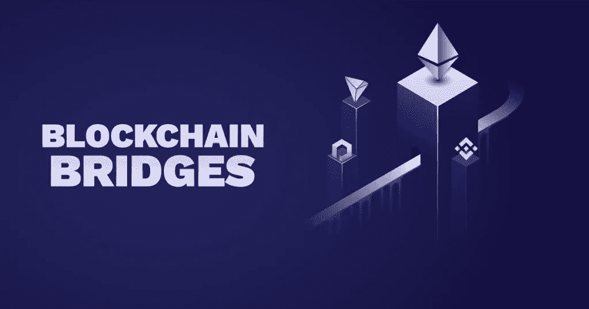
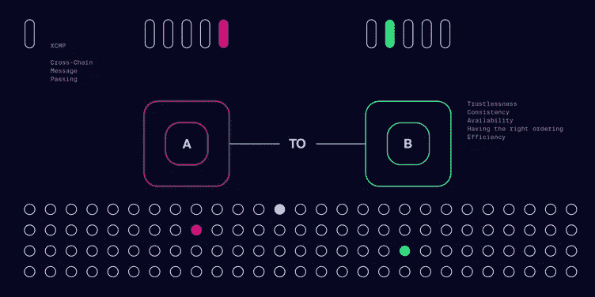

# 如何用波尔卡多特建造桥梁

> 原文：<https://medium.com/coinmonks/how-to-build-bridges-with-polkadot-e3cca6283a17?source=collection_archive---------5----------------------->

自 2008 年比特币白皮书发布以来，区块链技术已经走过了漫长的道路。从那以后，区块链网络出现了爆炸式增长，设计和预期功能多种多样。

区块链技术的一个关键价值主张围绕着去中心化的承诺，即网络能够由几个、有时是几千甚至上百万的利益相关者“拥有”和运营，而不是传统的、更集中的公司治理模式。

但随着区块链网络的数量(通常是规模)继续增长，它们在很大程度上仍然彼此隔绝，就像拥有自己社区和经济的岛屿，无法与外部世界交换信息或价值。当今区块链网络的孤岛性质违背了去中心化原则，并重新确立了现有集中式 web(通常称为 Web 2.0)的割据状态。

区块链网络之间缺乏互动不仅限制了权力下放，而且通过在创新、经济增长和自由贸易周围设置界限，阻碍了技术的进步和相关性。通常，为一个网络设计的应用程序只能在该网络中工作，这限制了它们被更广泛采用的可能性。

随着区块链技术的成熟，一些项目正在通过在网络之间建立“桥梁”来解决这个问题。迈向区块链和系统可互操作的世界将允许应用程序建立在彼此的服务和优势之上。随着一个新的、分散的和可互操作的互联网开始形成，这可能会对广泛的服务产生重大影响。分散金融(Defi)等应用将受益于流动性的增加，以及建立跨社区互动服务网络的能力，从而增加其用户基础并扩大可用资源。

# 什么是区块链桥？

区块链桥是允许令牌和/或任意数据从一个链传输到另一个链的连接。两个链可以有不同的协议、规则和治理模型，但是桥提供了一种兼容的方式来安全地在两端进行互操作。

桥有许多不同的设计，但它们通常可以分为两个阵营:依赖信任或联合的更集中的桥，以及更分散的所谓的“无信任”桥。集中式桥依赖于某种类型的中央机构或系统来运行，这意味着用户需要信任中介才能使用给定的应用程序或服务。

相比之下，无信任桥梁是用户不必信任单一实体或机构的桥梁。相反，信任是建立在代码中的数学真理。在一个分散的区块链系统中，这个事实是通过许多计算机节点根据写入软件的规则达成一个共同的协议来实现的。通过使用透明度和激励广泛参与，这消除了中央集权制度的许多问题，这些问题容易导致腐败或滥用权力。

可以创建桥来满足各种目的。它们不仅能够使一个网络上的令牌在另一个网络上使用，而且还可以用来交换任何类型的数据，包括智能合约调用、分散标识符，以及来自 oracles 的链外信息，如股票市场价格等。例如，在 Polkadot 上锚定可验证凭证的链可以被建立在以太坊上的游戏公司用于 KYC(了解你的客户)要求。网桥允许应用程序更加分散，因为它们不再受其来源网络的限制。

# 用波尔卡多特建造桥梁

波尔卡多特被设计成“区块链的区块链”，因为它相信没有一个区块链人能做所有的事情。Polkadot 允许被称为 parachains 的主权区块链(每个 para chains 都可能有自己的设计、规则、用例和令牌)进行互操作，同时所有人都受益于 Polkadot 的中央"[中继链](https://wiki.polkadot.network/docs/en/learn-architecture#relay-chain)提供的安全性

但是 Polkadot 也允许 parachains 和外部网络，如比特币或以太坊，通过桥梁进行互操作。Polkadot 桥可以以多种方式设计，可以由各种配置的区块链、智能合约和所谓的运行时模块(又名托盘)组成——可配置的区块链组件，用于开发定制的 Polkadot 兼容区块链和[衬底](https://www.substrate.io/)区块链框架。

波尔卡多特上的桥梁可以通过多种方式实现——一些可以作为[公共物品](https://polkadot.network/common-good-parachains-an-introduction-to-governance-allocated-parachain-slots/)公共设施建造，供整个社区使用，而另一些可以由社区团队以盈利为基础运营。

Polkadot 的设计还将实现两个外部链之间的桥接。例如，Polkadot 可以允许以分散的方式将比特币(BTC)转移到以太坊，方式如下:

在 Polkadot 上作为副链运行的桥可能有[整理器](https://wiki.polkadot.network/docs/en/learn-collator#docsNav)监控和翻译 Polkadot 中继链和外部链(例如，比特币)之间的信息。另一个副链桥可能用不同的链以相同的方式工作，例如以太坊。使用 Polkadot 生态系统中两个桥之间的[跨链消息传递](https://wiki.polkadot.network/docs/en/learn-crosschain#docsNav) (XCMP)，可以构建一个定制的用户界面来与这些桥进行交互，允许用户与这两个外部链进行交互。通过这种方式，用户可以使用他们的 BTC 通过 Polkadot 参与以太坊上的分散金融(DeFi)智能合约。

Cross-chain message passing (XCMP)

在 Polkadot 生态系统的 testnet 阶段，一些桥梁已经建成或正在开发中。

# 桥接方法

可以通过以下任何一种方法(按照建议的方法排序)来建立一个尽可能分散和不可信的桥梁:

*   *桥接托盘* —对于基底本地链，使用桥接托盘(例如 Kusama `\<\>` Polkadot 桥，因为两个网络的副链都使用基底)。
*   *智能合约* —如果链不在基底上，您应该在非基底链上有智能合约来桥接(例如，以太坊 mainnet 将有一个桥接智能合约，它基于传入的 XCMP 消息启动 Eth 事务)。
*   *高阶协议* —如果你的链不支持智能合约(如比特币)，你应该使用 [XClaim](https://eprint.iacr.org/2018/643.pdf) 或类似的协议来桥接。

# 经由桥式托盘

通过衬底托盘可以在 Polkadot 上接收来自外部非仿链区块链的消息。然后，可以将底层实例部署到 Polkadot，作为系统级的副链(核心 Polkadot 软件的本地扩展)或社区操作的副链。

Kusama `\<\>` Polkadot 桥就是严格使用桥托盘的桥的一个例子，因为两者都使用基于基底的副链。

对于在 Polkadot(非基底)上没有副链桥接模块的独立链，有必要部署桥接合同。

# 通过智能合约

考虑到具有图灵完全智能契约语言的区块链平台的通用性，有可能在 Polkadot 和任何其他支持智能契约的区块链之间架起桥梁。

那些已经熟悉以太坊的人可能知道现在存档的[奇偶桥](https://github.com/paritytech/parity-bridge)以及将 PoA 侧链连接到以太坊主网的努力。平价桥是两个智能合约的组合，每个链上部署一个，允许跨链转移价值。作为一个使用示例，最初的奇偶桥概念验证连接了两条以太坊链`main`和`side`。存入合同的乙醚`main`在`side`产生一个以 ERC 为单位的余额——20 个代币。相反，ERC-20 代币放回合同`side`可以在`main`释放以太。

# 通过高级协议

高阶协议(如 [XCLAIM](https://eprint.iacr.org/2018/643.pdf) )可用于桥接，但只应在其他选项不可用时使用。特别是 XCLAIM，它要求任何可交换资产都要有比可交换资产价值更高的抵押品作为支持，这增加了额外的开销。

比特币就是一个非常适合高阶协议的网络例子，因为它不支持智能合约，也不基于底层。

# [例题](https://wiki.polkadot.network/docs/learn-bridges#examples)

# 以太坊桥(智能合约\ <> Polkadot)

正如加文·伍德博士在 2019 年底解释的那样，有三种方式可以将波尔卡多特和基质生态系统连接到以太坊生态系统。

1.  波尔卡多特以太坊公共桥。
2.  衬底宇称以太坊(Openethereum)桥。
3.  衬底 EVM 模块。

# 比特币桥(XCLAIM \<>Substrate \<>Polkadot)

inter 团队已经在基于 [XCLAIM](https://eprint.iacr.org/2018/643.pdf) 设计论文的比特币桥上写了一个[规范](https://interlay.gitlab.io/polkabtc-spec/)。该协议实现了 Polkadot 和比特币之间的双向桥梁。它允许 BTC 的持有者将其资产“传送”到 Polkadot 作为 PolkaBTC，而 PolkaBTC 的持有者可以在比特币链上为 BTC 烧毁他们的资产。

规范中记录的比特币桥由两个逻辑上不同的组件组成:

*   XCLAIM 组件维护拥有 PolkaBTC 的所有帐户。
*   BTC 继电器负责在提交新交易时验证比特币的状态。

> *加入 Coinmonks* [*电报频道*](https://t.me/coincodecap) *和* [*Youtube 频道*](https://www.youtube.com/c/coinmonks/videos) *了解加密交易和投资*

# 另外，阅读

*   [3 商业评论](/coinmonks/3commas-review-an-excellent-crypto-trading-bot-2020-1313a58bec92) | [Pionex 评论](https://coincodecap.com/pionex-review-exchange-with-crypto-trading-bot) | [Coinrule 评论](/coinmonks/coinrule-review-2021-a-beginner-friendly-crypto-trading-bot-daf0504848ba)
*   [莱杰 vs n rave](/coinmonks/ledger-vs-ngrave-zero-7e40f0c1d694)|[莱杰 nano s vs x](/coinmonks/ledger-nano-s-vs-x-battery-hardware-price-storage-59a6663fe3b0) | [币安评论](/coinmonks/binance-review-ee10d3bf3b6e)
*   [Bybit Exchange 审查](/coinmonks/bybit-exchange-review-dbd570019b71) | [Bityard 审查](https://coincodecap.com/bityard-reivew) | [Jet-Bot 审查](https://coincodecap.com/jet-bot-review)
*   [3 commas vs crypto hopper](/coinmonks/3commas-vs-pionex-vs-cryptohopper-best-crypto-bot-6a98d2baa203)|[赚取加密利息](/coinmonks/earn-crypto-interest-b10b810fdda3)
*   最好的比特币[硬件钱包](/coinmonks/hardware-wallets-dfa1211730c6) | [BitBox02 回顾](/coinmonks/bitbox02-review-your-swiss-bitcoin-hardware-wallet-c36c88fff29)
*   [BlockFi vs Celsius](/coinmonks/blockfi-vs-celsius-vs-hodlnaut-8a1cc8c26630)|[Hodlnaut 点评](/coinmonks/hodlnaut-review-best-way-to-hodl-is-to-earn-interest-on-your-bitcoin-6658a8c19edf) | [KuCoin 点评](https://coincodecap.com/kucoin-review)
*   [Bitsgap 审查](/coinmonks/bitsgap-review-a-crypto-trading-bot-that-makes-easy-money-a5d88a336df2) | [Quadency 审查](/coinmonks/quadency-review-a-crypto-trading-automation-platform-3068eaa374e1) | [Bitbns 审查](/coinmonks/bitbns-review-38256a07e161)
*   [密码本交易平台](/coinmonks/top-10-crypto-copy-trading-platforms-for-beginners-d0c37c7d698c) | [Coinmama 审核](/coinmonks/coinmama-review-ace5641bde6e)