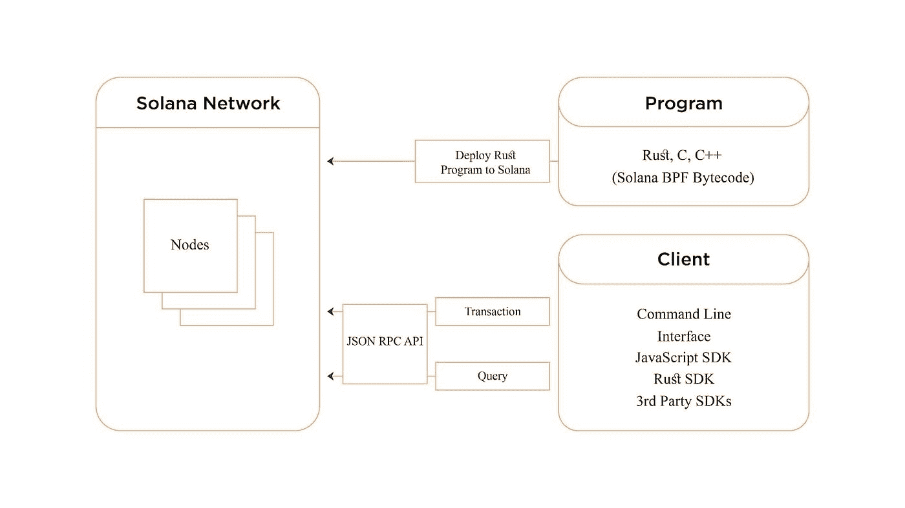

# 如何使用 Anchor-KryptoMind 构建和部署 Solana 智能合同

> 原文：<https://medium.com/coinmonks/how-to-build-deploy-a-solana-smart-contract-using-anchor-kryptomind-5dc53d119125?source=collection_archive---------34----------------------->


如果你想学习如何创建索拉纳智能合同和程序，你来对地方了。Solana 是一个崭露头角的高性能、无权限的区块链，支持快速、廉价和可伸缩的交易，并支持用 Rust、C++和 C 编写的智能合约

# 索拉纳是什么？

Solana 是一个分散的区块链生态系统，旨在消除影响现有区块链的拥塞和可扩展性问题。区块链主要关注增加的可伸缩性，例如更大的(TPS)和更快的确认时间。这是一项开源计划，结合了英特尔、网景、谷歌和高通的尖端技术，帮助 Solana 保持高性能标准。

# 索拉纳智能合同的架构

传统的 EVM 支持的区块链与 Solana 的智能合同模型不同。传统的基于 EVM 的契约将代码/逻辑和状态组合成一个链上部署的契约。另一方面，Solana 上的智能契约处于“只读”或“无状态”模式，只包含程序的逻辑。一旦设置了智能合约，它就可以被其外部的帐户访问。这些帐户与程序交互，并存储有关程序如何与它们交互的数据。

> 交易新手？试试[加密交易机器人](/coinmonks/crypto-trading-bot-c2ffce8acb2a)或者[复制交易](/coinmonks/top-10-crypto-copy-trading-platforms-for-beginners-d0c37c7d698c)

这允许状态(帐户)和契约逻辑(程序)的逻辑分离，这将典型的 EVM 支持的智能契约与 Solana 智能契约区分开来。此外，索拉纳和其他区块链的帐户是非常不同的。相比以太坊账户，以太坊账户只是指向用户钱包的指针，Solana 账户持有数据(比如钱包信息)。

此外，Solana 有一个 CLI 和 JSON RPC API 来改进 DApp 与 Solana 的交互。此外，分散的应用程序可能会使用当前的 SDK 连接区块链和索拉纳程序。



*   上图左侧的程序描述了开发过程，该过程使用户能够在 Solana 区块链上构建和部署独特的 Rust、C 和 C++程序。
*   一旦这些应用被有效地分发，任何有编程知识的人都可以利用它们。用户必须使用现有的客户端 SDK 和 JSON RPC API 来创建 dApps，以便与这些应用进行交互。
*   用户可以创建分散的应用程序，用于与第二个开发工作流客户端(在左下方)下部署的程序进行交互。这些 app 可能会构造各种应用，比如加密货币钱包、去中心化交易所等等，并通过客户端 SDK 向这些程序发送交易。
*   程序和客户端是该流程的两个组成部分，它们共同创建了一个全面的 dApps 和程序网络，可以通过通信来更新状态和分析区块链。

# 什么是锚？

Anchor 是一个创建 Solana 智能合同的框架，包括许多开发工具。简而言之，锚挽救了你的生命，让创建智能合同变得异常简单。

# 先决条件

## 生锈:

这是一个先决条件，因为它是一种非常强大的通用编程语言。这将适用于智能合同的创建。

## 索拉纳工具套装:

这包含了索拉纳 CLI。

## 入门指南

首先，创建一个新的锚点项目:

锚初始化计数器应用程序

在项目结构中，您将看到以下文件和文件夹。

程序—这是索拉纳程序(智能合同)的目录

测试——这是 javascript 测试代码存在的地方

迁移—这是部署脚本

应用程序—这是前端将要构建的地方

让我们看看程序目录中的 lib.rs 文件。

```
use anchor_lang::prelude::*;declare_id!("Fg6PaFpoGXkYsidMpWTK6W2BeZ7FEfcYkg476zPFsLnS");#[program]
pub mod counterapp {
    use super::*;
    pub fn initialize(ctx: Context<Initialize>) -> ProgramResult {       
        Ok(())
    }
}
#[derive(Accounts)]
pub struct Initialize {}
```

最基本的 CLI 程序是这个。当被调用时，initialize 函数只完成；初始化结构建立初始化函数的环境。

设置好我们的项目后，让我们创建我们的计数器应用程序。

要做到这一点，我们必须首先建立一个帐户，我们可以保存我们的数据。你可能想知道这个账户到底是什么。帐户只是在 Solana sealevel 中访问和保存数据的一种手段。

在上面的代码中，我们定义了两个结构；CounterAccount 结构是我们的帐户，它包含一个将存储我们的计数的 count 变量。

```
#[derive(Accounts)]
pub struct Create<'info> {

    #[account(init, payer=user, space = 16+16)]
    pub counter_account: Account<'info, CounterAccount>,

    #[account(mut)]
    pub user: Signer<'info>,

    pub system_program: Program<'info, System>,
}
#[account]
pub struct CounterAccount {
    pub count: u64,
}
```

Create struct 是我们的指令 struct，它定义了创建帐户的上下文，它说，“嘿，我想创建一个带有 32 字节空间的帐户 counter_account”。

#[account(…)]属性定义了 Anchor 为创建上下文而进行的预处理中的约束和指令。现在让我们创建我们的函数。

```
pub fn create(ctx: Context<Create>) -> ProgramResult {
let counter_account = &mut ctx.accounts.counter_account;
counter_account.count = 0;
Ok(())
}
```

Create 函数是 rpc 请求的处理程序，它接受用 Create struct 创建的上下文。

现在让我们创建测试函数并部署我们的杰作。

```
import * as anchor from '[@project](http://twitter.com/project)-serum/anchor';
import { Program } from '[@project](http://twitter.com/project)-serum/anchor';
import { Counterapp } from '../target/types/counterapp';
describe('counterapp', () => {
    const provider = anchor.Provider.env()
    anchor.setProvider(provider);
    const program = anchor.workspace.Counterapp as Program<Counterapp>;
    const counterAccount = anchor.web3.Keypair.generate();
    it('Is initialized!', async () => {
        await program.rpc.create({
            accounts: {
                counterAccount: counterAccount.publicKey,
                user: provider.wallet.publicKey,
                systemProgram: anchor.web3.SystemProgram.programId,
            },
            signers: [counterAccount]
        } as any)
    });
    it("Increment counter", async () => {
        await program.rpc.increment({
            accounts: {
                counterAccount: counterAccount.publicKey
            }
        } as any)
    })
    it("Fetch account", async () => {
        const account: any = await
        program.account.counterAccount.fetch(counterAccount.publicKey)
        console.log(account.count)
    })
});
```

现在，进行测试。

```
anchor test
```

测试通过后，我们现在可以部署程序了。确保 solana-test-validator 正在运行。

```
anchor deploy
```

# 结论

随着越来越多的行业采用区块链和分散式技术，分散式应用的使用正在扩大。Solana 允许创建快速、适应性强的智能合同和分散式应用程序，作为一个可访问、高速且负担得起的生态系统。它还经常提供更新。因为 Solana 提供了各种前沿资源，如 SDK、框架和开发工具，所以像我们这样的开发人员都渴望在其上进行构建。该平台还包括侵入式工具，如 Solana CLI 和 Solana Explorer，让用户通过命令行与协议进行交互。

*原载于 2022 年 6 月 25 日*[*【https://kryptomind.com】*](https://kryptomind.com/how-to-build-deploy-a-solana-smart-contract-using-anchor/)*。*