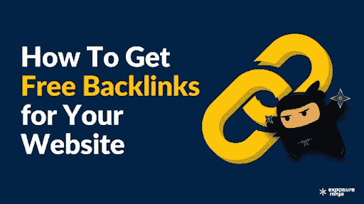

# 如何建立提高 SEO 的免费反向链接？9 个简单的方法

> 原文：<https://medium.com/coinmonks/how-to-build-free-backlinks-for-improving-seo-9-simple-ways-ab0422ca4e?source=collection_archive---------30----------------------->

# 反向链接是 SEO 的支柱。当人们访问一个可信的网站，这个网站反向链接到你的平台，他们会被自动重定向到你的网页。这有助于搜索引擎抓取和检测反向链接，以便他们可以更新和维护他们的搜索引擎索引，在搜索结果中显示您的网站。

最重要的是，反向链接塑造了搜索引擎，根据你网站的内容带来相关的结果。值得一提的是，要实践下面的 SEO 技巧，你需要一个稳定的互联网服务，让你能够及时地执行策略。所以，如果你正在寻找一个高速互联网连接。也就是说，让我们来讨论一下用免费反向链接来提高网站搜索引擎优化的最佳方法。

# 1.记者或博客作者的源内容

有一个免费的服务叫做帮助记者(HARO)，这是一个非常好的地方，人们可以通过它与博客作者和记者取得联系，并公开链接。它被 SEO 专家认为是获得高质量反向链接的最佳策略之一。搜索引擎首页排名背后的玄机是获取优质链接。好消息是，这个策略是一个白帽 SEO 技术，因此你可以放心地使用它。白帽技术是提高网站排名和带来更多流量的合法方法。

# 2.向你的朋友或同事寻求反向链接

没有垃圾邮件和强迫任何你认识的人在内容质量上妥协，你可以要求你的朋友和同事提供反向链接。作为数字世界的一部分，你可能认识拥有权威网站或博客的人，或者如果你是一名 SEO 专家，你可能有你的同事，你可以请求他们提供有价值的反向链接。如果没有，开始在你的领域内建立网络，搜索你想要的网站类型或与你的主题相关的网站，并开始建立有意义的关系。

# 3.接触类似的行业出版物

接触排名靠前的网站。有许多方法可以接近高 DA 站点。例如，你可以为他们写一篇客座博文，提供一项服务，比如帮助他们找到一个断开的链接，指出他们网站上的一个错误或者交换文章，等等。尝试提供一项服务，为你的网站增值，提高你在网络行业的声誉。在某些情况下，你可以简单地发布你的内容，并要求反向链接作为回报。可靠的消息来源比如。edu 或者。高排名的网络出版物被认为是高质量的链接。如果他们愿意，也让他们这样做。

# 4.创建和发布引人入胜的内容

根据 Buzzsomu 进行的研究，在 100 万篇博客文章中，75%的阅读量为零。现在这是令人担忧的，这背后的常见原因是我们更关注“发布”而不是“营销”或实际上写一些有意义的东西。因此，内容营销人员和 SEO 专家在发布和规划内容策略时，应该更多地关注测验、“为什么”和“如何”帖子、信息图表和视觉内容。

# 5.作为嘉宾出现在播客上

如果你有播客，太好了！如果没有，你可以随时出现在一个面试，谈话，或讨论，并要求他们给你一个反向链接。你可以创建自己的播客，邀请人们接受采访。这将有助于你和他们建立联系，之后，你可以请求他们给你一个反向链接。这是另一种高质量反向链接的方法。

# 6.在网站上写高价值的评论

通过在博客和网站上发表评论获得反向链接。尝试在评论中添加您的网站名称、URL 或关键词。确保它没有被标记为垃圾邮件。务必阅读文章中的主题，并据此撰写评论。否则，它不会引起你的注意，也达不到目的。

让我们只是接受它，我们都阅读有争议的评论，甚至是任何随机的帖子，无论是在社交媒体还是任何其他平台上，为了获得详细的见解。永远不要留下一句说“写得好”“同意”或“不同意”的俏皮话；通过叙述你的背景，尝试给你的评论增加一个故事或密度。要么建设性地批评，要么通过欣赏来承认某事。我也看到人们用超过 500 个单词来分享他们的经历，人们确实会阅读它们，因为我可以看到竖起大拇指和竖起大拇指的回应。

# 7.编写交互式指南

如果你想要高质量的链接，张贴“终极指南”或“分步指南”。在制作和设计信息内容时，导游的内容质量和数量必须丰富。标准长度从 4500 字开始，但根据主题的不同而不同。决定你想写一本终极指南的主题，并确保你写的主题是你感兴趣的领域之一，这样你就可以写出有深度的内容。如果指南的主题需求很高，并且正在网上搜索，那就更好了。涵盖关于这个主题的一切，因为它是一个终极指南，即使在几年后也会被阅读，因为它可以在网上获得。人们和谷歌认为冗长的内容是可信的，因此它在搜索引擎上排名很高。

# 8.研究你的竞争对手

根据 SEO 专家的说法，最快最聪明的改进方法是更多地了解你的竞争对手。关注他们的社交媒体页面，看看他们分享了什么，他们与谁合作，什么对他们有用，避免什么对他们没用。使用像 Moz 的 link explorer 这样的工具，看看谁和他们分享了反向链接，他们的反向链接在哪里。通过允许他们的通知，注册他们的简讯，关注他们的帖子和标签，进入另一个层次。你可以通过复制他们的成果获得同样的成功，这是关键。仔细观察一切，但不要刻意模仿他们的做法，不要开始盲目追随他们的做法。

# 9.发布博客评论

这是当今最流行的方法之一，它可以让你获得高质量的链接。但是，这种做法需要时间，因为得到响应的概率并不是那么好。从博客作者的网站和页面上获得评论是营销和获得反向链接的常见做法。拥有大量追随者的博客通常会收到数百个请求，这导致了响应的延迟，并让他们有可能只寻求高质量的合作。研究和接触可信的和排名高的博客，请他们给你一个评论。作为回报，你可以另外提供反向链接。

# 结论性注释

为了给你的网站带来更多的流量，你需要创建反向链接，因为这有助于你提高博客或网站的搜索引擎优化。在这篇文章中，我提到了一些简单的方法，你可以用它们来创建免费的反向链接，并通过你的网站或博客赚钱。

***注:*** *之前在‘blog arama . com .’上发表过客座博文。*

> 加入 Coinmonks [电报频道](https://t.me/coincodecap)和 [Youtube 频道](https://www.youtube.com/c/coinmonks/videos)了解加密交易和投资

# 另外，阅读

*   [最佳期货交易信号](https://coincodecap.com/futures-trading-signals) | [流动性交易所评论](https://coincodecap.com/liquid-exchange-review)
*   [南非的加密交易所](https://coincodecap.com/crypto-exchanges-in-south-africa) | [BitMEX 加密信号](https://coincodecap.com/bitmex-crypto-signals)
*   [MoonXBT 副本交易](https://coincodecap.com/moonxbt-copy-trading) | [阿联酋](https://coincodecap.com/crypto-wallets-in-uae)的加密钱包
*   [雷米塔诺评论](https://coincodecap.com/remitano-review)|[1 inch 协议指南](https://coincodecap.com/1inch) | [购买 Floki](https://coincodecap.com/buy-floki-inu-token)
*   [MoonXBT vs Bybit vs 币安](https://coincodecap.com/bybit-binance-moonxbt) | [Arbitrum:第二层解决方案](https://coincodecap.com/arbitrum)