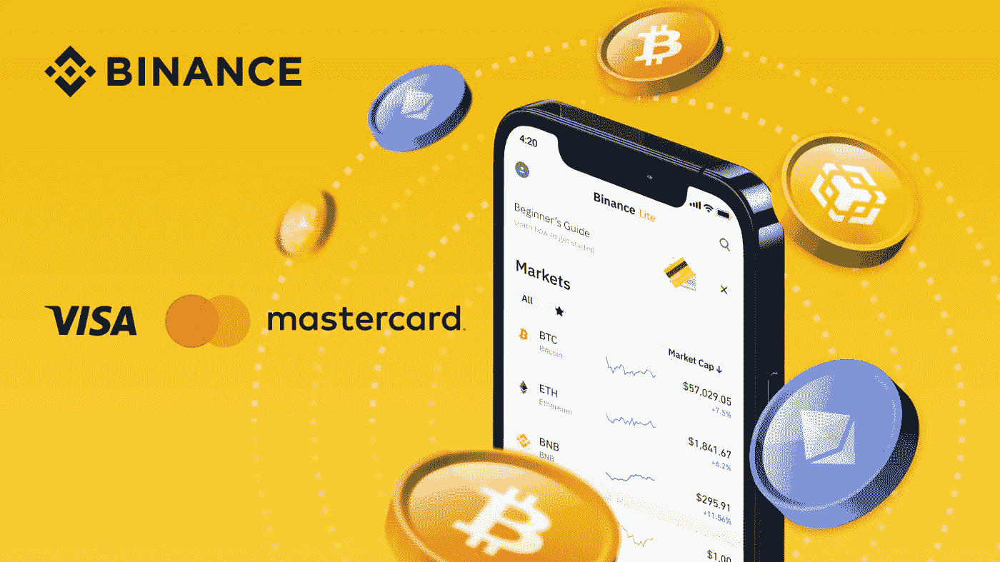

# 如何通过 5 个简单的步骤用信用卡购买代用币

> 原文：<https://medium.com/coinmonks/how-to-buy-altcoins-with-a-credit-card-in-5-easy-steps-4b9f121ea4fa?source=collection_archive---------67----------------------->

Photo: Binance

[法定存款](https://www.binance.com/en/fiat/deposit/USD?ref=UUTW4MZQ)、[银行转账](https://www.binance.com/en/my/wallet/exchange/deposit/fiat/USD?channel=bank%20transfer?ref=UUTW4MZQ)和[电子钱包](https://www.binance.com/en/buy-sell-crypto/other-channel/buy/USD/BUSD/?ref=UUTW4MZQ)是(但不是唯一的)广泛用于购买替代硬币的支付方式。虽然，除了这两种，如今信用卡主导的加密货币交易支付也很流行。但在固定存款和电子钱包主导的交易中，存款可能需要几个小时或几天。

[币安](https://accounts.binance.com/en/register?ref=UUTW4MZQ)(世界上最大的加密货币交易所)提供了一个令人兴奋的[币安买&卖](https://www.binance.com/en/buy-sell-crypto?channel=card&fiat=EUR?ref=UUTW4MZQ) (BB & S)功能。币安的 BB &功能允许[通过 VISA 或万事达卡购买加密货币](https://www.binance.com/en/buy-sell-crypto?channel=card&f iat=EUR&recurring=open?ref=UUTW4MZQ)。这篇文章将详细说明如何使用信用卡在币安购买代用币。

但首先，请注意以下几点:

强烈建议您清楚地检查和复查，以确认信用卡是理想的交易问题。在开始交易之前，确保信用卡发卡行和支付网络轻松允许相关交易类型。

**信用卡费用有哪些不同类型？**

1.  **交易费(TF)** :交易费由币安对卡交易征收。这些费用大多高于替代付款方式(即银行转账)。币安的 TF 佣金上限为 2%。而相关费用(如果有的话)是银行或信用卡服务公司特定的。
2.  **预借现金费(CAF)** :在预借现金中，信用卡实体倾向于向作为借款人的你提供资金。你支付的借款费用在 3% — 5%之间。有时，加密货币信用卡交易也被视为一种预付现金的形式。但是币安只接受万事达卡和维萨卡。所以它的用户实际上并没有付钱给咖啡馆。
3.  **国外交易费(FTF)** :如果你[通过信用卡](https://www.binance.com/en/buy-sell-crypto?channel=card&fiat=USD?ref=UUTW4MZQ)在美国以外的平台上用美元购买 crypto，将收取 3%的国外交易费。币安不允许直接存款或购买所有货币的加密货币。因此，如果你没有法定货币可用，你将需要求助于使用美元或欧元进行交易。

**用信用卡购买山寨币的好处**

1.  快速即时:信用卡是一种快捷的交易工具。当首次购买者或投资者通过法定货币购买加密货币时，这非常令人高兴。信用卡交易瞬间启动。与此相反，银行和电汇往往需要 3 到 8 天。因此，在交易完成之前，不可能将加密货币移出交易所。愿意利用熊市机会的投资者确实应该考虑适时购买信用卡加密货币。
2.  **用信用卡进行无现金投资**:加密货币市场总是在快速发展。几天的时间可能是在底部买入一枚硬币，或者更糟糕的是，在顶部买入一枚硬币。也许你的工资下周会到。如果你有足够的现金和信用卡，你就不用担心了。只要在月底支付你的账单，就可以避免你的信用卡提供商产生利息。
3.  **新手友好:**信用卡作为一种支付方式，适合那些想要避免通过高级加密交换导航的麻烦的新手。特别是加密货币的新手会发现使用信用卡要容易得多。像往常一样，只需输入你的卡号、有效期和 CVV，就可以了。
4.  **通过赌注赚取奖励**:在不太知情的加密领域，一般认为累积的交易费往往会抹去从加密货币购买中赚取的信用卡奖励。然而，实际上，这完全取决于你使用加密货币的方式。例如，赌注形式的加密货币金融产品提供了丰厚的收益作为被动收入(例如，币安赚 20%的 APY)。

访问更多关于用信用卡购买加密货币的详细信息。

**如何在币安用信用卡购买山寨币？**

第一步:登录你的币安账户(如果你有，或者[注册你的币安账户](https://accounts.binance.com/en/register?ref=UUTW4MZQ))。点击“购买加密”点击[信用卡/借记卡](https://www.binance.com/en/buy-sell-crypto?channel=card&fiat=EUR?ref=UUTW4MZQ)

第二步:选择你喜欢的法定货币。输入购买的固定金额。

第三步:点击“添加新卡”输入您的信用卡和帐单地址的详细信息。点击“添加卡片”

第 4 步:查看订单确认的付款细节。

第五步:通过银行的 OTP 交易页面验证您的付款。

继续用信用卡购买加密货币，马上。如果您想了解更多信息，请点击[此处](https://www.binance.com/en/blog/fiat/can-you-buy-cryptocurrency-with-a-credit-card-421499824684903691) (或查看[分步指南](https://www.binance.com/en/support/faq/8df758a570ba4d18941f38423f63aae5))。访问[常见问题](https://www.binance.com/en/support/faq/8df758a570ba4d18941f38423f63aae5)和**。**

[今天就用你的信用卡购买加密软件](https://www.binance.com/en/buy-sell-crypto?channel=card&f iat=EUR&recurring=open?ref=UUTW4MZQ)