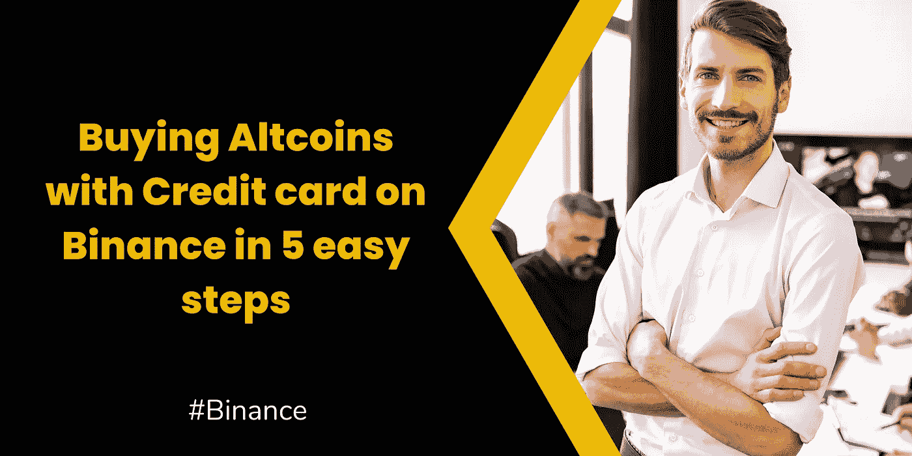
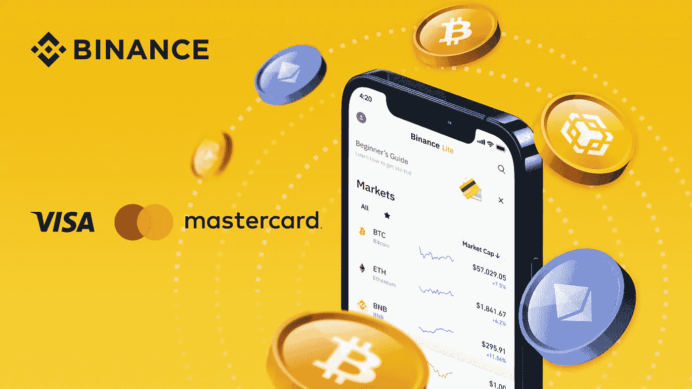
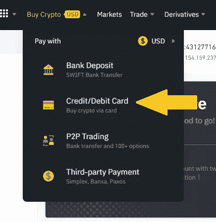
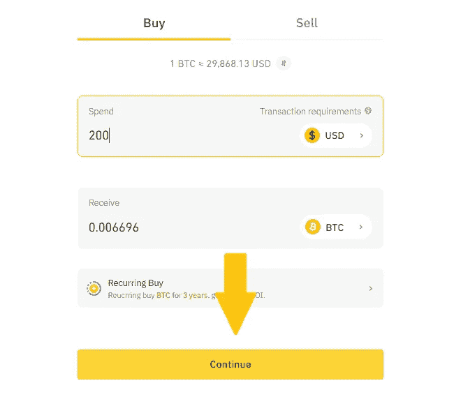
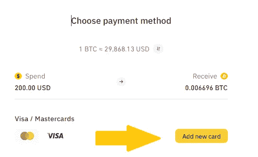
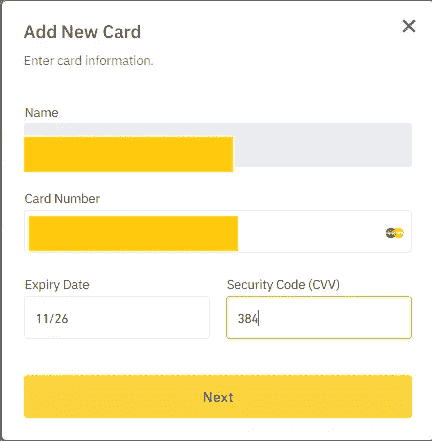
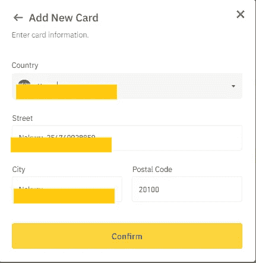
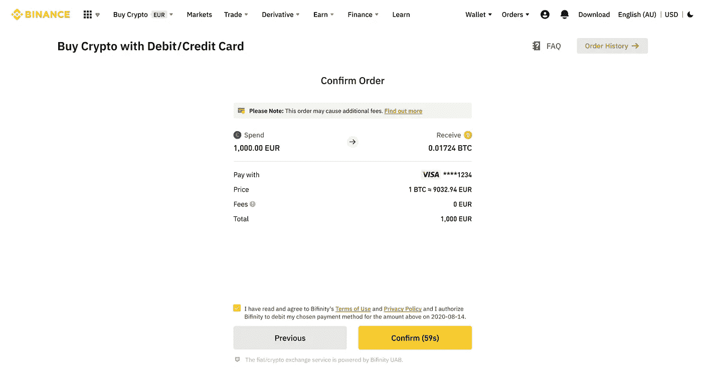

# 如何在币安通过 5 个简单的步骤用信用卡购买代用币

> 原文：<https://medium.com/coinmonks/how-to-buy-altcoins-with-a-credit-card-in-5-easy-steps-on-binance-1f21b41e3bac?source=collection_archive---------58----------------------->

在我们的日常生活中，使用信用卡是一种便捷的支付方式。你会很高兴地知道，作为一个币安用户，你可以很容易地用信用卡购买替代硬币。

这也是在币安购买加密软件最快的方式之一。

**目录**

*[***不同类型的信用卡手续费***](#4574) ***∘***[***用信用卡购买山寨币的好处***](#ff3e) ***∘***[*如何在币安用信用卡购买山寨币*](#0b80)*

## *不同类型的信用卡费用*

*信用卡在交易时会产生各种费用。在任何情况下，信用卡费用通常是不可避免的。*

*以下是在币安购买 crypto 的各种费用:*

1.  **交易费用* -当在加密货币平台上使用信用卡进行支付时，您应该预计会支付一小笔费用作为您的交易费用。*

*然而，重要的是要注意，这项费用通常会高于你的平均银行转账费用。不用说，币安通常会向你收取相当低的费用，最高可达 2%。*

**2。预付现金费用* -什么是预付现金费用？这是一项通常由银行收取的费用，是使用信用卡提取现金的结果。*

*在币安，你需要支付交易额的 3-5%作为预付现金费用。*

*请注意，币安上的一些信用卡交易通常会被作为预支现金处理。*

*一个很好的例子是美国运通卡持卡人将交易金额的 10%作为预付现金费用。*

*3.*国外交易费* -居住在美国境外的外国用户使用信用卡购买 USD 密码时，将被收取国外交易费。*

*这些用户通常会拿出交易费的 3%作为国外交易费。*

## *用信用卡购买代用币的好处*

*当谈到购买密码，方便是非常重要的。币安意识到许多用户会发现信用卡支付是最简单的支付方式。*

**

*以下是你可能想用信用卡 [***购买山寨币的一些原因:***](https://www.binance.com/en/blog/fiat/can-you-buy-cryptocurrency-with-a-credit-card-421499824684903691)*

1.  **快速和即时* -当你选择用信用卡在币安上购买 crypto 时，你可以在几秒钟内开始你的加密之旅。*

*另一方面，电汇可能会延迟您的交易 3-8 天。这意味着在交易成功完成之前，您不会获得加密资产。*

*如果你想快速购买密码，那么信用卡将是你的理想选择。*

**2。信用卡能让你在没有现金的情况下进行投资-* 手头没有足够的现金不应该成为你不购买 crypto 的充分理由。*

*加密市场发展迅速，错过机会不值得。即使你没有足够的资金，信用卡对你购买密码也很有用。*

*然而，你需要至少在月底前付清欠款，以避免高额利息。*

**3。初学者友好型-* 你可能一辈子都在使用信用卡。对于币安的许多用户来说，信用卡是购买密码的一种简单方便的方式。*

*特别是，如果你是一个初学者，你想要一个简单的支付方式。这实际上就像输入你的信用卡号、到期日和 CVV 一样简单。*

## *如何在币安用信用卡购买山寨币*

*你可以通过 5 个简单的步骤开始用你的信用卡购买代用币。*

1.  *第一步是登录您的帐户，然后导航到“*购买加密”*。*

**

*2.选择特定的法定货币，并输入您打算购买的法定金额。选择您想要购买的加密。然后继续点击继续。*

**

*3.在下一页，点击“添加新卡”并输入您的信用卡信息。*

****

*输入您的帐单地址。*

**

*4.热衷于仔细检查付款细节，并着手确认订单。*

**

*5.订单确认后，在银行的 OTP 交易页面上验证您的付款。[阅读更多常见问题解答](https://www.binance.com/en/support/faq/8df758a570ba4d18941f38423f63aae5)*

*[**今天用信用卡买密码> >**](https://www.binance.com/en/buy-sell-crypto?channel=card&fiat=EUR?ref=431277160)*

****关联披露:*** *本帖包含关联链接。如果您使用这些链接购买一些东西，我们可能会赚取佣金，对您没有额外的费用。感谢*。*