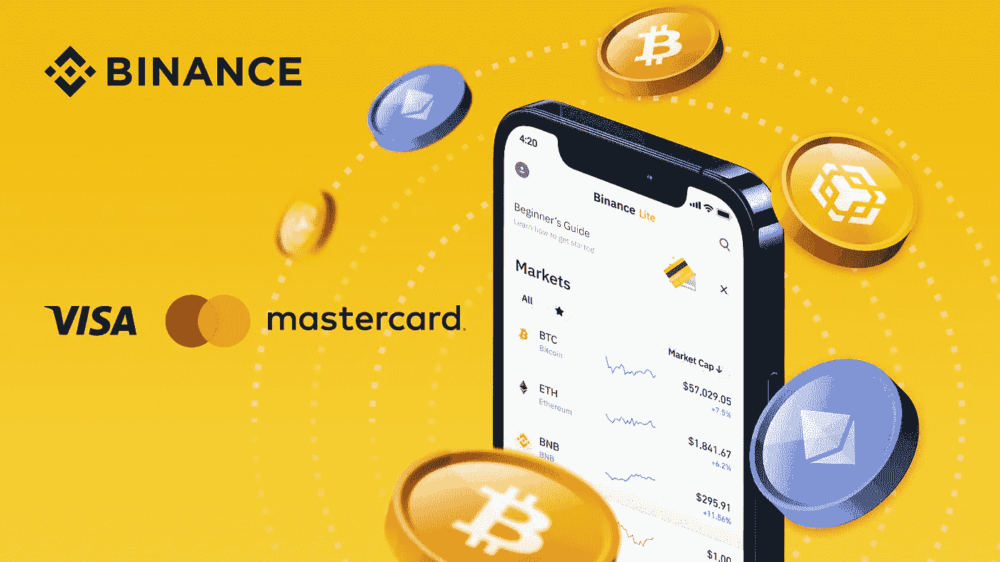
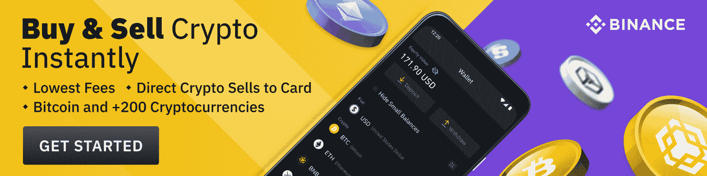

# 如何通过 5 个简单的步骤用信用卡购买 altcoins？

> 原文：<https://medium.com/coinmonks/how-to-buy-altcoins-with-a-credit-card-in-5-simple-steps-3df5408741be?source=collection_archive---------14----------------------->

Photo: Binance

**简介**

购买加密货币的电子钱包或银行转账是许多爱好者的首选媒介。但是，继法定存款或电子钱包之后，信用卡主导的加密货币购买是一种迅速而便捷的支付途径。通过信用卡购买 crypto 非常容易，交易只需 30 秒就能完成。[币安购买&出售](https://www.binance.com/en/buy-sell-crypto?channel=card&fiat=EUR&recurring=open?ref=P10U1GSP) (BB & S)是另一个在币安通过信用卡购买加密货币的有趣平台。[币安](https://www.binance.com/en?ref=P10U1GSP)让你[购买加密货币](https://www.binance.com/en/buy-sell-crypto?channel=card&fiat=EUR?ref=P10U1GSP)通过 VISA 或万事达卡支付定期费用。现在让我们详细检查诉诸信用卡购买替代硬币的来龙去脉。

**注**:

在交易启动前，及时检查并确保信用卡的适用性(发卡机构和支付网络允许启动交易类型)。

**信用卡手续费有哪些种类？**

考虑到您的个人情况，使用加密货币购买时适用于您的信用卡费用往往会有所不同。通常适用的费用如下:

**交易费用**

加密货币交易所对信用卡或借记卡交易征收的名义费用通常高于其他支付途径(如银行转账)。币安收取高达 2%的象征性费用，而额外的费用来自银行和信用卡服务提供商。

**预借现金佣金**

在预支现金中，信用卡提供商借给你(借款人)现金，你支付 3%-5%的费用。信用卡主导的加密货币交易有时也被归类为预付现金。但有个好消息:币安用户不需要支付任何预付现金的费用，因为币安只接受万事达卡和维萨卡。

**对外经营委员会**

如果您打算[通过信用卡](https://www.binance.com/en/buy-sell-crypto?channel=card&fiat=USD?ref=P10U1GSP)在不在美国的平台上用美元购买 crypto，您将支付国外交易费(交易金额的 3%)。如果你有国内发行的信用卡，但你通过其他法定发行的货币购买加密货币，你将支付国外交易费。

用信用卡购买山寨币的好处

**快速即时**

信用卡的快速交易启动功能使新手买家和投资者购买加密货币变得超级容易和即时。银行和电汇通常需要花费四到八天的时间，使加密货币处于不稳定状态(直到交易完成)。作为投资者，如果你希望在熊市下跌时迅速买入，考虑以信用卡为主导的加密货币购买是必须的。

**信用卡允许你不用现金投资**

想象一下在手头没有实际现金的情况下购买加密货币。很有趣，不是吗？认真的买家和投资者需要在他们偏好的加密货币的峰值和底部迅速采取行动。朝九晚五的工薪阶层可能需要信用卡便利，因为他们的发薪日与市场脉搏不同步。这里需要注意的是在日期之前及时支付即将到来的信用卡账单。

**方便初学者**

Cryptoverse 的新投资者会发现，在交易所通过信用卡支付他们购买的加密货币既快捷又容易。信用卡主导的加密交易需要相同的(新手友好的)输入卡号、有效期和 CVV 的步骤。提供信用卡使用的加密货币交易所

**用币安信用卡购买山寨币的步骤**

第一步。登录您的币安帐户。点击“购买加密货币”，然后点击[信用卡/借记卡](https://www.binance.com/en/buy-sell-crypto?channel=card&fiat=EUR?ref=P10U1GSP)

第二步:选择你的法定货币，并输入你想购买的数量(法定货币)。

第三步:点击“添加新卡”输入您的信用卡详细信息和帐单地址帐户。然后点击“添加卡片”注意:只能用自己的信用卡支付。

第 4 步:验证您的账单信息(付款详情)并确认订单。

注:过去一分钟，币安将再次计算价格和您应收的加密货币金额。要查看更新的市场价格，请单击“刷新”

第五步:在银行的一次性交易页面上确认您的付款。

# 那么，可以用信用卡购买加密货币吗？“是的，”你当然可以。要了解更多信息，请点击[此处](https://www.binance.com/en/blog/fiat/can-you-buy-cryptocurrency-with-a-credit-card-421499824684903691)(或访问分步指南[此处](https://www.binance.com/en/support/faq/8df758a570ba4d18941f38423f63aae5))，或阅读[常见问题解答](https://www.binance.com/en/support/faq/8df758a570ba4d18941f38423f63aae5)。

[今天就用信用卡购买加密软件](https://www.binance.com/en/buy-sell-crypto?channel=card&fiat=EUR?ref=P10U1GSP)

Photo: Binance

[通过信用卡激活您的加密购买/出售定期计划](https://www.binance.com/en/buy-sell-crypto?channel=card&fiat=EUR&recurring=open?ref=P10U1GSP)

新来币安吗？[今天免费注册](https://accounts.binance.com/en/register?ref=P10U1GSP)。

> *加入 Coinmonks* [*电报频道*](https://t.me/coincodecap) *和* [*Youtube 频道*](https://www.youtube.com/c/coinmonks/videos) *了解加密交易和投资*

# 另外，阅读

*   [有哪些交易信号？](https://coincodecap.com/trading-signal) | [Bitstamp vs 比特币基地](https://coincodecap.com/bitstamp-coinbase) | [买索拉纳](https://coincodecap.com/buy-solana)
*   [ProfitFarmers 回顾](https://coincodecap.com/profitfarmers-review) | [如何使用 Cornix Trading Bot](https://coincodecap.com/cornix-trading-bot)
*   [十大最佳加密货币博客](https://coincodecap.com/best-cryptocurrency-blogs) | [YouHodler 评论](https://coincodecap.com/youhodler-review)
*   [my constant Review](https://coincodecap.com/myconstant-review)|[8 款最佳摇摆交易机器人](https://coincodecap.com/best-swing-trading-bots)
*   [MXC 交易所评论](/coinmonks/mxc-exchange-review-3af0ec1cba8c) | [Pionex vs 币安](https://coincodecap.com/pionex-vs-binance) | [Pionex 套利机器人](https://coincodecap.com/pionex-arbitrage-bot)

**免责声明**:本文仅用于教育目的，不应理解为投资建议。