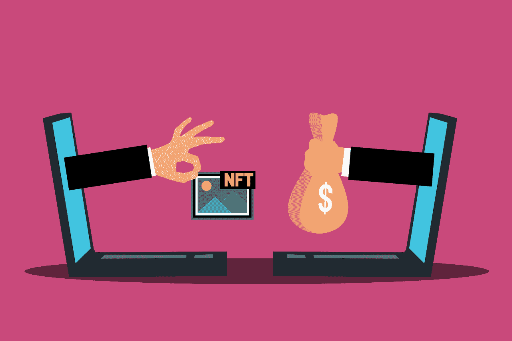

# 如何在 eToro 上购买 NFT？

> 原文：<https://medium.com/coinmonks/how-to-buy-an-nft-on-etoro-56367d8d7971?source=collection_archive---------55----------------------->

尽管每天都有数以千计的不可替代代币出售，但购买第一个代币可能会令人困惑。

在这个快速指南中，我们通过五个简单的步骤来分解如何使用 [eToro](https://med.etoro.com/B12087_A113940_TClick.aspx) 、MetaMask 和 OpenSea 购买 NFT。

# 概观

*   在 [eToro](https://med.etoro.com/B12087_A113940_TClick.aspx) 上购买以太坊
*   下载元掩码
*   将以太坊发送到元掩码
*   连接到 NFT 市场
*   买下 NFT

# 1.在 eToro 上购买以太坊

大多数 NFT 可以用[以太坊](https://med.etoro.com/B12087_A113940_TClick.aspx)购买，你可以在 eToro 上轻松买到。

如果您没有 eToro 帐户，只需注册、验证身份并存款即可。当你的账户通过验证并获得资金后，你就可以导航到[以太坊](https://med.etoro.com/B12087_A113940_TClick.aspx)并选择你想要购买的数量。

一旦您购买了以太坊，您需要[将它转移到您的 eToro 钱包](https://med.etoro.com/B12087_A113940_TClick.aspx)。为此，请点击 eToro 账户上的投资组合按钮，选择以太坊，然后点击转移到钱包。

注意:如果你看上了某个特定的 NFT，确保你买了足够的以太坊，为网络费用留有余地。根据区块链的活跃程度，交易价格会有很大的起伏。

*在一些欧盟国家和英国，加密资产不受监管。没有消费者保护。*

# 2.下载元掩码

MetaMask 是一个加密钱包，充当基于以太坊的分散金融(DeFi)和 NFT 生态系统的网关。它既可以作为火狐和谷歌 Chrome 的浏览器插件，也可以作为 iOS 和 Android 的移动应用程序。

无论您选择使用移动版还是桌面版，您都需要从 [MetaMask.io](http://metamask.io/) 下载应用程序，创建钱包，设置密码，并保存恢复短语。

重要提示:如果您忘记了密码，秘密恢复阶段用于恢复您的元掩码钱包。这个短语实际上代表了钱包里任何东西的所有权，所以一定要把它放在一个不会丢失或被盗的安全的地方。

# 3.将以太坊发送到元掩码

您现在已经准备好[将以太坊](https://www.etoro.com/en-us/customer-service/help/1343545772/how-do-i-send-cryptocurrencies-from-my-etoro-money-crypto-wallet-to-another-wallet/)发送到您的新 MetaMask 钱包。

首先，打开 eToro 钱包，点击以太坊下的发送。

然后打开 MetaMask，复制新钱包的地址，粘贴到 eToro 上的地址栏。在那里，指定以太币的数量并再次点击发送。

根据以太坊网络的繁忙程度，你的交易可能需要几分钟到一个多小时。

# 4.连接到 NFT 市场

当你的以太坊到达元面具时，导航到 NFT 平台。本指南涵盖了其中最大的 NFT 平台: [OpenSea](http://opensea.io/) 。

首先，导航到 OpenSea 主页的右上角，点击钱包图标并选择 MetaMask。系统会提示您连接钱包。

一旦连接上，就可以开始浏览了！OpenSea 拥有大量可供收藏的头像和艺术品，价格从几便士到几十万美元不等。

# 连接到其他平台

包括 [Rarible](https://rarible.com/) 在内的大部分 NFT 平台的钱包连接方式与 OpenSea 相同。其他的，比如 [SuperRare](https://superrare.com/) ，要求用户在连接前创建一个个人资料。

# 5.买下 NFT

一旦你发现了一个让你感兴趣的 NFT，你通常会有两个选择:立即购买和出价。这让你可以选择立即以规定的价格购买物品，或者出价购买。

*   出价
    点击出价按钮，查看详情，并输入您对 NFT 的出价。在此阶段，您需要在确认交易之前将您的 ETH 转换为 WETH。
*   点击“立即购买”按钮查看购买详情，然后前往收银台查看汽油费。最后，点击确认成为 NFT 的新主人。

*在一些欧盟国家和英国，加密资产不受监管。没有消费者保护。*

# 在商品交易所注册并潜入海洋

# [https://med.etoro.com/B12087_A113940_TClick.aspx](https://med.etoro.com/B12087_A113940_TClick.aspx)

> 加入 Coinmonks [电报频道](https://t.me/coincodecap)和 [Youtube 频道](https://www.youtube.com/c/coinmonks/videos)了解加密交易和投资

# 另外，阅读

*   [CBET 评论](https://coincodecap.com/cbet-casino-review) | [库科恩 vs 比特币基地](https://coincodecap.com/kucoin-vs-coinbase) | [拜比特 vs 比特币基地](https://coincodecap.com/bybit-vs-coinbase)
*   [如何在加拿大购买加密货币？](https://coincodecap.com/how-to-buy-cryptocurrency-in-canada)
*   [无聊猿游艇俱乐部(BAYC)评论](https://coincodecap.com/bored-ape-yacht-club-bayc-review)
*   [5 款最佳加密交易终端](https://coincodecap.com/crypto-trading-terminals) | [最佳 DeFi 应用](https://coincodecap.com/best-defi-apps)
*   [在美国如何使用 BitMEX？](https://coincodecap.com/use-bitmex-in-usa) | [BitMEX 评论](https://coincodecap.com/bitmex-review)