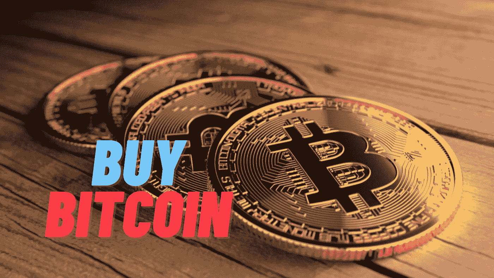
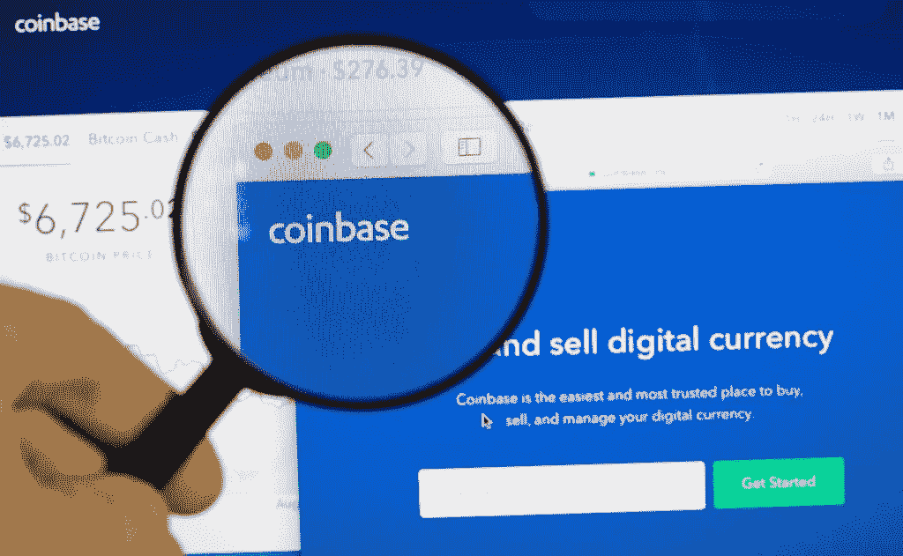

# 如何购买比特币

> 原文：<https://medium.com/coinmonks/how-to-buy-bitcoin-f092cf91a9cb?source=collection_archive---------75----------------------->

当谈到购买加密，你有很多选择。幸运的是，你可以在任何比特币基地可用的地方用 [**比特币基地应用**](https://www.coinbase.com/join/9npib9) 购买比特币。它快速、简单且安全。以下是美国居民如何使用比特币基地应用购买比特币。

## 1.[创建一个比特币基地账户](https://www.coinbase.com/join/9npib9)

下载 [**比特币基地 app**](https://www.coinbase.com/join/9npib9) ，开始报名流程。你需要一个有效的身份证，可能会被要求提供地址证明，以便进行交易，所以一定要准备好这些。验证您的 ID 可能需要几分钟以上的时间，具体取决于您的居住地。

## 2.添加付款方式

点击付款方式框并连接一种付款方式。你可以使用银行账户、借记卡或电汇。

## 3.开始做生意

按，然后从选项列表中选择“购买”。

## 4.从资产列表中选择比特币

在搜索栏中输入“比特币”即可搜索比特币。当你看到比特币出现在结果中时，点击它打开购买屏幕。

## 5.输入您想购买的数量

使用数字键盘输入您想用当地货币支付的金额。该应用程序会自动将其转换成比特币金额。

## 6.完成您的购买

准备好后点击“预览购买”。你会看到你购买的详细资料。确保一切看起来不错，然后确认您的购买。就是这样，你买了比特币。

> [***瞬间在比特币基地上创建账号***](https://www.coinbase.com/join/9npib9)

“复制自 2022 比特币基地”

> *加入 Coinmonks* [*电报频道*](https://t.me/coincodecap) *和* [*Youtube 频道*](https://www.youtube.com/c/coinmonks/videos) *了解加密交易和投资*

# 另外，阅读

*   [Bookmap 评论](https://coincodecap.com/bookmap-review-2021-best-trading-software) | [美国 5 大最佳加密交易所](https://coincodecap.com/crypto-exchange-usa)
*   最佳加密[硬件钱包](/coinmonks/hardware-wallets-dfa1211730c6) | [Bitbns 评论](/coinmonks/bitbns-review-38256a07e161)
*   [新加坡十大最佳加密交易所](https://coincodecap.com/crypto-exchange-in-singapore) | [收购 AXS](https://coincodecap.com/buy-axs-token)
*   [红狗赌场评论](https://coincodecap.com/red-dog-casino-review) | [Swyftx 评论](https://coincodecap.com/swyftx-review) | [CoinGate 评论](https://coincodecap.com/coingate-review)
*   [投资印度的最佳加密软件](https://coincodecap.com/best-crypto-to-invest-in-india-in-2021)|[WazirX P2P](https://coincodecap.com/wazirx-p2p)|[Hi Dollar Review](https://coincodecap.com/hi-dollar-review)
*   [加拿大最佳加密交易机器人](https://coincodecap.com/5-best-crypto-trading-bots-in-canada) | [库币评论](https://coincodecap.com/kucoin-review)
*   [火币的加密交易信号](https://coincodecap.com/huobi-crypto-trading-signals) | [HitBTC 审查](/coinmonks/hitbtc-review-c5143c5d53c2)
*   [如何在 FTX 交易所交易期货](https://coincodecap.com/ftx-futures-trading) | [OKEx vs 币安](https://coincodecap.com/okex-vs-binance)
*   [OKEx vs KuCoin](https://coincodecap.com/okex-kucoin) | [摄氏替代品](https://coincodecap.com/celsius-alternatives) | [如何购买 VeChain](https://coincodecap.com/buy-vechain)