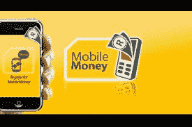

# 如何用移动货币在加纳购买比特币

> 原文：<https://medium.com/coinmonks/how-to-buy-bitcoin-in-ghana-with-mobile-money-4b6435886d8e?source=collection_archive---------38----------------------->

移动货币就像加纳的商业银行账户一样运作，是的，你可以用它从加密交换平台购买比特币。但在我们深入“如何”之前，让我们先来谈谈什么是移动货币，以及它是如何使用的。

**移动货币**

移动货币是一种电子钱包服务。这在包括加纳在内的许多国家都可以使用，它允许用户使用他们的手机保存、发送和接收钱。这是一种安全、简便的电子支付方式，是银行账户的热门替代方式。你可以在智能手机和基本功能手机上使用它。

它是由移动网络运营商或与移动网络运营商合作的其他实体向客户提供的金融服务，独立于正式的银行系统。使用移动货币服务不需要银行账户，唯一的先决条件是一个基本的手机号码。

在加纳，移动支付服务由 MTN 加纳、沃达丰和 AirtelTigo 等电信公司提供。加纳银行报告称，2021 年 1 月，用于移动货币交易的支票金额达到 28.2 亿美元。加纳银行还报告说，2021 年，有 4090 万注册移动货币账户和 1750 万活跃账户。这表明移动货币是加纳人日常做生意和进行金融交易的重要组成部分。

移动货币很受欢迎，因为它易于使用和设置，几乎每个人都有一个电话号码，这是使用移动货币的基本必需品。它能在任何设备上工作，不管设备有多复杂，这也很有帮助。

据称，手机支付服务比银行账户更便宜。没有像我们大多数银行账户那样的开户或持续账户收费。在像加纳这样的移动货币流行的国家，它就像你口袋里有钱一样好用，而且它已经变得更加安全和容易使用

**手机货币和手机银行的区别**

移动银行是在移动设备上使用应用程序来访问和执行银行服务，如资金交易、支票取款和余额查询。

将手机作为获取传统银行产品的另一个渠道的服务被认为是移动银行，而不是移动货币。移动货币与银行无关。

**如何用移动货币购买比特币**

由于移动货币的功能就像银行账户一样，大多数加密交换平台都将移动货币作为一种支付方式纳入了他们的网站。像币安、汇款银行等流行的交易所接受移动货币作为一种支付形式，你只需要用移动货币发起交易。这是可能的，因为移动货币的普及和普遍接受。

像 Dart Africa 这样的本地加密交易平台也接受移动货币作为支付方式。当你在 [Dart Africa](http://dartafrica.io) 上发起交易时，你可以出售你的比特币，并将钱发送到你的手机上。

**关于达特非洲**

Dart Africa 是一个可靠的本地交易平台，您可以在几分钟内无缝地将您的加密货币兑换成现金。Dart Africa 很受欢迎，因为客户满意度是该组织的目标之一，他们在这一领域一直表现出色。

他们的汇率是市场上最好的汇率之一，检查他们平台上的[硬币计算器](https://dartafrica.io/coincalculator)功能以确认这一说法。当你在 Dart Africa 上出售加密货币时，你的加密货币获得最佳价值的机会更高。

Dart Africa 提供包括移动货币在内的多种支付方式。一旦您在 Dart Africa 上出售您的加密硬币，初始付款将支付到您的 Dart Africa 钱包中(您可以通过在 Dart Africa 钱包中创建一个帐户来获得)，然后您可以将资金转移到您的移动钱包中，使用该平台支持的其他支付方式。Dart Africa 似乎在尽可能短的时间内处理付款方面做得很好。

确认加密货币交易后，资金在几分钟内支付。你可以通过其[网站](http://dartafrica.io)或在[谷歌 Play 商店](https://play.google.com/store/apps/details?id=com.dartafrica&hl=en_US&gl=US)和 App Store 均可下载的手机应用程序访问其服务。

在 Dart 非洲销售

*   只需创建一个帐户
*   设置您的交易 PIN
*   向提供的钱包发送加密硬币
*   将资金转移到您的移动钱包。

是的，就是这么简单。

**支持的加密硬币**

*   比特币，
*   莱特币，
*   以太坊，
*   USDT，
*   BUSD
*   Dogecoin，
*   USDC。

> 加入 Coinmonks [电报频道](https://t.me/coincodecap)和 [Youtube 频道](https://www.youtube.com/c/coinmonks/videos)了解加密交易和投资

# 另外，阅读

*   [德国最佳加密交易所](https://coincodecap.com/crypto-exchanges-in-germany) | [Arbitrum:第二层解决方案](https://coincodecap.com/arbitrum)
*   [币安交易机器人](/coinmonks/binance-trading-bots-d0d57bb62c4c) | [OKEx 审查](/coinmonks/okex-review-6b369304110f) | [阿塔尼审查](https://coincodecap.com/atani-review)
*   [最佳加密交易信号电报](/coinmonks/best-crypto-signals-telegram-5785cdbc4b2b) | [MoonXBT 评论](/coinmonks/moonxbt-review-6e4ab26d037)
*   [如何在 Bitbns 上购买柴犬(SHIB)币？](https://coincodecap.com/buy-shiba-bitbns) | [购买 Floki](https://coincodecap.com/buy-floki-inu-token)
*   [CoinFLEX 评论](https://coincodecap.com/coinflex-review) | [AEX 交易所评论](https://coincodecap.com/aex-exchange-review) | [UPbit 评论](https://coincodecap.com/upbit-review)
*   [十大最佳加密货币博客](https://coincodecap.com/best-cryptocurrency-blogs) | [YouHodler 评论](https://coincodecap.com/youhodler-review)