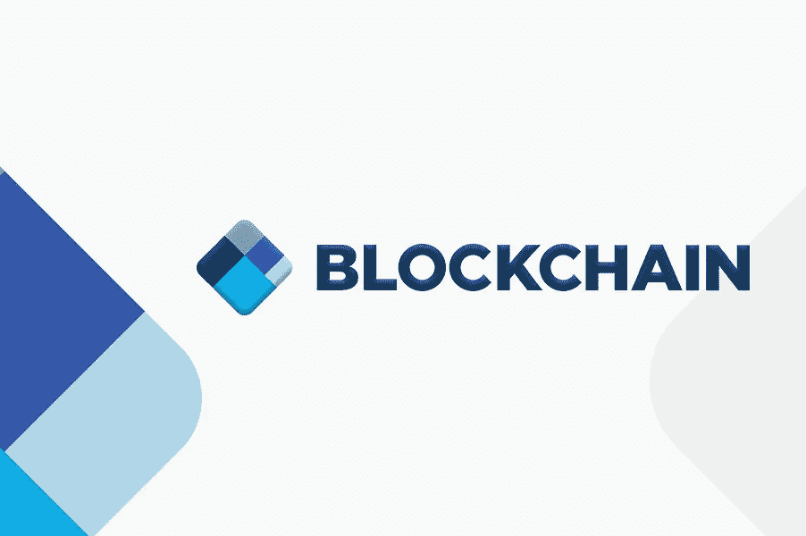
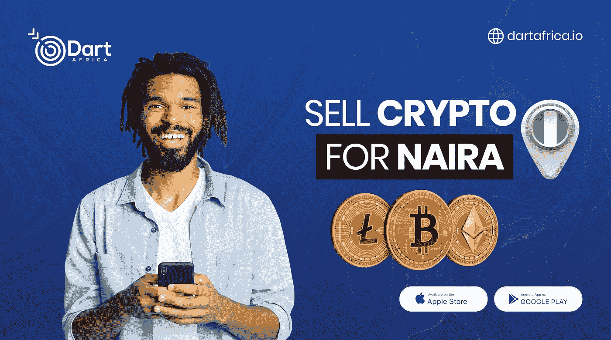

# 如何在区块链上购买比特币

> 原文：<https://medium.com/coinmonks/how-to-buy-bitcoin-on-blockchain-92a3743ccb3c?source=collection_archive---------38----------------------->

比特币是创造去中心化数字货币的第一次成功尝试，它是得到最广泛认可的加密货币。它使用分散协议、加密工具和区块链技术(定期更新的公共分类账，以实现交易状态的全球一致)来实现数字领域的点对点价值交换。

Blockchain

从更实际的意义上来说，比特币是一种数字货币:

1.  独立于任何政府、国家或金融机构，
2.  价值可以在没有任何中央控制机构或中介的帮助下进行全球转移，
3.  有一个众所周知的货币体系，可以说只能由供求关系来改变。

在更深刻的意义上，比特币可以被视为一种政治、哲学和经济体系。由于技术特征的各种集成，它包含了广泛的缔约方和利益相关方，并且它是一个包含不断发展其协议的变化的系统。

比特币可以指比特币软件协议，也可以指货币单位，其股票代码为 BTC。但在本文中，我们将把比特币称为一种货币单位。

## **关于区块链**

区块链可以被称为大多数加密货币所基于的技术，也是一家加密货币金融服务公司的名称，我们在主题中将其称为一家公司。该公司被普遍称为 Blockchain.com，以区别于“区块链技术”。Blockchain.com 于 2011 年开始成为第一个比特币区块链(比特币和大多数替代硬币背后的技术)，后来建立了其加密货币钱包，在 2021 年至 2020 年间占比特币交易的 28%。除了加密货币钱包，Blockchain.com 还提供加密货币兑换服务和机构加密货币市场贷款业务以及加密交易的数据、图表和分析。

## **如何在 Blockchain.com 购买比特币**

在你购买比特币之前:

*   可以分次购买比特币。1 BTC 目前的价值在 29000 美元左右，你可以选择购买价值 10 美元或 999 美元的比特币，你不必一次性购买整个价值 29000 美元的比特币。
*   在 Blockchain.com 上创建帐户后，您需要使用您的身份信息验证您的帐户，以遵守 AML(反洗钱)法规，就像您使用的任何金融机构一样。出台这一规定是为了让不良行为者更难使用加密货币。
*   Blockchain.com 有不同的系统供你储存比特币，一旦通过验证，你可以将比特币储存在你的 Blockchain.com 钱包、交易账户或奖励账户中，在那里你可以获得比特币的 APY(年百分比收益率)。

**现在，这里是如何在 Blockchain.com 上购买比特币:**

1.  注册并验证您的身份。
2.  导航至购买加密并选择您的支付方式(借记卡、信用卡或银行转账)。
3.  下单购买任何数量的比特币，无论是 10 美元还是 99 美元。

就像 1，2，3 一样简单。

请注意，只有在商业银行被允许在加密货币相关活动中进行交易的国家，才能连接您的信用卡或借记卡，如果您在这个国家，最好使用 P2P 加密交换平台购买比特币。

## **达特非洲；出售比特币的最佳平台**

Dart Africa 是一个本地加密货币交易平台，允许您将一些加密货币兑换成现金，而不受政府限制。Dart Africa 在尼日利亚和加纳开展业务，一直是当地交换平台的领跑者，提供出色的加密服务。

Dart Africa 为您的加密货币提供有利可图的利率，众所周知，大多数加密货币的价格波动很大，因此会影响交换平台提供的汇率。您可以随时使用 [Dart Africa 的硬币汇率计算器](https://dartafrica.io/coincalculator)检查当前汇率，将提供您选择的加密金额的相应美元、奈拉和塞迪斯值。

Dart Africa 区别于其他加密交换平台的另一点是其网站的结构。他们设计了自己的平台，使得任何人都可以轻松地在上面导航和出售他们的密码。您可以通过其[网站](http://dartafrica.io)和手机应用程序访问 Dart Africa 的服务。该应用可在[谷歌 Play 商店](https://play.google.com/store/apps/details?id=com.dartafrica&hl=en_US&gl=US)上下载。

**如何在 Dart Africa 上销售**

1.  向他们创建一个帐户，如果您已经有帐户，请登录。
2.  首次登录时，创建您的交易 PIN。这将用于验证从您的帐户提款。
3.  导航到出售硬币界面，输入您要出售的加密货币的详细信息。
4.  系统将为您生成一个钱包地址，并将密码发送到钱包。
5.  我们将根据您发送到所提供的钱包中的加密货币金额，向您的帐户存款。

> 加入 Coinmonks [电报频道](https://t.me/coincodecap)和 [Youtube 频道](https://www.youtube.com/c/coinmonks/videos)了解加密交易和投资

# 另外，阅读

*   [有哪些交易信号？](https://coincodecap.com/trading-signal) | [Bitstamp vs 比特币基地](https://coincodecap.com/bitstamp-coinbase) | [买索拉纳](https://coincodecap.com/buy-solana)
*   [ProfitFarmers 回顾](https://coincodecap.com/profitfarmers-review) | [如何使用 Cornix 交易机器人](https://coincodecap.com/cornix-trading-bot)
*   [西班牙 5 大最佳文案交易平台](https://coincodecap.com/copy-trading-spain)
*   [Pionex 双重投资](https://coincodecap.com/pionex-dual-investment) | [AdvCash 审查](https://coincodecap.com/advcash-review) | [支持审查](https://coincodecap.com/uphold-review)
*   [面向开发者的 8 个最佳加密货币 API](https://coincodecap.com/best-cryptocurrency-apis)