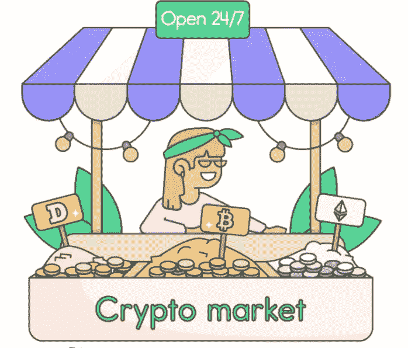
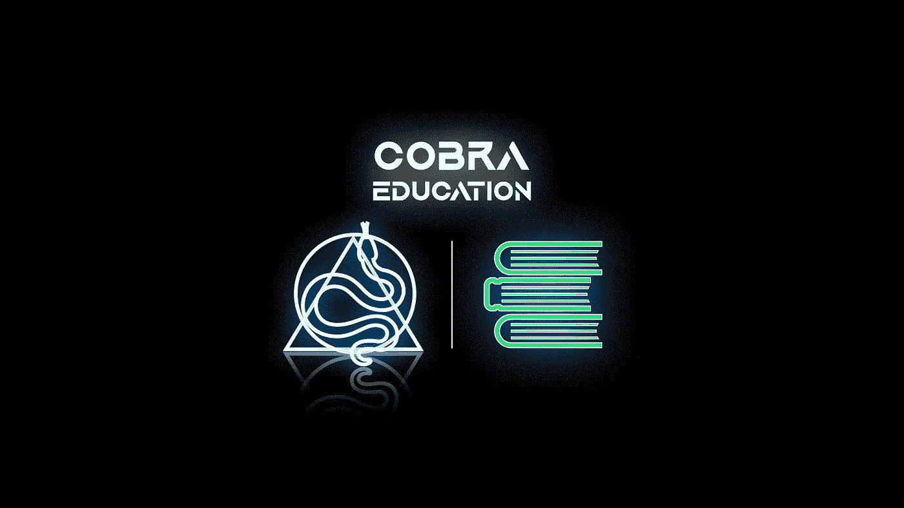

# 如何购买 Crypto？

> 原文：<https://medium.com/coinmonks/how-to-buy-crypto-92ffe2fe4b9d?source=collection_archive---------63----------------------->

在我们的 YouTube 上观看视频的同时，享受这个流的资源！

YouTube:[https://youtu.be/TpDftn2YTWE](https://youtu.be/TpDftn2YTWE)

不和:【https://discord.gg/J73qhkj7kr】T2

推特:【https://twitter.com/CryptoverseDAO】

linktree:[https://linktr.ee/cryptoversedao](https://linktr.ee/cryptoversedao)

-

如何购买 Crypto？

你可以在集中的(CEFI)和分散的(DEFI)交易所买卖密码。随着世界对加密货币兴趣的增长，投资比特币和以太坊等货币的愿望也在增长。加密货币可以在菲亚特(即美元和英镑)的集中交易所购买，也可以在另一种加密货币的分散平台上购买，即 BTC/联邦理工学院/USDT。

在你打开钱包投资加密之前，请确保你了解基本原理。要存储您购买的硬币/代币，您需要一个支持加密货币的加密钱包。你还需要根据自己的需求选择最好的比特币交易所。有些交易平台并非在每个国家都可用，这一点要记住。

如何在集中交易所购买密码？

几乎地球上的每一个加密货币交易所都可以协助买家购买比特币&以太坊。考虑以下选项:

https://www.binance.com/en[币安](https://www.binance.com/en)比特币基地[https://www.coinbase.com/](https://www.coinbase.com/)Crypto.com[https://crypto.com/](https://crypto.com/)Bitfinex[https://www.bitfinex.com/](https://www.bitfinex.com/)火币[https://www.huobi.com/en-us/](https://www.huobi.com/en-us/)

欲查看交易所及其评级的完整列表，请访问 https://coinmarketcap.com/rankings/exchanges/

所有这些交易都需要创建一个帐户并验证您的身份，因为这些业务必须符合法规，而且它们必须这样做。创建帐户是完全免费的。

是时候为你的帐户注资了，这样一旦验证通过，你就可以投资加密了。大多数交易所让客户通过银行转账向他们的账户提供资金，然而，大多数交易所也接受信用卡或现金支付。银行转帐可能需要几个工作日才能完成，但是根据您选择的平台，当天转帐可能是可用的。

当您的帐户获得资金时，您将可以选择使用您为帐户提供资金的货币购买大量加密货币。购买过程完成后，加密余额将进入您的 exchange 钱包。你可以把它留在那里，也可以把它转移到一个硬件钱包里，在那里只有你有权访问私钥或种子短语。

请记住:不是你的密钥，也不是你的硬币——当你把你的密码存储在集中的交易所时，你不能访问私人密钥，因此你实际上并不拥有对它们的唯一权利/访问权。或者，您可以将硬币存储在硬件/冷钱包中，在那里您可以完全控制和访问私钥。

更多详情请访问[https://cryptowallet.com/glossary/private-key/](https://cryptowallet.com/glossary/private-key/)

如何在分散交易所购买 Crypto？

如果您已经拥有加密货币，您可以通过将您现有的加密货币换成另一种加密货币来投资替代货币。
分散式交易所(也称为 DEX)托管在几个不同的区块链上，我们稍后将对此进行更详细的介绍。

考虑以下选项:

uniswap[https://info.uniswap.org/#/](https://info.uniswap.org/#/)
PancakeSwap[https://pancakeswap.finance/](https://pancakeswap.finance/)
Apeswap[https://apeswap.finance/](https://apeswap.finance/)
SushiSwap[https://app.sushi.com/en/swap](https://app.sushi.com/en/swap)
1 inch[https://app.1inch.io/](https://app.1inch.io/)
quick swap[https://quickswap.exchange/#/swap](https://quickswap.exchange/#/swap)
Raydium[https://raydium.io/swap/](https://raydium.io/swap/)
trader Joe[https://traderjoexyz.com/home#/](https://traderjoexyz.com/home#/)
astro swap[https://duck duck go . com/？](https://duckduckgo.com/?t=ffab&q=astroswap&ia=web)

与集中式系统不同，分散式交易所的一个主要优点是它们是非托管的，因此它们不需要用户注册账户。相反，客户可以直接从他们的加密钱包交易，使过程更加简单。

使用以太坊钱包

下一步是创建一个以太坊钱包，因为我们知道在投资以太坊时可以利用哪些交易所。这对于保证加密货币的安全至关重要。

虽然集中式交易所允许用户将加密货币保存在托管账户中，但也需要用户同意才能存取资金，不方便。

有多种以太坊钱包可供选择。一些消费者选择可以在电脑或智能手机上使用的软件解决方案。其他人选择硬件钱包，因为它为他们提供了更大的安全性和控制。

硬件钱包是一种加密的 USB 设备，必须插入计算机或蓝牙连接到移动设备才能使用。硬钱包包括 Ledger Nano S/X 和 Trezor。

对于需要软件解决方案的个人来说，以下软件选择是受欢迎且安全的，最受欢迎的是 MetaMask。

还有许多 Defi 钱包，它们不仅能给你以太坊的钱包，还能给你各种流行的区块链的钱包。

使用软件钱包很简单。在您的首选设备上安装程序并完成设置。如果钱包为您生成了种子短语，请备份种子短语。这一串字符代表钱包的私钥，确认您是该地址和与之关联的任何资金的合法所有者。

这些信息应该写在一张纸上作为备份。当数据以数字形式存储时，它很容易被黑客攻击，尤其是当文本文件保持在线时。

完成设置后，您将获得一份电子钱包地址摘要，如果您愿意，还可以创建一个新的电子钱包地址。当您投资以太坊并向您的钱包转账时，这是您将使用的地址。

无论你使用的是集中兑换还是分散兑换，都要注意尽快把你购买的以太坊发到你的钱包里。你控制的钱包保证你可以花掉现金而不需要第三方的许可。

您现在可以通过交易所将菲亚特转换为加密货币，创建 Defi 钱包并享受加密货币交易。

> 加入 Coinmonks [电报频道](https://t.me/coincodecap)和 [Youtube 频道](https://www.youtube.com/c/coinmonks/videos)了解加密交易和投资

# 另外，阅读

*   [5 款最佳加密交易终端](https://coincodecap.com/crypto-trading-terminals) | [最佳 Defi 应用](https://coincodecap.com/best-defi-apps)
*   [比特币基地 vs 瓦济克斯](https://coincodecap.com/coinbase-vs-wazirx) | [比特鲁点评](https://coincodecap.com/bitrue-review) | [波洛涅克斯 vs 比特鲁](https://coincodecap.com/poloniex-vs-bittrex)
*   [德国最佳加密交易所](https://coincodecap.com/crypto-exchanges-in-germany) | [Arbitrum:第二层解决方案](https://coincodecap.com/arbitrum)
*   [币安交易机器人](/coinmonks/binance-trading-bots-d0d57bb62c4c) | [OKEx 评论](/coinmonks/okex-review-6b369304110f) | [阿塔尼评论](https://coincodecap.com/atani-review)
*   [最佳加密交易信号电报](/coinmonks/best-crypto-signals-telegram-5785cdbc4b2b) | [MoonXBT 评论](/coinmonks/moonxbt-review-6e4ab26d037)
*   [如何在 Bitbns 上购买柴犬(SHIB)币？](https://coincodecap.com/buy-shiba-bitbns) | [买弗洛基](https://coincodecap.com/buy-floki-inu-token)
*   [CoinFLEX 评论](https://coincodecap.com/coinflex-review) | [AEX 交易所评论](https://coincodecap.com/aex-exchange-review) | [UPbit 评论](https://coincodecap.com/upbit-review)