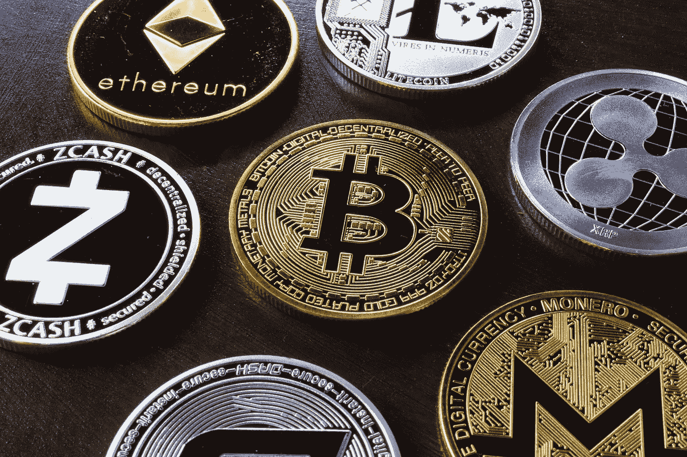
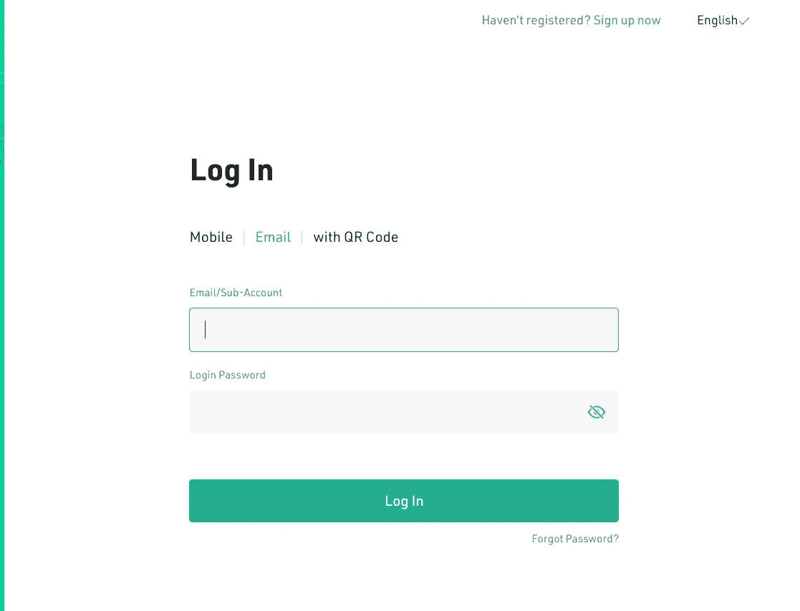
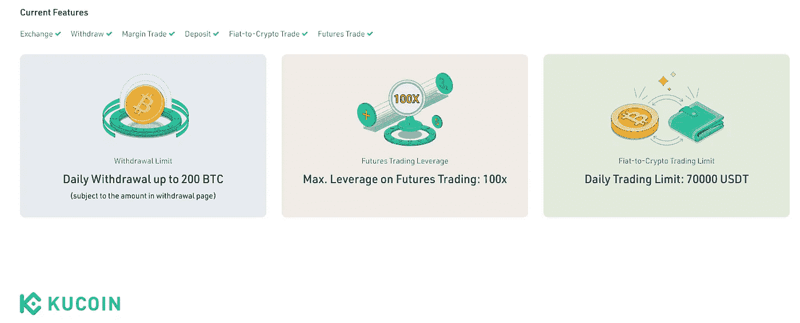
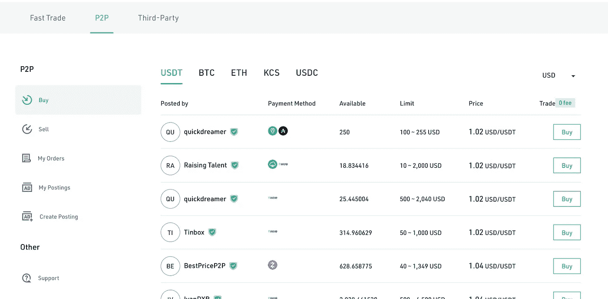

# 如何零手续费轻松购买加密货币

> 原文：<https://medium.com/coinmonks/how-to-buy-cryptocurrencies-easily-with-zero-fees-f5b32c6a15ef?source=collection_archive---------51----------------------->

Photo by Roger Brown: [Pexels](https://www.pexels.com/photo/various-cryptocurrency-on-table-5126268/)

近年来，比特币和其他加密货币可能已经成为主流，但对许多用户来说，访问这些数字资产仍然是一个问题。首先，[有些国家购买/交易加密货币是受限制的，或者完全是非法的](https://www.euronews.com/next/2022/04/27/bitcoin-ban-these-are-the-countries-where-crypto-is-restricted-or-illegal2)。

有限的支付方式和加密货币交易所的高额费用进一步加剧了这些可访问性问题，并限制了加密货币的采用，特别是在新兴经济体。

这就是为什么几家[顶级加密货币平台](http://Kucoin.com)转向 P2P 交易，将其作为解决大多数消费者购买痛点的最佳方案。点对点(P2P)购买是一种使用现金或任何相互接受的支付方式购买加密货币的快速、安全和简单的方式，几乎没有交易费用。

这篇文章将讨论使用 P2P 选项的好处以及提供这种服务的最佳平台。

# 点对点(P2P)交易:它是什么？

[点对点交易](https://www.kucoin.com/blog/everything-you-should-to-know-about-kucoin-p2p-trading)是直接从其他个人/用户处买卖数字资产的过程。对于加密货币爱好者来说，不通过常规交易所买卖自己喜欢的硬币是一种越来越受欢迎的方式。点对点交易也被称为场外交易市场。

点对点市场允许用户直接交易，不需要中间人。因此，P2P 交易所往往比集中式交易所更便宜，也更私密。

虽然许多人使用 P2P 市场进行大额购买或销售，但它们也适用于小额交易。除了集中市场之外，众多加密货币平台现在允许用户轻松进行 P2P 交易。一个很好的例子就是 [KuCoin](https://www.kucoin.com/r/rf/NQx2vx) 。

# P2P 的优势:为什么它更好

由于几个原因，点对点交易平台在加密货币社区中越来越受欢迎。但点对点交易的主要优势(至少在我看来)是，它允许你以通行的市场汇率直接从其他用户那里购买加密货币。

然而，还有其他好处。

1.  **更快的交易:**点对点交易平台不需要任何第三方/中介(只需要第三方托管)，因此您的交易速度比使用可能需要验证每笔交易的集中交易更快。在处理大额资金时尤其如此，有了 p2p 交易，你就不需要等待像 KYC 及其同类公司那样的程序格式。
2.  **匿名是有保证的:**在进行点对点交易时，交易发生时你可以使用你的钱包地址，而不是你的银行信息。这样，你可以保护你的隐私，同时保持匿名。
3.  **托管系统:【KuCoin 等平台上的 p2p 交易通过内置的托管机制来保护交易双方。所以，如果你想从一个信誉不太好的人那里购买，KuCoin 的托管系统是为了确保如果交易过程中出现问题，你不会失去你的钱。**
4.  **费用更低:**用户在点对点交易平台上支付的费用更低，因为没有需要为其服务支付报酬的中间人。点对点交易平台对每笔交易收取少量费用(通常低于 0.5%)。相比之下，传统交易所对每笔交易收取更高的费用(通常在 1%左右或以上)。有些点对点交易平台甚至对某些交易实行零手续费！如果你想在购买密码时获得最好的交易，我推荐使用 KuCoin P2P，因为他们提供零交易费。

# **关于 KuCoin P2P 交易你需要知道的一切**

KuCoin 是一个世界级的区块链资产交易所和数字货币交易平台，旨在为全球用户提供优质、安全、高效的加密货币交易。他们还提供各种其他服务，如加密聊天、多币种钱包和支付保护。

KuCoin 的点对点(P2P)交易模式使用户能够直接从一个用户交易到另一个用户，而无需交易所或经纪人等中介。这消除了第三方处理双方之间交易的需要，降低了交易费用。KuCoin 的 P2P 模式也让用户可以完全控制自己的资产。

KuCoin 的交易费用为零，流动性高，价格在加密市场上最具竞争力。存款也不收费。

此外，KuCoin 支持主要的加密货币和 20 多种法定货币，如美元、英镑、加拿大元、迪拉姆、第纳尔、奈拉、卢比等。，意味着用户可以在任何给定时间轻松地购买或出售大多数主流数字资产。最好的部分是以你想要的价格水平出售的自由(如果有一个愿意的买家)。

# 如何通过 KuCoin P2P 交易购买密码

KuCoin 为您提供了一种最简单的购买加密货币的方法。步骤很简单；

**登录您的 KuCoin 帐户:**点击 KuCoin 网站上的登录图标，输入您的详细信息，包括您的手机或电子邮件。如果您没有帐户，请单击登录图标，在这里您需要输入您的电子邮件地址或电话号码并设置密码。

KuCoin Login Page

**在 KuCoin 上完成您的 KYC 验证:** KuCoin 使用 KYC 验证来维护其平台的安全完整性。登录后，点击 KYC 验证头像并填写所需信息。KYC 验证可能需要几天时间，因为需要人工输入来确定所提供信息的有效性。

KuCoin KYC Verification

**点击“购买密码”:** KuCoin 让你可以用第三方购买密码，快速交易(银行卡)，p2p。在这种情况下，选择格式(P2P)。

选择法定货币，然后选择 amerchant:从平台上的众多选项中选择货币，包括您的当地货币，以及您希望购买的商家。

KuCoin P2P Interface

**下单并完成支付:**这一步听起来很简单；下订单并完成已完成交易所需的付款。整个购买过程很快，你会在几分钟内得到你的密码。

# 使用 KuCoin 在线购买加密货币很容易

KuCoin 是排名前 5 的加密交易平台，也是目前全球拥有 1000 万用户的最佳加密货币交易所之一。他们对所有 p2p 交易提供零费用，这意味着你可以高枕无忧，因为你知道你购买的每一枚硬币都将是尽可能最好的利率。

作为奖励，KuCoin 提供联盟计划，并给予用户交易费折扣！用自己的钱不应该要付费，这也是 KuCoin 伟大的地方。欲了解更多信息，请访问 [KuCoin](http://https;//www.kucoin.com/r/rf/NQx2vx) 开始您的加密之旅。