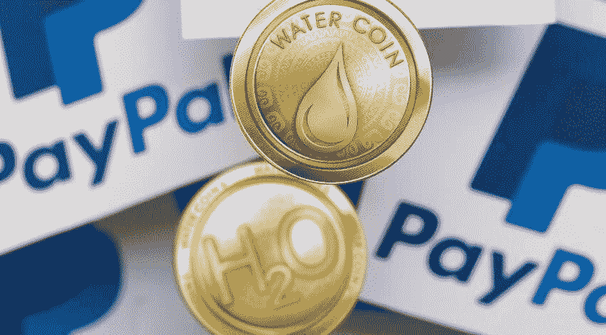

# 如何用 PayPal 购买加密货币

> 原文：<https://medium.com/coinmonks/how-to-buy-cryptocurrencies-with-paypal-fd8ab5b7f076?source=collection_archive---------83----------------------->

用 PayPal 购买加密货币看似不可能，其实不然。事实上，平台已经在自己的钱包中纳入了购买比特币的功能，但并不是所有人都可以使用。使用 PayPal 直接购买加密货币的主要缺点是不能在用户之间交换比特币，它基本上只是一个购买、出售和托管服务。

与所有 PayPal 操作一样，在他们的平台上存储加密货币可能有相当大的风险，因为数字钱包保留限制其他功能甚至没收你存储的比特币余额的权利。虽然这些措施肯定更多的是针对通过比特币获得支付的黑客的攻击，而不是你从视频游戏中获得的收入。

然而，除了购买接受 PayPal 作为支付方式的加密货币，还有其他替代方式，它只是一个汇款的网关，不涉及加密活动的转移，这可能是一个真正的优势。缺点是并非所有的钱包都支持这种方式，但在我们的研究中，我们发现了其中的五种。

本地比特币

让我们从使用本地比特币的 PayPal 购买加密货币的选项列表开始，这是一个安全、免费的平台，你可以在人与人之间进行交易。

您必须在此注册，才能使用 PayPal 余额进行交易。该服务使用托管系统，一旦加密货币被兑换，该系统就会交付资金。

LocalBitcoins 在生态圈中口碑不错；此外，它允许您在进行交易时查看每个用户的信誉。它支持几乎所有的本地货币，并为其用户提供技术支持。该平台受欧洲法律管辖。

Paxful

使用 Paxful 用 PayPal 购买加密货币的一个好处就是可以获得不同的区块链，甚至是以太坊。如果你是一个 NFT 玩家，使用这个工具当然会很方便，因为你可以用你在 PayPal 上的收入平衡投资你想要的游戏。

这个平台突出的一点是它的安全性。要进行交易，您必须注册并选择您的支付方式，然后当您进行购买时，加密货币资金将继续由网站保管，直到您确认您已通过 PayPal 进行支付，并且交易双方已成功完成。

本网站的佣金是向卖家收取的，只占最终交易金额的 1%。

eToro

我们的计数向前迈进，现在取代了另一个平台，它也支持 PayPal 作为购买加密货币或 eToro 的支付方式。这是一个非常受欢迎的交易平台。
您不能在这里直接使用 PayPal 资金购买加密货币，但您可以向您的 eToro 帐户中添加资金，并交易您想要的加密货币，即购买公开交易，如果您愿意，您可以将加密货币转移到您喜欢的钱包中。

这意味着您可以将 PayPal 余额添加到您的 eToro 钱包中，然后使用所需的加密货币进行交易。您不能直接向卖家付款，但可以通过增加一个额外的步骤以同样的方式执行交易。

XCoins

你也可以考虑将 XCoins 作为用你的 PayPal 余额购买你的加密货币的选项之一，但你也可以在这个平台上出借加密货币。

注册时，您需要输入您的付款方式并完成验证。您在 XCoins 中的加密货币可以借给其他人并收取利息。

另外，还可以申请贷款。贷款金额从 20 欧元到 1000 欧元不等，或者是等值的加密货币。

在这种情况下，可以直接与卖家进行交易，而不必通过 XCoins 钱包，这将节省时间，并且您也可以更好地控制从 PayPal 帐户进行的投资，以防万一。

比特币基地

用 PayPal 购买加密货币的最佳选择是比特币基地。它是支持这种方法的最健壮和公认的钱包，所以使用起来相当安全。

与比特币基地进行这些交易的主要优势之一是，该平台直接与 PayPal 达成协议，所以你可以使用你账户中的可用资金购买你想要的加密货币。

目前它只适用于美国，但他们承诺在未来将纳入更多的国家。你可以购买任何你想要的加密货币，并实时收到你的资金，没有任何麻烦。你所要做的就是注册。

这些交易根据价值产生佣金。简单地说，你必须在注册时将你的 PayPal 帐户与比特币基地联系起来。

*原载于【https://www.reddit.com】**。***

> *加入 Coinmonks [电报频道](https://t.me/coincodecap)和 [Youtube 频道](https://www.youtube.com/c/coinmonks/videos)了解加密交易和投资*

# *另外，阅读*

*   *[Bookmap 点评](https://coincodecap.com/bookmap-review-2021-best-trading-software) | [美国 5 大最佳加密交易所](https://coincodecap.com/crypto-exchange-usa)*
*   *最佳加密[硬件钱包](/coinmonks/hardware-wallets-dfa1211730c6) | [Bitbns 评论](/coinmonks/bitbns-review-38256a07e161)*
*   *[新加坡十大最佳加密交易所](https://coincodecap.com/crypto-exchange-in-singapore) | [购买 AXS](https://coincodecap.com/buy-axs-token)*
*   *[红狗赌场评论](https://coincodecap.com/red-dog-casino-review) | [Swyftx 评论](https://coincodecap.com/swyftx-review) | [CoinGate 评论](https://coincodecap.com/coingate-review)*
*   *[投资印度的最佳密码](https://coincodecap.com/best-crypto-to-invest-in-india-in-2021)|[WazirX P2P](https://coincodecap.com/wazirx-p2p)|[Hi Dollar Review](https://coincodecap.com/hi-dollar-review)*
*   *[加拿大最佳加密交易机器人](https://coincodecap.com/5-best-crypto-trading-bots-in-canada) | [库币评论](https://coincodecap.com/kucoin-review)*