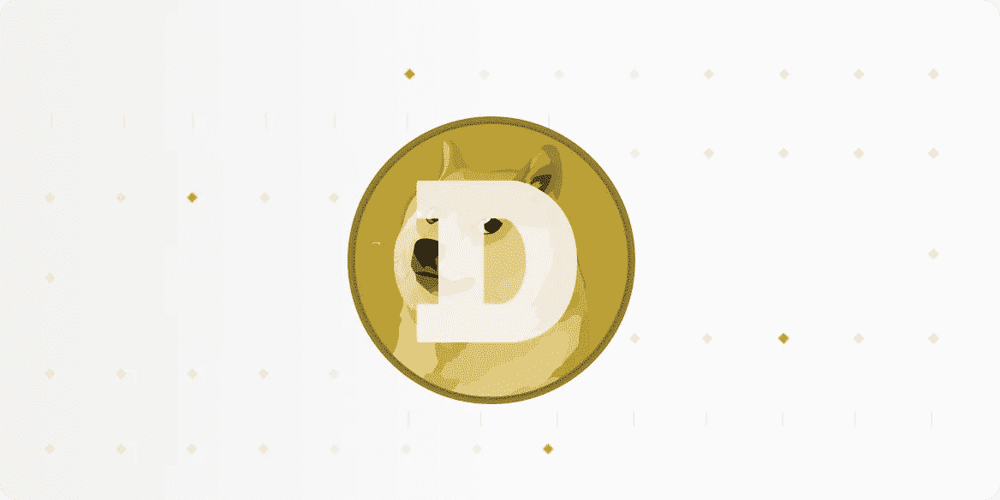
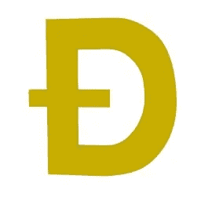

# 如何在尼日利亚购买 DogeCoin

> 原文：<https://medium.com/coinmonks/how-to-buy-dodge-coin-in-nigeria-5cc5a214409?source=collection_archive---------41----------------------->

Dogecoin (DOGE)是一种点对点、开源的加密货币。它通常被认为是一个迷因币，也可以被视为替代币。Dogecoin 于 2013 年 12 月推出，以柴犬(日本狗)的形象作为其标志。

How to Buy Doge in Nigeria

Dogecoin 是由澳大利亚悉尼的 Adobe 公司产品经理杰克逊·帕尔默开的一个玩笑。他创建 Dogecoin 是为了嘲笑围绕加密货币的炒作，他以新兴加密货币技术的“sceptis-analytic”观察者而闻名，他关于他的新加密风险的第一条推文是在开玩笑中完成的。但在社交媒体上获得积极反馈后，他买下了 dogecoin.com 域名。

Billy Markus 是 IBM 在俄勒冈州波特兰市的一名软件开发人员，他对创造一种数字货币很感兴趣，但却难以获得关注。他发现了 Dogecoin 的传言，并联系 Palmer 获得许可，在一个真正的 Dogecoin 后面开发软件。

马库斯将 Dogecoin 代码基于 Litecoin，最初对区块开采使用随机奖励，但后来在 2014 年改为静态奖励。Dogecoin 使用 Litecoin 的 scrypt 技术，是一种工作证明(PoW)硬币。虽然这可能是一个笑话，但 Dogecoin 的区块链有其优点，Dogecoin 的 scrypt 算法的显著特点是其低廉的价格和无限的供应。

Dogecoin 有起有落，在加密泡沫之后，我们看到其价格在午餐后的两周内上涨了 300%,此后记录了更大的涨幅，价格也下降了，就像所有加密货币一样，Dogecoin 直到今天仍然相关，因为它仍然是一种可交易的加密资产，你可以在各种交易平台上购买 Dogecoin，我们将详细介绍一些你可以使用的加密货币。

**比特币基地**

由于其直观的界面和令人惊叹的加密和硬币产品教育课程，被认为是初学者的最佳加密货币交易平台。

他们有最简单和最广泛的加密货币，初学者会对交易和投资感兴趣。

比特币基地不仅会帮助你更好地学习如何在尼日利亚购买 Dogecoin，而且还会给你不同加密资产的知识。他们的目标是丰富你的交易知识以及你的加密投资组合。

**币安 P2P 交易平台**

作为最大的密码交易平台，币安是另一个购买 Dogecoin 的好平台。尽管该平台加载了不同的功能和加密产品，但用户可以通过网站上的各种教育资源学习如何在币安应用程序中使用他们的不同产品。

当你想购买 Dogecoin 时，最好考虑币安 P2P，你必须验证你的币安账户。

## **如何在币安 P2P 上购买 doge coin**

Dogecoin

*   在主屏幕上登录你的账户，点击“P2P 交易”
*   浏览 Dogecoin 卖家列表，选择符合您期望的付款方式和费率的卖家。
*   向卖家下订单，并在 15 分钟内付款。
*   将付款凭证寄给卖家，卖家收到付款后会将狗粮交给你。所有这些仍然在 15 分钟的时间范围内。

## **如何出售你的狗狗硬币**

你可以使用币安 P2P 来出售你的 Dogecoin，也可以使用像 Dart Africa 这样的本地加密货币交易平台。

Dart Africa 是一个自动化加密交易平台，在这里您可以出售您的加密货币，并在几分钟内将现金存入您的银行账户。这个平台既适合业余爱好者，也适合专业加密货币交易者。Dart Africa 以两件事闻名，其高汇率和快速付款时间。您可以访问他们的网站或通过他们的移动应用程序访问他们的服务。在[谷歌 Play 商店](https://play.google.com/store/apps/details?id=com.dartafrica&hl=en_US&gl=US)下载 Dart 非洲移动应用。

在 Dart Africa 交易的加密货币:

*   比特币
*   以太坊
*   道奇硬币
*   莱特币
*   美元硬币
*   USDT 系绳等。

**如何在 Dart Africa 上出售你的 dog ecoin**

*   在 Dart Africa 上创建并设置一个帐户，如果您已经有帐户，请登录
*   导航到交易界面，选择 Dogecoin 作为您的首选加密货币。
*   通过手动输入钱包上的地址或扫描提供的条形码，将 Dogecoin 发送到系统提供的钱包地址。
*   在您的 Dart Africa 帐户被记入贷方后，将资金发送到您当地的尼日利亚帐户。

> 加入 Coinmonks [电报频道](https://t.me/coincodecap)和 [Youtube 频道](https://www.youtube.com/c/coinmonks/videos)了解加密交易和投资

# 另外，阅读

*   [TraderWagon 回顾](https://coincodecap.com/traderwagon-review) | [北海巨妖 vs 双子星 vs BitYard](https://coincodecap.com/kraken-vs-gemini-vs-bityard)
*   [Exness 回顾](https://coincodecap.com/exness-review)|[moon xbt Vs bit get Vs Bingbon](https://coincodecap.com/bingbon-vs-bitget-vs-moonxbt)
*   [如何开始通过加密贷款赚取被动收入](https://coincodecap.com/passive-income-crypto-lending)
*   [加密货币储蓄账户](/coinmonks/cryptocurrency-savings-accounts-be3bc0feffbf) | [加密交易机器人](https://coincodecap.com/best-crypto-trading-bots)
*   [BigONE 交易所评论](/coinmonks/bigone-exchange-review-64705d85a1d4) | [CEX。IO 审查](https://coincodecap.com/cex-io-review) | [交换区审查](/coinmonks/swapzone-review-crypto-exchange-data-aggregator-e0ad78e55ed7)
*   [最佳比特币保证金交易](/coinmonks/bitcoin-margin-trading-exchange-bcbfcbf7b8e3) | [比特币保证金交易](https://coincodecap.com/bityard-margin-trading)