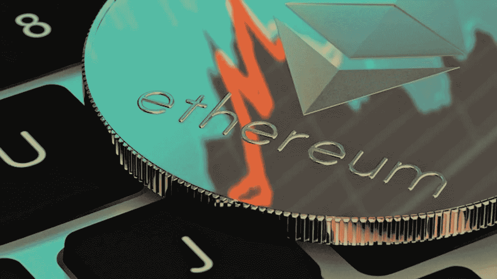

# 如何购买以太坊 2

> 原文：<https://medium.com/coinmonks/how-to-buy-ethereum-2-bbfc8fd9400?source=collection_archive---------33----------------------->

ETH2 是以太坊网络的升级版，旨在提高网络的安全性和可扩展性。这一升级涉及以太坊的挖掘模型(“工作证明”)向赌注模型(“赌注证明”)的转变。ETH2 =标桩 ETH。比特币基地为我们的客户提供下注赢取奖励的能力。当你投资你的 ETH 时，你会获得回报(高达 4.50%的年利率)，它会转换成比特币基地的 ETH2。你不能在比特币基地直接买到 ETH2。ETH2 的价格与 ETH 相同。一旦以太坊网络升级完成，ETH 和 ETH2 将合并为一个令牌。

**1。** [**创建比特币基地账户**](https://www.coinbase.com/join/9npib9)

下载 [*比特币基地 app*](https://www.coinbase.com/join/9npib9) ，开始报名流程。你需要一个有效的身份证，可能会被要求提供地址证明，以便进行交易，所以一定要准备好这些。验证您的 ID 可能需要几分钟以上的时间，具体取决于您的居住地。

**2。添加付款方式**

点击付款方式框并连接一种付款方式。你可以使用银行账户、借记卡或电汇。

**3。开始交易**

按下交易按钮，然后从选项列表中选择“购买”。

**4。从资产列表中选择以太坊**

在搜索栏中输入“以太坊”来搜索以太坊。当你看到以太坊出现在搜索结果中时，点击它打开购买界面。

**5。输入您想要购买的数量**

使用数字键盘输入您想用当地货币支付的金额。该应用程序会自动转换成以太坊平衡。

**6。赌上你的 ETH 获得以太坊 2(ETH2)**

通过网络或手机访问您的投资组合下的以太坊资产页面，并按照相应的提示进行操作。如果您已登录并符合条件，您可以将您的 ETH 转换为 ETH2 并开始下注。

> [以太坊价格图表点击这里](https://www.tradingview.com/chart/)
> 
> [从这里购买以太坊最好的平台](https://www.coinbase.com/join/9npib9)

*抄自 2022 年比特币基地*

> 加入 Coinmonks [电报频道](https://t.me/coincodecap)和 [Youtube 频道](https://www.youtube.com/c/coinmonks/videos)了解加密交易和投资

# 另外，阅读

*   [最佳期货交易信号](https://coincodecap.com/futures-trading-signals) | [期交所评论](https://coincodecap.com/liquid-exchange-review)
*   [用于 Huobi 的加密交易信号](https://coincodecap.com/huobi-crypto-trading-signals) | [Swapzone 审查](/coinmonks/swapzone-review-crypto-exchange-data-aggregator-e0ad78e55ed7)
*   最佳[密码交易机器人](https://coincodecap.com/best-crypto-trading-bots) | [购买索拉纳](https://coincodecap.com/buy-solana) | [矩阵导出评论](https://coincodecap.com/matrixport-review)
*   [Coldcard 评论](https://coincodecap.com/coldcard-review) | [BOXtradEX 评论](https://coincodecap.com/boxtradex-review)|[uni swap 指南](https://coincodecap.com/uniswap)
*   [比特币基地评论](/coinmonks/coinbase-review-6ef4e0f56064) | [德里比特评论](/coinmonks/deribit-review-options-fees-apis-and-testnet-2ca16c4bbdb2) | [FTX 评论](/coinmonks/ftx-crypto-exchange-review-53664ac1198f)
*   [n 零复习](/coinmonks/ngrave-zero-review-c465cf8307fc) | [Phemex 复习](/coinmonks/phemex-review-4cfba0b49e28) | [PrimeXBT 复习](/coinmonks/primexbt-review-88e0815be858)
*   最佳[区块链分析](https://bitquery.io/blog/best-blockchain-analysis-tools-and-software)工具| [赚比特币](/coinmonks/earn-bitcoin-6e8bd3c592d9)
*   [Cloudbet 赌场评论](https://coincodecap.com/cloudbet-casino-review) | [点火赌场评论](https://coincodecap.com/ignition-casino-review)
*   [加密套利](/coinmonks/crypto-arbitrage-guide-how-to-make-money-as-a-beginner-62bfe5c868f6)指南| [如何做空比特币](/coinmonks/how-to-short-bitcoin-568a2d0b4ae5)