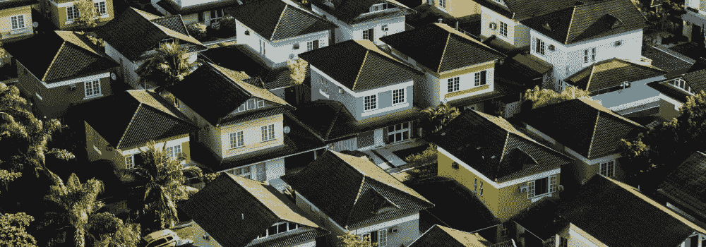

# 如何购买分数房地产被动收入

> 原文：<https://medium.com/coinmonks/how-to-buy-fractional-real-estate-for-passive-income-d71f9ac39bf8?source=collection_archive---------57----------------------->

被动的攻击性令人讨厌。被动攻击型的人喜欢留下的尖锐且通常匿名的便条也是如此。另一方面，被动收入是一件非常非常美好的事情。

这种收入就像它听起来的那样:用最少的努力获得的收入。即使你睡得很香，梦想着你的被动收入可以帮助你购买的所有东西，这也是产生的收入。帮我报名！

# 赚取被动收入的最佳方式

被动收入的专家们不缺乏赚取被动收入的创造性方法。从出售股票照片或写一本电子书到创建 Udemy 课程或开设 YouTube 频道，被动收入机会似乎无处不在。我不知道你怎么想，但是写一本书或创建课程对我来说并不那么被动。我写书的时候睡不着。相信我，我试过了。

那些寻找睡眠机会丰富的真正被动创收体验的人会发现，房地产投资是最好的被动收入投资之一。

# 房地产投资的障碍

房地产投资说起来容易做起来难，尤其是当你考虑到当前房地产市场的狂热时。例如，2022 年 1 月，美国住房市场上 70%的房屋以竞价战告终，这是有记录以来的最高水平。因此，除非你来自第五代被动收入家庭，否则你可能会发现房地产投资在经济上是不可企及的——即使它有着深远的意义。

围绕房屋所有权的其他成本也开始增加。你不得不与法律费用、财产维护费用和房地产经纪人费用作斗争。仅最后一项平均就要 18000 美元。所有这些成本使得房地产投资对于普通的千禧一代房地产大亨来说遥不可及。

或者是？进入[部分房地产投资](https://ark7.com/app)。

# 什么是分数房地产投资？

部分房地产投资，让你与多个不相关方合伙拥有一部分财产。然后，当共有人想要出售他们在财产中的股份时，合作社的股份就转让给股份的新所有人。对于那些有钱投资并希望分散其财产持有而不是将一切投资于一个财产的投资者来说，部分投资房地产非常值得探索。

部分所有权机会存在于广泛的财产类型，包括商业财产，仓库，度假出租，甚至潜在的农田。简而言之，部分房地产投资降低了房地产投资的门槛，这种投资在历史上一直是一种进入门槛很高的资产类别。最近商业模式的转变从根本上改变了我们对资产所有权的看法。

# 如何部分房地产投资工作？

[只要你符合以下标准，开始](https://support.ark7.com/hc/en-us/articles/360022597351-What-do-I-need-to-get-started-)就很简单:

*   你至少 18 岁了。
*   你有美国社会安全号码。
*   可以通过反洗钱检查。
*   你有合法的美国居住地址。
*   你有电子邮件地址。

只要你符合上述标准，你就可以开户并核实你的身份。一旦平台正确验证您的身份，就会提示您[将资金](https://support.ark7.com/hc/en-us/articles/360022722431-How-do-I-deposit-money-on-Ark7-)存入您的账户。您也可以使用个人退休账户(IRA)投资部分房地产，具体取决于平台。

# 购买你的部分房地产

许多部分投资房地产平台使用人工智能(AI)技术来识别市场上最具吸引力的房产。多户住宅是一个受欢迎的选择，因为它们的长期投资潜力很大。用住宅物业赚取稳定租金收入的能力(你好被动收入，你在这里！)给了投资者温暖的模糊感。

一旦这些人工智能识别的机会经过房地产专家团队的另一轮审查，就会进行更详细的筛选，以确保该房产是正确的。部分财产成功的标准包括:

*   位置，位置，位置。
*   财产的财务历史。
*   租赁合同详情。
*   结构细节。
*   市场状况。
*   经济趋势。

推荐:在 [Ark7](https://www.ark7.com?tc=TNKXI) 上查看各个州有哪些房产可供部分房地产投资，包括亚利桑那州、加利福尼亚州、宾夕法尼亚州、得克萨斯州、田纳西州和华盛顿州。

# 搭乘被动收入列车

一旦你找到了你梦想中的部分所有权机会，你就会购买发行的股票，使你成为房产的股东。产权本身由注册的系列有限责任公司所有，与购买股票时没有什么不同。同样类似于股票市场持股，部分股东可以通过租金收入(每月分配)和价值增值(当你出售你的股票或当房产出售时)赚钱。

这种每月的被动收入可能会随着房产的情况而波动，因为所有的房产费用在分配前都会从租金收入中扣除。虽然这些股票的期限不定，但在不久的将来，它们将可以在二级市场上交易。

# 点点滴滴，跨越那些 T

对于那些从传统股票和债券投资组合中分散投资的人来说，这一切听起来都是显而易见的，而且非常适合。以下是围绕该流程的几个额外的澄清点:

*   物业管理费是租金收入的一个百分比，在租金收入分配前与其他费用一起扣除。
*   该管理费包括标准的物业管理费，包括收取租金、监督维护和维修要求、向新的潜在租户营销物业以及回应租户的请求。
*   不要求投资者直接缴纳房产税；注册系列有限责任公司涵盖这些。

你准备好迈出下一步去建立你的被动收入帝国了吗？  [今天就注册 Ark7】，体验只有分数房地产投资才能提供的深度睡眠。](https://www.ark7.com?tc=TNKXI)

> 加入 Coinmonks [电报频道](https://t.me/coincodecap)和 [Youtube 频道](https://www.youtube.com/c/coinmonks/videos)了解加密交易和投资

# 另外，阅读

*   [最佳比特币保证金交易](/coinmonks/bitcoin-margin-trading-exchange-bcbfcbf7b8e3) | [萝莉点评](/coinmonks/lolli-review-e6ddc7895ad8) | [比特币保证金交易](https://coincodecap.com/bityard-margin-trading)
*   [创造并出售你的第一个 NFT](https://coincodecap.com/create-nft) | [密码交易机器人](/coinmonks/crypto-trading-bot-c2ffce8acb2a)
*   [如何在 CoinDCX 上购买柴犬(SHIB)币？](https://coincodecap.com/buy-shiba-coindcx)
*   [CBET 评论](https://coincodecap.com/cbet-casino-review) | [库库恩 vs 比特币基地](https://coincodecap.com/kucoin-vs-coinbase) | [拜比特 vs 比特币基地](https://coincodecap.com/bybit-vs-coinbase)
*   [折叠 App 回顾](https://coincodecap.com/fold-app-review) | [LocalBitcoins 回顾](/coinmonks/localbitcoins-review-6cc001c6ed56) | [Bybit vs 币安](https://coincodecap.com/bybit-binance-moonxbt)
*   [加密保证金交易交易所](/coinmonks/crypto-margin-trading-exchanges-428b1f7ad108) | [赚取比特币](/coinmonks/earn-bitcoin-6e8bd3c592d9) | [Mudrex 投资](https://coincodecap.com/mudrex-invest-review-the-best-way-to-invest-in-crypto)