# 如何在 Artkit 上购买、列出和铸造您的 NFT

> 原文：<https://medium.com/coinmonks/how-to-buy-list-and-mint-your-nfts-on-artkit-2e449f097815?source=collection_archive---------37----------------------->

[**Artkit**](https://artkit.art/) 是世界上最重要的购买和销售 NFT 的去中心化 NFT 市场；它的社区和用例使它区别于同类平台。也许你在站台上想知道，“我怎么才能铸造一个 NFT？”如果是这样，这篇文章是给你的。

铸造 NFT 意味着将数字数据转换成记录在区块链上的加密集合或数字资产。数字项目或文件将被保存在分布式分类帐或分散的数据库中，并且不能被更改、更新或删除。

今天，没有比 [Artkit 更好的平台来快速方便地出售艺术品。这有很多好处。例如，你可以彻底分享你的 NFT 背后的故事，同时仍然保留你作品的所有权。每次有人转售你的 NFT，你也会得到一笔佣金。转售后，你的 NFT 增值越多，你的利润就越大。](https://artkit.art/)

对于买卖 NFT 来说， [Artkit](https://artkit.art/) 是顶级的去中心化市场。在其他地方制造这些数字资产会降低可见性和确定业务的可能性。由于这种情况，大多数商家在这个网站上展示他们最伟大的作品。你也可以通过一些勤奋和想象力来完成它。你现在知道从哪里开始了。

创建一个加密钱包，将其链接到您的 [Artkit](https://artkit.art/) 帐户，并上传您的 NFT，开始铸造 NFT。下面详细解释了如何完成这些任务。

1.  要在我们的平台上购买您的 NFT，请仔细按照图片上的步骤操作

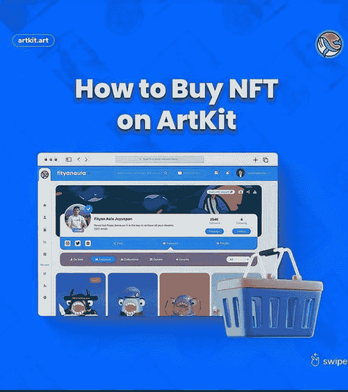

2.你首先需要找到一个你喜欢并感兴趣的创作者，然后挑选你想买的 NFT。

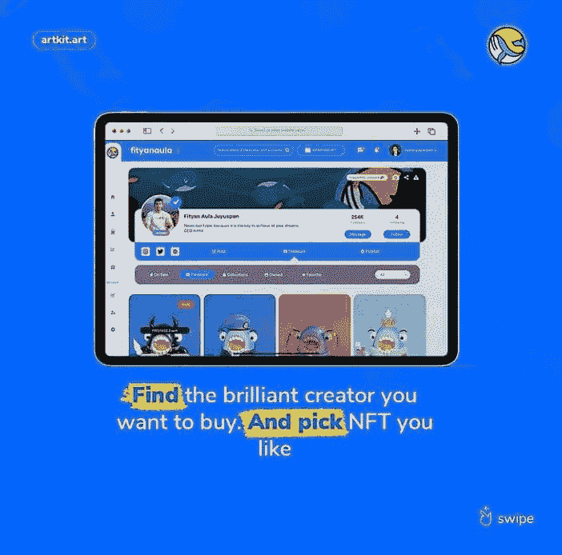

3.你要确保阅读了所有关于你想买的 NFT 的必要信息。确认所有信息后，点击“立即购买”

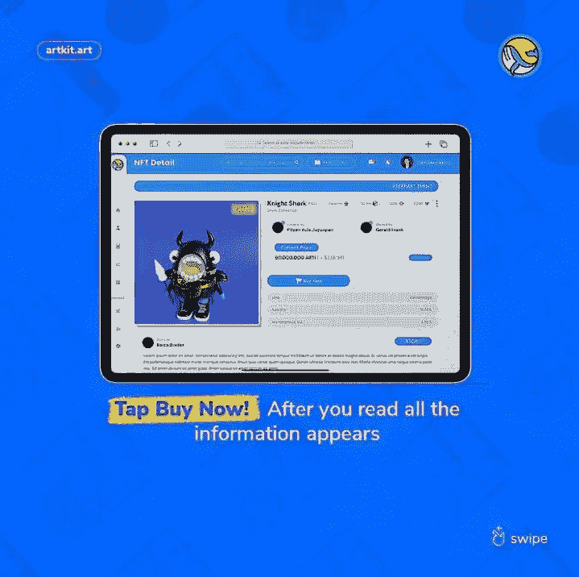

4.点击“确认结帐”以确认您的交易并购买 NFT。

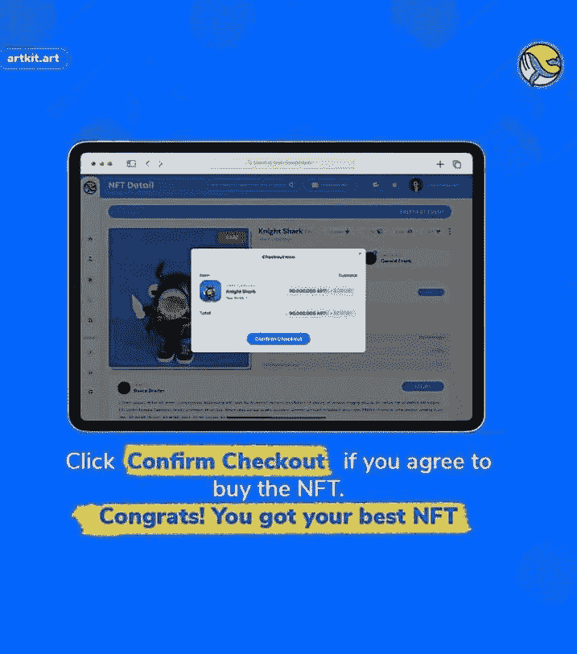

既然我们已经看到了如何购买，让我们学习如何铸造我们的 NFTS

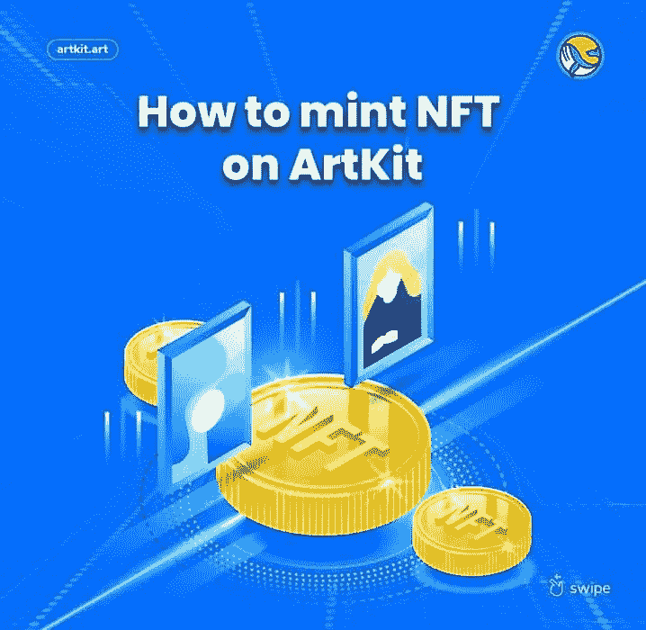

1.  你首先要打开你的个人资料页面，点击“添加 NFT”。

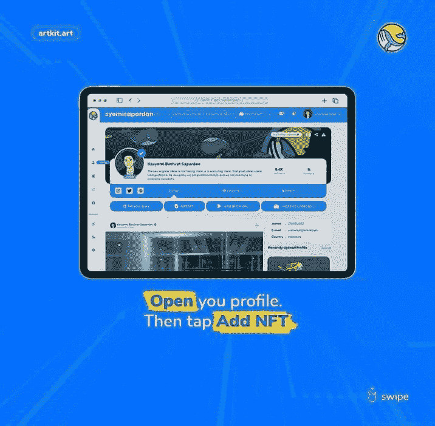

2.上传您的作品，并创建一个独特的名称。在这个非常重要的阶段，你必须填写供应库存和一个非常好的描述你的作品。这个好的描述将有助于吸引买家。

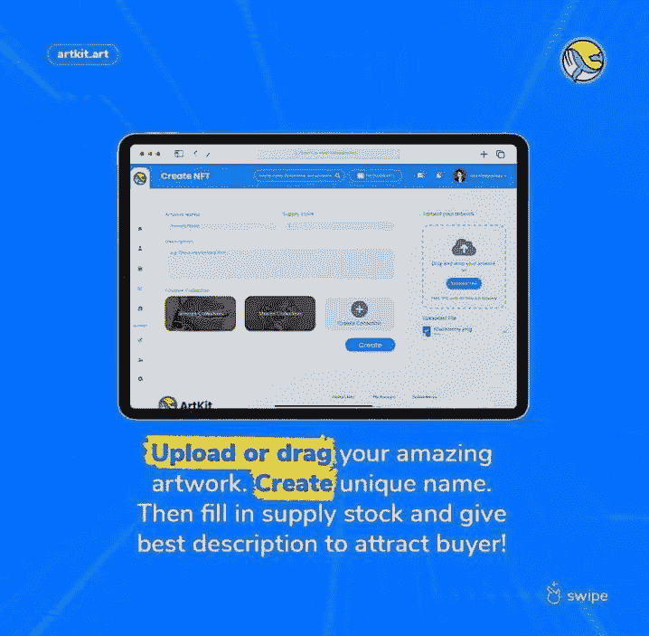

3.验证您的验证码以确认您是人类

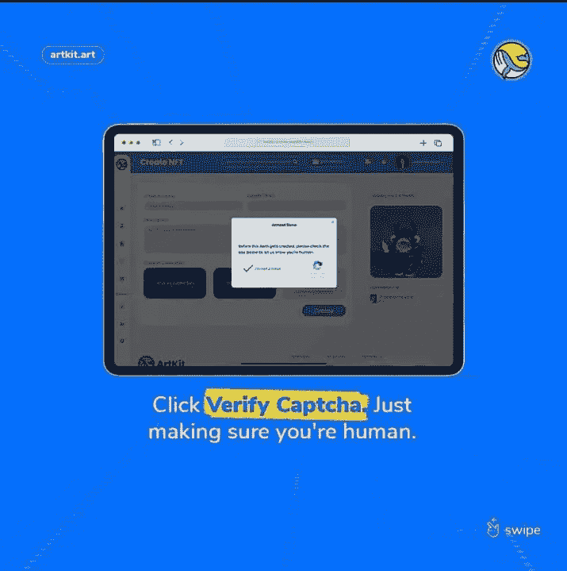

4.太神奇了！你刚刚铸造了一个 NFT

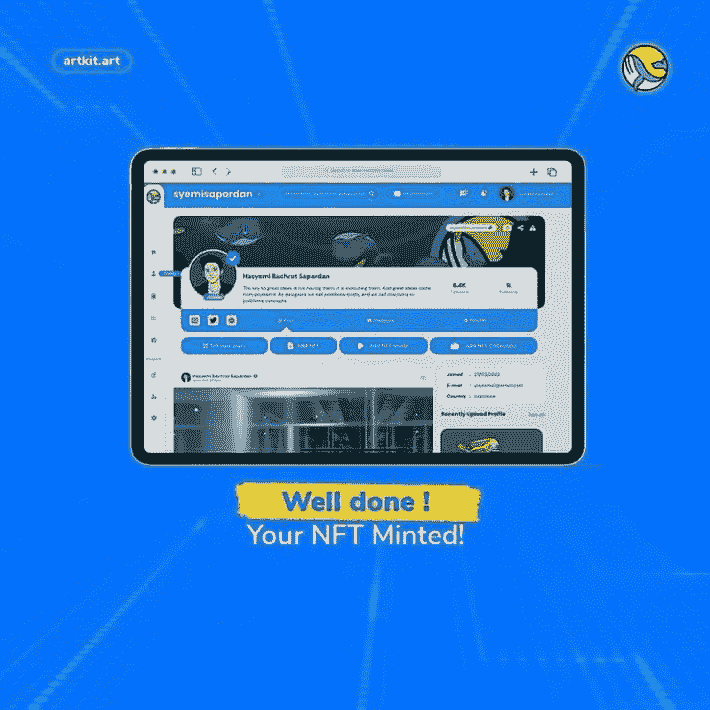

也许你一直在问，如果我想把我自己的 Nft 挂牌出售呢？好了，我们为您介绍了
让我们学习如何列出我们的非功能性食物

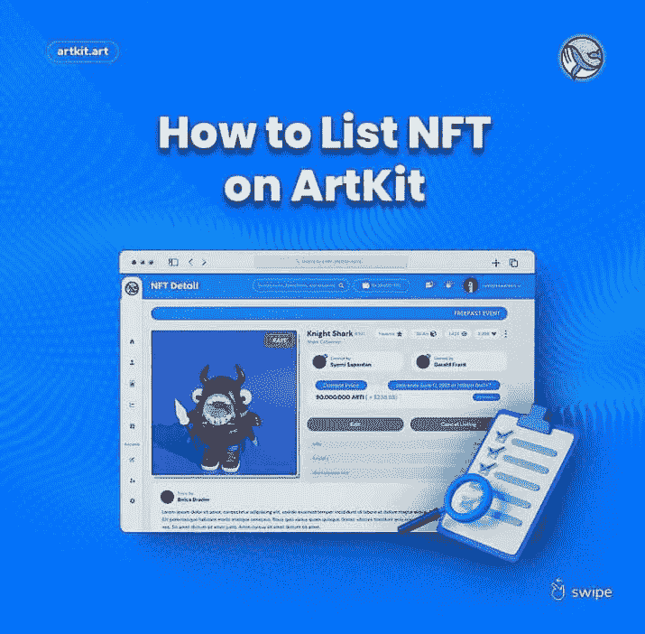

1.  选择您的 Nft，并确保您设置了时间价格和持续时间

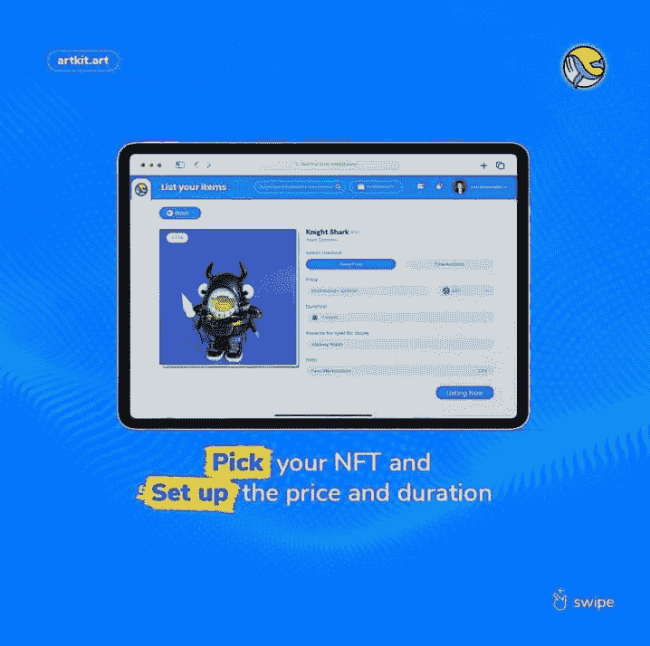

2.按照页面上的说明操作

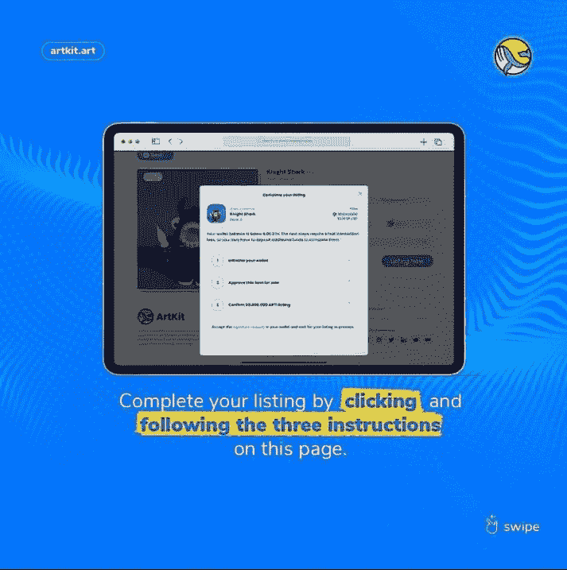

3.是的，就这些，恭喜你的 NFT 上市了

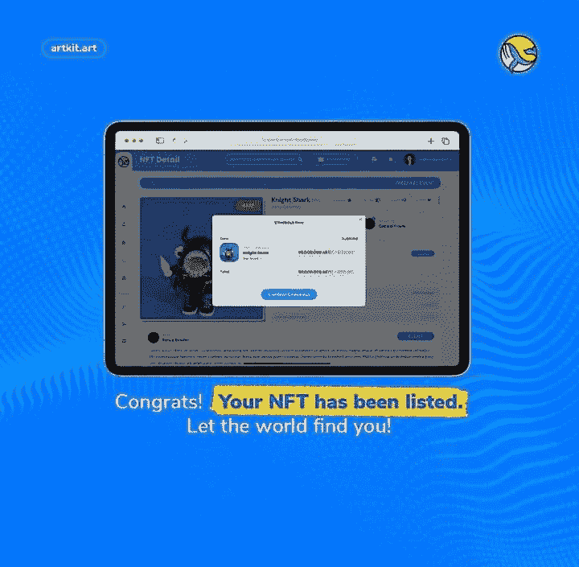

最后

你可以用加密货币进行的最有趣、有时也是最有利可图的活动之一，就是买卖 NFT。创建一个令人垂涎的收藏可能是一个令人兴奋和满足的过程，偶尔你需要出售某些物品来体验这种乐趣。

谢天谢地，出售艺术品是一个简单的程序。Artkit 让你可以在几分钟内列出你的非功能性食物清单，并且你可以很容易地撤销这个决定。

您现在有资源通过 [Artkit](https://artkit.art/) 买卖 NFT，使您能够组装和定制您亲自选择的迷人的个性化收藏。

> 加入 Coinmonks [电报频道](https://t.me/coincodecap)和 [Youtube 频道](https://www.youtube.com/c/coinmonks/videos)了解加密交易和投资

# 另外，阅读

*   [CoinFLEX 评论](https://coincodecap.com/coinflex-review) | [AEX 交易所评论](https://coincodecap.com/aex-exchange-review) | [UPbit 评论](https://coincodecap.com/upbit-review)
*   [AscendEx 保证金交易](https://coincodecap.com/ascendex-margin-trading) | [Bitfinex 赌注](https://coincodecap.com/bitfinex-staking) | [bitFlyer 审核](https://coincodecap.com/bitflyer-review)
*   [Bitget 评论](https://coincodecap.com/bitget-review) | [双子星 vs BlockFi](https://coincodecap.com/gemini-vs-blockfi) cmd| [OKEx 期货交易](https://coincodecap.com/okex-futures-trading)
*   [AscendEx Staking](https://coincodecap.com/ascendex-staking)|[Bot Ocean Review](https://coincodecap.com/bot-ocean-review)|[最佳比特币钱包](https://coincodecap.com/bitcoin-wallets-india)
*   [霍比评论](https://coincodecap.com/huobi-review) | [OKEx 保证金交易](https://coincodecap.com/okex-margin-trading) | [期货交易](https://coincodecap.com/futures-trading)
*   [网格交易机器人](https://coincodecap.com/grid-trading) | [Cryptohopper 审查](/coinmonks/cryptohopper-review-a388ff5bae88) | [Bexplus 审查](https://coincodecap.com/bexplus-review)