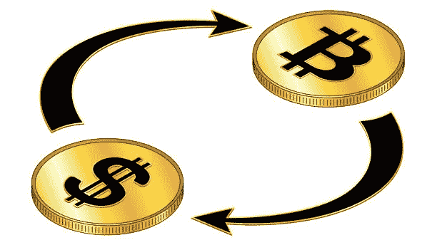

# 如何在尼日利亚购买 USDT:技巧和窍门

> 原文：<https://medium.com/coinmonks/how-to-buy-usdt-in-nigeria-tips-and-tricks-23a974d8cf24?source=collection_archive---------11----------------------->

密码市场的特点是其高波动性，从而使市场不稳定。然而，在尼日利亚这样一个通货膨胀率高、奈拉对美元贬值的国家，用尼日利亚奈拉直接交易加密市场可能是一个非常冒险的游戏。随着尼日利亚人在加密市场交易，稳定的硬币现在是帮助他们在加密资产价格波动期间免受损失的必需品。系绳(USDT)是最受欢迎的稳定硬币，因为它拥有最高的市场份额。这种稳定的硬币与美元挂钩，这使得它不受其他加密货币波动的影响。我们是什么意思？1 USDT = 1 美元的价格，不考虑市场上发生的价格波动，不像比特币等其他加密货币。这个惊人的特性使它成为一个很好的中介，可以将价值从一种加密资产转移到另一种资产，而不会因价格波动而遭受重大损失。

## 在尼日利亚哪里可以买到 USDT？

由于尼日利亚的通货膨胀风险和加密市场经常出现的波动，交易者正在寻找一种更安全的方式来保持其奈拉的价值。USDT 是一个稳定可行的解决方案。随着尼日利亚的加密禁令，用户已经转向点对点交易购买 USDT。在尼日利亚有几个地方可以买到 USDT，但最受欢迎的可能是币安。
币安是一个数字资产交易所，允许用户交易各种加密货币和数字代币。像其他交易所一样，币安有一个点对点的部分，这意味着用户可以直接相互交易。交易所的功能是作为买家和卖家之间的中介，将加密货币兑换成法定货币，反之亦然。使用对等加密交换的好处包括不依赖第三方。此外，由于交易所的性质，欺诈风险较小。币安还提供各种其他功能，包括保证金交易和法定货币到加密货币的交易。这最后一个功能使该交易所成为那些寻求投资加密货币的人的理想平台，而不必担心技术细节或承担重大风险。

作为对等加密交换的用户，了解所涉及的风险是很重要的。以下是一些让你安全的建议:

*   在你拿到钱之前，不要释放你的硬币。；
*   确保您的计算机免受恶意软件的侵害；
*   请确保使用安全密码，并及时更新您正在使用的交易所发布的安全警报。
*   做交易要谨慎；和
*   不要与任何人分享你的个人信息，包括你的地址。

人们也出售 USDT 来换钱。购买您的 USDT 后，如果您选择出售您的 USDT， [Dart Africa](http://dartafrica.io) 是在尼日利亚出售您的 USDT 的可靠平台，交易将以闪电般的速度完成。这种做法经常被那些想要快速清算他们的资产，或者正在寻找其他投资方式的人使用。为了奈拉而卖出 USDT 是一种快速简单的方法，可以把你的钱撤出市场。如果你持有大量 USDT 股票，这也是赚点外快的好方法。如果你不愿意直接在交易所购买其他加密货币，也可以用这种方法购买。

## 如何在 DART AFRICA 上销售

1.  [在 Play store](https://play.google.com/store/apps/details?id=com.dartafrica&gl=US) /App Store 获取应用或访问 dartafrica.io
2.  创建一个帐户，并填写您的银行信息。
3.  创建一个交易 pin，该 pin 将用于您的所有取款。
4.  选择 USDT 作为您要出售的硬币。输入金额，然后点击“立即出售硬币”进行出售。
5.  向系统生成的钱包地址付款。
6.  确认后，您的现金将被支付到您的钱包或您的银行账户；取决于你的选择。

Dart Africa 仍然是将您的 USDT 快速兑换成现金的最佳平台，没有任何压力。凭借用户友好的界面和全天候支持，Dart Africa 使交换过程变得快速而简单。此外，该平台提供了丰富的支付选择，包括银行转账和移动钱包。总的来说，Dart Africa 是任何想在尼日尼亚将 USDT 兑换成现金的人的绝佳选择。

> 加入 Coinmonks [电报频道](https://t.me/coincodecap)和 [Youtube 频道](https://www.youtube.com/c/coinmonks/videos)了解加密交易和投资

# 另外，阅读

*   最好的比特币[硬件钱包](/coinmonks/hardware-wallets-dfa1211730c6) | [BitBox02 回顾](/coinmonks/bitbox02-review-your-swiss-bitcoin-hardware-wallet-c36c88fff29)
*   [block fi vs Celsius](/coinmonks/blockfi-vs-celsius-vs-hodlnaut-8a1cc8c26630)|[Hodlnaut 审核](/coinmonks/hodlnaut-review-best-way-to-hodl-is-to-earn-interest-on-your-bitcoin-6658a8c19edf) | [KuCoin 审核](https://coincodecap.com/kucoin-review)
*   [Bitsgap 评审](/coinmonks/bitsgap-review-a-crypto-trading-bot-that-makes-easy-money-a5d88a336df2) | [Quadency 评审](/coinmonks/quadency-review-a-crypto-trading-automation-platform-3068eaa374e1) | [Bitbns 评审](/coinmonks/bitbns-review-38256a07e161)
*   [加密复制交易平台](/coinmonks/top-10-crypto-copy-trading-platforms-for-beginners-d0c37c7d698c) | [Coinmama 审核](/coinmonks/coinmama-review-ace5641bde6e)
*   [印度的加密交易所](/coinmonks/bitcoin-exchange-in-india-7f1fe79715c9) | [比特币储蓄账户](/coinmonks/bitcoin-savings-account-e65b13f92451)
*   [OKEx vs KuCoin](https://coincodecap.com/okex-kucoin) | [摄氏替代品](https://coincodecap.com/celsius-alternatives) | [如何购买 VeChain](https://coincodecap.com/buy-vechain)