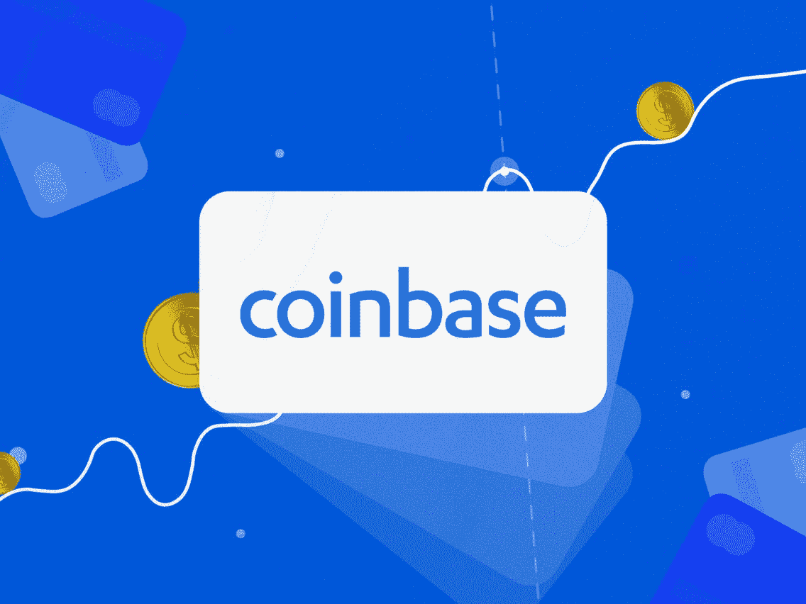
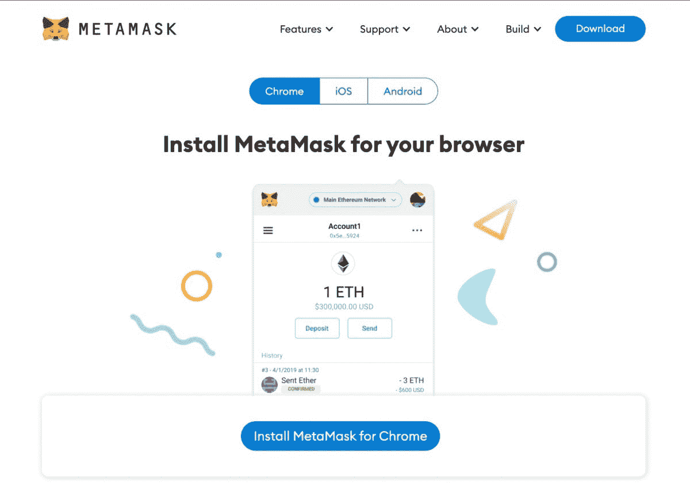
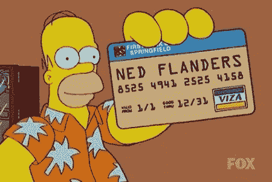
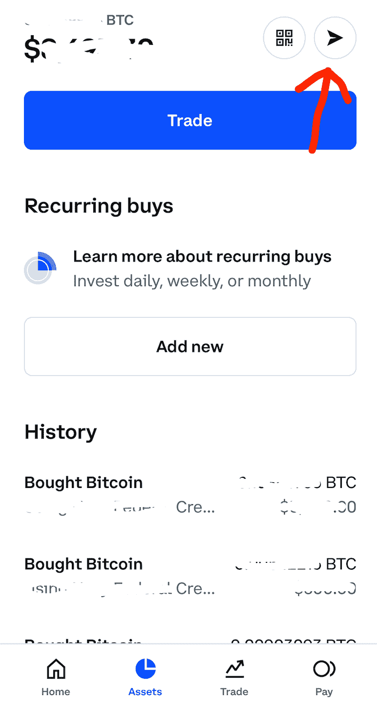
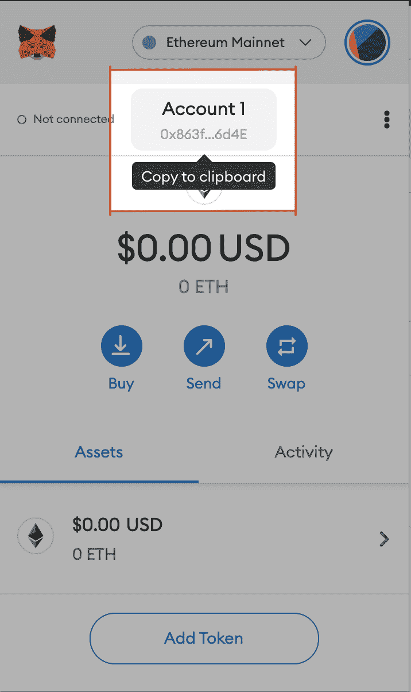
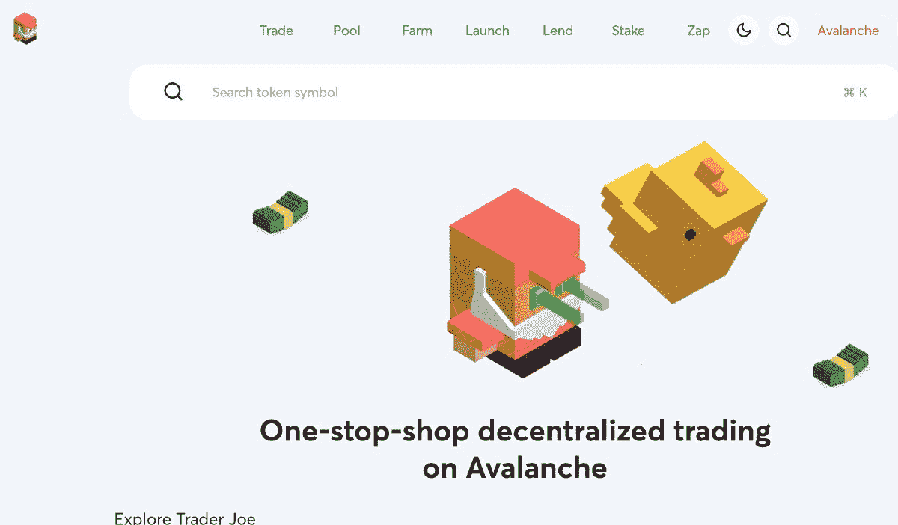
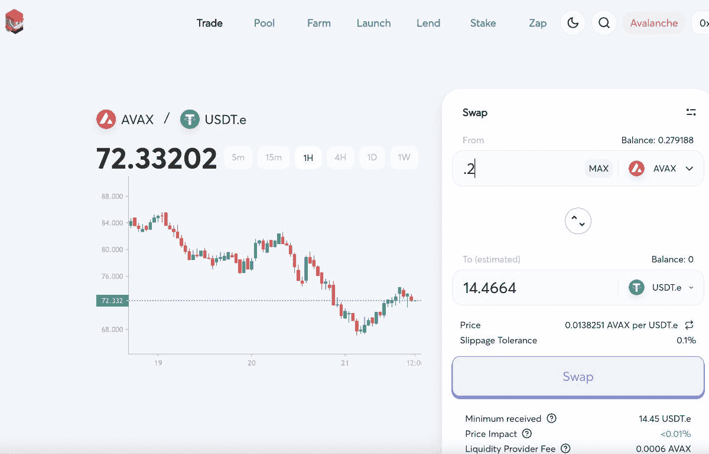

# 如何购买你的第一枚硬币

> 原文：<https://medium.com/coinmonks/how-to-buy-your-first-altcoin-718929597e95?source=collection_archive---------58----------------------->

# 1.建立一个加密交易账户

加密账户是购买加密货币的地方。我使用了一个叫做比特币基地的平台。其他受欢迎的选择包括[双子座](https://www.gemini.com/)和[币安](https://www.binance.com/en)。我不偏袒任何一个，我只是选择了最低的进入门槛，那就是比特币基地。

把这想象成建立一个银行账户。我必须做一些标准的事情，比如添加我的个人信息，驾照等等。

这个过程非常简单明了。这里最重要的是连接到另一个金融机构。这可能需要很长时间，所以请耐心等待。

# 2.设置加密钱包

比特币基地，或者任何其他加密交易账户，对于你能买什么和不能买什么，能力是有限的。我不能参与比特币基地的新项目——我只能交易比特币、以太坊和雪崩等主要货币。

那么，如果我想买卖更新更小的硬币，我该怎么做呢？

我得准备一个钱包。

我使用一个名为 MetaMask 的钱包，它是我浏览器上的一个插件。

我是如何设置的？

1.我下载了 [MetaMask 插件](https://metamask.io/download/)并添加到 Chrome 中。

2.我建立了我的 MetaMask 账户，并设置了一个复杂的密码。

3.我得到了我的种子短语。**这很重要。如果我忘记了密码，这是我用来找回我的帐户的一系列单词。如果你失去了你的密码+失去了你的种子短语，你失去了你的钱。**

我把我的种子短语藏在某个秘密的地方。

现在我有了钱包，我可以从一个叫分散兑换的地方买到不知名的硬币。

**什么是分散式交易所？**

这样想一想:

我的比特币基地账户就像银行一样。这是我存放法定货币(如美元)的地方，并用它来购买我的第一个主要密码(如比特币、以太网和雪崩)。

我的 MetaMask 钱包就像一个钱包。我去比特币基地银行，取出我的钱，放入我的 MetaMask 钱包。

然后，一旦我的钱包里有了钱，我就可以去一个分散的交易所，就像一个开放的市场，进行购买。

现在，在一个开放的市场中，一切皆有可能。

也许我找到了一笔好交易。也许我被骗了。谁知道呢。这里是蛮荒的西部，所以你要小心。(一分钟后将详细介绍分散式交流。)

# 3.将雪崩添加到元遮罩

在我能把一个密码发送到任何地方之前，我需要一个密码来发送。我从购买比特币基地的资产开始。

**进行交易**

您在加密交易账户上进行的第一笔交易将需要几天时间来处理。别担心。之后就快多了。

**建立正确的网络**

然后我必须将正确的网络添加到我的 MetaMask 钱包中。不同的加密货币存在于不同的区块链(MetaMask 称之为网络)。默认情况下，MetaMask 会假设你的交易都存在于以太坊上。

如果你喜欢以太坊，那没问题。我不知道。我用雪崩。这意味着我需要手动将 Avalanche 添加到我的钱包中。

把它想象成给你的钱包换一张不同的信用卡。有些人对万事达卡很忠诚，这没什么。它可以用在很多地方。但是我喜欢美国运通。回报更好，即使它没有被很多地方接受。

但是我拿到钱包不会自动得到美国运通卡。我必须经历一些步骤。

我也是。

*如果你热衷于使用 Ned Flanders 网络，所有这些都将成为泡影。*

这里有一个非常简单的教程，教你如何给你的 MetaMask 钱包添加另一个“网络”:[https://support . avax . network/en/articles/4626956-how-do-I-set-up-meta mask-on-avalanche](https://support.avax.network/en/articles/4626956-how-do-i-set-up-metamask-on-avalanche)

# 4.购买并从比特币基地发送到 MetaMask

既然我已经把我的偏好网络添加到我的钱包里了，是时候去银行取些钱了。

1.我回到比特币基地。

2.我点击我在比特币基地的新资产。

3.我点击“发送”小箭头。

4.然后它会问我要寄多少钱，要寄到什么地址。

**什么是钱包地址？**

加密钱包地址是指向您的钱包的一系列数字和字母。每个钱包都有一个唯一的地址，但你的地址不是秘密。我和朋友分享我的地址，这样我们就可以一直交换密码和 NFT。

我不会在 Twitter 或类似的网站上大肆宣扬，就像我不会在 Twitter 上分享我的家庭住址一样。

不是因为任何真正重要的原因。有人能对我的地址做的唯一事情就是看看我的钱包里有什么。不过，他们不能接受。他们需要我的私人钥匙才能做到这一点(另当别论)。

5.我去我的元掩码，复制我的钱包地址。

或者，如果我从我的移动比特币基地和桌面 MetaMask 汇款，我可以用我的手机扫描 MetaMask 上我地址的二维码版本。

> ***亲提示***
> 
> *我第一次这么做的时候，我从少量的加密开始。只是为了练习。以防我试着发错地址或类似的错误。*
> 
> 只有当我觉得发送小额汇款很舒服时，我才会增加金额。

一旦加密被发送到我的元掩码，它几乎立即出现。

现在事情变得有趣了。我的钱包里有钱，我可以把它投资到各种疯狂的交易中，比如分散交易所。

# 5.将我的钱包连接到分散式交换机

如果你不知道自己在做什么，分散交易所(DEX)是一个输光所有钱的好地方。

指数也是投资新项目的好地方。

为方便起见，我们先来关注一个 DEX: [Trader Joe](https://traderjoexyz.com/#/trade) 。

Trader Joe 是雪崩区块链上存在的硬币的 DEX(或市场)。

我喜欢它，因为用户界面真的很流畅，很容易使用。他们为用户提供了大量超酷的奖励。他们真的参与了 AVAX 社区。

如果我想在 DEX 上做任何交易，我需要连接我的钱包。

> ***关于连接钱包的说明***
> 
> 我只将我的钱包连接到我信任的网站。把我的钱包连接到一堆不同的网站是自找麻烦。我定期回去，断开我的钱包从旧网站只是为了保证自己的安全。

1.我点击右上角的“连接钱包”按钮。

2.会弹出一个窗口，要求我签合同。我接受。

3.现在我的钱包已经连接到交易者 Joe DEX，我可以开始交易了。

4.我点击“交易”标签。

5.对于顶部的硬币，我输入我想交易的 AVAX 数量。我不能选择全部，因为我需要一点点剩余的交易费[又名汽油]。

6.然后，在底部，我会选择我想交易的硬币。

7.我单击“交换”，然后交易将暂停一会儿。

8.如果交易成功，将会出现一个弹出窗口，确认我已经在分散交易中购买了我的第一个替代硬币！

> **注:**
> 
> **这都是个人叙述，不是理财建议。**

***

想要独家访问我的每周加密观察列表，在那里我告诉你我在未来几周投资的项目？

[注册我的时事通讯](https://sendfox.com/lp/1x9d5n)并在雪崩区块链上从玩到赚游戏中赚取$$。

感谢阅读！

格雷格“密码小子”拉森