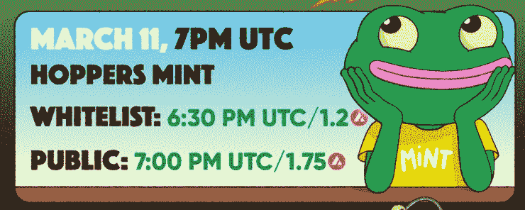

# 如何购买你的第一个赚钱的 NFT

> 原文：<https://medium.com/coinmonks/how-to-buy-your-first-money-making-nft-213cc976303b?source=collection_archive---------17----------------------->

让我告诉你如何购买你的第一个 NFT。

我们将使用一个即将推出的名为 Hoppers Game 的项目作为例子。

**快速提示:**

我不知道你对 NFT 的先入之见。许多人认为它们只不过是价格过高的猿类图片等等。

这并不完全错误。但这也不是故事的全部。

我对买卖你在网上读到的这些知名的 NFT 项目不感兴趣。

如果一个项目大到可以上新闻，我已经不感兴趣了。

我喜欢小项目、小开发团队和小的专用社区。

所以，与其买一辆毫无用处的 NFT，不如期待它涨价？？？原因是，我认为我会把它翻过来获利，我更喜欢不同的东西。

我只买我能玩的 NFT 或在游戏中下注。我会在几周或几个月内赚几千块。卖掉所有东西。拿走我的利润，然后去下一家。

*这款 NFT 目前报价 65 ETH，相当于 16.5 万美元左右。别把我算进去，伙计。*

我喜欢的 NFT 可以在游戏中扮演双重角色。

我想买下 NFT，用它玩游戏，在游戏中赚钱，然后卖掉我的 NFT。如果我出售我的真实 NFT 赚了钱，那很好，但不是必须的。只要我玩游戏赚了钱，我就赢了。

好了，足够的序言…

# 如何在本周购买你的第一个 NFT

**【我要教你的是我的过程。这不是财务建议。投资前做好自己的研究。]**

Hoppers Game 将在 3 月 11 日举行造币销售。如果你在那个日期之后读到这篇文章，不要担心。我将要教你的东西将适用于任何关于雪崩区块链的 NFT 项目

> 什么是薄荷特卖？
> 
> *在加密游戏领域，巨额销售是指游戏开发者首次出售他们的可玩角色的时刻。*
> 
> 在大减价时购买是获得投资回报的最佳方式。

在你做任何事情之前，确保你已经准备好了你的钱包。然后给它加上一些$AVAX。【如果你不知道我说的 wtf，[看这篇文章，](/coinmonks/how-to-buy-your-first-altcoin-718929597e95)按照步骤，然后回到这里。]

# 什么是白名单？

现在，看上面的图像。请注意，所谓的“白名单”和公众有不同的造币时间？

在白名单上意味着你可以提前获得 NFT 造币和折扣。例如，作为交换，你可能会在 Twitter 上推广这个项目，从而被列入“白名单”。

我们现在不担心这些。对于你的第一个 NFT 来说步骤太多了。让我们把重点放在公共造币厂。

对于这个跳鼠游戏，NFT 将花费 1.7 美元。目前大约是 130 美元。

记住:为了玩这个游戏(并赚钱)，你需要 NFT。你可以只买一个，然后就放在那里。或者你可以像我一样:你找到一个你喜欢的项目，然后买下 5 个以上的角色。

风险更高？当然可以。

更高的奖励潜力？绝对的。

你的电话。

如果我相信这个游戏，我只会在一个项目中获得一堆 NFT，而且我还有其他投资的利润可以投入。

在这种情况下，我准备在 3 月 11 日铸造 5 个漏斗。

# 那些讨厌的交易费

现在，除了购买价格之外，您还希望钱包中有一点额外的$AVAX 来支付交易费用。

雪崩区块链最大的优点是交易费用低(例如，与以太坊区块链相比)。但是要记住一件重要的事情:

当一款备受期待的游戏推出 NFT 时，网络就会变得拥堵，交易费用也会上升。

我完全期待支付额外的 0.3 美元的交易费(即天然气)，当我薄荷我的漏斗。

这对你来说意味着什么？如果你花 1.7 美元买一张 NFT，你的钱包里应该有 2 美元以防万一。

你最不希望的事情就是留出时间来创造一个项目，然后错过机会，因为当你试图将更多的$AVAX 转移到你的钱包时，游戏已经售罄。

# 造币日做什么

一旦你的钱包里有足够的$AVAX，你会想在造币日做一些事情，以确保你得到一个漏斗(或任何你买的 NFT)。

> ***注:***
> 
> 最成功的项目通常会在几分钟(甚至几秒钟)内销售一空。所以你必须要快。

1.转到[https://hoppersgame.io/](https://hoppersgame.io/)

2.点击“让我们开始蹦蹦跳跳”按钮。

3.在造币日，这一页的某个地方会有一个按钮连接你的钱包。如果你想买一个 NFT，你必须连接。

> ***请注意:***
> 
> 我与这个项目没有任何关系。我相信开发团队是基于他们在其他项目上的记录，但是任何事情都有可能发生。秘密空间是蛮荒的西部。做你自己的研究，知道你在这里做的每一步都是有风险的。我只是在分担我承担的风险。

4.选择你想要铸造的 NFT 的数量，然后点击“铸造”

5.该网站将要求您批准新合同。再次声明:如果你想获得 NFT，你必须这样做。但是在你的钱包里签一份新合同总是有风险的。

6.点击您的钱包，确认交易成功完成。看到 1.7 $AVAX (+费用)是从你的钱包里拿走的。

7.现在你会很高兴看到你的 NFT。这是最令人兴奋的部分。这是投资、游戏和赌博的交集。你将看不到你钱包里的 NFT。你必须去市场…

8.去 https://marketplace.kalao.io/。这是雪崩区块链上最受信任的市场之一。

9.点击“连接钱包”按钮。

10.如果你愿意，就签合同吧。

11.点击顶部的“我的 NFTs”。

12.你会在仪表盘上看到你的新 NFT！

*这是我的艺术家绘制的薄荷日的样子:-)*

现在你有了你的第一个 NFT，是时候玩你的第一个游戏赚取密码游戏了！

一旦游戏在 3 月 12 日上线，我会教你如何用你的 NFT 玩游戏，赚取奖励，并将这些奖励兑换成你银行账户中的现金。

***

想要独家访问我的每周加密观察列表，在那里我告诉你我在未来几周投资的项目？

[注册我的时事通讯](https://sendfox.com/lp/1x9d5n)，从雪崩区块链的“玩到赚”游戏中赚取$$。

感谢阅读！

格雷格“密码小子”拉森