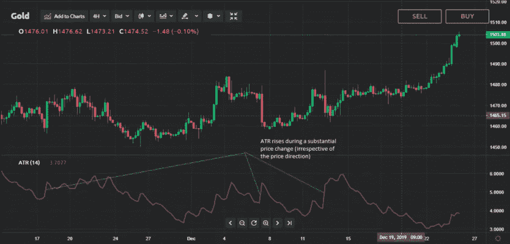

# 如何计算 ATR(平均真实范围)并设置止损——用 JavaScript 进行技术分析

> 原文：<https://medium.com/coinmonks/how-to-calculate-atr-average-true-range-and-set-stop-loss-technical-analysis-with-javascript-39d875d24ac3?source=collection_archive---------8----------------------->

“在交易中，你不能阻止损失的发生，但你可以通过在交易中使用止损来避免重大损失。”
― [**奥拉维尔丹尼尔**](https://www.goodreads.com/quotes/tag/stop-loss#:~:text=%E2%80%9CIn%20trading%2C%20you%20can',stop%20loss%20in%20your%20trades.%E2%80%9D)

> 你多久交易一次止损？ATR 可以帮助你提高胜率。


Photo from [Unsplash](https://unsplash.com/s/photos/losing-money)

你可能已经错过了一次交易，因为你的交易在下一次“牛市”之前就已经止损了。

这是交易者的普遍经验。

在本文中，您将了解 ATR 以及如何使用简单的 javascript 实现这个指标。

本文还将帮助您理解如何使用普通 javascript 计算 ATR 指标的值。

# 什么是 ATR(平均真实范围指标)？

**ATR** 是**平均真实范围的缩写。it** 是交易员设置止损的常用指标。尤其是跟踪止损。

该指标在大多数交易所和 TradingView 中可用。

它用于股票、外汇和加密货币市场的技术分析。

> “平均真实范围(ATR)是技术分析中使用的市场波动指标。
> 
> 它通常来源于一系列真实范围指标的 14 天简单移动平均线。
> 
> ATR 最初是为商品市场开发的，但后来被应用于所有类型的证券。”[—Investopedia.com](https://www.investopedia.com/terms/a/atr.asp)

# ATR 在技术分析中有多重要？

交易者可以用 ATR 来进出交易，当 ATR 和其他指标一起形成一个完整的策略时，ATR 是很有用的。



Photo from [Currency.com](https://currency.com/how-to-read-and-use-average-true-range-trading-indicator)

它的创建是为了让交易者通过简单的计算更准确地衡量资产的每日波动性。

指标没有指明价格方向；相反，它主要用于衡量缺口引起的波动，并限制涨跌。

ATR 的计算相当简单，只需要历史价格数据。

# 使用 ATR 设置止损。ATR 的广泛应用优势

如前所述，ATR 是设置止损的重要工具。它可以在交易视图指示器中找到。


Photo from [Unsplash](https://unsplash.com/s/photos/losing-money)

注意:最佳实践是将这些值乘以 1.5 倍或 2 倍，具体取决于您的风险管理承受能力。

# **使用简单 Javascript 函数的基本 ATR 公式**

如 **Investopedia** 网站所提供的，平均真实范围的公式为:

> "*TR*= Max[(*H*-*L*)、Abs(*H*-*CP*)、Abs(*L*-*CP*)】*ATR*=(*n*1)(*I*= 1)∑(*n*)*TRi*

因此，必须首先计算真实范围的系列/阵列。然后求出范围的平均值。这成为我们的平均真实范围。

真实范围是根据以下公式计算的最大值:

```
High - Low
High - Yesterday's Close
last Candle stick Close - Low
```

我们为此需要的数据是我们感兴趣的货币或股票的当前/今天的最高价和最低价以及前一天/昨天的收盘价。这取决于所讨论的市场。加密市场全天候运行，因此使用以前的蜡烛棒数据。

我们可以用 JavaScript 表示如下:

# 使用交易指标计算 ATR。一个 Javascript NPM 包

换句话说，要构建一个全功能的交易机器人，你需要已经构建好的包来实现 ATR。

我使用的是用 Typescript 编写的 J avascript [技术指标](https://www.npmjs.com/package/technicalindicators)库。你也应该试试。

要安装 run:

```
npm install --save technicalindicators//to import and use in your project.
const ATR **=** require('technicalindicators').ATR;
```

代码:

# 在 RunKit 上试试

您可以使用 RunKit 轻松尝试 ATR 公式。以下是链接。[现在就试试](https://runkit.com/anandaravindan/atr)

# **结论**

ATR 是技术分析非常重要的指标。大多数外汇、股票和加密货币的交易者在确定止损点时都使用 ATR。

也有其他的技术指标来设置止损，例如 BB(布林线)。技术分析的文章会更多。

谢谢，继续收听！

**你用什么技术指标来设置止损？请随意分享你的想法。**

> 加入 Coinmonks [电报频道](https://t.me/coincodecap)和 [Youtube 频道](https://www.youtube.com/c/coinmonks/videos)了解加密交易和投资

# 另外，阅读

*   [币安期货交易](https://coincodecap.com/binance-futures-trading)|[3 commas vs Mudrex vs eToro](https://coincodecap.com/mudrex-3commas-etoro)
*   [如何购买 Monero](https://coincodecap.com/buy-monero) | [IDEX 评论](https://coincodecap.com/idex-review) | [BitKan 交易机器人](https://coincodecap.com/bitkan-trading-bot)
*   [尤霍德勒 vs 科恩洛 vs 霍德诺特](/coinmonks/youhodler-vs-coinloan-vs-hodlnaut-b1050acde55a) | [Cryptohopper vs 哈斯博特](https://coincodecap.com/cryptohopper-vs-haasbot)
*   [顶级付费加密货币和区块链课程](https://coincodecap.com/blockchain-courses)
*   [MXC 交易所评论](/coinmonks/mxc-exchange-review-3af0ec1cba8c) | [Pionex vs 币安](https://coincodecap.com/pionex-vs-binance) | [Pionex 套利机器人](https://coincodecap.com/pionex-arbitrage-bot)
*   [如何在印度购买比特币？](/coinmonks/buy-bitcoin-in-india-feb50ddfef94) | [瓦济克斯评论](/coinmonks/wazirx-review-5c811b074f5b)