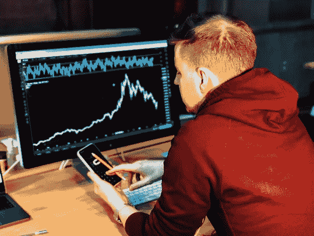

# 比特币转账手续费怎么算

> 原文：<https://medium.com/coinmonks/how-to-calculate-bitcoin-transfer-fee-afcf5ca446e5?source=collection_archive---------30----------------------->

**在区块链网络中转账要付费。这笔费用被称为佣金，它归矿工所有，也就是形成这些区块的人。比特币转账费用是可变的。它会根据网络负载而增减。如果说在其存在之初，比特币转账的佣金根本无法支付，那么几年来，这一费用一直在持续增长。**

**原则上，您可以通过设置增减来更改标准费用。但是，这不是一个事实，你的交易不会补充已经存在的未确认交易的数量。为了防止这种情况发生，比特币的转账费用必须充足。**

## 内容

**1 比特币交易**

**2 比特币交易手续费计算规则**

**3 比特币佣金由哪些因素决定**

**4 什么可以提成**

**5 最低交易费**

**6 比特币费用计算器**

**7 将比特币提现为卢布的费用**

**8 如何节省比特币转账费用**

**9 结论+相关视频**

## [比特币交易](https://cryptobatman.blogspot.com/2022/04/How-to-Calculate-Bitcoin-Transfer-Fee.html)

对于比特币网络中的正式工作，你需要支付佣金。但首先，我们来看看会如何扣款:1 比特币= 1000 mBTC = 1 亿聪。也就是 1 Satoshi 是 0.00000001 比特币。这是 Satoshi，扣除是为了支付转让。

**交易有自己的特点。假设你有一个比特币。送 0.5 BTC，你会得到 0.5 BTC 的变化。每一个翻译都是一个程序代码。它是根据硬币的来源和去向而产生的。**

你甚至不需要花太多心思去指定交易的费用金额。现代比特币钱包的配置方式是，当用户进行转账时，收费窗口已经显示了系统建议支付的金额，以便交易具有竞争力。

 [## 比特币转账手续费怎么算

### 原则上，您可以通过设置更多或更少来更改标准费用。但事实上你的交易…

cryptobatman.blogspot.com](https://cryptobatman.blogspot.com/2022/04/How-to-Calculate-Bitcoin-Transfer-Fee.html) 

> 加入 Coinmonks [电报频道](https://t.me/coincodecap)和 [Youtube 频道](https://www.youtube.com/c/coinmonks/videos)了解加密交易和投资

# 另外，阅读

*   XT.COM 评论 | [币安评论](https://coincodecap.com/xt-com-review)
*   [SmithBot 评论](https://coincodecap.com/smithbot-review) | [4 款最佳免费开源交易机器人](https://coincodecap.com/free-open-source-trading-bots)
*   [比特币基地僵尸程序](/coinmonks/coinbase-bots-ac6359e897f3) | [AscendEX 审查](/coinmonks/ascendex-review-53e829cf75fa) | [OKEx 交易僵尸程序](/coinmonks/okex-trading-bots-234920f61e60)
*   [如何在印度购买比特币？](/coinmonks/buy-bitcoin-in-india-feb50ddfef94) | [瓦济克斯审查](/coinmonks/wazirx-review-5c811b074f5b)
*   [隐翅虫替代品](/coinmonks/cryptohopper-alternatives-d67287b16d27) | [HitBTC 审查](/coinmonks/hitbtc-review-c5143c5d53c2)