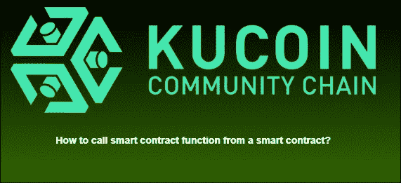
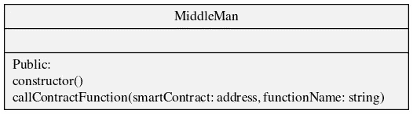
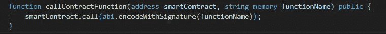

# 如何从一个没有 ABI 的智能合约调用智能合约函数？

> 原文：<https://medium.com/coinmonks/how-to-call-smart-contract-function-from-a-smart-contract-without-abi-af38b86b8d0f?source=collection_archive---------6----------------------->

从智能合约中调用智能合约函数有时会很有用。一个示例用例是时间锁合约，它可以延迟智能合约函数调用，并允许投资者在项目出现可疑情况时发出警告。

首先我们将看一下 UML 类图:

对于这个智能契约，我们将只有一个函数 **callContractFunction** 。在这个函数中，您传递智能协定地址和希望在该特定协定地址上调用的函数名。注意，在这个例子中，我们将只调用不需要任何参数的函数。

**实施**:

在这一节中，我们将看看上面的一个方法的实现

**先决条件:**

*   已安装节点和硬件

在这个函数中，我们使用 solidity 的内置低级调用方法，它是每个地址的类方法。如果函数被实现，那么它将被触发，否则它将有一个错误。EncodewithSignature 会将我们传递的字符串编码成 EVM 可以读取的字节。

事后的想法

在这篇短文中，您了解了如何在没有 ABI 的情况下使用低级调用来调用智能合约函数及其可能的用例。

不要忘记检查 KCC 更多可怕的加密项目。

社交网络
不和:[https://discord.gg/H5ucJydSyd](https://discord.gg/H5ucJydSyd)推特:[https://twitter.com/KCCOfficialTW](https://twitter.com/KCCOfficialTW)电报:[https://t.me/KCCOfficialEnglishCommunity](https://t.me/KCCOfficialEnglishCommunity)电报频道:[https://t.me/KCCOfficialChannel](https://t.me/KCCOfficialChannel)

> 加入 Coinmonks [电报频道](https://t.me/coincodecap)和 [Youtube 频道](https://www.youtube.com/c/coinmonks/videos)了解加密交易和投资

# 另外，阅读

*   [CoinDCX 评论](/coinmonks/coindcx-review-8444db3621a2) | [加密保证金交易交易所](https://coincodecap.com/crypto-margin-trading-exchanges)
*   [红狗赌场评论](https://coincodecap.com/red-dog-casino-review) | [Swyftx 评论](https://coincodecap.com/swyftx-review) | [造币厂评论](https://coincodecap.com/coingate-review)
*   [Bookmap 评论](https://coincodecap.com/bookmap-review-2021-best-trading-software) | [美国 5 大最佳加密交易所](https://coincodecap.com/crypto-exchange-usa)
*   [如何在 FTX 交易所交易期货](https://coincodecap.com/ftx-futures-trading) | [OKEx vs 币安](https://coincodecap.com/okex-vs-binance)
*   [CoinLoan 审查](https://coincodecap.com/coinloan-review) | [YouHodler 审查](/coinmonks/youhodler-4-easy-ways-to-make-money-98969b9689f2) | [BlockFi 审查](https://coincodecap.com/blockfi-review)
*   [XT.COM 评论](https://coincodecap.com/profittradingapp-for-binance)币安评论 |
*   [SmithBot 评论](https://coincodecap.com/smithbot-review) | [4 款最佳免费开源交易机器人](https://coincodecap.com/free-open-source-trading-bots)