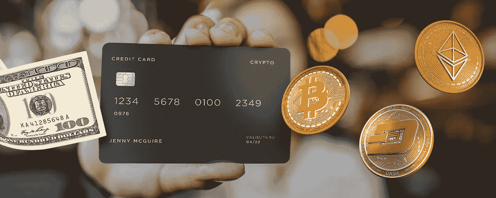

# 如何选择加密卡？

> 原文：<https://medium.com/coinmonks/how-to-choose-a-crypto-card-90b383a8b206?source=collection_archive---------54----------------------->

数字货币在全球的扩张导致了新的支持支付工具的快速发展，如汇款和商户服务或支持加密货币的银行卡，这些银行卡是与万事达卡和维萨卡等领先的支付网络合作发行的。这些加密友好的银行卡被认为是最方便的日常加密支付手段，因为它们是用户的习惯。

加密卡允许它们的主人进行日常购物，而不必钻研复杂的区块链和其他支付过程，如钱包和私人钥匙。它们的工作方式与传统银行卡几乎相同，主要区别是在支付商品和服务时，数字货币会自动转换为纸币。

加密银行卡的另一个主要优势是其固有的安全性，这与确保记录的不变性及其完全透明的基本区块链基础直接相关。

加密银行卡还可以在传统金融和分散资产世界之间建立重要联系，允许其所有者使用银行账户在 metaverses 和分散应用程序中使用其持有的资产购买数字产品。

市场上有大量的加密银行卡服务，这可能会使新用户难以选择一个合适的具有整体功能的服务。然而，记住某些关键因素将简化选择加密银行卡的过程。

# 卡的类型

在金融市场上可以找到几种类型的银行卡。所有给定的类型都已经进入了加密货币行业，并由各种服务发布。

**加密信用卡** —这些信用卡依赖于贷款资金的使用，这些贷款资金被转换成纸币供持卡人消费。资金由发行实体发放，以换取立即或在宽限期结束时应计的一定百分比的信贷。客户以持有加密货币的形式偿还信用。值得注意的是，这是一项高风险的投资，因为加密货币有波动的趋势。信用卡有风险，因为过度使用信用卡会导致罚款。此外，如果客户拒绝支付信贷，或宽限期届满，将适用罚款，客户很可能会发现自己在财务和法律上岌岌可危。

**加密借记卡** —借记卡是最安全、最普遍的银行卡类型。这种卡只使用用户在银行账户上的资金。这些卡与加密货币一起被广泛使用，因为它们经常被绑定到持有者的加密货币投资组合中，每次购买时可用的资金都被转换成菲亚特。

**加密预付卡** —预付卡不与任何银行账户挂钩，仅使用持卡人存入的资金。该限额受到用户希望分配的金额的限制，并且也可以用于加密货币。预付加密货币银行卡可以装载一定数量的数字货币，这些数字货币将根据当前汇率在每笔交易中扣除。

最受欢迎的选择是借记卡，因为它几乎没有风险，不需要任何费用或信贷，并且与持卡人可支配的资金数量直接相关。信用卡有风险，因为要收费。预付卡更适合那些与母银行或数字钱包缺乏持续联系的偏远地区。

**虚拟卡**——除了提供与合法银行账户绑定的加密货币钱包的即时网关，加密友好卡可以以虚拟格式发行。这种卡可以通过智能手机或手表即时存取资金，无论是纸币还是电子货币。虚拟加密卡还增加了一层安全，因为它们没有物理丢失的风险。

# 需要考虑的重要因素

选择加密银行卡时，用户应考虑几个重要因素，这些因素将决定卡的可用性及其使用的便利性。

首先也是最重要的是支持资产的范围。并非所有的加密银行服务都提供广泛支持的数字货币，这将用户限制在受欢迎的硬币名单上。然而，Embily 等领先的全球金融科技公司确实为比特币、ETH、USDT 和其他主要稳定货币提供支持，允许客户可靠地使用他们的资产，并以有利和可预测的利率将其转换为菲亚特。

另一个要考虑的重要因素是发布服务的合作伙伴。与全球支付网络的连接对于确保信用卡在零售店和商家网站被接受至关重要。例如，Embily 支持 VISA 和 MasterCard 网关，使其成为一项全球服务，几乎可以在任何商户网点或在线资源中接受。

卡片递送的可用性是另一个重要方面，它将决定客户的便利程度。 [Embily](https://embily.com/?utm_source=bitcoinist&utm_medium=article&utm_campaign=cryptocard) 为全球客户提供免费卡片制作和递送服务。

商户和自动柜员机交易的佣金对于确保加密银行卡使用的财务可行性至关重要。一些服务提供商对自动取款机和转账收取佣金。佣金有时可能高达每笔交易的 3%。 [Embily](https://embily.com/?utm_source=bitcoinist&utm_medium=article&utm_campaign=cryptocard) 对所有提现操作和转账收取 0%的手续费。

加密卡提供商的全球影响力同样重要，确保客户能够在世界任何地方使用他们的卡。该因素与卡的交付和服务有关，使客户能够全天候获得发卡方的帮助，并使用卡进行任何交易。

在选择提供商时，加密银行卡的安全性和发行服务的基础设施是至关重要的因素。区块链行业因多次黑客攻击和个人数据泄露而闻名。因此，各种安全层的可用性对于确保持卡人免受潜在的资金和数据损失至关重要。 [Embily](https://embily.com/?utm_source=bitcoinist&utm_medium=article&utm_campaign=cryptocard) 服务完全符合 PCI DSS 3.2.1 标准，使公司能够确保银行卡持卡人数据的完整性和整体基础设施的安全性。

集成到加密银行卡服务应用程序接口中的兑换操作的可用性对于将客户连接到加密货币市场并允许他们进行必要的销售、购买和兑换操作也至关重要。 [Embily](https://embily.com/?utm_source=bitcoinist&utm_medium=article&utm_campaign=cryptocard) 为其客户提供了一个功能齐全、直观的场外交易平台，并集成到移动应用程序中。

一些加密银行卡服务还要求其客户在卡上持有一定数量的硬币或代币以供继续使用。这种方法对于那些在日常操作中依赖其加密货币持有量并将该卡用作成熟债务工具的用户来说并不方便。适用此类要求的服务将客户的资金用于自己的运营，并从整个市场上的流动性池中产生被动收入，从而产生损失已押资金的潜在风险。Embily 加密银行卡服务对其客户没有任何此类要求。

最后，并不是所有的加密银行卡服务都允许他们的客户利用返现机会。事实是，借记卡很少能应用现金返还，因为其使用的基础系统的性质依赖于高嵌入佣金。银行在提供现金返还方面的利益是通过交换来确保的，这实质上是银行为进行无现金支付而相互支付的佣金。交换涉及支付系统，如 VISA 和 MasterCard，发行银行和收单银行。所有参与返现的人最初的收入来源是持卡人，他支付包含在购买的商品或服务价格中的交易服务费。卖家向银行支付收单费用，收单银行将部分佣金发送给发卡的服务或银行。发行银行与支付系统分享佣金，并且作为交换的结果而收到的资金被部分返还给买方作为现金返还。因此，供应链中的所有参与者都受益。由于 Embily 适用最低佣金，它不能将返现纳入其借记卡。

# 关键要点

随着数字货币的出现及其作为支付手段逐渐与法定货币平起平坐，对便捷载体的需求使得加密银行卡成为分散行业参与者的主流工具。市场上有各种各样的加密银行卡，很难选择正确的一种。但是，一些关键因素，如服务可用性、网关连接、佣金、安全性和支持的资产列表，可以帮助客户确定最适合他们需求的服务。

> 加入 Coinmonks [电报频道](https://t.me/coincodecap)和 [Youtube 频道](https://www.youtube.com/c/coinmonks/videos)了解加密交易和投资

# 另外，阅读

*   [Bookmap 点评](https://coincodecap.com/bookmap-review-2021-best-trading-software) | [美国 5 大最佳加密交易所](https://coincodecap.com/crypto-exchange-usa)
*   最佳加密[硬件钱包](/coinmonks/hardware-wallets-dfa1211730c6) | [Bitbns 评论](/coinmonks/bitbns-review-38256a07e161)
*   [新加坡十大最佳加密交易所](https://coincodecap.com/crypto-exchange-in-singapore) | [购买 AXS](https://coincodecap.com/buy-axs-token)
*   [红狗赌场评论](https://coincodecap.com/red-dog-casino-review) | [Swyftx 评论](https://coincodecap.com/swyftx-review) | [造币厂评论](https://coincodecap.com/coingate-review)
*   [投资印度的最佳密码](https://coincodecap.com/best-crypto-to-invest-in-india-in-2021)|[WazirX P2P](https://coincodecap.com/wazirx-p2p)|[Hi Dollar Review](https://coincodecap.com/hi-dollar-review)
*   [加拿大最佳加密交易机器人](https://coincodecap.com/5-best-crypto-trading-bots-in-canada) | [库币评论](https://coincodecap.com/kucoin-review)
*   [火币加密交易信号](https://coincodecap.com/huobi-crypto-trading-signals) | [HitBTC 审核](/coinmonks/hitbtc-review-c5143c5d53c2)