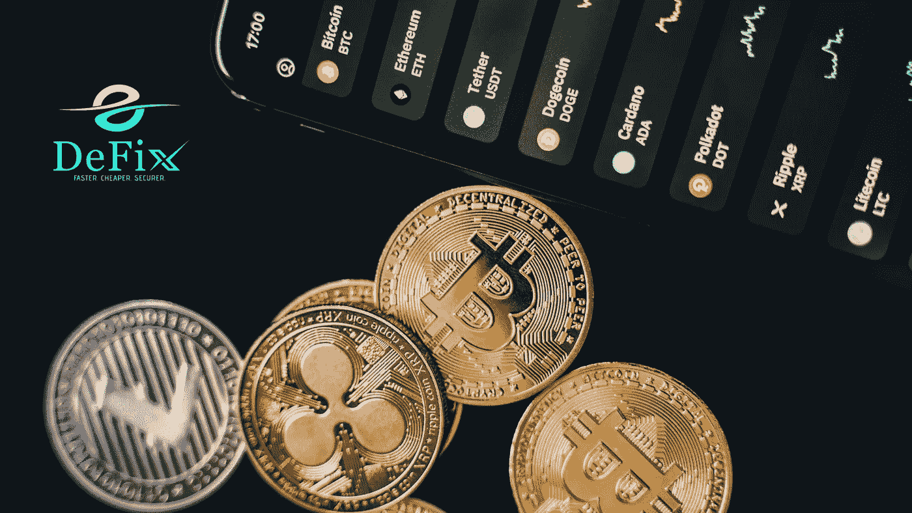
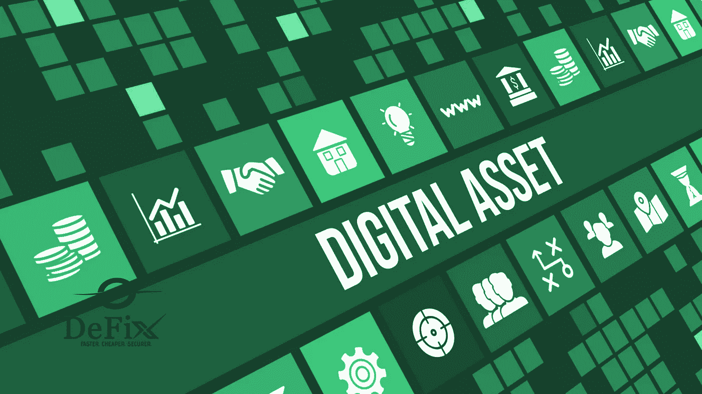
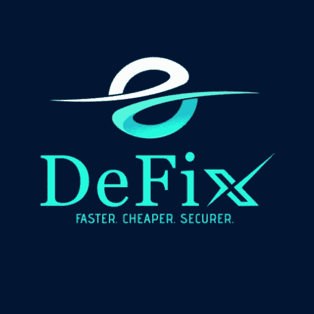

# 如何为您的数字资产选择钱包

> 原文：<https://medium.com/coinmonks/how-to-choose-a-wallet-for-your-digital-assets-6c6ec40c78ad?source=collection_archive---------52----------------------->

在你考虑投资加密货币之前，你应该首先弄清楚如何获得一个可靠的钱包来保护你的加密资产。如果不谨慎，很容易掉入无良平台的陷阱，损失资金。

在选择钱包之前，你需要考虑的一个关键因素是它是否具有高级安全功能。请记住，你必须进行彻底的研究，以确定你选择的钱包是否适合你的投资组合。

例如，如果您打算使用加密钱包进行常规交易，热钱包是一个完美的选择。相反，冷钱包非常适合那些对长期投资感兴趣的人，尤其是买入并持有型的投资者。

以下是选择加密钱包时需要考虑的一些因素。

## **多个数字资产**

一个好的钱包应该支持广泛的数字资产。这是你应该用来评估适合你的投资组合的钱包的标准之一。这样，你将能够分散你的投资组合和交易，而不必从一个加密钱包转移到另一个。

尽管大多数数字钱包可能不支持所有加密货币，但它们至少应该支持比特币、以太坊、莱特币和许多其他主要货币。

## **钱包开发者的透明度**

在选择正确的加密钱包时，您应该考虑的另一个因素是关于钱包提供商的信息。你认识他们吗？这意味着你应该能够访问他们的联系方式和其他信息，这样你就可以随时联系他们以防万一。

如果你无法获得平台上钱包提供商的详细信息，那么你就有理由担心你的加密资产的安全性。

## **好用**

你选择的钱包应该容易使用。尝试导航，看看你是否可以轻松地使用这些功能。不要选择一个复杂的钱包，它可能会让你在没有咨询其他用户的情况下无法使用。

在任何情况下，钱包都应该满足有经验的和新的加密用户的需求。因此，钱包应该有一个直观的用户界面，方便用户交易和管理他们的投资组合。

## **定价**

不同的平台有不同的价格。因此，你应该选择一个不仅容易使用，而且能为用户提供方便的钱包。如果你想买一个昂贵的钱包，那么从你的投资中获利可能会很困难。这是因为一些钱包在用户每次取款时都会收取一定的费用。

## **安全**

在你进入加密货币的世界之前，你的加密钱包的安全性应该是最重要的。你应该考虑的一个主要方面是钱包是否有双重认证。

为了提高安全性，请确认网络钱包地址是否以 HTTPS 开头。这比 HTTP 钱包提供了更好的安全性。

## **结论**

虽然互联网上有几十种加密钱包**、**，但你应该仔细研究，不仅要了解它们的功能，还要知道其他人在说什么。这将使你免于投资那些可能使你的资金面临风险的可疑钱包。

因此，我们推荐像 defix 这样可靠的钱包来帮助您轻松保护和管理您的加密组合。

> 加入 Coinmonks [电报频道](https://t.me/coincodecap)和 [Youtube 频道](https://www.youtube.com/c/coinmonks/videos)了解加密交易和投资

# 另外，阅读

*   [3 商业评论](/coinmonks/3commas-review-an-excellent-crypto-trading-bot-2020-1313a58bec92) | [Pionex 评论](https://coincodecap.com/pionex-review-exchange-with-crypto-trading-bot) | [Coinrule 评论](/coinmonks/coinrule-review-2021-a-beginner-friendly-crypto-trading-bot-daf0504848ba)
*   [莱杰 vs n rave](/coinmonks/ledger-vs-ngrave-zero-7e40f0c1d694)|[莱杰 nano s vs x](/coinmonks/ledger-nano-s-vs-x-battery-hardware-price-storage-59a6663fe3b0) | [币安评论](/coinmonks/binance-review-ee10d3bf3b6e)
*   [Bybit Exchange 评论](/coinmonks/bybit-exchange-review-dbd570019b71) | [Bityard 评论](https://coincodecap.com/bityard-reivew) | [Jet-Bot 评论](https://coincodecap.com/jet-bot-review)
*   [3 commas vs crypto hopper](/coinmonks/3commas-vs-pionex-vs-cryptohopper-best-crypto-bot-6a98d2baa203)|[赚取秘密利息](/coinmonks/earn-crypto-interest-b10b810fdda3)
*   最好的比特币[硬件钱包](/coinmonks/hardware-wallets-dfa1211730c6) | [BitBox02 回顾](/coinmonks/bitbox02-review-your-swiss-bitcoin-hardware-wallet-c36c88fff29)
*   [BlockFi vs 摄氏度](/coinmonks/blockfi-vs-celsius-vs-hodlnaut-8a1cc8c26630) | [Hodlnaut 审核](/coinmonks/hodlnaut-review-best-way-to-hodl-is-to-earn-interest-on-your-bitcoin-6658a8c19edf) | [KuCoin 审核](https://coincodecap.com/kucoin-review)
*   [Bitsgap 审核](/coinmonks/bitsgap-review-a-crypto-trading-bot-that-makes-easy-money-a5d88a336df2) | [四倍审核](/coinmonks/quadency-review-a-crypto-trading-automation-platform-3068eaa374e1) | [Bitbns 审核](/coinmonks/bitbns-review-38256a07e161)