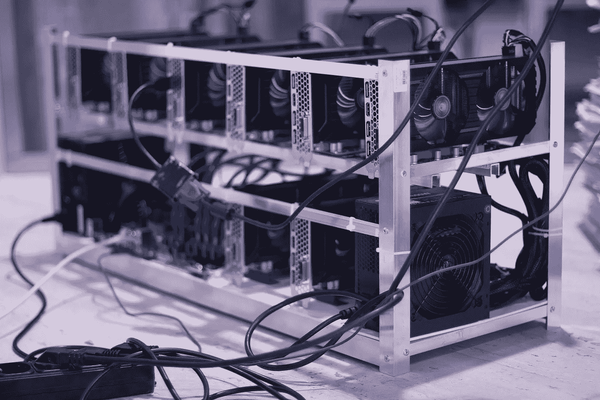

# 如何选择以太坊矿池

> 原文：<https://medium.com/coinmonks/how-to-choose-an-ethereum-mining-pool-468745f72835?source=collection_archive---------46----------------------->

选择采矿池时，应考虑以下几个变量:

1) **池散列率**:池的散列率是参与者的挖掘硬件的散列率的集合。较大的池散列率将确保池更频繁地接收奖励，因为池在网络上更有竞争力。对于个体矿工来说，这可以确保更频繁的支出。然而，在一个更大的池中的单个矿工可能会收到较少的奖励，因为奖励必须在更多的池参与者之间分配。希望支持健康的、分散的网络的矿工也可能想要选择具有较小总体散列率的池，以防止任何一个池通过散列获得对网络的主导控制。

2) **费用**:资金池从每笔支出中收取费用，帮助支持资金池的运作。池费可以从不到 1%到 4%不等。根据其他因素，选择一个收费较低的矿池以最大限度地提高单个矿工的报酬是有意义的。一些支付模式可能会产生更高的费用，以覆盖资金池运营商承担的风险；尤其是在网络打赏没有快速验证的情况下。

3) **支付模式**:矿池使用几种支付模式。支出模型影响到如何计算单个矿工的奖励。

* **PPS** :每股支付(PPS)根据提交的工作提供固定的支付。如果有 10 份“股票”提交给该池，并且一名矿工提交了一份，那么该矿工将获得 10%的奖金。即使提交的单个份额恰好是赢得网络奖励的份额，矿工仍然获得 10%的份额。

* **PPLNS** :每最后 N 股支付(Pay-Per-Last-N-Shares)提供了一个更加可变的支付系统，该系统基于矿工的股份占当前区块之前的大量股份的百分比。这种支付模式鼓励池的忠实用户，不鼓励跳到池中，赢得几个街区，然后再跳走。新加入人才库的人将获得比例较低的奖励，直到他们在最后 N 个股票窗口内做出贡献。

*   **PPS+** :这款是前两款的杂交款。整体奖励使用 PPS 模式支付，而任何交易奖励使用 PPLNS 模式支付。

> 加入 Coinmonks [电报频道](https://t.me/coincodecap)和 [Youtube 频道](https://www.youtube.com/c/coinmonks/videos)了解加密交易和投资

# 另外，阅读

*   [OKEx vs KuCoin](https://coincodecap.com/okex-kucoin) | [摄氏替代度](https://coincodecap.com/celsius-alternatives) | [如何购买 VeChain](https://coincodecap.com/buy-vechain)
*   [ProfitFarmers 回顾](https://coincodecap.com/profitfarmers-review) | [如何使用 Cornix 交易机器人](https://coincodecap.com/cornix-trading-bot)
*   [如何匿名购买比特币](https://coincodecap.com/buy-bitcoin-anonymously) | [比特币现金钱包](https://coincodecap.com/bitcoin-cash-wallets)
*   [瓦济里克斯 NFT 评论](https://coincodecap.com/wazirx-nft-review)|[Bitsgap vs Pionex](https://coincodecap.com/bitsgap-vs-pionex)|[Tangem 评论](https://coincodecap.com/tangem-wallet-review)
*   如何使用 Solidity 在以太坊上创建 DApp？
*   [币安 vs FTX](https://coincodecap.com/binance-vs-ftx) | [最佳(SOL)索拉纳钱包](https://coincodecap.com/solana-wallets)
*   [如何在 Uniswap 上交换加密？](https://coincodecap.com/swap-crypto-on-uniswap) | [A-Ads 评论](https://coincodecap.com/a-ads-review)
*   [加密货币储蓄账户](/coinmonks/cryptocurrency-savings-accounts-be3bc0feffbf) | [YoBit 审核](/coinmonks/yobit-review-175464162c62)
*   [Botsfolio vs nap bots vs Mudrex](/coinmonks/botsfolio-vs-napbots-vs-mudrex-c81344970c02)|[gate . io 交流回顾](/coinmonks/gate-io-exchange-review-61bf87b7078f)