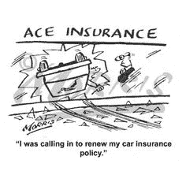
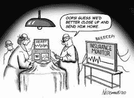

# 如何选择保单？—我应该了解我的保险的哪些内容？

> 原文：<https://medium.com/coinmonks/how-to-choose-insurance-policy-what-should-i-know-about-my-insurance-372dfbc971ed?source=collection_archive---------22----------------------->

嘿，伙计们……很高兴再次回来继续我们关于保险的讨论。到目前为止，在这个关于保险的系列中，我们已经讨论了为什么我们需要它，有多少种保险，包括人寿保险，谁需要人寿保险。在上一篇文章中，我们也讨论了如何有效地计划保险费，以减少保险费带来的痛苦，以及如何节省一点额外的费用，明智地将其用于创造财富的其他地方。今天，在这个系列的最后一篇文章中，让我们来讨论最重要的问题，“如何从市场上的多种选择中选择合适的保险和**在购买保险之前必须了解他/她的保险单**”。

好吧…..在进入技术层面之前，让我们绝对清楚地了解一件事:任何保险单，无论是人寿保险、车辆保险、家庭保险或任何其他通用保险**保险** **都是具有明确合同条款的合法合同**。因此，如果保险顾问的承诺没有反映在保险单中，则这些承诺是不成立的。**要 100%确定您的保障范围和您将获得的保障，唯一的方法是在签署合同条款之前仔细阅读保单文件**。

在当今商业化的世界，保险也成为许多公司以类似条款提供的金融产品，如何选择最适合自己的交易有点主观。这主要取决于你的具体财务需求、冒险倾向以及对特定保险公司的信念/品牌忠诚度。我相信我们当中许多人仍然认为 LIC 是人寿保险的第一选择，尽管有许多其他保险公司提供类似的产品。在这种情况下，**建议提前按照保险单的优先顺序列出您的期望，当然，在查看任何公司的销售手册之前，这些手册可能会影响您的看法**。这些期望可能包括您在不幸事件发生时希望获得的总金额、某些附加利益，如随时间增加保险金额的选项、附加受益人的包含、税收优惠等。您可以根据自己的需要随意添加或删除列表中的内容。

一旦你有了一个粗略的想法，你在寻找什么，什么应该是保险金额和你支付保费的能力，现在是时候做一些橱窗购物。在当今信息技术的世界里，最好是花些时间在互联网上做些初步的研究。我们中的一些人可能仍然喜欢咨询我们友好的邻居保险顾问。然而，即使对这些人来说，我也建议在咨询保险代理人或顾问之前花些时间进行自己的研究。作为客户，你了解的越多，向你介绍这些产品的人就会透露更多的细节。对于那些像我一样，更喜欢做自己的在线研究的人来说，有许多聚合器，如 Policy Bazar，它们汇编并提供各种保险的多种选择。事实上，这些聚合器是所有保险需求的一站式解决方案。

**如何选择合适的保险** —现在是时候拿起纸笔，让那些熟悉 Excel 的人打开一张新的表格，比较所有可用的选项。

第一步——选择你感兴趣的类别。这是简单的一步，如果你正在寻找通用保险，如房屋保险或车辆保险。然而，如果你正在寻找人寿保险，这是一个棘手的部分，因为现在你**将不得不在定期保险、返还保费的定期保险、退款政策、养老计划、终身寿险等众多选择中做出选择。如果你没有现成的答案，请不要着急。**在做出任何决定之前，与你的配偶或受益人详细讨论最微小的问题。花点时间来决定，你的选择一旦被选择就是为了你的生活，因此延迟几天不会有任何显著的不同。****

第二步——开始用各种可用选项中的数据填充 Excel 表格或纸上的字段。**必须考虑的字段有:-保险金额、保费金额、保险公司的基本要求(强制性健康检查)、附加条款* &免责声明*以及包含和遗漏**等。再次请随意定制此表…..毕竟这是你的床单(哈..哈…哈……)

*   **附加条款** —这些是有一定费用的可选保险，标准保单不承保，但对您承保某些人生事件可能很重要。
*   **豁免** —这通常是指在残疾影响收入潜力的情况下对保费的豁免，但也可能包括在特定情况下对保单持有人的某些条款的豁免。

第 3 步—选择 Policy Bazar 或其任何竞争对手(如 Coalition、purge、Digit Insurance、Spruce Holdings、Acko General Insurance 等)等聚合公司，并在做出最终决定前检查保险公司在理赔、客户满意度评级方面的相对表现。

第 4 步——现在选择你认为最适合你的要求和最经济的保险单。总的来说，**更喜欢客户评级和理赔率较高的公司的保险产品，而不是过往记录不佳的公司**。

第 5 步——检查支付保险费的选项。如果存在按年、按季度或按月支付保费的选择，严格从财务角度来看，选择更长期限的保费将是有利的，因为这通常提供 2-5%的折扣。

**无论您选择哪项政策或哪家公司，都要坚持与您分享政策文件草案**。请仔细阅读这份文件，看你是否清楚地理解了合同的所有条款。如果你不明白某些术语，可以谷歌一下，或者请整合商的主管或你的保险顾问给你解释一下。是的……..即使是在线聚合器也有高管来帮助你。这些通常来自他们的销售团队，但可以安排专家或公司代表回电，以澄清您的所有疑问。在你满意之前，不要签署文件或支付保险费。

最后，这可能并不总是有效，但是和公司代表协商你的政策并没有坏处。您可以**就保单的某些限制性条款甚至保费成本**进行协商。例如:-您可能对某家保险公司有品牌忠诚度，因此想要购买该公司的保险，但该公司的保费可能比其他公司高。在这种情况下，如果你接近公司并与他们谈判，你可能会得到折扣保费或一些额外的好处。

这就是这篇文章的全部内容…..我希望你也能像以前的帖子一样喜欢阅读它。我的许多年轻读者评论说，在可预见的未来，这个问题与他们无关。但是，伙计们，做正确事情的知识就是力量……在今天的世界，尤其是后电晕时代，最好通过旅行或健康等小型通用保险来确保您的计划，而不是承担全部费用。如果你了解这个主题，它可能会帮助你在每次购买机票、预订火车票、为车辆投保或只是帮助你的朋友和家人选择任何保险相关产品时，有意或无意地做出更好的选择。

> 加入 Coinmonks [电报频道](https://t.me/coincodecap)和 [Youtube 频道](https://www.youtube.com/c/coinmonks/videos)了解加密交易和投资

# 另外，阅读

*   [Bitsgap 审核](/coinmonks/bitsgap-review-a-crypto-trading-bot-that-makes-easy-money-a5d88a336df2) | [Quadency 审核](/coinmonks/quadency-review-a-crypto-trading-automation-platform-3068eaa374e1) | [Bitbns 审核](/coinmonks/bitbns-review-38256a07e161)
*   [加密复制交易平台](/coinmonks/top-10-crypto-copy-trading-platforms-for-beginners-d0c37c7d698c) | [Coinmama 审核](/coinmonks/coinmama-review-ace5641bde6e)
*   [印度的加密交易所](/coinmonks/bitcoin-exchange-in-india-7f1fe79715c9) | [比特币储蓄账户](/coinmonks/bitcoin-savings-account-e65b13f92451)
*   [OKEx vs KuCoin](https://coincodecap.com/okex-kucoin) | [摄氏替代品](https://coincodecap.com/celsius-alternatives) | [如何购买 VeChain](https://coincodecap.com/buy-vechain)
*   [币安期货交易](https://coincodecap.com/binance-futures-trading)|[3 commas vs Mudrex vs eToro](https://coincodecap.com/mudrex-3commas-etoro)
*   [如何购买 Monero](https://coincodecap.com/buy-monero) | [IDEX 评论](https://coincodecap.com/idex-review) | [BitKan 交易机器人](https://coincodecap.com/bitkan-trading-bot)
*   [CoinDCX 评论](/coinmonks/coindcx-review-8444db3621a2) | [加密保证金交易交易所](https://coincodecap.com/crypto-margin-trading-exchanges)
*   [红狗赌场评论](https://coincodecap.com/red-dog-casino-review) | [Swyftx 评论](https://coincodecap.com/swyftx-review) | [CoinGate 评论](https://coincodecap.com/coingate-review)
*   [Bookmap 点评](https://coincodecap.com/bookmap-review-2021-best-trading-software) | [美国 5 大最佳加密交易所](https://coincodecap.com/crypto-exchange-usa)