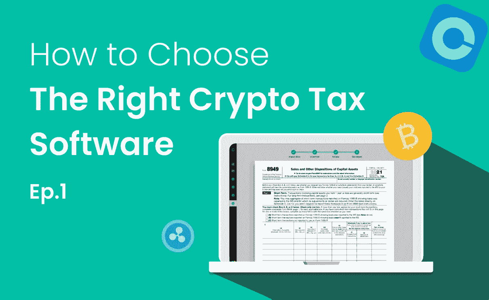
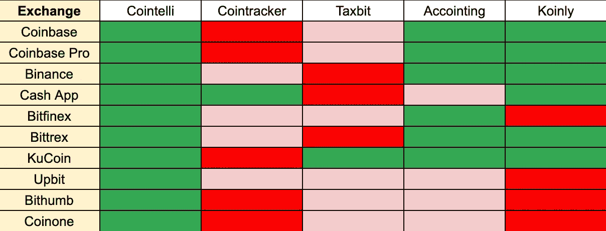

# 如何选择正确的加密税务软件，第 1 部分:审查外汇覆盖面

> 原文：<https://medium.com/coinmonks/how-to-choose-the-right-crypto-tax-software-part-1-review-exchange-coverage-d66bcaac11be?source=collection_archive---------27----------------------->

美国加密投资者将不得不更加关注加密税的申报。随着大约 16%的成年人投资加密货币，这一市场预计将大幅增长，华盛顿加大了对这一领域征税的力度。美国国税局在 2014 年首次起草了加密货币税收规则，华盛顿最近又给国税局[800 亿美元](https://www.cnbc.com/2021/07/14/irs-new-rules-on-bitcoin-ethereum-dogecoin-trading.html)用于打击逃税。

然而，加密税可能很难完全理解。正确地归档它们需要准确地报告来自潜在的许多不同加密平台的复杂交易。要在不增加自己负担的情况下做好这件事，你需要合适的软件。

你如何为这项工作选择合适的软件？在整个系列中，我们将概述您的软件需要勾选的所有框，以真正使计算您的加密税既简单又准确。在第一部分中，我们将讨论如何可靠地处理*所有的*数据。

# 查看支持多少加密平台

通过税务报告软件申报加密货币税的重要第一步是从您使用的所有交易所和钱包中导入您的所有交易数据。这样做的时候，你需要采取一些必要的步骤来确保准确性。

首先，看看软件支持多少加密交换和钱包。首先，Cointelli 支持的主要加密交换比许多其他竞争对手多得多，并且具有完全的导入能力。Cointelli 支持的交易所包括像比特币基地、币安和 KuCoin 这样的大公司，但也包括更小、更小众的交易所。Cointelli 还支持至少 15 种区块链:比特币、以太坊，甚至 Dogecoin 都在其中。

## CSV 文件导入测试结果

*绿色:支持|粉色:不支持|红色:功能不全*

其次，检查软件是否支持从每个交易所导入交易数据的多种方法。否则，您可能无法自动导入您的交易，而是不得不使用软件提供的表格(如果有的话)通过繁琐的过程上传交易。

同样重要的是，检查每个平台检索和导入交易数据的难易程度，因为每个交易所和钱包都提供了不同的方式，如 CSV 文件和 API。某些加密税务平台无法轻松地从 CSV 文件和 API 密钥中导入数据。有时，格式不兼容，或者凭证不能被正确地认证。

Cointelli 不仅支持更多的钱包和交易所，还提供了从这些平台导入交易数据的最简单方法。这使得 Cointelli 非常适合初学者。

# 检查您是否可以解决数据丢失问题

第三，您应该记住，将交易数据导入加密税务软件时，可能会发生数据丢失。全球有数千种加密货币和数十种加密货币交易类型(如购买、出售、返现、利息)。然而，加密货币的符号在各个交易所可能并不相同。例如，比特币在一些平台上可以标记为 BTC，但在其他平台上可以标记为 XBT。大多数加密货币税务软件平台在导入交易数据时会忽略很少使用的交易类型，这意味着一些数据可能会被遗漏，并导致客户在填写纳税申报单时丢失关键信息。

第四，导入后确认较新的加密货币和 NFT 之类的交易记录已经正确上传。新的加密货币和相关项目一直在涌现，交易所、钱包和加密税收软件需要时间来赶上。

最后，仔细检查是否可以在需要时删除导入的数据。如果没有适当地过滤掉不需要的数据，你最终可能会付出比实际需要更多的钱。为了提高费用计算的准确性，Cointelli 通过分解关键标准的交易所数据来提取费用值，而不是使用交易所提供的数据。特别建议有大量交易的投资者密切关注他们最终支付的金额。

# 接下来呢？

在你确认你选择的加密税务软件可以正确导入你的所有数据后，开始检查这个软件是否允许你查看数据并根据需要进行更正。我们将在下一篇文章中看到这一点！

你可以在这里阅读第二部分。

*Cointelli 是一家加密税务报告公司，由注册税务专家 Mark Kang 创立，他作为注册会计师为社区服务的长期经验促使他开发用户友好的税务软件。Cointelli 在税务报告生成过程中自动检测和纠正错误，并与 TurboTax 以及各种加密交易所和钱包兼容。在这些方面以及更多方面，Cointelli 简化了纳税申报流程。*

*查看*[*coin telli*](https://cointelli.com/)*了解更多。*

*免责声明:本帖仅供参考，不应被解释为或依赖为财务、法律或税务专业人士建议的替代品。此外，本内容仅涉及美国公民和居民的美国联邦所得税后果，不涉及可能与受特殊规则约束的特定人员(如经销商或贸易商)相关的税务后果。您应该咨询您自己的财务、法律或税务专业人士，以报告和提交您的加密税或根据您的特定情况做出决定。法律、法规或现有法律的解释可能会发生变化，这可能会对未来或追溯产生不利影响。这篇文章的内容可能会有变化。*