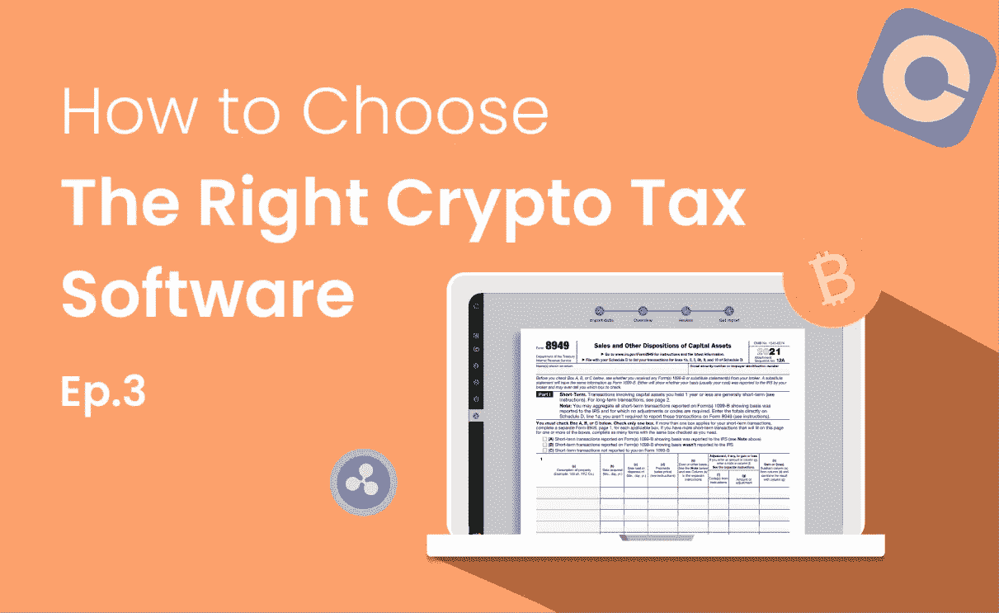

# 如何选择正确的加密税务软件，第 3 部分:验证软件兼容性和价格标签

> 原文：<https://medium.com/coinmonks/how-to-choose-the-right-crypto-tax-software-part-3-verify-software-compatibility-and-price-tag-f95d3a33521d?source=collection_archive---------49----------------------->

美国加密投资者将不得不更加关注加密税的申报。随着大约 16%的成年人投资加密货币，这一市场预计将大幅增长，华盛顿加大了对这一领域征税的力度。美国国税局在 2014 年首次起草了加密货币税收规则，华盛顿最近又给国税局[800 亿美元](https://www.cnbc.com/2021/07/14/irs-new-rules-on-bitcoin-ethereum-dogecoin-trading.html)用于打击逃税。

然而，加密税可能很难完全理解。正确地归档它们需要准确地报告来自潜在的许多不同加密平台的复杂交易。要在不增加自己负担的情况下做好这件事，你需要合适的软件。

你如何为这项工作选择合适的软件？在整个系列中，我们将概述您的软件需要勾选的所有框，以真正使计算您的加密税既简单又准确。这是我们的加密税务软件选择系列的最后一部分。我们在[的第一篇文章](/@cointelli/how-to-choose-the-right-crypto-tax-software-part-1-review-exchange-coverage-d66bcaac11be)中讨论了如何确保你的服务可以正确导入你的所有数据，而在[的第二篇文章](/@cointelli/how-to-choose-the-right-crypto-tax-software-part-2-confirm-error-correction-function-5f1cbc67a6a7)中，我们概述了确认你使用的服务允许你调整你上传的数据以确保高度准确性的重要性。

现在，我们涵盖了两个重要的最后步骤:确保加密税务软件是兼容你更广泛的报税软件和负担得起的。

# 验证兼容性

选择加密税务软件时，确认与流行的税务和会计软件品牌的兼容性非常重要。许多加密货币税务软件平台在这方面受到限制。因此，关键是要知道你感兴趣的加密税务软件是与 TurboTax 之类的软件一起工作，还是与注册会计师使用的软件一起工作。

Cointelli 提供了与这两个类别以及更多类别的兼容性。它以一种形式生成您的税务报告，可以直接上传到 TurboTax 和 TaxAct，还可以通过电子邮件将您的税务报告直接发送给您的会计师，只需点击“发送给会计师”按钮。

请放心，Cointelli 知道在将报告传递给其他程序时它在做什么。Cointelli 确保与流行的会计软件应用程序兼容，会计专业人员参与其设计和开发。有了 Cointelli，你的会计师可以迅速生成税务报告，与他们的会计软件*一起工作。*

# 价格应该是合适的

加密税务软件的市场仍然很新，所以这些服务的价格通常从 50 美元到 200 美元不等。当每年的交易次数超过 1，000 次时，这种软件的年订阅费用在许多情况下超过 100 美元，因为定价通常是根据通过该软件运行的交易次数来确定的。例如，在整个 2021 年，每周交易 20 次，总计将超过 1000 次交易，因此您可能需要支付两倍于基本计划的费用。

使用 Cointelli，您可以处理多达 100，000 笔交易，而每年仍然只需支付 49 美元(加税)。实际上，这是业内最低的价格。其他品牌可能会提供较低的基本费用，但这些价格通常有非常低的交易限额。这些限制往往会迫使你进入一个新的层次，比 Cointelli 的一刀切交易更昂贵。

如果你有 10 万以上的交易，不用担心。请联系我们，让我们知道。

# 结束语

这使我们结束了对选择加密税解决方案时要记住什么的审查。现在，让我们简要说明如果你*不*正确报告你的加密资产会发生什么。

加密货币交易所已经通过 1099-K 和 1099-MISC 等表格向美国国税局报告用户资产和交易。他们还将从 2023 年开始发出 1099-Bs 报告资本收益。正因为如此，美国国税局已经掌握了谁欠了加密税以及他们欠了多少的线索。随着时间的推移，国税局只会得到更多信息。

最重要的是，自 2019 纳税年度以来，美国国税局一直在 1040 表格的顶部询问纳税人是否交易过加密货币。如果回答错误或遗漏了你总收入的一部分，你可能会受到刑事和经济处罚。

那么，哪种软件可以满足我们在过去三篇文章中建立的所有标准，并让你尽可能轻松地度过纳税季呢？看完这个系列，我们希望你已经决定 Cointelli！

我们向你保证。当涉及到快速准确地完成纳税时，您可以依靠 Cointelli。

在这里阅读该系列的部分[一](/@cointelli/how-to-choose-the-right-crypto-tax-software-part-1-review-exchange-coverage-d66bcaac11be)和[二](/@cointelli/how-to-choose-the-right-crypto-tax-software-part-2-confirm-error-correction-function-5f1cbc67a6a7)。

Cointelli 是一家加密税务报告公司，由注册税务专家 Mark Kang 创立，他作为注册会计师为社区服务的长期经验促使他开发用户友好的税务软件。Cointelli 在税务报告生成过程中自动检测和纠正错误，并与 TurboTax 以及各种加密交易所和钱包兼容。在这些方面以及更多方面，Cointelli 简化了纳税申报流程。

*查看*[*coin telli*](https://cointelli.com/)*了解更多。*

*免责声明:本文仅供参考，不应被解释为或依赖为财务、法律或税务专业人士建议的替代。此外，本内容仅涉及美国公民和居民的美国联邦所得税后果，不涉及可能与受特殊规则约束的特定人员(如经销商或贸易商)相关的税务后果。您应该咨询您自己的财务、法律或税务专业人士，以报告和提交您的加密税或根据您的特定情况做出决定。法律、法规或现有法律的解释可能会发生变化，这可能会对未来或追溯产生不利影响。这篇文章的内容可能会有变化。*