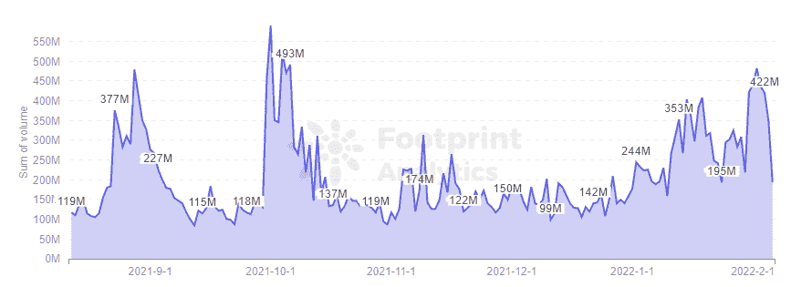
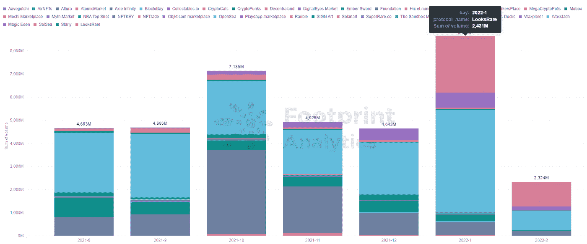
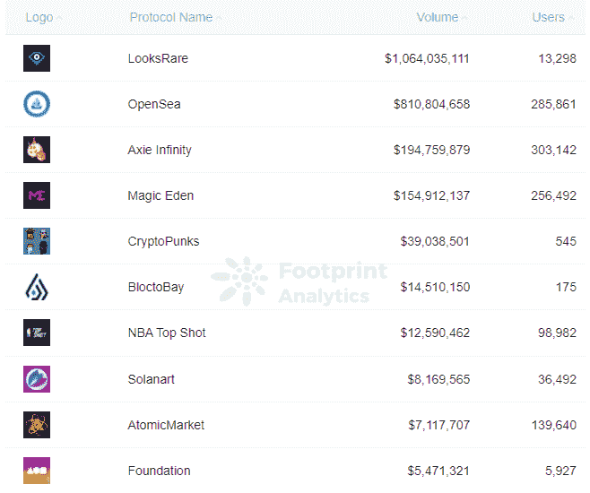
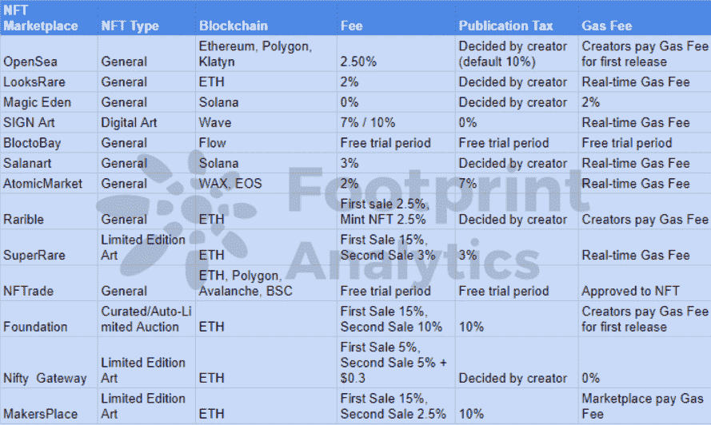

# 如何选择正确的 NFT 市场？

> 原文：<https://medium.com/coinmonks/how-to-choose-the-right-nft-marketplace-4d81d27afd2?source=collection_archive---------16----------------------->

无论你左看、右看、下看还是四周看，似乎你会发现一个新的 NFT 市场，声称是当前加密季节的下一个 OpenSea 杀手。

一月份，NFT 所有市场的交易额超过了 8 . 62 亿美元，比去年 12 月增长了 85%。根据[足迹分析](https://www.footprint.network/)，主要市场的数量增长到 40 个。

*Footprint Analytics — Daily Volume of NFT Marketplaces*

然后， [LooksRare](https://www.footprint.network/guest/chart/monthly-volume-by-nft-marketplaces-fp-217f7010-54af-4711-b6c2-c48069f1a7c9?channel=u-DBc983) 似乎不知从哪里冒出来，向交易者空投了$LOOKS，在推出后不到一个月的时间里，交易额就超过了 2.4 亿美元。

*Footprint Analytics — Daily Volume of NFT Marketplaces*

随着 NFT 对更广泛的市场趋势表现出弹性，随着数字收藏品与比特币价格脱钩，这些市场可能会继续激增。

现在是时候为你的 NFT 需求找到合适的 NFT 市场了，这篇文章可以帮助你。

*Footprint Analytics —* [*Top NFT Marketplaces*](https://www.footprint.network/guest/chart/top-nft-marketplaces-by-monthly-volume-fp-da65fead-4247-488c-bbe3-e64b4d598513?channel=u-DBc983) *by Monthly Volume*

# 在 NFT 市场需要考虑的 6 件事

*   **单个项目与多个项目的对比**

四个主要市场只支持一个 NFT 项目，即 Axie Infinity、CryptoPunks、NBA Top Shot 和 Mobox。

对这些 NFT 项目感兴趣的人可以直接去这些收费较低的市场。

对于有多个项目的市场，请参见下表。

注意:如果你没有大笔预算或者是一个初学收藏的人，不要去以太坊上的 NFT 市场，那里的汽油费很高。

*   **NFT 市场提供的信息**

一个好的 NFT 市场需要为买家提供关于项目的完整信息，如可供购买的 NFT 数量、每个 NFT 的价格，以及更深入的信息，如买卖数量、持有人和历史交易信息。

*   **安全**

一个好的 NFT 市场需要有一个高度安全的环境来保护创造者和购买者。比如对一些私人信息进行高级加密，以及要求进行身份验证或为交易提供保险以防止欺诈。

*   **高级搜索功能**

购买 NFT 时，快速访问可靠、准确的数据非常重要。此外，该平台应该提供更多的可视化数据，让玩家清楚地了解市场上正在发生的事情，并帮助确定哪些非功能性游戏更值得投资。

一个好的 NFT 市场应该提供不同的搜索功能来满足买家的需求，例如特定的名称、类型或创作者。

*   **电子钱包的便利性**

正确的 NFT 市场需要简单易用，无论你在哪里或使用什么设备。

它还应该提供对多个 NFT 钱包以及支付选项的支持，如果你想用你的加密钱包中使用的支付方法购买 NFTs，这是很有帮助的。

*   **市场评级**

当你决定购买 NFT 时，你可以从别人的评论中更好地了解他们的经历，让你做出明智的决定和你可以期待的。

# 摘要

随着 NFT 继续变得越来越受欢迎，2022 年可能会看到更多优秀平台的涌入。创作者和买家有几十种选择，选择正确的市场可以帮助您找到正确的 NFT，同时获得更高的回报。

> *加入 Coinmonks* [*电报频道*](https://t.me/coincodecap) *和* [*Youtube 频道*](https://www.youtube.com/c/coinmonks/videos) *了解加密交易和投资*

# 另外，阅读

*   [比斯勒评论](https://coincodecap.com/bitsler-review)|[WazirX vs coin switch vs coin dcx](https://coincodecap.com/wazirx-vs-coinswitch-vs-coindcx)
*   [赢取注册奖金——10 大最佳加密平台](https://coincodecap.com/earn-sign-up-bonus)
*   [最佳加密交易信号电报](/coinmonks/best-crypto-signals-telegram-5785cdbc4b2b) | [MoonXBT 评论](/coinmonks/moonxbt-review-6e4ab26d037)
*   [Coinswitch 俱吠罗评论](/coinmonks/coinswitch-kuber-review-1a8dc5c7a739) | [电网交易机器人](https://coincodecap.com/grid-trading) | [比特币基地收费](/coinmonks/coinbase-fees-831e77d4f2c5)
*   [Bitget 评论](https://coincodecap.com/bitget-review)|[Gemini vs BlockFi](https://coincodecap.com/gemini-vs-blockfi)|[OKEx 期货交易](https://coincodecap.com/okex-futures-trading)
*   [OKEx vs KuCoin](https://coincodecap.com/okex-kucoin) | [摄氏替代度](https://coincodecap.com/celsius-alternatives) | [如何购买 VeChain](https://coincodecap.com/buy-vechain)
*   [币安期货交易](https://coincodecap.com/binance-futures-trading)|[3 commas vs Mudrex vs eToro](https://coincodecap.com/mudrex-3commas-etoro)
*   [在印度利用加密套利赚取被动收入](https://coincodecap.com/crypto-arbitrage-in-india)
*   [德国最佳加密交易所](https://coincodecap.com/crypto-exchanges-in-germany) | [WazirX P2P](https://coincodecap.com/wazirx-p2p)
*   [如何购买 Monero](https://coincodecap.com/buy-monero) | [IDEX 评论](https://coincodecap.com/idex-review) | [BitKan 交易机器人](https://coincodecap.com/bitkan-trading-bot)