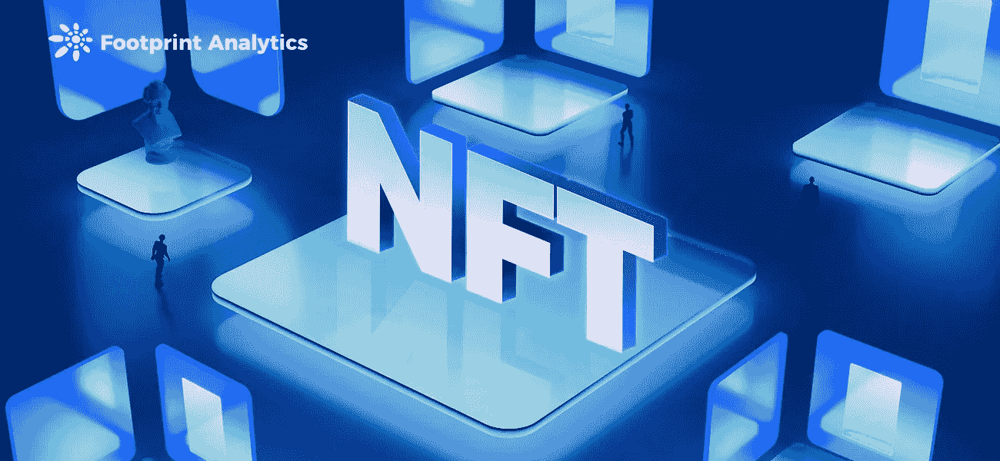
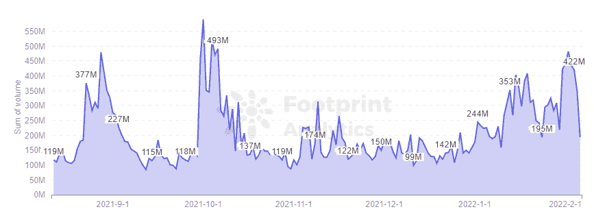
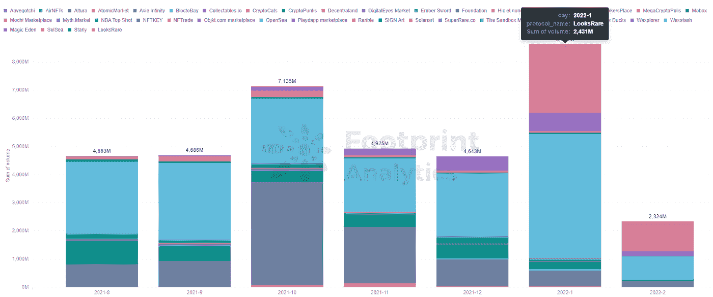
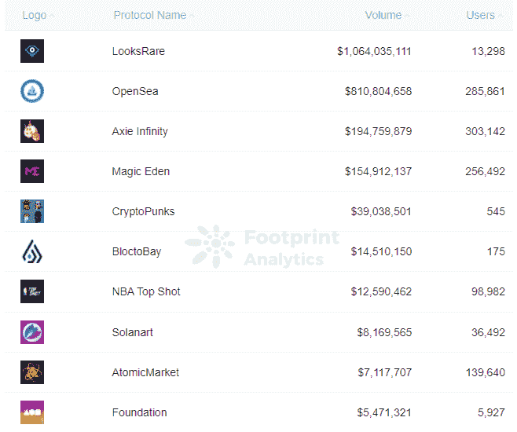
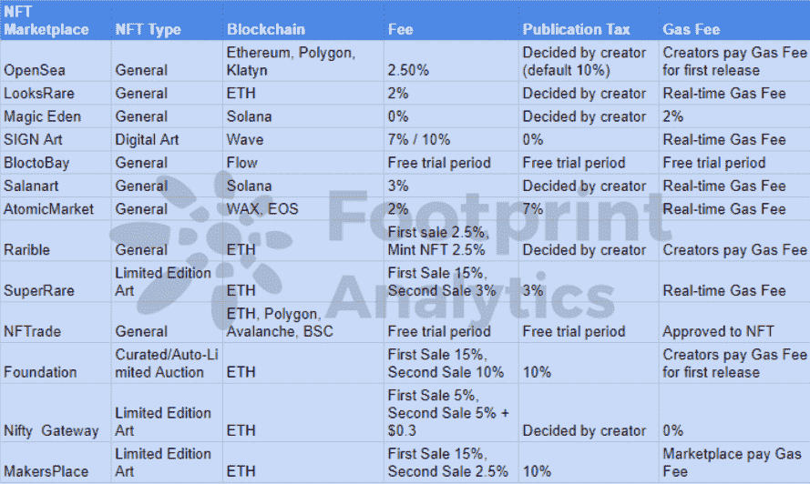

# 如何选择正确的 NFT 市场？

> 原文：<https://medium.com/coinmonks/how-to-choose-the-right-nft-marketplace-982d92822942?source=collection_archive---------64----------------------->

如何从 40 多个 NFT 市场中找到适合你需求的 NFT，这篇文章将帮助你。

数据来源: [NFT 市场仪表板](https://www.footprint.network/guest/dashboard/nft-marketplace-dashboard-fp-97271bbe-5092-4469-b1b6-0e59241023fa?channel=u-DBc983)

无论你左看、右看、下看还是四周看，似乎你会发现一个新的 NFT 市场，声称是当前加密季节的下一个 OpenSea 杀手。

一月份，NFT 所有[市场](https://www.footprint.network/guest/dashboard/nft-marketplace-dashboard-fp-97271bbe-5092-4469-b1b6-0e59241023fa?channel=u-DBc983)的交易额超过了 8 . 62 亿美元，比去年 12 月增长了 85%。根据[足迹分析](https://www.footprint.network/)，主要市场的数量增长到 40 个。

*Footprint Analytics — Daily Volume of NFT Marketplaces*

然后， [LooksRare](https://www.footprint.network/guest/chart/monthly-volume-by-nft-marketplaces-fp-217f7010-54af-4711-b6c2-c48069f1a7c9?channel=u-DBc983) 似乎从天而降，向交易者空投了$LOOKS，并在推出后不到一个月的时间内交易超过了 2.4 亿美元。

*Footprint Analytics — Daily Volume of NFT Marketplaces*

随着 NFT 对更广泛的市场趋势表现出弹性，随着数字收藏品与比特币价格脱钩，这些市场可能会继续激增。

现在是时候为你的 NFT 需求找到合适的 NFT 市场了，这篇文章可以帮助你。

*Footprint Analytics —* [*Top NFT Marketplaces*](https://www.footprint.network/guest/chart/top-nft-marketplaces-by-monthly-volume-fp-da65fead-4247-488c-bbe3-e64b4d598513?channel=u-DBc983) *by Monthly Volume*

# 在 NFT 市场需要考虑的 6 件事

1.  单个项目与多个项目

四个主要市场只支持一个 NFT 项目，即 Axie Infinity、CryptoPunks、NBA Top Shot 和 Mobox。

对这些 NFT 项目感兴趣的人可以直接去这些收费较低的市场。

对于有多个项目的市场，请参见下表。

*Sorted by Footprint Analytics*

注意:如果你没有大笔预算或者是一个初学收藏的人，不要去以太坊上的 NFT 市场，那里的汽油费很高。

2.NFT 市场提供的信息

一个好的 NFT 市场需要为买家提供关于项目的完整信息，如可供购买的 NFT 数量、每个 NFT 的价格，以及更深入的信息，如买卖数量、持有人和历史交易信息。

3.安全性

一个好的 NFT 市场需要有一个高度安全的环境来保护创造者和购买者。比如对一些私人信息进行高级加密，以及要求进行身份验证或为交易提供保险以防止欺诈。

4.高级搜索功能

购买 NFT 时，快速访问可靠、准确的数据非常重要。此外，该平台应该提供更多的可视化数据，让玩家清楚地了解市场上正在发生的事情，并帮助确定哪些非功能性游戏更值得投资。

一个好的 NFT 市场应该提供不同的搜索功能来满足买家的需求，例如特定的名称、类型或创作者。

5.数字钱包的便利

正确的 NFT 市场需要简单易用，无论你在哪里或使用什么设备。

它还应该提供对多个 NFT 钱包以及支付选项的支持，如果你想用你的加密钱包中使用的支付方法购买 NFTs，这是很有帮助的。

6.市场评级

当你决定购买 NFT 时，你可以从别人的评论中更好地了解他们的经历，让你做出明智的决定和你可以期待的。

# 摘要

随着 NFT 继续变得越来越受欢迎，2022 年可能会看到更多优秀平台的涌入。创作者和买家有几十种选择，选择正确的市场可以帮助您找到正确的 NFT，同时获得更高的回报。

**什么是足迹分析**

足迹分析是一个一体化的分析平台，用于可视化区块链数据和发现见解。它清理和整合链上数据，因此任何经验水平的用户都可以快速开始研究令牌，项目和协议。凭借一千多个仪表板模板和一个拖放界面，任何人都可以在几分钟内构建自己的定制图表。发掘区块链数据，利用足迹进行更明智的投资。

*足迹网址:*[*https://www . Footprint . network*](https://www.footprint.network/)

*不和:*[*https://discord.gg/3HYaR6USM7*](https://discord.gg/3HYaR6USM7)

*推特:*[*https://twitter.com/Footprint_DeFi*](https://twitter.com/Footprint_DeFi)

*电报:*[*https://t.me/joinchat/4-ocuURAr2thODFh*](https://t.me/joinchat/4-ocuURAr2thODFh)

*Youtube:*[*https://www.youtube.com/channel/UCKwZbKyuhWveetGhZcNtSTg*](https://www.youtube.com/channel/UCKwZbKyuhWveetGhZcNtSTg)

> 加入 Coinmonks [电报频道](https://t.me/coincodecap)和 [Youtube 频道](https://www.youtube.com/c/coinmonks/videos)了解加密交易和投资

# 另外，阅读

*   [印度的加密交易所](/coinmonks/bitcoin-exchange-in-india-7f1fe79715c9) | [比特币储蓄账户](/coinmonks/bitcoin-savings-account-e65b13f92451)
*   [OKEx vs KuCoin](https://coincodecap.com/okex-kucoin) | [摄氏替代品](https://coincodecap.com/celsius-alternatives) | [如何购买 VeChain](https://coincodecap.com/buy-vechain)
*   [币安期货交易](https://coincodecap.com/binance-futures-trading)|[3 comas vs Mudrex vs eToro](https://coincodecap.com/mudrex-3commas-etoro)
*   [如何购买 Monero](https://coincodecap.com/buy-monero) | [IDEX 评论](https://coincodecap.com/idex-review) | [BitKan 交易机器人](https://coincodecap.com/bitkan-trading-bot)
*   [CoinDCX 评论](/coinmonks/coindcx-review-8444db3621a2) | [加密保证金交易交易所](https://coincodecap.com/crypto-margin-trading-exchanges)
*   [红狗赌场评论](https://coincodecap.com/red-dog-casino-review) | [Swyftx 评论](https://coincodecap.com/swyftx-review) | [CoinGate 评论](https://coincodecap.com/coingate-review)
*   [Bookmap 评论](https://coincodecap.com/bookmap-review-2021-best-trading-software) | [美国 5 大最佳加密交易所](https://coincodecap.com/crypto-exchange-usa)
*   [如何在 FTX 交易所交易期货](https://coincodecap.com/ftx-futures-trading) | [OKEx vs 币安](https://coincodecap.com/okex-vs-binance)
*   [CoinLoan 评论](https://coincodecap.com/coinloan-review) | [YouHodler 评论](/coinmonks/youhodler-4-easy-ways-to-make-money-98969b9689f2) | [BlockFi 评论](https://coincodecap.com/blockfi-review)
*   XT.COM 评论 | [币安评论](https://coincodecap.com/xt-com-review)
*   [SmithBot 评论](https://coincodecap.com/smithbot-review) | [4 款最佳免费开源交易机器人](https://coincodecap.com/free-open-source-trading-bots)