# 简单的方法来索赔和股权 Evmos 空投-一个完整的指南

> 原文：<https://medium.com/coinmonks/how-to-claim-and-stake-evmos-airdrop-complete-guide-d262106d6c30?source=collection_archive---------0----------------------->

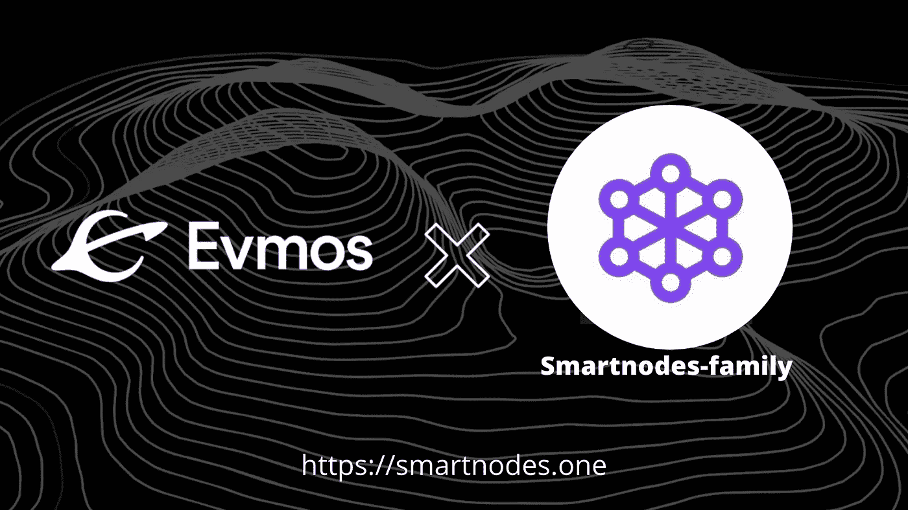

Evmos.org | Smartnodes.one

# **Evmos 简介**

在宇宙生态系统中，Evmos 是[股权](https://smartnodes.one/)的分散证明。它建立在以太坊虚拟机(EVM)上，因此它完全兼容以太坊网络。Evmos 的使命是将基于以太坊的应用和资产引入宇宙生态系统的互操作网络，同时协调开发者和用户的激励措施，并尝试在 EVM 和链间可组合性领域进行创新。

Evmos 是一个基于 Cosmos 的区块链，它使用 Cosmos SDK 和 Tendermint 核心共识来提供快速终结和高吞吐量。开发人员可以在 Tendermint consensus 环境中部署基于以太坊的应用程序，通过使用以太坊的 EVM，这些应用程序具有更低的交易成本、更好的交易速度以及利益相关共识证明的安全性。

# 检查 Evmos airdrop 的资格

*   Keplr + Ledger 现在不行。团队致力于解决问题(本指南不适用于 ledger)
*   原子、OSMO、离子固定器和定桩器。包括 Osmo/Atom Lp、Osmo/Akt Lp、Atom/Akt Lp、Osmo/Ust Lp。
*   Evmos airdrop 的快照日期为**2021 年 11 月 25 日 19:00 UTC(如果您在此日期之前下注或在池中提供流动性，则符合条件)**
*   **按照以下步骤检查您的 Evmos 分配**

第 1 步-转到[https://gotrekt.com/](https://gotrekt.com/)并点击连接钱包。(选择 Keplr 钱包)

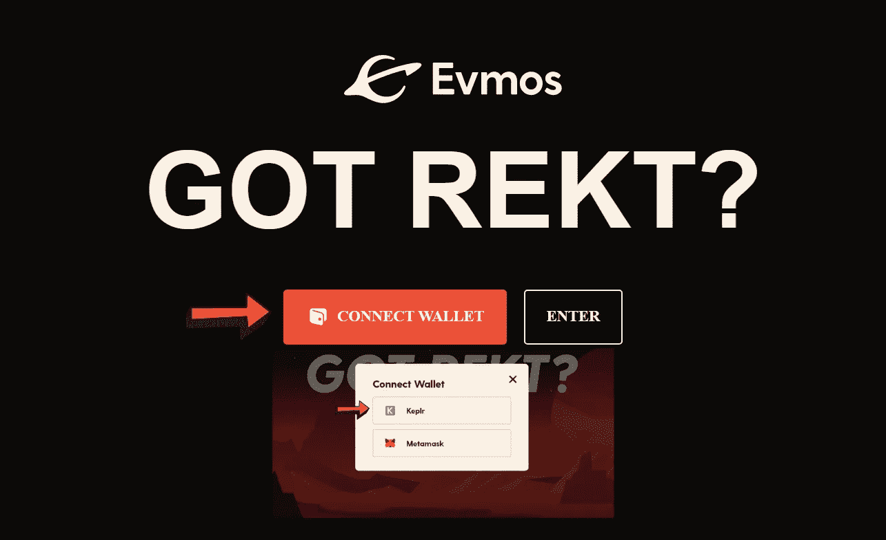

[Evmos | Got Rekt airdrop](https://app.evmos.org/mission-control)

在“我的总结”中查看，如果您看到可申请的令牌总数(如下图所示，我们可以申请 51 个 Evmos 令牌)。

恭喜你有资格参加这次空投。您可以按照步骤来认领您的空投。

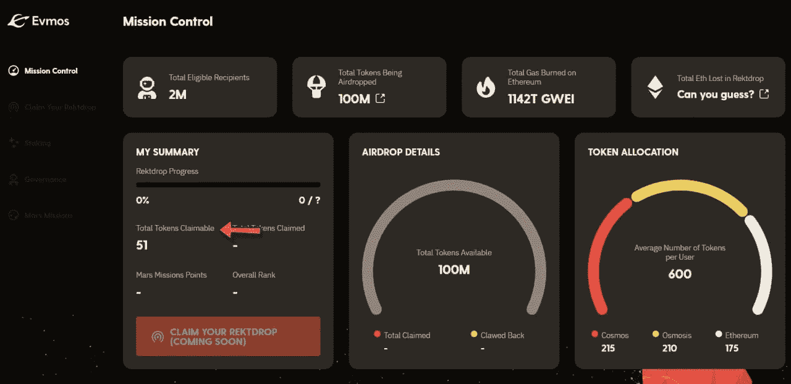

[Evmos airdrop Allocation](https://app.evmos.org/mission-control)

# 如何认领 Evmos REKT 空投？

目前，你只能索赔空投的 75%。看起来他们有一个和渗透作用相似的模型。每次任务你可以得到四分之一的空投物资。

1)从渗透向 E **vmos** 发送一个 IBC 事务(airdrop 的 25%)

2)对治理提案进行投票(空投的 25%)

3)与验证者的股份(空投的 25%)

4) EVM 行动(不清楚这实际上意味着什么)(空投的 25%)

**按照以下步骤申请(Evmos 的前 25%)**

步骤 2-在 Keplr 中添加 Evmos (Beta ),并复制您的 evmos1 地址

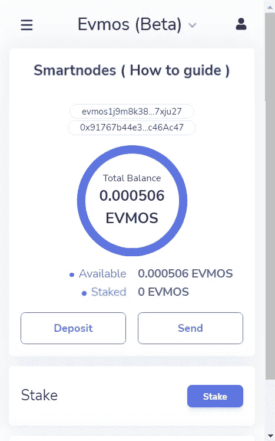

A[dding Evmos Beta](https://chrome.google.com/webstore/detail/keplr/dmkamcknogkgcdfhhbddcghachkejeap?hl=en)

步骤 3-进入设置并启用“显示高级 IBC 传输”

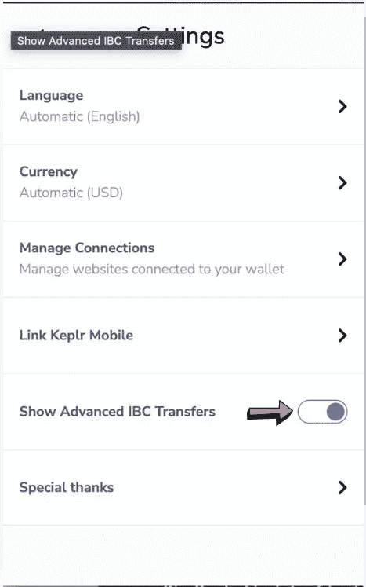

Settings IBC Transfers

第 4 步-开关链到“渗透”的顶部，然后点击“IBC 转移”

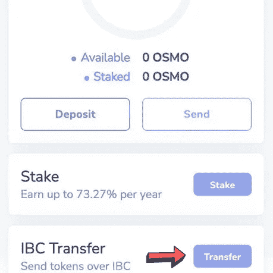

IBC transfers

步骤 5-添加一个新的 IBC 频道。将目的链设置为“Evmos (Beta)”并将通道 ID 设置为“通道-204”。省省吧。

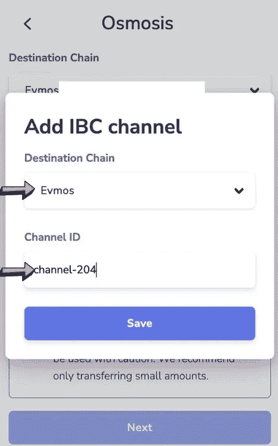

Adding Evmos IBC chain

第 6 步-选择 Evmos 作为“目的地链”,并将第 2 步中的 Evmos 地址粘贴到收件人字段中。

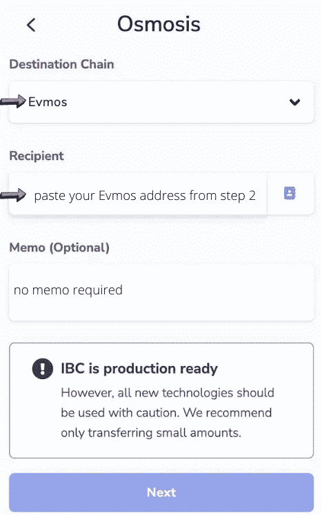

Evmos airdrop

第 7 步-发送少量的$OSMO 令牌，你的$EVMOS 就会出现🎉。

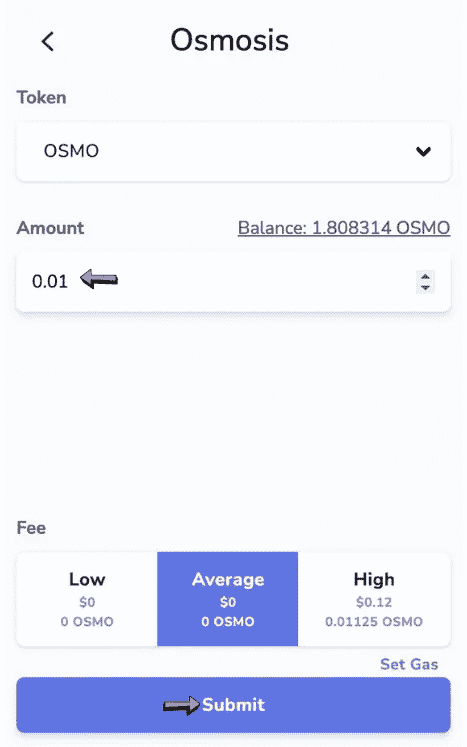

Keplr IBC

恭喜你，你已经获得了你的 Evmos 空投的前 25%!

**按照以下步骤申请(第二笔 25%的 Evmos)**

步骤 1-转到👉[https://evmos . disper ze . network/](https://evmos.disperze.network/)连接你的 keplr 钱包。

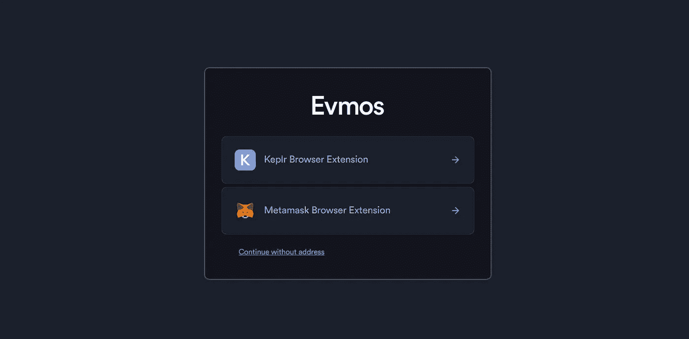

Evmos airdrop

第 2 步-现在点击治理查看可用的提案来投票。

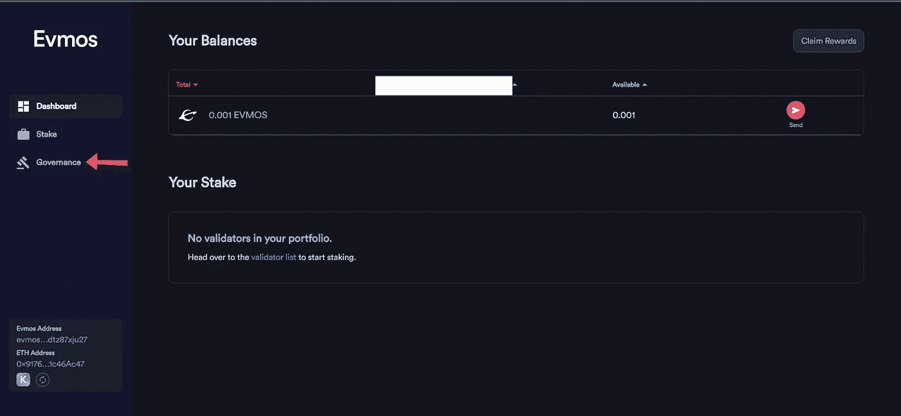

Seeing governance proposals

第 3 步-点击“空投索赔很快”的建议，然后投票。(选择“是”并点击发送，然后在 Keplr 中批准交易)

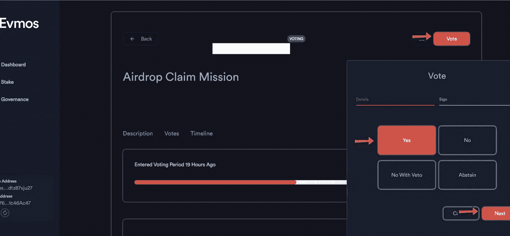

Voting in proposal

第 4 步-批准这项交易投票，恭喜你，你已经要求你的 Evmos 空投的第二个 25%！

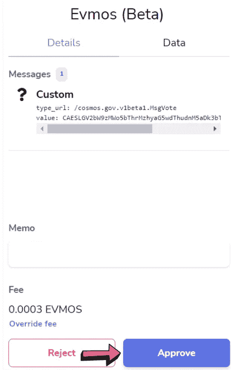

Approving voting transaction

**按照以下步骤申请(Evmos 的第三份 25%股份)**

步骤 1-转到👉[https://evmos . disper ze . network/](https://evmos.disperze.network/)连接你的 Keplr 钱包。前往 stake 并选择您的验证器。

**smart nodes-Family node**[https://evmos . disper ze . network/validators/evmosvaloper 13 nu jml 9 r 2dg 85 nuc FFE 82 q3yg 8 f 35 qxmfal 7 p](https://evmos.disperze.network/validators/evmosvaloper13nujml9r2dg85nucffe82xq3yg8f35qxmfal7p)

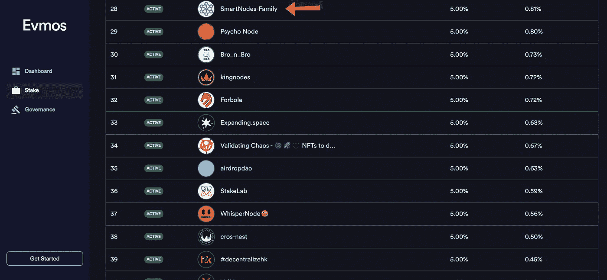

Evmos | Smartnodes.one

第 2 步-点击赌注，并设置金额“多少 Evmos 你想赌注”，最后点击下一步。(注:不要点击最大节省一些汽油费的 Evmos)

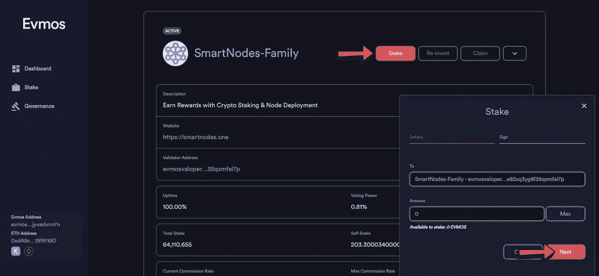

Staking Evmos with Smartnodes-Family

步骤 3-在 Keplr 钱包弹出窗口中批准交易，并等待几秒钟。

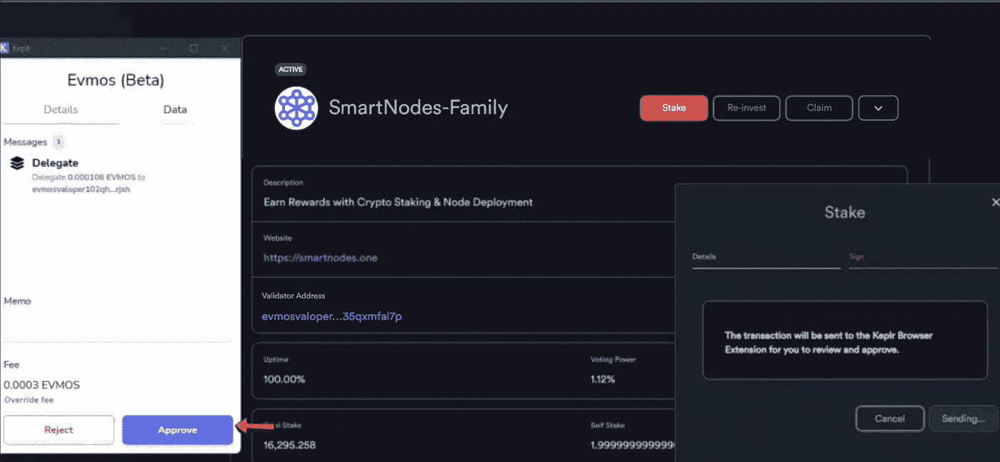

Approving staking transaction in Keplr

第 4 步-您已成功将您的 Evmos 令牌与 [Smartnodes-Family 绑定。](https://evmos.disperze.network/validators/evmosvaloper13nujml9r2dg85nucffe82xq3yg8f35qxmfal7p)

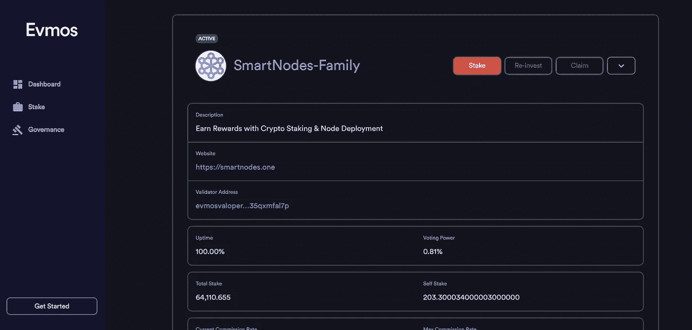

Evmos staked with [smartnodes-Family](https://evmos.disperze.network/validators/evmosvaloper13nujml9r2dg85nucffe82xq3yg8f35qxmfal7p)

**恭喜**，你已经获得了你的 Evmos 空投的前 75%!

# 为什么选择 Smartnodes？

⚛️ *我们在宇宙中非常活跃，尽我们所能提供支持。我们是社区驱动的。*[*smart nodes*](http://smartnodes.one/)*——家族是利益验证者的证明，并积极地对提案进行投票，以帮助确保适当的治理。*

⚛️*[*smart nodes*](https://smartnodes.one/#choose)*所使用的基础设施——家庭只有具备 10 层安全措施的精英才能保护您的资产。**

*⚛️[*smart nodes*](https://smartnodes.one/about)*——家庭验证器提供 100%全额退款斜线和双标志保护。**

*⚛️[***smart nodes***](https://smartnodes.one/#choose)***——家族*** *佣金* *仅为利润的 5%佣金，低于 Cosmos validator 平均 12.5%的水平。您可以访问我们的网站:--*[*smart nodes . one*](https://smartnodes.one/)，轻松计算您的下注奖励*

**

***Socials |**[***Reddit***](https://www.reddit.com/r/smart_nodes/)**|**[***Twitter***](https://twitter.com/nodes_smart)**|**[***网站***](http://smartnodes.one/)**|**[**电报**](https://t.me/smartnodesvalidators) **|***

**

> *交易新手？尝试[加密交易机器人](/coinmonks/crypto-trading-bot-c2ffce8acb2a)或[复制交易](/coinmonks/top-10-crypto-copy-trading-platforms-for-beginners-d0c37c7d698c)*