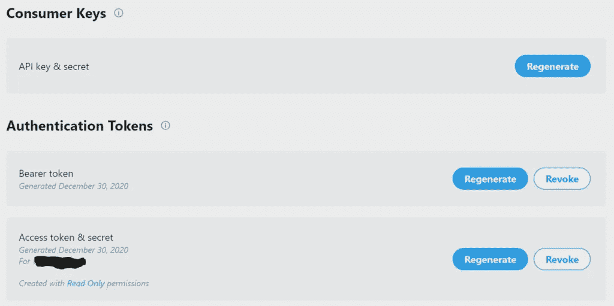

# 当马斯克在推特上发布比特币时，如何编写一个加密货币交易机器人来购买比特币

> 原文：<https://medium.com/coinmonks/how-to-code-a-cryptocurrency-trading-bot-to-buy-bitcoin-when-musk-tweets-about-it-bb11f15e92a0?source=collection_archive---------7----------------------->

# 为什么会有人这么做？

答案很简单——这位特斯拉的技术之王有一段影响加密市场的历史，每当他在推特上发布关于加密市场的消息时，当他拿起手机，开始在推特上表达他对区块链技术的看法时，市场的运动几乎是意料之中的。

通过创建一个加密交易机器人，每当特斯拉老板在推特上发布比特币时，它就会购买比特币，你可以放心，你将在火箭上获得一个 VIP 席位，火箭将飞过月球，直接飞往火星，由于天气寒冷和气候干燥，伊隆在那里度过了大部分夏季。

# 这真的有用吗？

简单的回答是“不确定”——因为之前没有人测试过这个策略。更长的答案可能是——只要我们在谈论比特币。从统计学上来说，不管你是什么时候买的比特币，你都很有可能获利(不包括本文撰写时的历史高点)。

所以，如果没有别的，你至少可以在埃隆的帮助下，为你的 BTC·霍德林战略增添一点趣味。本文不会进行详细的分析来说明这种策略实际上是否有效。这篇文章是关于构建它的乐趣，但它确实是一个强大的提醒，提醒我们有多少资源可以支配，你可以构建任何你能想到的加密交易机器人。

您也将能够看到和使用代码，这样您就可以测试它或改进它。


# 如何设置你的比特币机器人

本文关注的是比特币交易机器人的实际技术构建，以及如何在安全的测试环境中设置它，所以让我们开始吧。

# 您将需要以下资源:

*   MetaTrader5 帐户
*   XBTFX 的模拟账户，这样你可以安全地测试你的策略
*   一个 Twitter 开发账户
*   十二层 API 帐户

# 设置 MetaTrader5 和 XBTFX

顾名思义，MT5 是一个支持多个经纪人以及详细技术分析的平台，使用 MT5 开始您的加密机器人构建之旅的主要原因是因为它与 Python 的轻松集成以及对演示或虚拟帐户的开箱即用支持，以便您可以在安全的演示环境中进行测试。

在前一篇文章中有关于如何安装和配置 MetaTrader5 以及 XBTFX crypto broker 的详细说明，该文章讲述了如何用 python 构建加密交易机器人，因此我们在本文中只简要介绍这些步骤。如果你需要更多关于如何做的信息，以及为什么选择这两个平台，请参考上面的链接文章。

从下载并安装 [MetaTrader5](https://www.metatrader5.com/en/download) 开始，在他们的平台上创建一个账户。接下来你需要的是一个可以进行交易的经纪人——我推荐 [XBTFX](https://my.xbtfx.io/register?xbt=2364) ,因为他们提供了所有与 MT5 终端合作的经纪人中最多的加密对。注册 XBTFX 并创建一个模拟账户。

你现在可以通过 MT5 连接到你的模拟账户，方法是导航到文件>开户，然后搜索 XBTFX。如果您已经使用上面的推荐链接注册，您将需要选择“连接到现有帐户”，否则继续创建一个新帐户。

# 热门 Bot 文章:

> [*1。2021 年聊天机器人趋势报告*](https://chatbotslife.com/chatbot-trends-report-2021-4181eef67dcc)
> 
> [*2。训练聊天机器人 NLP 模型的 4 个注意事项和 3 个不要注意事项*](https://chatbotslife.com/4-dos-and-3-don-ts-for-training-a-chatbot-nlp-model-536f949e21ae)
> 
> [*3。礼宾机器人:从一个聊天屏幕处理多个聊天机器人*](https://chatbotslife.com/concierge-bot-handle-multiple-chatbots-from-one-chat-screen-3321f785b32a)
> 
> [*4。一个专家系统:对话式人工智能 Vs 聊天机器人*](https://chatbotslife.com/an-expert-system-conversational-ai-vs-chatbots-6b7c17c99258)

# 用 Twitter 申请一个开发人员帐户

在使用 Twitter 的 API 或 Tweepy Python 模块之前，您需要一个 Twitter 开发人员帐户。幸运的是，申请过程既快又简单，只要你描述了为什么你需要访问 Twitter API，你就有可能被接受。

原生到 [twitter 的开发平台](https://developer.twitter.com/)，点击导航菜单右上角的应用。


在下一页，点击申请开发者账户，系统会提示您使用 twitter 账户登录。


遵循注册流程，并解释您使用 API 的意图


在您完成所有必要的信息之后，可能需要几个小时到几天的时间才能访问平台。根据我的经验，只有几个小时。

一旦您的开发帐户准备好了，导航到项目和应用程序标签打开项目 1，如果这是不可用的，继续创建一个。在您的项目下，转到密钥和令牌并生成以下内容(确保保存它们，否则您将需要重新生成密钥！):



# 定义 bot 参数

*   每次埃隆在他的推文中提到比特币时，该机器人都会建立比特币的买入头寸
*   止盈设置为 10%，止损设置为 5%
*   如果已经有一个活跃的交易，比特币机器人将不会再进行另一个交易(可以调整)

# 为你的比特币交易机器人编码

# 初步设置

首先，需要使用 PyPi 导入 MetaTrader5 和 Tweepy 模块。

```
pip install tweepy
pip install MetaTrader5
pip install — upgrade MetaTrader5
```

下一步是将这些模块和其他一些模块导入到 Python 解释器中。

```
#Twitter Scraper module
import tweepy
from tweepy import OAuthHandler #dates module
from datetime import datetime, date
from itertools import count
import timeimport re #trading terminal
import MetaTrader5 as mt5
```

我们现在需要存储您使用 Twitter Dev 平台生成的密钥和令牌，以便在 Tweepy 中使用它们。

```
# Store Twitter credentials from dev account
consumer_key = “CONSUMER_KEY”
consumer_secret = “CONSUMER_SECRET”
access_key = “API_KEY”
access_secret = “API_SECRET”# Pass twitter credentials to tweepy via its OAuthHandler
auth = tweepy.OAuthHandler(consumer_key, consumer_secret)
auth.set_access_token(access_key, access_secret)
api = tweepy.API(auth)
```

在初步设置的最后一部分，你需要连接到 MT5 终端，存储你的账户资产，并定义我们将使用的交易工具——在本例中是比特币。我们还将创建一个简短的关键字列表来查询 Elon 的最后一条推文。

```
# connect to the trade account without specifying a password and a server
mt5.initialize()# account number in the top left corner of the MT5 terminal window
# the terminal database password is applied if connection data is set to be remembered
account_number = 555
authorized = mt5.login(account_number)if authorized:
 print(f’connected to account #{account_number}’)
else:
 print(f’failed to connect at account #{account_number}, error code: {mt5.last_error()}’)# store the equity of your account
account_info = mt5.account_info()
if account_info is None:
 raise RuntimeError(‘Could not load the account equity level.’)
else:
 equity = float(account_info[10])
```

现在让我们来定义我们将要放入交易的硬币和我们将要搜索的关键词。

```
#crypto sign and keywords
CRYPTO = ‘BTCUSD’
keywords = [‘Bitcoin’, ‘bitcoin’, ‘BITCOIN’, ‘btc’, ‘BTC’]
```

# 获取埃隆的最新推文

所有的初步工作都完成了，是时候关注这个机器人的酷的部分了。让我们从下面的 **get_elons_tweet()** 函数中所示的 Tweepy 获取 Elon 的最后一条 tweet 开始。

在测试期间，表情符号和其他无效字符会破坏脚本，所以每条推文都被重新格式化，只包含字母数字字符。

```
#Get Technoking’s latest tweet
def get_elons_tweet():
 “””Get Elon’s last tweet by user ID — retry until tweepy returns tweet”””
 tweets = tweepy.Cursor(api.user_timeline,id=”44196397", since=date.today(), tweet_mode=’extended’).items(1)#remove all invalid characters
 elons_last_tweet = [re.sub(‘[^A-Za-z0–9]+’, ‘ ‘, tweet.full_text) for tweet in tweets]#re-try until it returns a value — tweepy API fails to return the tweet sometimes
 while not elons_last_tweet:
 tweets = tweepy.Cursor(api.user_timeline,id=”44196397", since=date.today(), tweet_mode=’extended’).items(1)
 elons_last_tweet = [re.sub(‘[^A-Za-z0–9]+’, ‘ ‘, tweet.full_text) for tweet in tweets]
 return elons_last_tweet[0]
```

# 逻辑检查和准备交易请求

现在我们有了 Elon 的最后一条推文，我们可以开始准备逻辑和函数 **trade()** 中的交易请求。有关交易请求格式的更多信息，请查看 MT 5 文档。

**what_musk_said** 包含最后一条推文，逻辑将检查上面我们的 **keywords** 变量中定义的任何关键字是否出现在 Elon 的推文中。如果这是真的，比特币交易机器人将在比特币上下单购买，并立即执行。如果它是假的，它将简单地返回给我们推文。

```
#buy bitcoin
def trade():
 “””Check if Musk mentioned bitcoin and open a buy position if so”””
 what_musk_said = get_elons_tweet()# used to check if a position has already been placed
 positions = mt5.positions_get(symbol=CRYPTO)
 orders = mt5.orders_get(symbol=CRYPTO)
 symbol_info = mt5.symbol_info(CRYPTO)
 price = mt5.symbol_info_tick(CRYPTO).bid# perform logic check
 if any(keyword in what_musk_said for keyword in keywords):
 print(f’the madlad said it — buying some!’)# prepare the trade request
 if not mt5.initialize():
 raise RuntimeError(f’MT5 initialize() failed with error code {mt5.last_error()}’)# check that there are no open positions or orders
 if len(positions) == 0 and len(orders) < 1:
 if symbol_info is None:
 print(f’{CRYPTO} not found, can not call order_check()’)
 mt5.shutdown()# if the symbol is unavailable in MarketWatch, add it
 if not symbol_info.visible:
 print(f’{CRYPTO} is not visible, trying to switch on’)
 if not mt5.symbol_select(CRYPTO, True):
 print(‘symbol_select({}}) failed, exit’, CRYPTO)#this represents 5% Equity. Minimum order is 0.01 BTC. Increase equity share if retcode = 10014
 lot = float(round(((equity / 5) / price), 2))# define stop loss and take profit
 sl = price — (price * 5) / 100
 tp = price + (price * 10) / 100
 request = {
 ‘action’: mt5.TRADE_ACTION_DEAL,
 ‘symbol’: CRYPTO,
 ‘volume’: lot,
 ‘type’: mt5.ORDER_TYPE_BUY,
 ‘price’: price,
 ‘sl’: sl,
 ‘tp’: tp,
 ‘magic’: 66,
 ‘comment’: ‘python-buy’,
 ‘type_time’: mt5.ORDER_TIME_GTC,
 ‘type_filling’: mt5.ORDER_FILLING_IOC,
 }# send a trading request
 result = mt5.order_send(request)# check the execution result
 print(f’1\. order_send(): by {CRYPTO} {lot} lots at {price}’)if result.retcode != mt5.TRADE_RETCODE_DONE:
 print(f’2\. order_send failed, retcode={result.retcode}’)#print the order result — anything else than retcode=10009 is an error in the trading request.
 print(f’2\. order_send done, {result}’)
 print(f’ opened position with POSITION_TICKET={result.order}’)else:
 print(f’BUY signal detected, but {CRYPTO} has {len(positions)} active trade’)else:
 print(f’He did not say it, he said: {what_musk_said}’)
```

# 把所有的放在一起

我们现在需要决定我们应该多长时间迭代一次下面的代码。默认情况下，它每 5 秒拉取并分析一次 Elon 的最后一条推文，但这可以在下面的 **time.sleep** 函数中进行调整。

```
#execute code every 5 seconds
if __name__ == ‘__main__’:
 print(‘Press Ctrl-C / Ctrl-Q to stop.’)
 for i in count():
 trade()
 print(f’Iteration {i}’)
 time.sleep(5)
```

# 其他资源:

*   [PyPi 安装程序](https://pypi.org/project/pypi-install/)
*   [GitHub 回购](https://github.com/CyberPunkMetalHead/bitcoin-bot-buy-if-elon-tweets)
*   [十二页文档](https://docs.tweepy.org/en/latest/install.html)
*   [MetaTrader5 Python 文档](https://docs.mql4.com/mql5_language/mql5_functions/mql5_common)

这是一个有趣的项目，我希望你喜欢这篇文章。如果你喜欢这篇文章，请跟我来。更多加密机器人项目，请查看我的博客，了解更多用 Python 编写的[加密货币交易机器人](https://www.cryptomaton.org/)

# 支持我

BTC 钱包:bc1q 078 vwjaf 76 jj 7 vnjte 23 ehkksr 09 tnyy 2 njrqg

ETH 钱包:0x4e 07987 e7bd 858695603 B2 cc 0 dcfa 36 B4 BF 540 a 0

# 别忘了给我们你的👏！

> 加入 Coinmonks [电报频道](https://t.me/coincodecap)和 [Youtube 频道](https://www.youtube.com/c/coinmonks/videos)了解加密交易和投资

# 另外，阅读

*   [最佳加密交换平台](https://coincodecap.com/best-crypto-swap-platforms) | [最佳加密交易所](https://coincodecap.com/crypto-exchange)
*   [购买比特币印度](/coinmonks/buy-bitcoin-in-india-feb50ddfef94) | [Pionex 评论](/coinmonks/pionex-review-exchange-with-crypto-trading-bot-1e459d0191ea) | [加密交易机器人](/coinmonks/crypto-trading-bot-c2ffce8acb2a)
*   [n ave 零点回顾](/coinmonks/ngrave-zero-review-c465cf8307fc) | [Phemex 回顾](/coinmonks/phemex-review-4cfba0b49e28) | [PrimeXBT 回顾](/coinmonks/primexbt-review-88e0815be858)
*   最佳[区块链分析](https://bitquery.io/blog/best-blockchain-analysis-tools-and-software)工具| [赚比特币](/coinmonks/earn-bitcoin-6e8bd3c592d9)
*   [Cloudbet 赌场评论](https://coincodecap.com/cloudbet-casino-review) | [点火赌场评论](https://coincodecap.com/ignition-casino-review)
*   [加密套利](/coinmonks/crypto-arbitrage-guide-how-to-make-money-as-a-beginner-62bfe5c868f6)指南| [如何做空比特币](/coinmonks/how-to-short-bitcoin-568a2d0b4ae5)