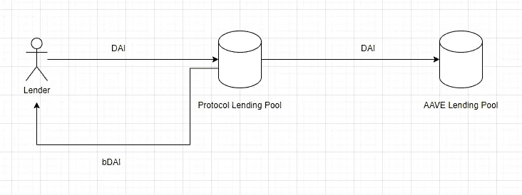
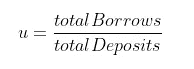
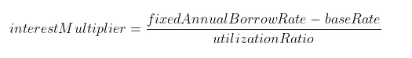
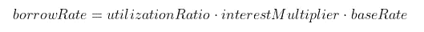
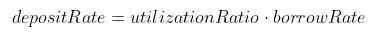
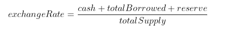

# 如何编写自己的出借协议

> 原文：<https://medium.com/coinmonks/how-to-code-a-lending-protocol-a9b5b021696d?source=collection_archive---------4----------------------->

使用 hardhat、Solidity 和 Typescript 从头开始构建一个分散的借贷协议。


Photo by [Kanchanara](https://unsplash.com/@kanchanara?utm_source=unsplash&utm_medium=referral&utm_content=creditCopyText) on [Unsplash](https://unsplash.com/s/photos/cryptocurrency?utm_source=unsplash&utm_medium=referral&utm_content=creditCopyText)

# **简介**

今天我们将学习如何使用 Solidity、Typescript 和 Openzeppelin 构建自己的借贷协议。

首先，我必须解释清楚我们要构建什么，然后直接进入代码。

第二，该协议仅用于研究目的，它是不可持续的，也不适合生产。

# **贷款协议**

我们要建造的东西很简单。

贷方可以将 DAI 存入协议池，并收到 bDAI 令牌(计息 DAI)作为回报。

随后，该协议在等待借款人或贷款人提款的同时，将 DAI 的金额存入贷款池以赚取利息。



借款人可以将乙醚作为抵押品，并以抵押品价值的 80%借入 DAI。

当借款人的债务价值超过其抵押品价值的 80%时，借款人可以被清算。

> 注:作为抵押品存入的乙醚也存入 AAVE 的贷款池以赚取利息。

该协议还有一个储备金，不时从 AAVE 的贷款池中收取所有利息并存入储备金。

当借款人支付贷款时，储备金也从贷款费中收取所有费用。

关于清算，当发生清算时，使用 Uniswap 将清算的乙醚交换为 DAI，并存入准备金。

# **数学**

现在让我们来谈谈协议背后的数学原理。

我使用的公式是受锚协议和复合金融的启发。

所有的贷款都是由借款利率通过算法决定的。

借款利率根据市场供求(利用率)不断变化。

**利用率**

利用率量化了相对于存款额的借入需求。



**借款利率**

借入率随利用率成比例增加。

最初配置的一些参数值(固定年借款利率和基本利率)。



**存款利率**

存款利率也成比例地提高利用率。



该指示器使得速率基于协议使用而变化。当协议的利用率较低时，它会降低存/借款利率，以吸引更多的借款人而不是储户。

当协议使用率较高时，它会提高借款/存款利率，以吸引存款并赶走借款人。

**bDAI**

随着利息的增加，每个 bDAI 都可以转换成数量不断增加的 DAI，bDAI 和 DAI 之间的汇率使用以下公式计算:



# 入门指南

让我们直接跳到代码，如果你不熟悉 hardhat，我推荐你阅读它的文档。

**要求**

*   饭桶
*   节点。射流研究…
*   以打字打的文件
*   NPM

获得一切的最快方法就是做以下事情:

```
git clone [https://github.com/AlexRamos93/solidity-defi](https://github.com/AlexRamos93/solidity-defi)
cd solidity-defi
npm install
```

在`contract`文件夹中，打开名为`BondToken.sol`的文件，看起来应该像下面的代码。

我不会遍历整个代码，但我会突出显示关键部分，以帮助您理解发生了什么。

正如你所看到的，我们有一些接口，让我来解释一下。

*   ***ILendingPool*** :是我们需要交互的 Aave 借贷合同，以便发送保证金和抵押品。

*   *****iswarouter***:是用于交换令牌的 Uniswap 契约，当我们需要将封装好的 eth 交换成 DAI 时。**
*   *****aggregator v3 interface***:chain link data feed contract，我们需要从现实世界获取以太市场价格。**

**在第 **47** 行，我们用几个继承实例化了我们的契约。**

*   *****ERC20 burnable***:open zeppelin 实现了一个具有 burn 功能的 ERC 20 契约。**
*   ***:门禁合同***
*   ******Math*** :帮助我们做计算的合同。***

***如您所见，我们有几个合同变量，我不会一一列举，它们非常简单。***

***然后我们实例化我们将需要调用的外部契约。***

***现在来说说一些重要的功能。***

***这些功能为贷方提供存款和取款服务。***

***为了使`bondAsset`功能起作用，首先贷方需要批准相同数量的 DAI，以便合同能够使用该 DAI。***

***合同得到 DAI 后，增加`totalDeposit`金额并发送到 ave 借贷池，之后得到`msg.sender`的`exchangeRate`和 mint bDAI。***

***`unbondAsset`函数也很简单，它的作用是将用户要提取的戴的`_amount`乘以当前的`exchangeRate`，之后，将`totalDeposit`减 1，将`bDAI`中的金额刻录下来，然后从 Aave 中提取并发送给用户。***

***合同中的其他关键功能是，`addCollateral`和`removeCollateral`。***

***`addCollateral`没有什么特别的，是一个能够从`msg`接收乙醚的`payable`函数，它将乙醚的量加到`usersCollateral`上，并将该量发送给 Aave 协议。***

> ***注意:契约不能只是将以太发送给 Aave，首先调用 WETHGateway 来包装以太，然后存放在 Aave 的池中。***

***在`removeCollateral`函数中，正如你所看到的，这可能有点棘手。***

***首先，从 oracle (Chainlink)获取乙醚的市场价格。然后映射用户的抵押品和借款金额，并检查是否还有剩余金额需要删除。***

***如果删除金额低于剩余金额，合同将删除该担保金额，并将其发送回用户。***

> ***注意:同样，由于 Aave 不能处理本地以太网，我们需要使用 WETHGateway 来打开以太网并将其发送回去。***

***最后但同样重要的是，`borrow`、`repay`和`liquidation`功能。***

***`borrow`函数非常简单，只是检查 msg.sender 是否有足够的抵押品，然后从 Aave 中删除 DAI 并发送给借款者。***

***为了使`repay`工作，调用者需要批准它想要偿还的 DAI 的数量。之后，合同计算借款费用。***

***借款费用归`reserve`所有，其余归存款所有。***

***`liquidation`函数不同于其他函数，只能由合同所有者调用。***

***清算功能所做的基本上是检查贷款价值是否高于抵押品的 80%(以美元计)。如果这是真的，抵押品(乙醚)被交换到戴，如果戴的数额高于贷款，额外的数额被送往储备，其余的回到存款。***

*****结论*****

***这是如何编写自己的贷款池代码的简要介绍。***

***其余的代码可以在 github 上的这个库中找到。***

***就像 a 之前说的，这个合同不适合生产，有很多需要改进的地方。***

***你不会在这个存储库上找到单元/集成测试，我还在学习如何模拟外部契约，但是如果你知道关于这个主题的任何好的资源或教程，请在评论中留下。***

# ***参考***

*   ***[https://docs.anchorprotocol.com/protocol/money-market](https://docs.anchorprotocol.com/protocol/money-market)***
*   ***[https://compound.finance/docs/ctokens](https://compound.finance/docs/ctokens)***
*   ***[https://docs . aave . com/developers/get-started/v3-overview](https://docs.aave.com/developers/getting-started/v3-overview)***