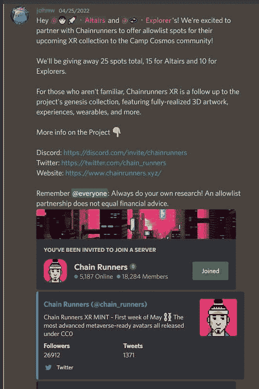
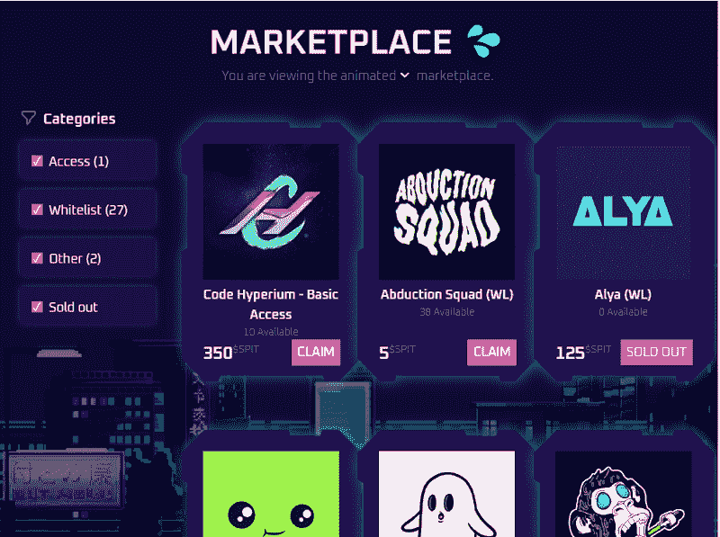

# 如何协作？最佳 NFT 产品推广技巧

> 原文：<https://medium.com/coinmonks/how-to-collaborate-the-best-nft-product-promotion-technique-bb284160336d?source=collection_archive---------2----------------------->

web 3-项目正在快速普及。最流行的 Web3 技术之一是 NFT 或不可替代令牌。它是由存储在区块链中的数据组成的数字资产。NFT 的所有权记录在区块链，可以由所有者转让，允许 NFT 出售和交易。创作者把几个 NFT 统一成一个主题，这样的一套 NFT 就是一个集合。每天都有面向创造者和持有者的新 NFT 系列和工具推出——它们都需要在它们的造币(销售)日期之前以某种方式向世界展示自己。此时，协作的需求就出现了。

协作在整个项目生命周期中都是必不可少的，尤其是在售前阶段。后薄荷 collabs(在薄荷日期之后)的目标是为两个项目的持有者增加价值，例如，通过共享技术片段，而不一定向新人推广它们。

两个项目之间进行预售合作，以扩大他们的社区，提高对新收藏的兴趣，并收集愿意购买的收藏家的访问列表。组织售前协作有两种主要方式，让我们分别介绍一下这两种方式。

**经典合作**在两个系列之间进行，由一个系列(通常是新系列)组织，并在另一个系列(通常是更受欢迎的系列)的 Discord 或 Twitter 频道上进行。

在这样的合作中，你通常通过完成几个条件(加入一个不和谐频道，对帖子做出反应，等等)而获得赢得 WL 奖的机会。).获胜者是使用机器人随机确定的，例如，Discord 中的赠品机器人或 Twitter 上的 Twitter Picker。

合作经常在不和谐的情况下进行，在 Twitter 上不太常见。在 Discord 网站上，通常会有 50-100 个 WL 的免费广告位和 5-10 个 WL 的推特广告位。这样做的原因是你能接触到的受众。在 Discord 上你只与可靠的服务器合作，所以观众更多的参与，他们有相关的经验和他们收藏的令牌。但是，这种受众仅限于服务器的成员。在 Twitter 上，受众要广泛得多(仅受 Twitter 用户数量的限制)，你可以分享推文，获得越来越多的接触，但这些人的参与度较低。

如何衡量你们合作的成功？接触到的人越多，您的 WL 和社区中的新成员注册越多，合作就越有效。当与你合作的藏品的持有者拥有更受欢迎的藏品时，完美的合作就发生了。那么你知道你有很大的机会接触到蓝筹股持有者。

**白名单市场** —这是一种替代的合作方式，其中没有随机举行的赠品，收集者获得他们的 WL 运动保证，获得一定数量的市场主机项目的本地令牌。比方说，你有一些$SPIT，一个 Llamaverse 代币。你可以进入他们的市场(前提是你持有一个 Llamaverse Genesis NFT 作为访问权限)，找到一个你感兴趣的收藏，并以$SPIT 的价格购买他们的 WL。

在托管 WL 市场的项目中，持有人通常会获得激励，以持有他们拥有的 NFT，这导致 NFT 上市数量减少，价格上涨。这就是为什么收藏有市场是好事，这样他们就可以在那里获得新的项目。

以下是一些白名单市场的例子:

[isoroom](https://isoroom.io/)

[llamaverse](https://www.llamaverse.io/rewards)

[satoshirunners](https://ecosystem.satoshirunners.io/satoshi-marketplace)

[经济图表-冒险](https://reconrams-adventure.io/)

[thehabibiz](https://www.thehabibiz.net/)

[chillbear](https://marketplace.chillbear.club/)

[cetsoncreck](https://bleckmarket.cetsoncreck.com/)

# 如何组织 collabs？

基本上，要进行合作，你需要做的就是与创始人或合作经理建立联系。有时流行的项目甚至有一个 collab 请求表单需要填写。如果你的项目是新的、未知的，那么与一些蓝筹公司合作将会非常困难。此外，发送几十个甚至几百个 collab 请求非常耗时。最好是雇一个协作经理，这样就不用在上面花几天时间了。你会从合作中获得更好的结果。

协作经理是负责在 web3 空间中建立这种连接的人。主要职责是组织协作——寻找最好的藏品，与它们的创始人谈判，并确保所有获奖者在造币时都得到照顾。所以是公关加上一些脚踏实地的工作，也就是说一个完美的 collab 经理应该是持有人熟知的，同时又是负责任的，有组织的。

通常，为了让 WL 参与这种合作，收藏者需要满足一些条件:加入 Discord 频道，关注该项目的 Twitter 账户，有时还会邀请其他人。合作条件的实现必须由某人来控制。这些活动通常也属于协作经理的权限范围。你经常会发现自己同时有几十个合作项目在进行，有成千上万的收藏者参与其中——管理者必须控制所有的事情。当管理如此多的数据变得困难时，最好使用 WL 建筑服务来创建协作。此类服务将自动检查所有需求，收集分析并跟踪所有参与者。可以避免大量的手工操作。你所需要做的就是创建你的合作页面，并在你和你的伴侣的不和谐中传播一个链接。

以下是其中的一些工具:

[Letsmint](https://letsmint.io/)

[第一时间](https://www.premint.xyz/)

[领奖台](https://www.podiumnft.com/)

# 哪里可以找到协作经理？

即使您使用工具来自动化大部分过程，您仍然需要人来协商合作。这些人是合作经理。那么如何雇佣这样的人呢？就像在任何其他领域一样，协作经理并不同样有效。外面有很多廉价的工人。这些专家擅长最平凡的工作——向他们能够找到的所有项目发送数百份合作请求，然后确保获奖者获得 WL 奖。廉价经理在 web3 领域人脉不广，所以不要指望与过度炒作的项目合作。此外，他们可能不是很负责，可能只是没有看到所有的交易，或者只是中途消失。如果你需要做初步的市场调查、试水或接触尽可能多的收藏品，就雇佣他们。

如果你想拥有最好的 collab 经理，并且你准备在这上面花些钱，那就寻找你喜欢的流行或成功的产品。成功的收藏通常都有一个人脉很广的 collab 经理，所以这个人可能会帮你打开很多门。这样的人也可以评估项目的潜力，并选择最佳的营销方式。不要犹豫，联系你感兴趣的人——当项目已经过了积极营销阶段，合作经理通常可以接下一个项目。

如果你不准备花钱买最好的，你可以在 NFT 求职网站上寻找最合适的。以下是它们的候选列表(有些需要令牌的所有权):

[Rootroop.com](https://jobs.rootroop.com/)

[Cryptojobslist.com](https://cryptojobslist.com/nft)

[Web3.career](https://web3.career/nft-jobs)

[Niftyjobs](https://www.niftyjobs.com/)

合作对于营销系列和工具至关重要。NFT 空间的项目已经饱和，因此依靠知名的名字更容易在市场上为人所知。所以你们合作的质量比数量更重要。找到好的合作经理，合作的目标是著名的收藏，祝你好运！

> 加入 Coinmonks [电报频道](https://t.me/coincodecap)和 [Youtube 频道](https://www.youtube.com/c/coinmonks/videos)了解加密交易和投资

# 另外，阅读

*   [网格交易机器人](https://coincodecap.com/grid-trading) | [Cryptohopper 审查](/coinmonks/cryptohopper-review-a388ff5bae88) | [Bexplus 审查](https://coincodecap.com/bexplus-review)
*   [7 个最佳零费用加密交易平台](https://coincodecap.com/zero-fee-crypto-exchanges)
*   [氹欞侊贸易评论](https://coincodecap.com/anny-trade-review) | [火币保证金交易](/coinmonks/huobi-margin-trading-b3b06cdc1519)
*   [分散交易所](https://coincodecap.com/what-are-decentralized-exchanges) | [比特 FIP](https://coincodecap.com/bitbns-fip) | [Pionex 评论](https://coincodecap.com/pionex-review-exchange-with-crypto-trading-bot)
*   [用信用卡购买密码的 10 个最佳地点](https://coincodecap.com/buy-crypto-with-credit-card)
*   [最好的卡达诺钱包](https://coincodecap.com/best-cardano-wallets) | [冰棒副本交易](https://coincodecap.com/bingbon-copy-trading)