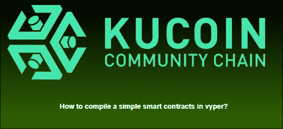
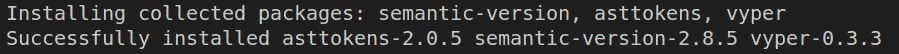
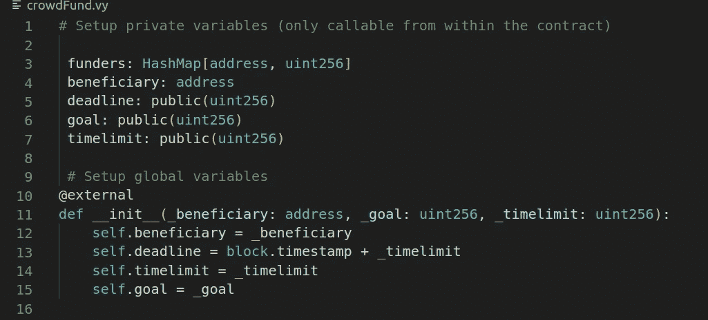
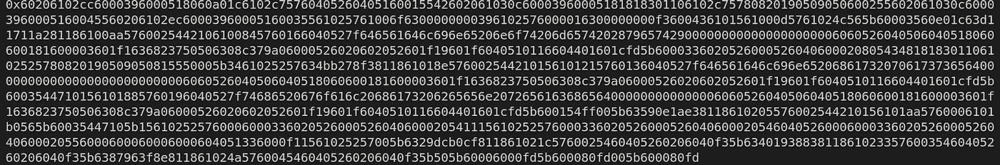

# 如何在 vyper 中编译一个简单的智能合同？

> 原文：<https://medium.com/coinmonks/how-to-compile-a-simple-smart-contracts-in-vyper-60972d364815?source=collection_archive---------28----------------------->



**什么是 Vyper？**

从官网上借鉴定义，

" Vyper 是一种面向契约的 pythonic 编程语言，目标是以太坊虚拟机(EVM)"

这意味着 vyper 是智能契约编程语言领域中的 python 等价物。vyper 是一种类似于 python 的简单易学的语言，所以让我们开始深入学习吧！

**先决条件:**

*   Python3

**第一步:安装 vyper**

您可以通过执行以下命令轻松安装 vyper:

```
python -m pip install vyper
```

如果安装成功，您应该会看到如下消息



**第二步:创建您的第一份 vyper 智能合同**

首先，您需要创建一个新的带扩展名的空文件。小牛肉酵母

为了展示的目的，我们决定使用一个例子 vyper 合同中发现的官方网站命名为群众基金。你可以复制并粘贴到你的新的 vy 文件中。点击[此处](https://vyper.readthedocs.io/en/latest/vyper-by-example.html#crowdfund)为代码。



**第三步:编译你的 vyper 智能合同**

您可以通过执行以下命令来编译 vyper 智能合约

```
python3 -m vyper crowdFund.vy
```



编译完成后，您应该会看到显示一些字节代码。该字节代码可用于部署在 KCC 网络上。

**事后想法**

在这篇短文中，您已经学习了如何安装 vyper，并在 vyper 中编译了一个简单的智能契约。在未来的教程中，您将学习如何在 KCC 测试网上使用 python web3 部署 bytes 代码。下次见！

不要忘记检查 KCC 更多可怕的加密项目。

社交网络
不和:[https://discord.gg/H5ucJydSyd](https://discord.gg/H5ucJydSyd)推特:[https://twitter.com/KCCOfficialTW](https://twitter.com/KCCOfficialTW)电报:[https://t.me/KCCOfficialEnglishCommunity](https://t.me/KCCOfficialEnglishCommunity)电报频道:[https://t.me/KCCOfficialChannel](https://t.me/KCCOfficialChannel)

> 加入 Coinmonks [电报频道](https://t.me/coincodecap)和 [Youtube 频道](https://www.youtube.com/c/coinmonks/videos)了解加密交易和投资

# 另外，阅读

*   [如何在 FTX 交易所交易期货](https://coincodecap.com/ftx-futures-trading) | [OKEx vs 币安](https://coincodecap.com/okex-vs-binance)
*   [CoinLoan 评论](https://coincodecap.com/coinloan-review) | [YouHodler 评论](/coinmonks/youhodler-4-easy-ways-to-make-money-98969b9689f2) | [BlockFi 评论](https://coincodecap.com/blockfi-review)
*   [XT.COM 评论](https://coincodecap.com/profittradingapp-for-binance) | [币安评论](https://coincodecap.com/xt-com-review)
*   [SmithBot 评论](https://coincodecap.com/smithbot-review) | [4 款最佳免费开源交易机器人](https://coincodecap.com/free-open-source-trading-bots)
*   [比特币基地僵尸工具](/coinmonks/coinbase-bots-ac6359e897f3) | [AscendEX 审查](/coinmonks/ascendex-review-53e829cf75fa) | [OKEx 交易僵尸工具](/coinmonks/okex-trading-bots-234920f61e60)
*   [如何在印度购买比特币？](/coinmonks/buy-bitcoin-in-india-feb50ddfef94) | [瓦济克斯评论](/coinmonks/wazirx-review-5c811b074f5b)