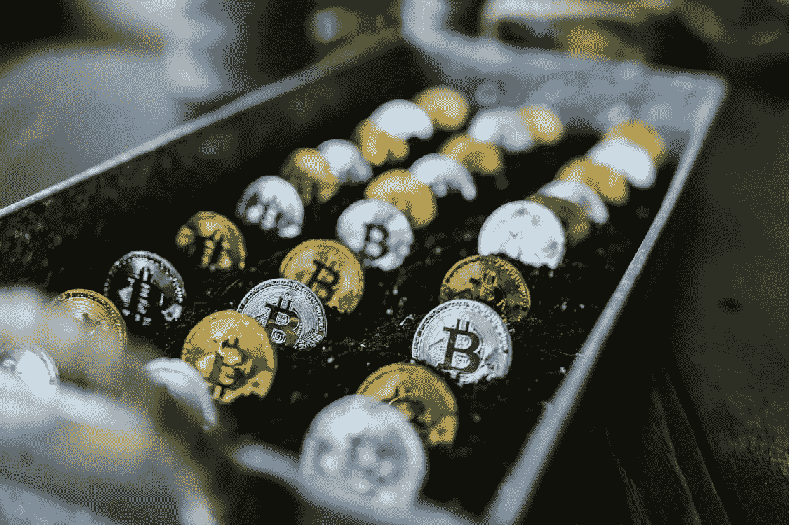

# 如何构建一个巨大的收益加密组合

> 原文：<https://medium.com/coinmonks/how-to-construct-a-great-crypto-portfolio-for-massive-gains-b59ebe8d1e7d?source=collection_archive---------41----------------------->

你听过多少次“买 X 币，要上月球了！”只为你花光所有的钱，看到 X 币价值归零。你的投资组合里都是这样的硬币吗？别担心，让我们来看看专业投资者是如何构建自己的加密投资组合的。

在来自 CryptosRUs*的 George 的帮助下，我们收集了获得巨大收益所需的所有工具

1.  不要追逐利益！

*   如果你刚好持有一定数量的比特币，看到以太坊开始升值，不要卖掉你的比特币，错过更多的以太坊收益。你可能刚刚买了以太坊的顶部，让自己面临错过比特币上涨的风险。这种因害怕错过而购买项目的概念被称为“FOMO”。当你买了一个好的加密资产，坚持这个项目！

**2。不要恐慌性抛售！**

*   当你持有加密资产时，一旦你看到价格像石头一样下跌，不要卖出。有可能价格会回升，比你卖出的价格更值钱，最终导致你以更高的价格回购。鲸鱼喜欢玩鲸鱼式的游戏，吓唬你我这样的散户。

**3。在别人恐惧的时候贪婪！**

*   我们这一代最伟大的投资者之一沃伦·巴菲特建议，当别人都在抛售时，当别人都害怕买入时，要贪婪！当街上有血的时候买，即使是你自己的血！这意味着在加密资产大幅下跌时买入它们。你会经常听到“只买蘸酱！”关于这些事件。

**4。遵循 50/25/25 法则。**

买 50%比特币，25%大盘股，25%小盘股。让我们解释一下为什么这个策略有效

*   50%的比特币——比特币太大了，不能错过。把比特币想象成字面上的数字黄金。比特币涉及的散户和机构投资者最多。比特币是人类创造的最大价值储存手段，承载着加密市场。许多投资者预测比特币有一天会达到 100 万美元。考虑到这一点，拥有足够的比特币对你的投资组合至关重要。
*   25%的大盘股——前 10-20 个项目应该占你投资组合的 25%。应该高度考虑以太坊、BNB、波尔卡多特、卡尔达诺、XRP、特拉、雪崩、Crypto.com、Chainlink 和 Matic 等大型品牌。
*   25%的小盘股——你投资组合的最后 25%应该由任何具有巨大潜力的股票组成。你的普通迷因硬币在这里没有太多的空间，真的不应该被考虑。相反，寻找有伟大目标和领导者的项目。就个人而言，兑换硬币是一个很好的选择。交换硬币，如 FTX，和 KuCoin 令牌很适合这一类。最后 25%的候选项目应该包括元宇宙、NFTs 和游戏项目。

无论你选择什么样的资产，你自己都必须能够看到其中的潜力。不要靠口口相传。对项目和团队做自己的研究。沃伦·巴菲特曾经说过“如果你对持有一只股票 10 年感到不舒服，你就不应该持有它 10 分钟”。这也适用于加密资产。

就像有许多方法来剥一只猫的皮一样，也有许多其他方法来构建一个加密组合。通过多年的研究和犯错误，这最终成为在加密中获得巨大收益的最佳指南之一。

免责声明:本指南不是财务建议。请自行研究。

克罗波斯鲁斯，乔治，导演。*了解如何构建您的 2021 年加密组合*。YouTube ，YouTube，2021 年 9 月 24 日，[https://www.youtube.com/watch?v=atD3ik7fnI8.](https://www.youtube.com/watch?v=atD3ik7fnI8.)2022 年 3 月 12 日访问。

> *加入 Coinmonks* [*电报频道*](https://t.me/coincodecap) *和* [*Youtube 频道*](https://www.youtube.com/c/coinmonks/videos) *了解加密交易和投资*

# 另外，阅读

*   [Bookmap 点评](https://coincodecap.com/bookmap-review-2021-best-trading-software) | [美国 5 大最佳加密交易所](https://coincodecap.com/crypto-exchange-usa)
*   最佳加密[硬件钱包](/coinmonks/hardware-wallets-dfa1211730c6) | [Bitbns 评论](/coinmonks/bitbns-review-38256a07e161)
*   [新加坡十大最佳加密交易所](https://coincodecap.com/crypto-exchange-in-singapore) | [购买 AXS](https://coincodecap.com/buy-axs-token)
*   [红狗赌场评论](https://coincodecap.com/red-dog-casino-review) | [Swyftx 评论](https://coincodecap.com/swyftx-review) | [CoinGate 评论](https://coincodecap.com/coingate-review)
*   [投资印度的最佳密码](https://coincodecap.com/best-crypto-to-invest-in-india-in-2021)|[WazirX P2P](https://coincodecap.com/wazirx-p2p)|[Hi Dollar Review](https://coincodecap.com/hi-dollar-review)