# 如何将多边形 Matic 转换为多边形 ETH (WETH)

> 原文：<https://medium.com/coinmonks/how-to-convert-polygon-matic-into-polygon-eth-weth-f9e74aa76c4e?source=collection_archive---------1----------------------->

## 包装 ETH (WETH)的逐步终极指南

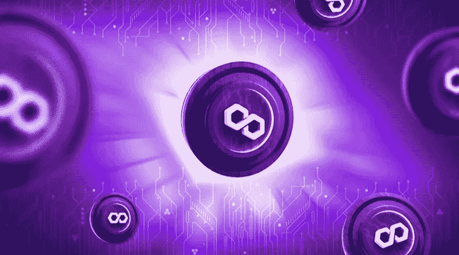

Polygon

今天，我们将讨论什么是包装以太坊(WETH) &如何将包装以太坊(WETH)转换成 Matic。

但首先，让我们从一些基本概念开始:

# 阿尔特科恩

Altcoin 是指除比特币以外的任何类型的**加密货币**。**以太坊**是最受欢迎的**阿尔特币**，人们在谈论更广泛的区块链网络时用全称(以太坊)但以太(ETH)讨论货币本身。

# 乙醚(ETH)？

**ETH** 是数字化、全球化的货币。它是**以太坊**应用的货币。ETH 是一种**加密货币**。这是一种稀缺的数字货币，你可以在互联网上使用——类似于比特币。ETH 是以太坊的命脉。当您发送 ETH 或使用以太坊应用程序时，您将在 ETH 中支付少量费用来使用以太坊网络。

# ERC-20 标准

ERC-20 是在 ETH 发布后开发的标准，它定义了如何传输令牌以及如何在以太坊网络中的令牌之间保持这些传输的一致记录。

# 什么是包裹代币？

当我们谈论包装代币时，我们指的是在区块链 T21 托管的货币，其价格与其基础资产相同。这些基础资产不一定在区块链联邦理工学院。因此，**包装令牌**允许它们和其他数字资产之间的互操作性。

有不同种类的包装代币。例如，想想包装好的比特币——它的价值与 BTC 相同。一份智能合约为包装好的比特币实时复制一个 BTC 的价格。因此，你总是可以以 1:1 的比例用比特币交易包装好的 BTC。

有不同种类的包裹代币，包裹以太坊绝对是最受欢迎的一种。但这是什么呢？

# 包裹以太坊

包裹以太坊——也叫**WETH**——是代表**以太**的代币，来自以太坊网络的原始加密货币。我们是乙醚与 **ERC-20** 标准的兼容版本。

创建 wet 的原因是互操作性。你需要**包裹的**以太坊来交易 **ETH** 换其他 **ERC-20** 代币。

最初，没有第三方，乙醚不能直接与 ERC-20 标准进行交易。如果以太坊网络上创建的所有令牌使用相同的标准，这些令牌将很容易交易，并可以立即与使用 ERC-20 标准的 Dapps 一起工作。

总而言之,“包装”以太坊的要点是允许**去中心化**的金融活动，而无需求助于第三方，以及更好的互操作性。

# 包裹以太坊是如何工作的？

**包裹令牌**要求监护人持有抵押品。比如，如果你想包装以太坊，保管人会拿着你的以太，给你包装好的以太坊作为回报。保管人可以是商家、多签名钱包，或者只是智能合约。你把你的抵押品送给保管人，一枚包装好的硬币就铸造出来了。例如，有了包裹以太坊，你可以简单地去 Uniswap 这样的 DEX，把你的以太换成包裹以太坊。原始以太转换为包装以太币，但价值保持不变，类似于与美元挂钩的稳定硬币的工作方式。

在以太坊区块链上，需要包装的以太坊在分散应用程序上的令牌之间交换。例如，一些分散的应用程序不能与以太一起工作，而只能与 wet 一起工作。虽然需要乙醚来支付汽油费，但我们有一个 **ERC20-token** ，可以在 **DeFi** 应用程序中与其他 ERC-20 token 进行交换。其他区块链可能有他们自己版本的 WETH，从而在他们的区块链上创造了以太的镜像。

# 将多边形 Matic 转换为多边形 ETH (WETH)的分步指南

在这个分步指南中，我们将介绍如何将 WETH 转换成 Matic。我们将在苏珊的帮助下做这件事。

所以我们要去 [Sushiswap](https://www.sushi.com/) 。

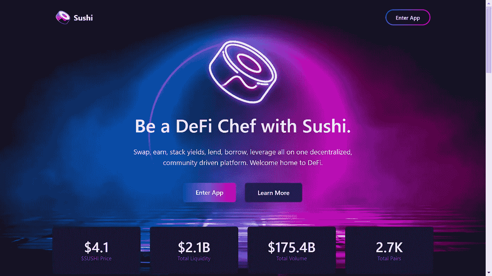

Sushiswap

在这里，您可以看到**交换**有不同的选项。

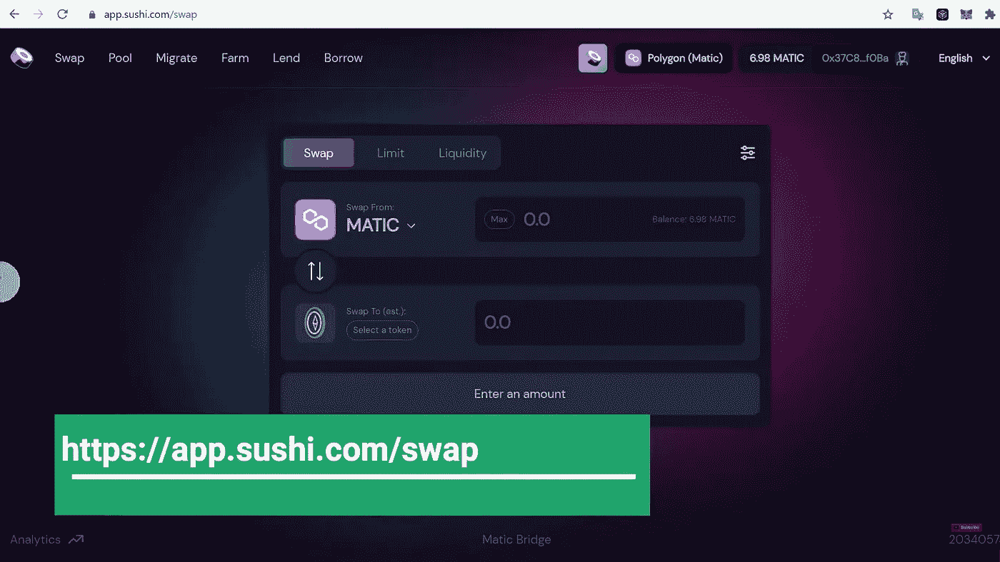

Sushi swap App

首先，您需要将元掩码与 Matic mainnet 连接起来，您需要在多边形网络上包装 eth (WETH)。

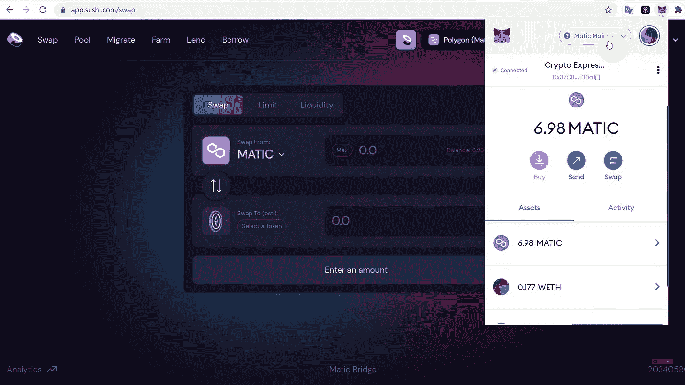

Connect Metamask

现在你去[**sushi.com**](https://app.sushi.com/en/swap)然后**选择令牌**选项，因为你想把它转换成 Matic。

现在选择 **WETH** token。

您可以从**公共底座**中选择，也可以从**列表**中选择。

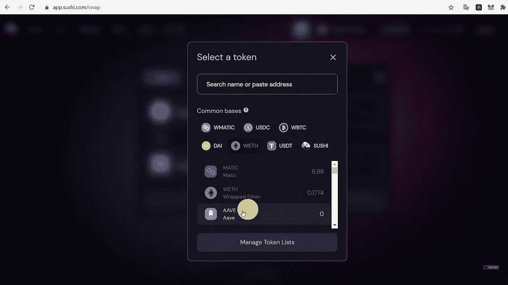

Select a Token

然后在选择了 **WETH** token 之后，你需要输入你想要兑换的金额。例如，让我们通过输入 0.005 WETH 来尝试一下。

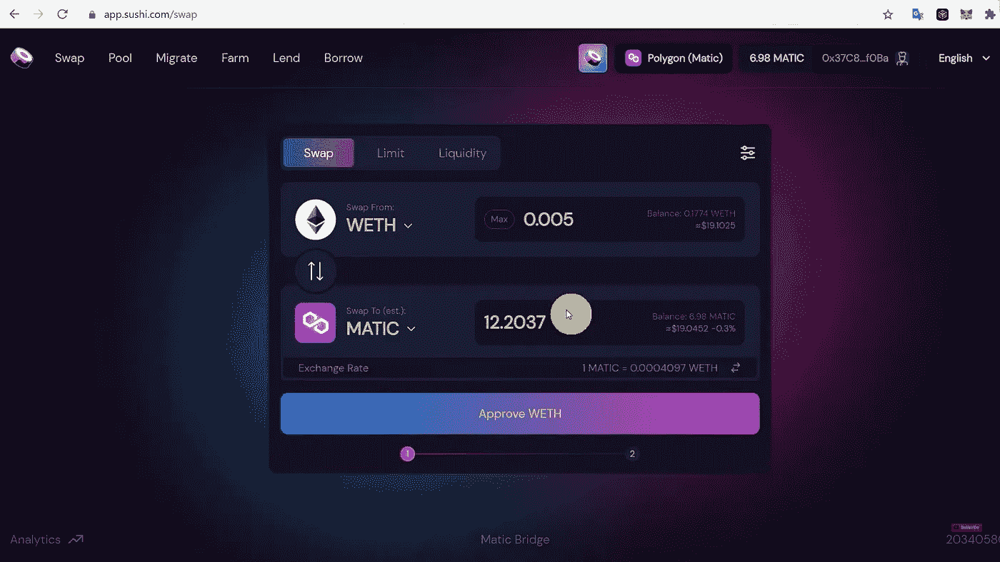

Enter amount to swap

我们会得到上图所示的 12.3037 Matic。

现在点击**批准是否**选项。

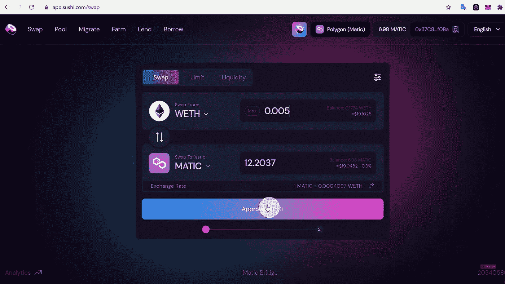

Approve WETH

将出现**元掩码**弹出窗口。你需要**确认**它。它还需要一些交易费，就像你在这张图片中看到的那样。

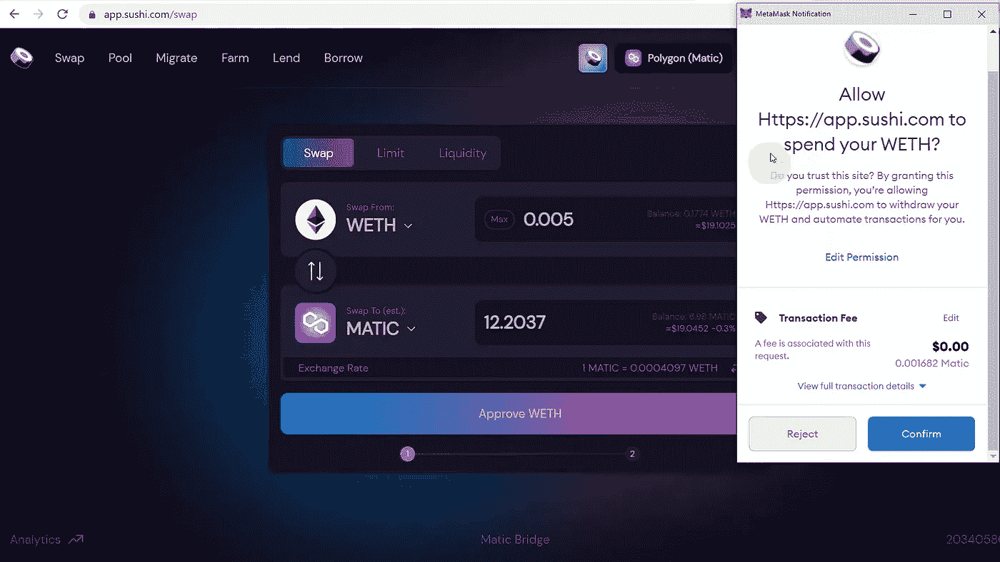

Confirm transaction

会收取 0.001682 Matic。

现在点击**确认**按钮。批准我们需要几秒钟时间。

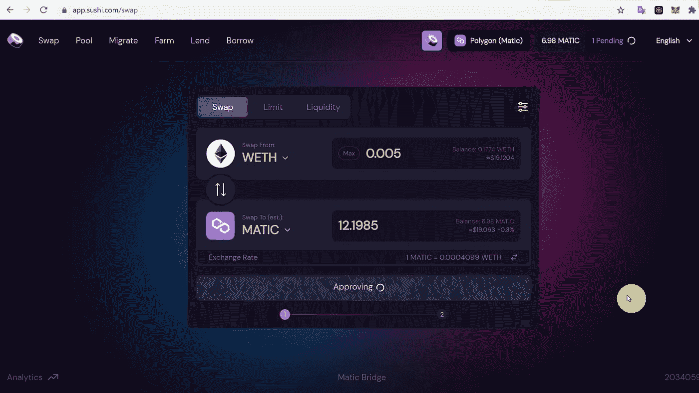

Approve swap

之后，您也可以查看此交易。正如你所看到的**互换**选项。这将启用**交换**按钮选项。

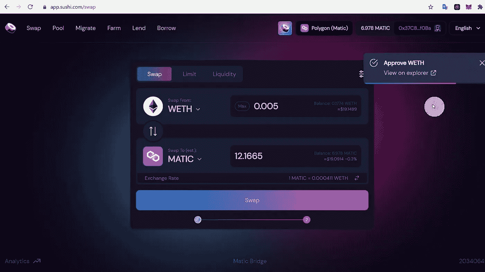

Swap

这是确认信息，你可以看到 12.1665 的 WETH 进入 Matic，你可以在这张图片中看到这么多的费用。

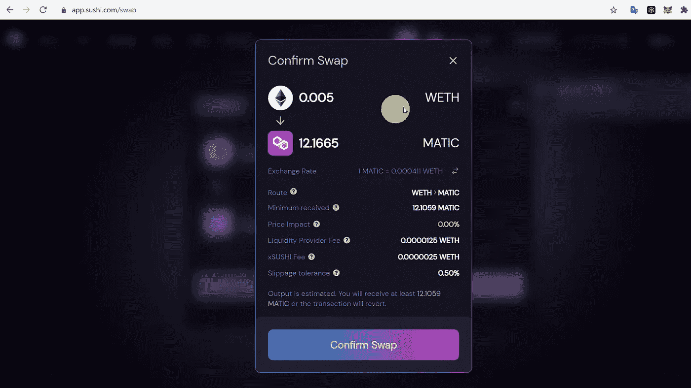

Confirm swap

现在点击**确认交换**。

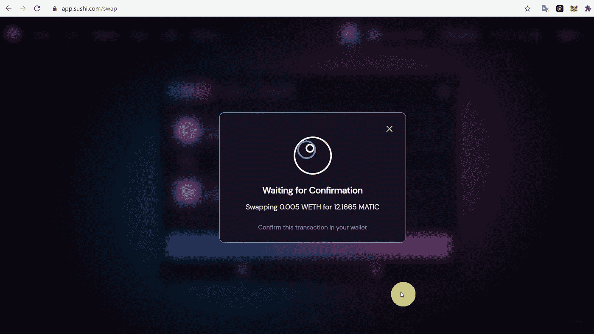

Waiting for confirmation

Metamask 将再次显示确认消息。然后你需要检查它有一些**气体**。

然后点击**确认**并且交易已经**提交**。

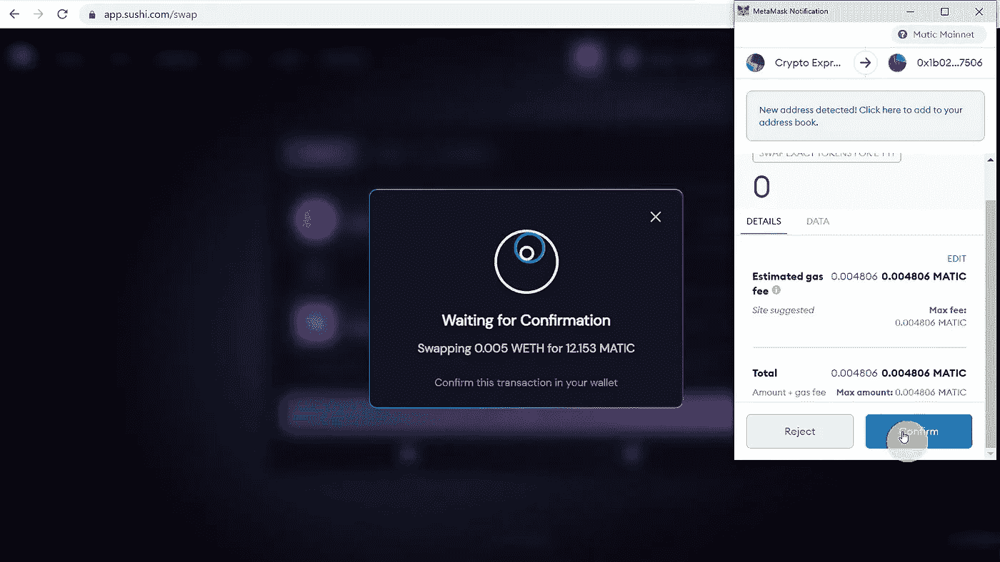

Transaction submitted

您可以通过点击浏览器选项上的**视图，在浏览器上查看该交易。**

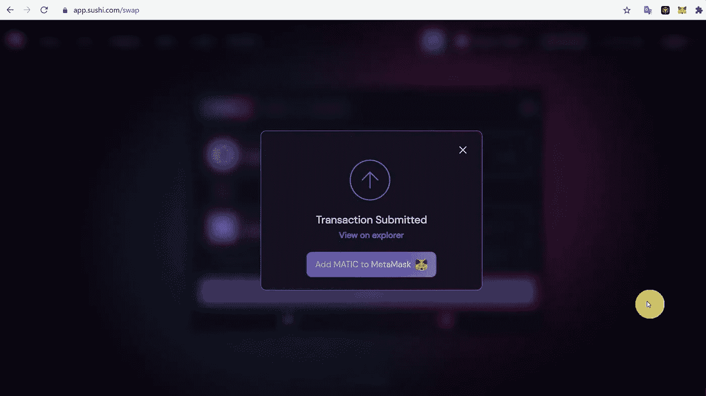

View on explorer

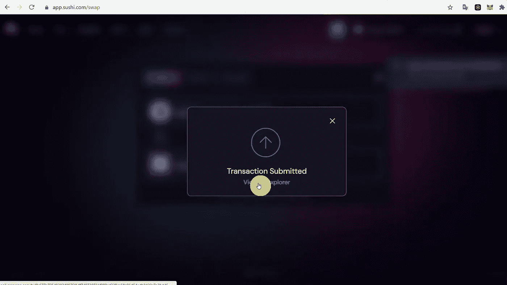

Transaction submitted

这是 polyscan，您可以在这里查看交易。只需刷新页面，您就会看到此交易已被确认。

如你所见，包装好的 eth (WETH)被转换成了 **Matic** 。

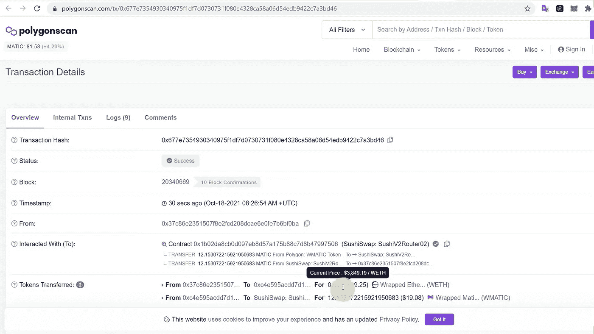

Polyscan

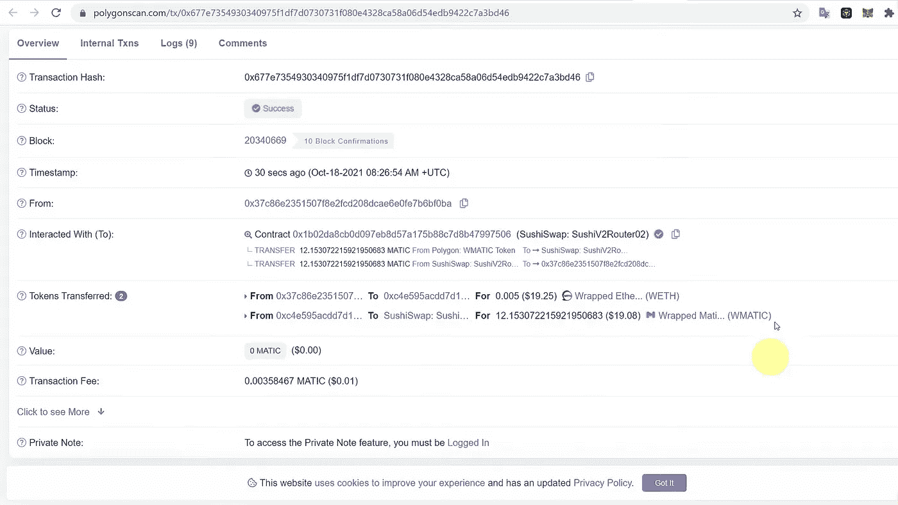

WETH converted into Matic

您也可以在**元掩码**上看到这一点。

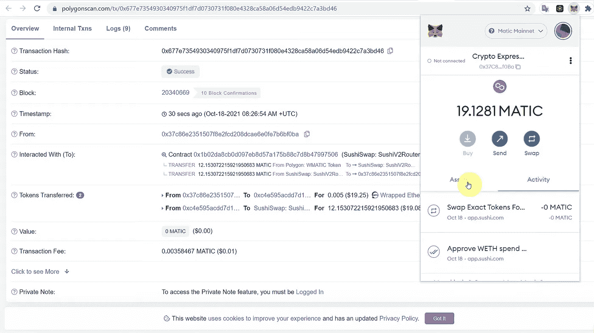

WETH is converted into Matic on Metamask

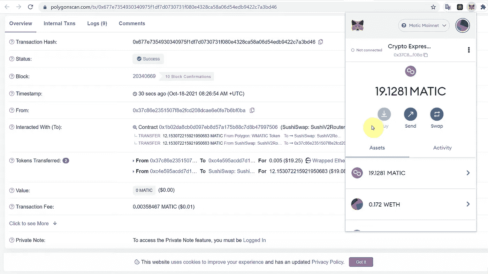

WETH is converted into Matic on Metamask

所以这是 19.1281 **WETH** 成功转换为 **MATIC** 。

# 包裹

在本文中，我们了解了包装以太坊(WETH)，它是如何工作的&它们是如何在多边形网络上转换的。

## 在 LinkedIn 上关注我

[https://www.linkedin.com/in/ishanshahzad/](https://www.linkedin.com/in/ishanshahzad/)