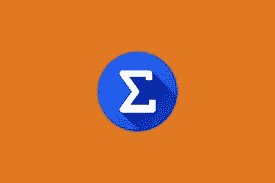

# 如何将 Sumcoin 转换成比特币

> 原文：<https://medium.com/coinmonks/how-to-convert-sumcoin-to-bitcoin-2ddb24e3a43d?source=collection_archive---------10----------------------->

Sumcoin 是一种加密区块链，使用 scrypt 工作证明算法。Sumcoin 实时跟踪所有硬币，其价格是所有市值最高的 100 枚硬币的总和。它是为那些想最大限度地接触加密空间，但只想简单地持有一枚硬币的人准备的，这大大降低了风险因素。

Sumcoin 区块链是一个分散的公共分类账，包含 sum coin 点对点网络上的所有交易。Sumcoins 协议在技术上类似于比特币。比特币区块链是 2009 年向全球推出的第一个加密货币区块链，是必不可少的加密货币商品。使用这种技术，参与者可以确认交易，而不需要中央结算机构。

Sumcoin to BTC

与比特币网络相同，Sumcoin 的支付网络(也称为 Sumcoin 区块链)使用户之间的交易成为可能。该网络使用分布式共识来验证和批准交易，共识是通过运行 Sumcoin 软件的大型高性能计算机(称为矿工)的全球网络达成的。

参与采矿过程的每个矿工都有一份最新的区块链或公共分类账，记录 Sumcoin 历史上的所有交易。每次发现一个新区块，每个矿工的公共分类账副本都会更新。

Sumcoin 目前的价值为 528.80 美元，价格是 100 多种加密货币的平均值，Sumcoin 是为加密爱好者提供的，他们没有足够的加密知识，但希望投资一种风险较低的加密硬币，这将遵循加密市场的总体趋势。

## 我怎样才能把苏姆币兑换成 BTC 币？

将总和兑换成 BTC 最常见的方式是使用加密交换或 P2P(个人对个人)交换平台，如本地比特币等。

加密交换平台您可以将您的 Sumcoin 交易到 BTC:

*   3commas.io
*   Walletinvestors.com
*   Coincodex.com
*   Coingecko.com
*   Coindataflow.com
*   nomics.com

你也可以浏览 P2P 交易平台和本地交易所，让用户将他们的比特币交易到 BTC。

## 用 BTC 换奈拉和塞迪斯

Dart Africa 是一个全自动的加密货币交易平台，由于加密硬币验证和支付之间没有延迟时间，因此允许他们立即向客户支付。Dart Africa 是兑换加密货币的最佳平台之一，如果你在尼日利亚或加纳，他们提供两国当地货币的支付。

有了 Dart Africa，您可以以加密兑换市场上最优惠的汇率兑换您的加密货币。它的平台上有一个自动化的[比率计算器](https://dartafrica.io/coincalculator)，可以给出你想要出售的任何数量的密码的 Naira 和 Cedis 等价物，所有这些都是为了帮助客户的销售体验。

他们设计了自己的平台(网站和移动应用程序)，使不同专业水平的客户可以轻松地在平台上导航和销售他们的密码。浅青色和蓝色的色调给网站带来了令人愉悦的美感，这极大地促进了它伟大的界面。设计的用户体验方面也不缺乏，因为网站和移动应用程序都是为了提高效率而设计的。在[谷歌 Play 商店下载手机应用。](https://play.google.com/store/apps/details?id=com.dartafrica&hl=en_US&gl=US)

Dart Africa 还整合了一个全天候的客户服务系统，以满足客户的加密需求。你可以随时与他们的支持团队沟通，以防你在浏览他们的网站时遇到任何问题，或者你只是想询问。

**达特非洲适合你如果:**

*   您正在寻找加密货币的快速支付方式。
*   你希望你的加密货币有一个有利的贸易利率。
*   易于导航和使用的平台。
*   你想要一个零诈骗概率的平台，
*   你还没有准备好处理 P2P 交换平台的技术性问题。

**如何在 Dart Africa 上销售**

1.  向他们创建一个帐户，如果您已经有帐户，请登录。
2.  首次登录时，创建您的交易 PIN。这将用于验证从您的帐户提款。
3.  导航到出售硬币界面，输入您要出售的加密货币的详细信息。
4.  系统将为您生成一个钱包地址，并将密码发送到钱包。
5.  我们将根据您发送到所提供的钱包中的加密货币金额，向您的帐户存款。

> *加入 Coinmonks* [*电报频道*](https://t.me/coincodecap) *和* [*Youtube 频道*](https://www.youtube.com/c/coinmonks/videos) *了解加密交易和投资*

# 另外，阅读

*   [有哪些交易信号？](https://coincodecap.com/trading-signal) | [Bitstamp vs 比特币基地](https://coincodecap.com/bitstamp-coinbase) | [买索拉纳](https://coincodecap.com/buy-solana)
*   [ProfitFarmers 回顾](https://coincodecap.com/profitfarmers-review) | [如何使用 Cornix 交易机器人](https://coincodecap.com/cornix-trading-bot)
*   [西班牙 5 大最佳文案交易平台](https://coincodecap.com/copy-trading-spain)
*   [Pionex 双重投资](https://coincodecap.com/pionex-dual-investment) | [AdvCash 审查](https://coincodecap.com/advcash-review) | [支持审查](https://coincodecap.com/uphold-review)
*   [面向开发者的 8 个最佳加密货币 API](https://coincodecap.com/best-cryptocurrency-apis)