# 如何将你的艺术转化为 NFT，并在数字艺术市场上出售

> 原文：<https://medium.com/coinmonks/how-to-convert-your-art-into-nft-and-sell-it-on-a-digital-art-marketplace-4d748bec811?source=collection_archive---------21----------------------->

## 本指南旨在帮助独立艺术创作者(或艺术爱好者)在 Opensea 上列出并出售他们的作品

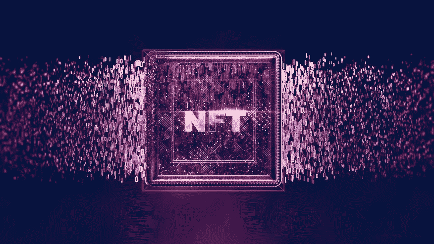

2021 年是 NFTs(不可替代令牌)年，它成为继 ICOs、Defi 和 gaming 之后的下一个加密大事件。在这一年中，我们看到了 NFT 的供应和需求的爆炸式增长，这主要是由元宇宙和零售推动的。

艺术创作者也接受了这一趋势，认为这是通过将他们的作品作为数字艺术出售来接触更多观众的机会。2021 年 4 月，世界知名的**拍卖行、** [苏富比拍卖行在 NFT 首次拍卖了数字艺术家 Pak 的作品](https://www.sothebys.com/en/articles/17-million-realized-in-sothebys-first-nft-sale-with-digital-creator-pak)，带来了 1680 万美元的收入，这一运动获得了更多的关注。

随着我们走向 2022 年，越来越多的不知名(和正在崛起的)艺术家正在将他们的艺术(即素描、摄影、音乐、绘画等)转化为非传统艺术，并在不依赖中介的情况下出售给潜在买家。

# 介绍

NFT **代表**不可替代令牌。ethereum.org 的这句话很好地解释了这一点:

> *NFT 是我们可以用来表示唯一物品所有权的令牌。他们让我们将艺术品、收藏品、甚至房地产等事物符号化。他们一次只能有一个官方所有者，并且他们受到以太坊区块链*的保护——没有人可以修改所有权记录或者复制/粘贴一个新的 NFT。*

***请注意:**尽管大多数 NFT 是在以太坊区块链上创建的，但由于其高昂的燃气费，用户正在寻求其他区块链，如 Polygon(一种二层区块链)来铸造和购买 NFT，而无需支付任何燃气费。

鲜为人知的是，NFT 的存在时间比 2021 年还要长。2014 年，凯文·麦考伊铸造了有史以来第一个不可替代的令牌(NFT)，名为量子，去年苏富比以 147 万美元的价格将其售出，成为头条新闻。

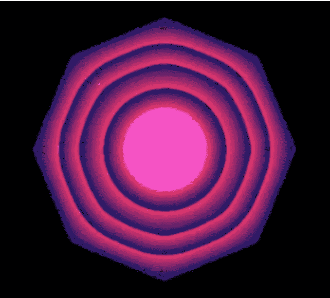

A still from *Quantum* (2014), the first NFT, by Kevin McCoy©

# 如何开始

在一个朋友要求我们帮助他们在一个数字艺术市场上列出并出售他们的热图像收藏后，我们写了这篇文章。我们的目标是创建某种循序渐进的指南，可以被其他在加密/区块链/NFT 方面有任何水平经验的用户使用。

希望你觉得有用！😃

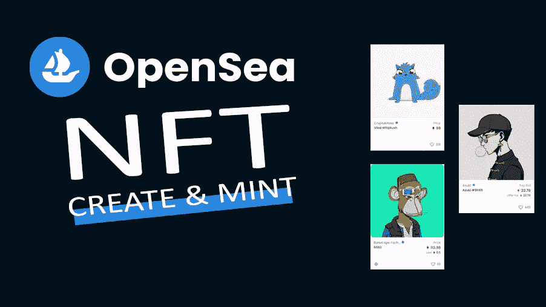

Art by Cryptoverse©

## 配置您的个人资料

重要的事情先来。在开始在 Opensea 上销售之前，您需要设置您的帐户和个人资料，并将您的钱包连接到 Opensea。

以下是如何做到这一点的步骤:

1.  去 https://opensea.io/account。
    你要做的第一件事就是连接你的以太坊钱包。
    *出于本文的目的，我们将使用[元掩码](http://metamask.io)。(如果你还没有设置你的 Metamask 钱包，你可以在[这里](https://opensea.io/blog/learn/how-to-easily-setup-a-metamask-wallet/)找到设置步骤)。
2.  单击元掩码，钱夹将打开，让您输入首次设置钱夹时定义的密码:

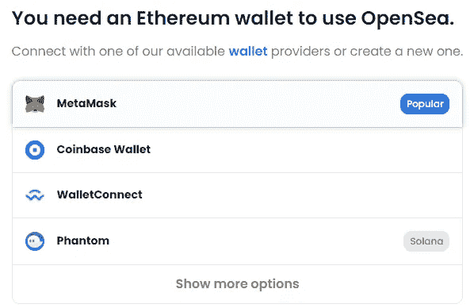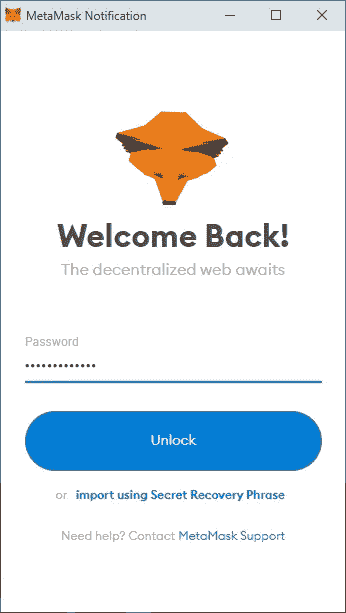

Connecting the Metamask wallet to Opensea

3.连接钱包后，您需要更新您的个人资料以包含您的所有信息:

单击右侧的齿轮图标(设置)打开设置页面:

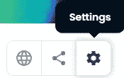

Settings page

并填写尽可能多的字段。您提供的信息越多越好，因为这会吸引更多的买家购买您的 NFTs:

Profile Settings page

**请注意:**你的钱包地址会自动出现在钱包地址栏里(上图我们已经隐藏了)。

配置您的个人资料后，该创建您的第一个收藏了，您可以在其中添加您的 NFT 项目。

# 创建您的第一个收藏

在刊登物品之前，建议你先建立一个收藏，让潜在买家可以看到所有(类似的)物品。

1.  点击您的个人资料图片(在右上角)并选择“我的收藏”选项:

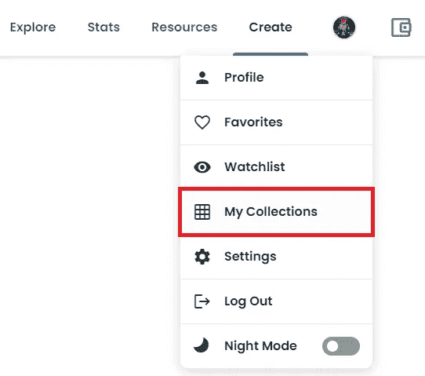

Accessing the Collections page

2.在新页面上，单击“创建收藏”按钮。

3.配置您的集合，注意必填字段(*)。

a.为您的系列定义徽标图像。
我们还建议设置特色图片和横幅图片。

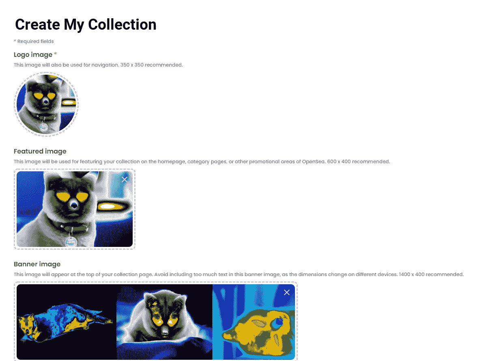

b.为您的收藏命名，设置描述，并为收藏中的项目选择类别。
我们还建议创建个性化的 URL。

c.输入您所有社交媒体页面的链接。这会让你的潜在买家知道你是合法的:

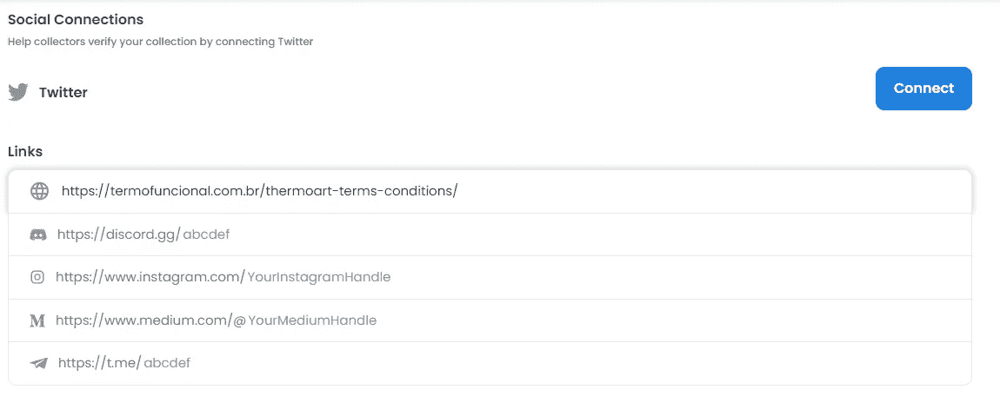

d.设置你的**创造者收益**为每次你的 NFT 在 OpenSea 上出售的最高**10%。这使得创作者在每次交易他们的 NFT 时，他们的在线工作都能得到公平的回报。在我们的例子中，我们将把它设置为 7.5%。**

请注意，OpenSea 将从平台上发生的每笔交易中抽取 2.5%的佣金。要了解更多信息，[请点击此处](https://support.opensea.io/hc/en-us/articles/1500009575482-How-do-creator-earnings-work-on-OpenSea-)。

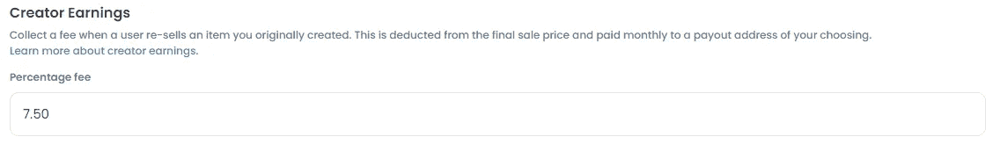

e.选择区块链([以太坊](https://ethereum.org/en/)或无气链，[多边形](https://matic.network/))，您希望默认添加此收藏中的新物品，并定义可用于购买和出售您的无气链的代币:

如果以太坊是您选择的链，您将能够接受数百个代币作为付款:

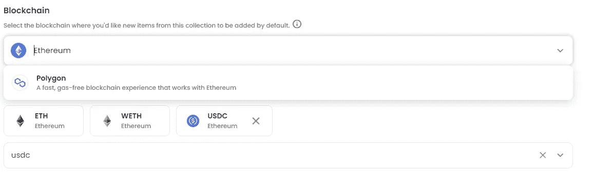

f.为您的收藏项目选择显示主题，然后单击“创建”按钮。

**瞧，你已经创建了你的第一个收藏，现在可以接收你的物品了！**

# 将您的项目添加到收藏中

如果您新创建的收藏没有自动打开，请再次点击您的个人资料图片(位于右上角)，然后选择“我的收藏”。

1.  当您的收藏页面打开时，选择您的收藏开始添加您的项目。然后，单击“添加项目”按钮:

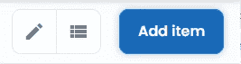

2.配置您的项目，注意必填字段(*):

a.添加您的图像(或视频、音频或 3D 模型)并为您的 NFT 定义一个名称:

b.你的物品将出现的**集合**会自动填充，但你可以随时更改。

你也可以为你的物品定义属性、等级和统计数据。这些特征被大多数 NFT 收藏所采用，有助于确定 NFT 的整体稀有程度及其价值:

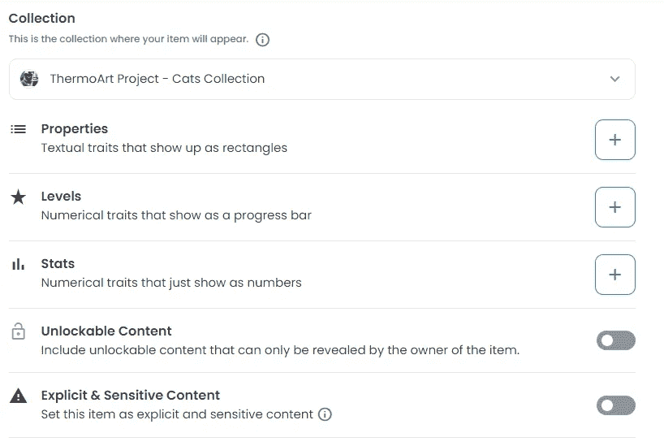

## **属性**

属性是 OpenSea 上最常见的 NFT(文本)特征，并以矩形显示您的 NFT 的主要特征。

例如，对于我们朋友的[系列](https://opensea.io/collection/thermo-cats)，我们定义了以下特征:

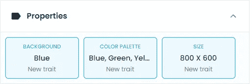

## **级别**

等级是数字特征，以进度条的形式显示给定特征的强度。如果你创造了一个名为“吸引力”的特质，并且最多有 100 个不同的等级，那么用等级来表示它是有意义的。

作为等级特征的一个例子:

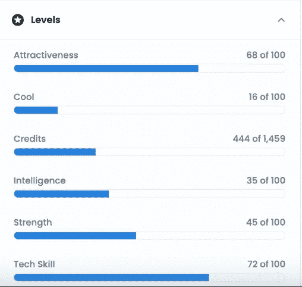

## **统计数据**

统计数据也是数字特征，通常显示给定特征的强度、影响或等级。即使它们和等级特征相似，统计数据也只显示它们的数值，仅此而已。

作为统计特征的一个例子:

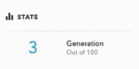

4.接下来，定义你将**铸造多少物品**以及这些物品将被铸造的区块链。

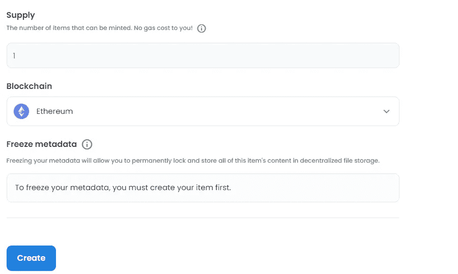

> 铸造是一种在区块链上制造物品的行为，并且需要耗费汽油。使用 OpenSea 的工具铸造是懒惰的，这意味着它只在必要的时候发生:
> 
> 当您将项目转移到另一个帐户时
> 
> 当有人从你这里买了一样东西
> 
> 这意味着你可以在这里免费创作*。*

*5.最后，点击“创建”按钮创建你的第一个项目。*

# *现在是时候列出你的 NFT 出售*

*你已经做到了这一步，所以是时候列出你的 NFT，并希望取得一些销售。*

1.  *打开你新创建的物品，点击“出售”按钮。*
2.  *你可以选择以固定价格或限时拍卖的方式出售你的物品。点击[此处](https://support.opensea.io/hc/en-us/articles/360063498333-How-do-I-list-an-NFT-to-sell-)了解这两种房源的更多信息。
    我们将列出我们的**固定价格**为 0.01，为期 6 个月:*

**

*NFT Lucy The Cat #1*

*3.准备好后，点击“完成列表”按钮。这会开启另一个画面(并启动你的以太坊钱包)来完成你的刊登。*

***请注意:**首次在 OpenSea 上进行销售设置时，您必须初始化您的钱包，这需要一次性支付汽油费。(提示:尽量在汽油费最低的时候这样做——这通常发生在东部时间凌晨和周末)。*

*4.查看钱包中显示的信息，包括总额+第一次将向您收取的油费。确保注册代理是 [https://opensea.io](https://opensea.io) 。*

*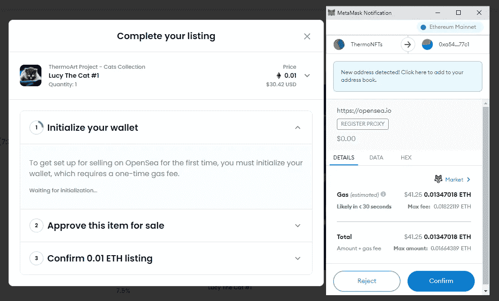*

*Complete your listing — first step*

*5.Opensea 使用 Project Wyvern Exchange 进行投标、报价、购买和销售，因此您需要签署合同。*

*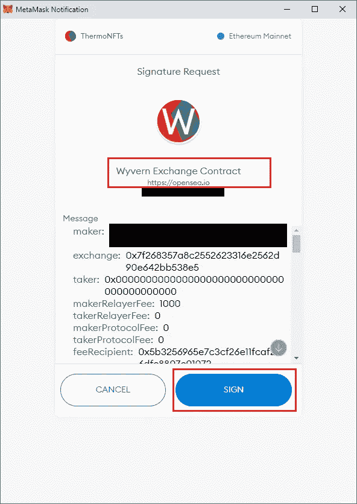*

*Complete your listing — step 2*

*6.如果一切顺利，你的物品将会成功刊登，如下所示:*

*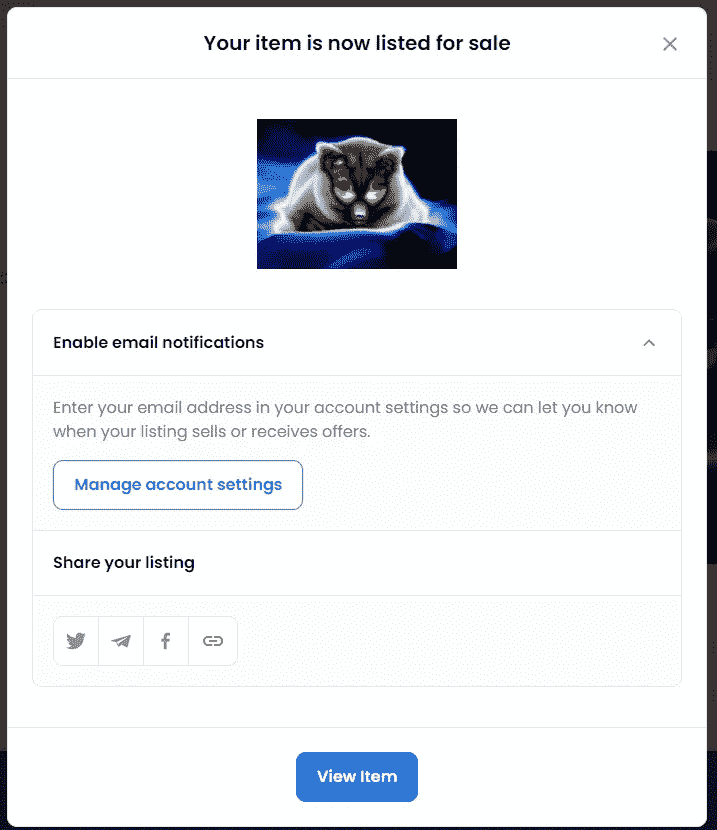*

*Complete your listing — step 3*

*7.点击项目确认**列表**事件:*

*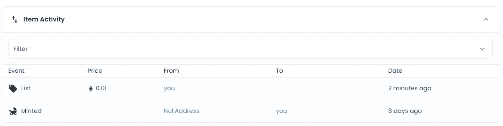*

*Complete your listing — step 4*

*8.对于你列出出售的任何其他项目，你不会被收取任何汽油费。您只需要确认列表:*

*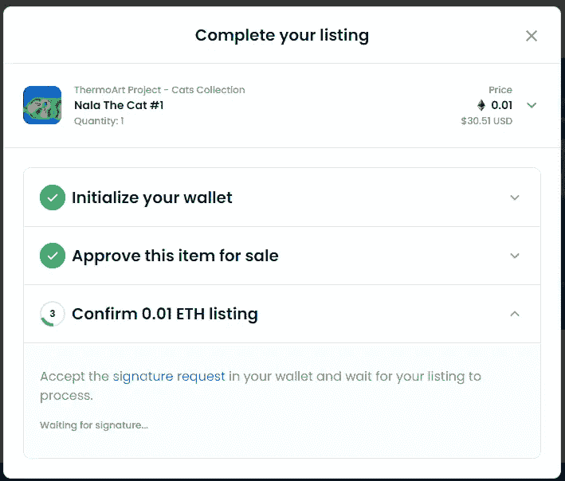*

*Complete your listing — step 5*

# *最后的想法*

*正如我们在上面所看到的，NFTs 为创作者和艺术爱好者提供了无限的机会，他们可以将自己的作品作为数字艺术出售，摆脱了艺术市场的传统运作方式。*

*尽管在过去的几年中，非金融交易存在一些不确定性，但有一点是绝对确定的:**非金融交易将会继续存在**，并将改变我们的生活方式，以及我们拥有、购买、销售、跟踪和管理各种资产的方式。*

> *加入 Coinmonks [电报频道](https://t.me/coincodecap)和 [Youtube 频道](https://www.youtube.com/c/coinmonks/videos)了解加密交易和投资*

# *另外，阅读*

*   *[最佳以太坊钱包](https://coincodecap.com/best-ethereum-wallets) | [电报上的加密货币机器人](https://coincodecap.com/telegram-crypto-bots)*
*   *[交易杠杆代币的最佳交易所](https://coincodecap.com/leveraged-token-exchanges) | [购买弗洛基](https://coincodecap.com/buy-floki-inu-token)*
*   *[3 commas vs Pionex vs Cryptohopper](https://coincodecap.com/3commas-vs-pionex-vs-cryptohopper)|[Bingbon Review](https://coincodecap.com/bingbon-review)*
*   *[加密复制交易平台](/coinmonks/top-10-crypto-copy-trading-platforms-for-beginners-d0c37c7d698c) | [如何在 WazirX 上购买比特币](/coinmonks/buy-bitcoin-on-wazirx-2d12b7989af1)*
*   *[货币评论](https://coincodecap.com/coinloan-review)|[Crypto.com 评论](/coinmonks/crypto-com-review-f143dca1f74c)*