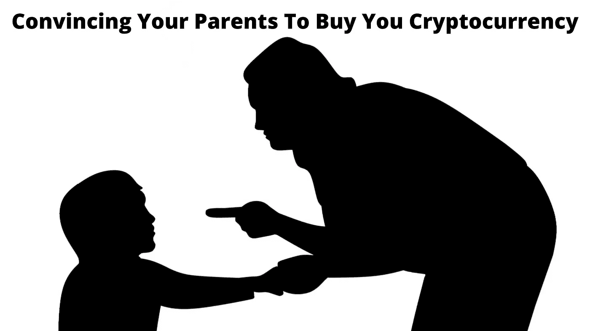
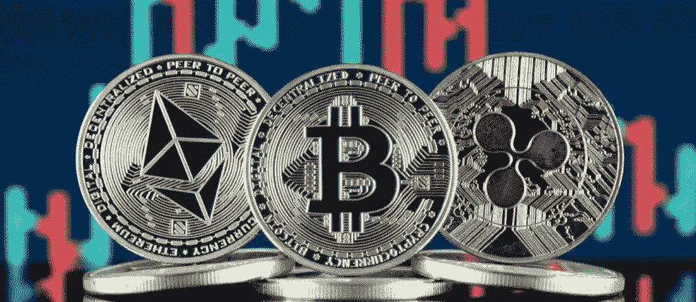
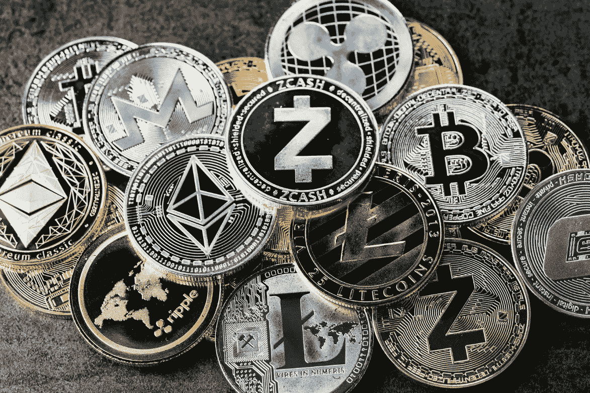

# 如何说服父母给你买加密货币

> 原文：<https://medium.com/coinmonks/how-to-convince-your-parents-to-buy-you-cryptocurrency-890723be2c7f?source=collection_archive---------42----------------------->

加密货币是一种可以购买服务和产品的数字货币或交换机制。您可以将美元兑换成加密货币，就像您将美元兑换成游戏俱乐部代币或街机代币一样。数字货币兑换使用区块链技术保存在公共分类账中，并使用加密技术获得。与由国家银行控制并由货币管理机构监管的传统货币不同，数字货币是分散的。

你父母是不是不喜欢你开始说加密货币？当你试图阐明创新的进步理念或从激烈竞争中独立出来的巨大潜力时，他们的反应是怀疑、轻蔑还是不屑？

本文将澄清一些常见问题和关于加密货币的一般假设。

**加密货币简史**

2008 年，中本聪创造了领先的加密货币比特币(BTC)，并引入了区块链技术。比特币仍然是最容易识别的加密货币，但目前有很多不同的数字货币，包括比特币现金、以太坊、莱特币、Cardano、Dogecoin 和 XRP。而且因为是比特币的替代品，所以被称为 altcoins。加密货币市场也推动了比特币基地等在线经纪商的崛起，让你可以购买不同的数字货币。

**加密货币是如何工作的？**

加密货币的工作原理类似于 PayPal 或信用卡，只是它用数字资产来交换服务和产品，而不是美元或其他法定货币。要交易加密货币，你需要使用一种称为加密货币钱包的数字钱包与合作伙伴兑换货币。加密货币钱包是一种允许您发送和接收资产的产品。您想要访问私钥来完成交易。私钥就像财务报表一样。您可以拥有不同的密钥，并让每项资产都附带这些密钥。交易被记录在一个公共登记簿上，它显示了交易总额，但没有透露交易双方的个人信息。

加密货币挖掘是确认交易的预期交互。它包括计算能力和复杂计算的巨大规模，但通过挖掘有效处理问题的人可以获得奖励硬币、令牌或交易费。

**列出你父母可能有的潜在担忧和问题**

你想了解区块链和加密基础知识，看看加密货币有多独特。

๏ **什么是密码学？**

加密是保护区块链的一种方法。密码，也称为“哈希”，将方块绑定在一起，使它们对黑客来说无懈可击。这些代码类似于受保护的密码。用户制作一个很简单；然而，入侵者获取它几乎是不可理解的。

๏ **区块链是如何运作的？**

区块链是记录加密货币聚合和交换的数据库。它将信息存储在顺序查询中连接或链接在一起的块中。与传统货币或法定货币不同，区块链没有中央管理机构。这是所有加密货币客户都能看到的正确记录。流程被称为工作确认或工作证明，经常被纳入这一系统，以制造新的区块和批准交易。

**找到解决你潜在担忧的最佳方式**

当你有一个关注点的总结时，回顾你的计划。如果你的父母在你们聊天的时候谈论这件事，考虑处理这些情况的方法。这有助于向你所爱的人展示你已经给予了特别的关注。

如果成本是一个问题，你可以申请一份兼职工作来帮助购买加密货币。

如果你的父母时间紧张，检查一下你的时间表。寻找机会每天关注你的加密货币交易，并学习新技术来赚更多的钱。

一直对加密货币感兴趣，坚持学习几个小时。这有助于获得父母的信任。

**如何使用加密货币？**

加密货币的工作方式很像传统货币。你可以说，你可以通过长期持有你购买的货币来进行购买，并将它们视为投资。

**投资:**可以将资源投资于加密货币，以特定价值买入一定数量，在价值增加时再卖出。加密货币的货币价值取决于波动性，这是一种意想不到的快速变化；绝对值或市值可以快速上下波动。

**购物:**可以使用加密货币在网上购买物品，招募人员提供服务。加密货币交易可以针对政府发行的货币或公共货币标准(如美元)进行，并可以兑换各种数字货币。

**使用加密货币前需要牢记的 5 件重要事情？**

虽然比特币已经进入主流，但加密货币的种类已经超过 500 种。请从可信的在线交易所购买，并创建一个数字钱包，以确保交易加密货币时的安全。你可以拿着它或者用它在线购买服务和商品。

1.有很多加密货币交易所。然而，并不是所有的公司都在所有的国家经营。各种组织也提供加密货币，识别不同的支付技术，并收取额外的费用。

2.比较 4、5 家网上交易所，选择最适合自己的。请确保您了解 exchange 界面及其功能，以便正确使用它。由于组织对黑客特别没有抵抗力，所以要仔细评估交易所每个操作的安全性。

> [阅读更多](https://cryptozoom.info/how-to-convince-your-parents-to-buy-you-cryptocurrency/)

> *通过*[*C*rypto zoom](https://cryptozoom.info/)*免费的初学加密指南掌握 web3.0 世界的基础知识，在这里我们深入了解该领域中一些顶级的 NFT、加密和元宇宙项目，以便您在投资前获得信息。*

> 加入 Coinmonks [电报频道](https://t.me/coincodecap)和 [Youtube 频道](https://www.youtube.com/c/coinmonks/videos)了解加密交易和投资

# 另外，阅读

*   [币安 vs FTX](https://coincodecap.com/binance-vs-ftx) | [最佳(SOL)索拉纳钱包](https://coincodecap.com/solana-wallets)
*   [如何在 Uniswap 上交换加密？](https://coincodecap.com/swap-crypto-on-uniswap) | [A-Ads 评论](https://coincodecap.com/a-ads-review)
*   [加密货币储蓄账户](/coinmonks/cryptocurrency-savings-accounts-be3bc0feffbf) | [YoBit 评论](/coinmonks/yobit-review-175464162c62)
*   [Botsfolio vs nap bots vs Mudrex](/coinmonks/botsfolio-vs-napbots-vs-mudrex-c81344970c02)|[gate . io 交流回顾](/coinmonks/gate-io-exchange-review-61bf87b7078f)
*   [CoinFLEX 评论](https://coincodecap.com/coinflex-review) | [AEX 交易所评论](https://coincodecap.com/aex-exchange-review) | [UPbit 评论](https://coincodecap.com/upbit-review)