# 如何创建元掩码钱包—桌面

> 原文：<https://medium.com/coinmonks/how-to-create-a-metamask-wallet-desktop-c3b4efe18bbd?source=collection_archive---------46----------------------->

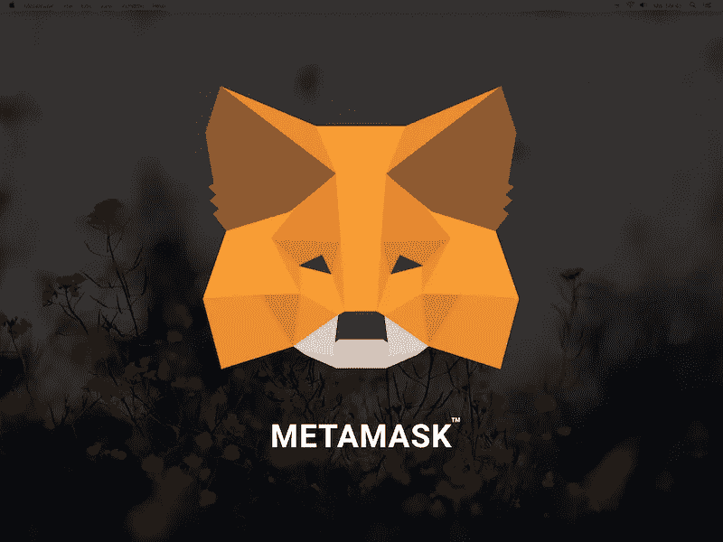

Photo source: [https://www.sketchappsources.com/](https://www.sketchappsources.com/)

对一些人来说，走出传统的金融世界，进入分散金融(DeFi)的世界可能有些可怕，但如果我们想重新更新我们的金融观点，这是完全必要的。

创建一个我们可以存储资金的在线账户是实现这一目标的第一步。让我们一步一步地了解如何制作 MetaMask 钱包。MetaMask 的功能还允许您全天候购买/出售/交易加密资产(包括 NFT 的)。

创建钱包

我们需要一个地方来存放我们所有的资产。为了做到这一点，我们将创建一种银行账户，你有 100%的控制权，永远不会被任何实体冻结或关闭。这叫钱包。

在本指南中，我们将使用元掩码钱包。元掩码是使用最广泛的钱包。

*   在笔记本电脑上，打开浏览器，搜索“Metamask.io”。
*   在左下角，点击“立即下载”。

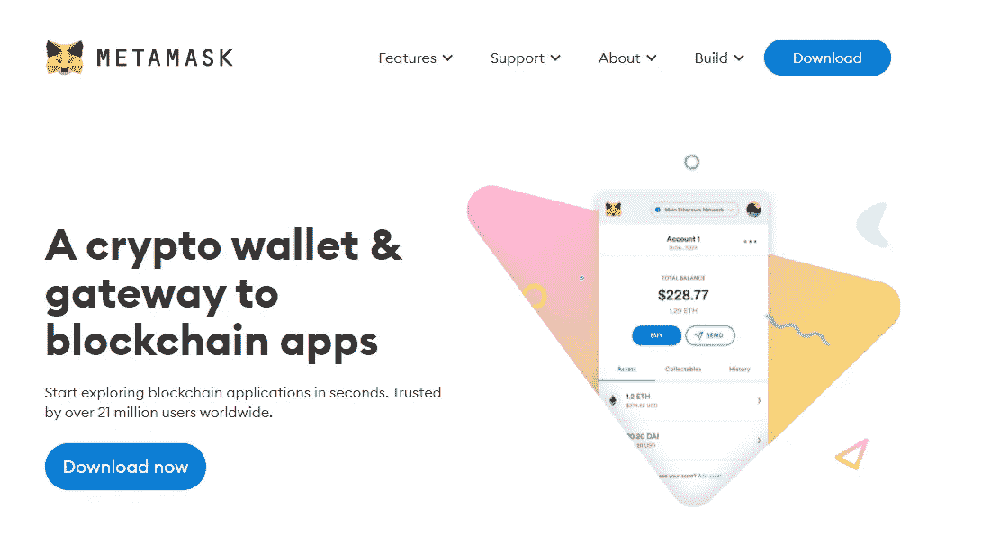

*   在这个例子中，我们将使用 Brave 浏览器，但是你也可以使用 Google Chrome、Firefox 或 Microsoft Edge。
*   单击“为 _____ 安装元掩码”。

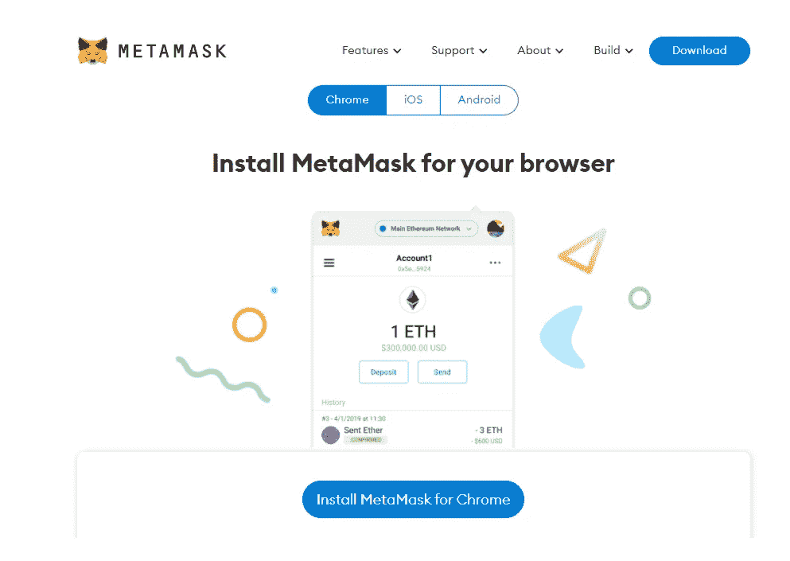

*   您将看到一个类似如下的页面:

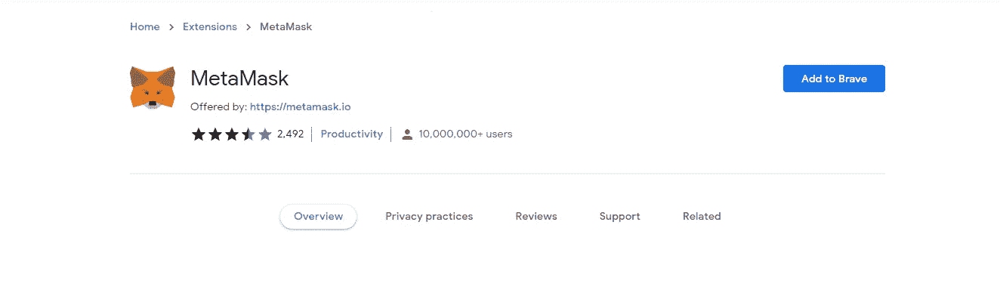

*   在其他浏览器上点击“添加到 _____”或类似的东西。
*   可能会出现一个弹出窗口，询问您是否允许。继续添加扩展。
*   MetaMask 现在将开始下载并将其自身添加到您的浏览器中。
*   你可以点击 fox 的标志或者等待一个二级页面自动出现。

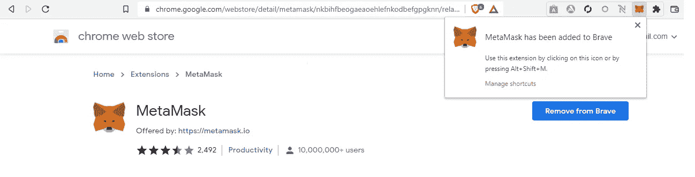

*   当你在屏幕上移动鼠标时，一只狐狸会滑稽地跟着你的鼠标移动。点击“开始”。

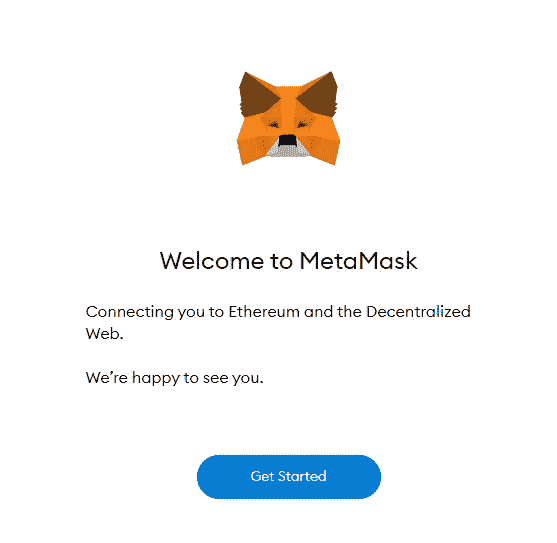

*   在右边，点击“是的，让我们开始设置”下的“创建钱包”!

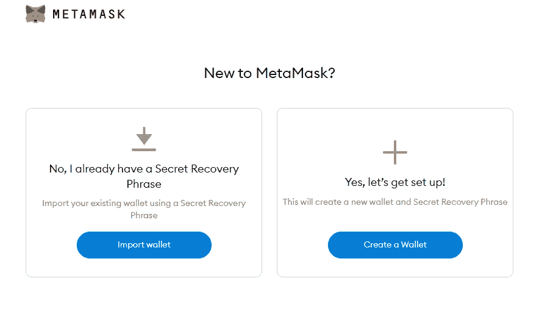

*   系统会提示您一些信息，询问您是否想要改进元掩码。你选择的答案并不重要。

*   创建一个强密码并继续(不要使用您的传统银行密码！).

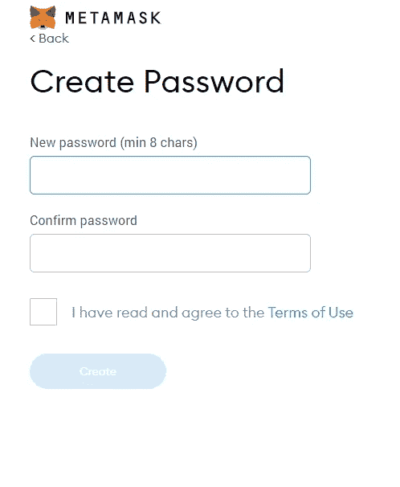

*   然后你会被带到一个页面，在那里你可以选择观看一个短片。我建议您单击“播放”了解我们在以下步骤中将要做的事情。

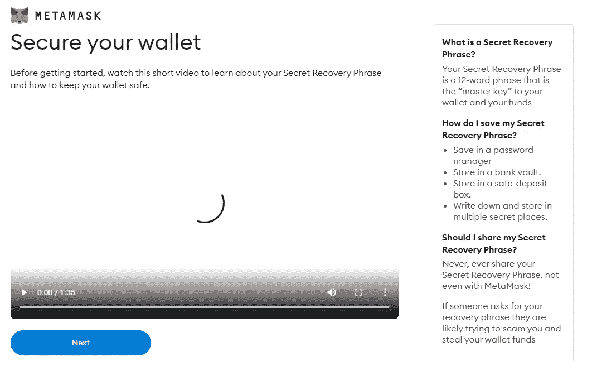

*   这是非常重要的一步。确保你在一个没有被监视的私人区域。
*   点击“点击此处透露密语”。

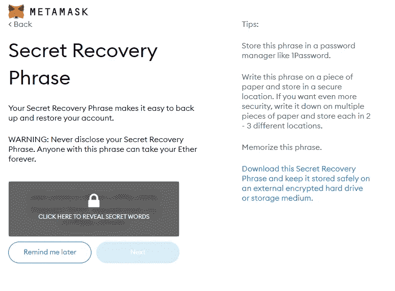

*   你会在英语词典中看到一串看似随意的单词。那是因为他们是！这是完全拥有自己的银行账户的关键，而不必担心你的资产被任何银行或世界政府冻结、扣押或锁定。没有人可以访问你的帐户，除非他们知道这些随机单词！这些随机单词被称为您的种子短语。
*   把这些字母写在一张纸上。不要把它们储存在你的手机或电脑上。如果你的设备被黑或被盗，那么你可以考虑你的种子短语妥协和你的资金不见了。
*   既然您已经按顺序写下了种子短语，请单击“下一步”。
*   现在将提示您按种子短语的顺序点击下面的每个单词。

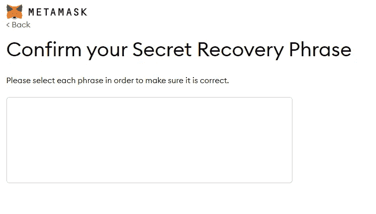

*   完成后点击“确认”。
*   元掩码将显示一条祝贺消息🎊页面。阅读页面上的提示，然后点击“全部完成”。

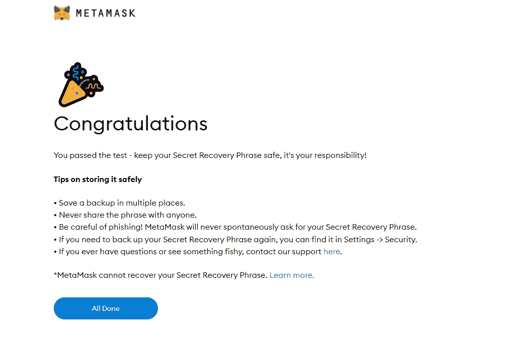

*   你现在已经完成了你自己的钱包！

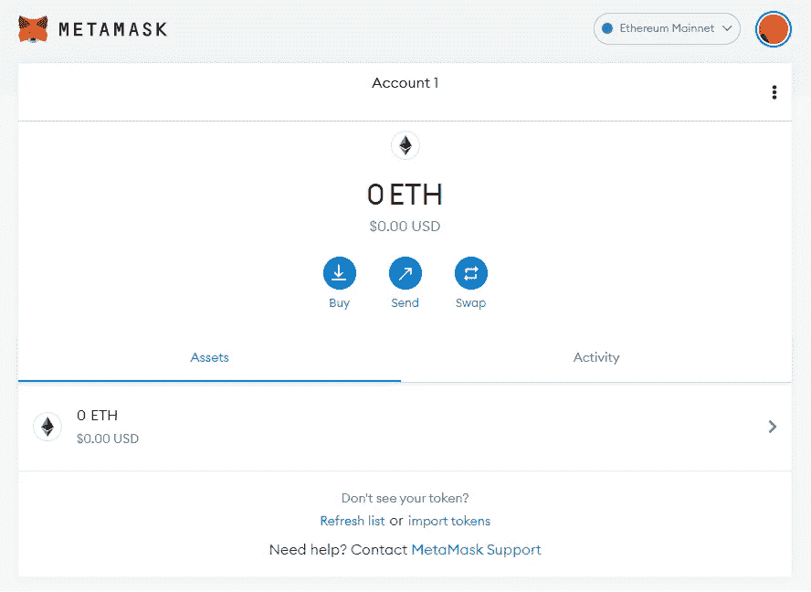

你现在已经迈出了进入 DeFi 世界的第一步！

> 加入 Coinmonks [电报频道](https://t.me/coincodecap)和 [Youtube 频道](https://www.youtube.com/c/coinmonks/videos)了解加密交易和投资

# 另外，阅读

*   [BlockFi vs 摄氏](/coinmonks/blockfi-vs-celsius-vs-hodlnaut-8a1cc8c26630) | [Hodlnaut 点评](/coinmonks/hodlnaut-review-best-way-to-hodl-is-to-earn-interest-on-your-bitcoin-6658a8c19edf) | [KuCoin 点评](https://coincodecap.com/kucoin-review)
*   [Bitsgap 审查](/coinmonks/bitsgap-review-a-crypto-trading-bot-that-makes-easy-money-a5d88a336df2) | [Quadency 审查](/coinmonks/quadency-review-a-crypto-trading-automation-platform-3068eaa374e1) | [Bitbns 审查](/coinmonks/bitbns-review-38256a07e161)
*   [密码本交易平台](/coinmonks/top-10-crypto-copy-trading-platforms-for-beginners-d0c37c7d698c) | [Coinmama 审核](/coinmonks/coinmama-review-ace5641bde6e)
*   [印度的加密交易所](/coinmonks/bitcoin-exchange-in-india-7f1fe79715c9) | [比特币储蓄账户](/coinmonks/bitcoin-savings-account-e65b13f92451)
*   [OKEx vs KuCoin](https://coincodecap.com/okex-kucoin) | [摄氏替代品](https://coincodecap.com/celsius-alternatives) | [如何购买 VeChain](https://coincodecap.com/buy-vechain)
*   [币安期货交易](https://coincodecap.com/binance-futures-trading)|[3 commas vs Mudrex vs eToro](https://coincodecap.com/mudrex-3commas-etoro)