# 如何创建元掩码钱包

> 原文：<https://medium.com/coinmonks/how-to-create-a-metamask-wallet-f0e5e714bb51?source=collection_archive---------19----------------------->

在本文中:

*   什么是 Metamask，为什么需要它？
*   如何设置钱包
*   如何设置 BSC 网络并获得 BSC-BEP20 钱包地址？
*   如何将 Metamask 钱包连接到 8？金融平台

# 什么是 Metamask？你为什么需要它？

Metamask 是一个存储数字资产的钱包，能够连接到 3，700 多个分散的应用程序和 Web 3 服务。

钱包的特性使其在全球范围内广受欢迎(超过 2000 万次安装)。

*   使用方便
*   能够连接到各种 DeFi 项目的 dApps。
*   高安全性，防止入侵者。

关于 Metamask 的想法和功能的更多细节可以在官方演示视频中看到:

[https://www.youtube.com/watch?v=YVgfHZMFFFQ&t = 8s&ab _ channel = meta mask](https://www.youtube.com/watch?v=YVgfHZMFFFQ&t=8s&ab_channel=MetaMask)

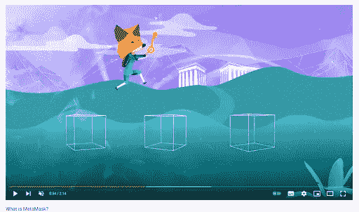

自 2016 年以来，Metamask 已经成为去中心化金融领域的行业标准。

这就是为什么你绝对需要它，如果你想:

*   在 GameFi 中游戏并赢取奖金。
*   存储和交换加密资产
*   在 DeFi 中创造被动收入。
*   在 metaverses 中买卖商品

简而言之，Metamask 绝对是任何进入 MetaFi 美妙新世界的人的必备之物。

# 如何安装元掩码钱包

去官网，metamask.io。

Metamask 提供了几种类型的安装:

*   作为浏览器扩展(受 Chrome、Firefox、Edge、Brave 支持)。
*   作为安卓和苹果智能手机的应用

比如让我们看看如何为 Chrome 浏览器安装 Metamask 作为 app 这是最受欢迎的选择。手机 app 的安装有其特殊性，但流程大体相似。

去 Chrome 应用商店，在那里找到 Metamask，点击添加到 Chrome

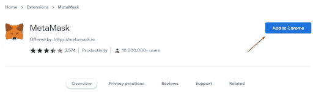

然后，您需要允许 Metamask 使用它工作所需的数据。

这就完成了扩展的安装(我们建议您在扩展设置中固定 Metamask，以便图标出现在扩展面板上)。

现在你需要注册。安装扩展后，初始化窗口应该在浏览器中打开，并带有“开始”按钮。

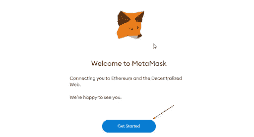

点击它。

所以他们给你一个选择。

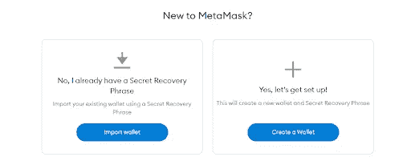

假设你是一个新人，以前没有注册过 Metamask。你点击创建一个钱包。

接下来，你需要接受钱包的政策(比如 Metamask 从不收集个人信息和完整的 IP 地址)。

在下一步中，创建密码。

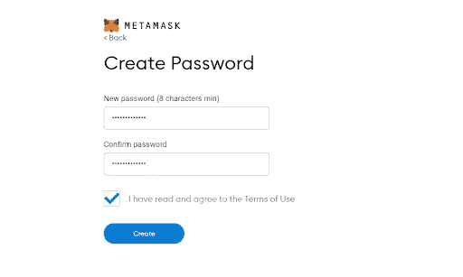

尽管需要创建密码，Metamask 会生成并要求您写下一个 12 个单词的秘密短语。它们将是恢复钱包访问权限的关键。

尽可能负责任地对待它。谁能得到这个秘密短语，谁就能完全控制这个钱包。

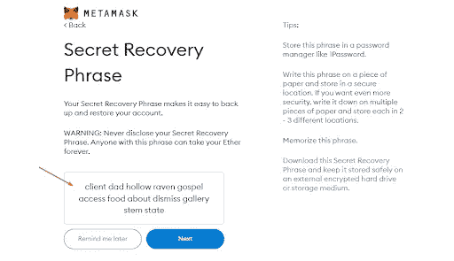

之后，系统会要求您按照正确的顺序重现这 12 个单词，以确保您安全地保存它们。

这就完成了元掩码钱包的注册和创建。

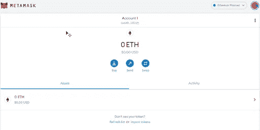

您将获得一个唯一的地址和一个空间，在这里您可以对加密资产进行基本操作—购买、发送和交换。

**提示。**要打开钱包，点击 Chrome 扩展面板上的相应图标。单击“展开视图”在浏览器的单独选项卡上使用钱包；这样更方便。

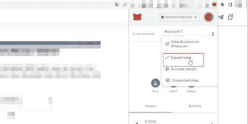

# 如何设置 BSC 网络并获得 BSC-BEP20 钱包地址？

尽管 Metamask 最初是在以太坊区块链上，但它也允许与其他区块链合作，例如 BSC(币安智能链)。

让我们看看如何在 Metamask 中获得一个 BSC-BEP20 Wallet 地址。为此，您需要在钱包设置中添加一个 BSC 网络。

遵循三个步骤:

1.  输入钱包设置
2.  单击网络选项卡。
3.  单击添加网络。

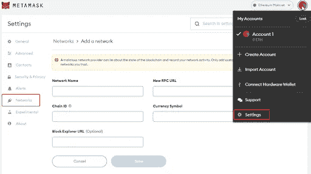

将打开一个表单，您必须在其中输入以下值:

*   网络，名称:智能链
*   新的 RPC 网址:【https://bsc-dataseed.binance.org/ 
*   链条编号:56
*   象征:BNB

区块浏览器网址:【https://bscscan.com 

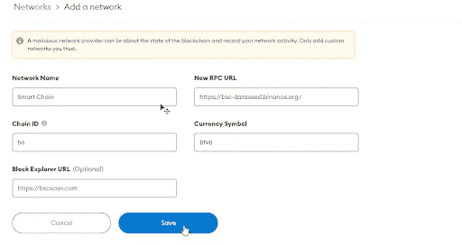

单击保存。Metamask 将尝试连接到 BSC，如果您所做的一切都正确，智能链将出现在支持的网络列表中，BNB 将出现在支持的货币中。

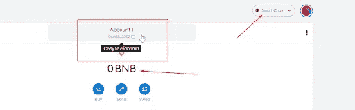

现在，您可以将 BSC 区块链上发行的加密货币资产转移到您的 Metamask 帐户地址。要接收资产，请复制地址并将其交给发送者(例如，交易所或个人)。

您可以将资产从 BSC 区块链((BEP)-20)转移到此地址。BEP-20 是在 BSC 区块链上发行的令牌的标准。您可以使用此地址接收 8F 代币，然后进行兑换或转移。

# 如何将 Metamask 钱包连接到 8。金融平台

八号。金融平台在平衡计分卡区块链上运作。在钱包和平台之间建立连接非常简单。只需点击几下。

为此，请访问网站 8。金融，点击连接钱包。

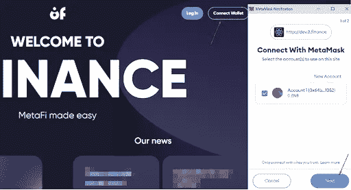

接下来，Metamask 扩展打开并请求允许将您的钱包连接到站点。

单击下一步并连接。

如果你做的一切都正确，你会看到一个弹出窗口，说该网站已连接到钱包。

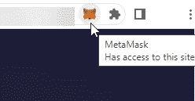

现在你可以充分利用该网站提供的服务。

这篇文章中的数据已经失去了相关性；参见[手册](https://8-finance.gitbook.io/wiki-eng/about/what-is-8.finance)中的当前信息。

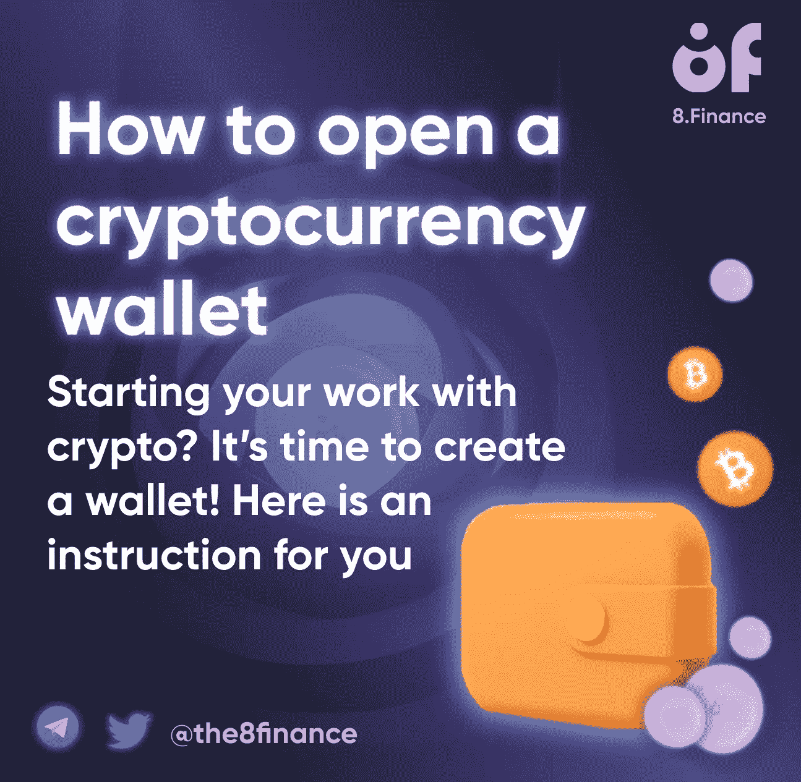

> 加入 Coinmonks [电报频道](https://t.me/coincodecap)和 [Youtube 频道](https://www.youtube.com/c/coinmonks/videos)了解加密交易和投资

# 另外，阅读

*   [从 WazirX 切换到 CoinDCX 的 5 个理由](https://coincodecap.com/reasons-to-switch-from-wazirx-to-coindcx)
*   [Unocoin 评论](https://coincodecap.com/unocoin-review) | [最佳加密赌注硬币](https://coincodecap.com/best-crypto-staking-coins)
*   [如何使用 MetaMask Wallet 获得 KCC 地址？](https://coincodecap.com/kcc-address-metamask)
*   [如何获得自己的。XYZ 领域？](https://coincodecap.com/xyz-domain)
*   [最佳加密交换平台](https://coincodecap.com/best-crypto-swap-platforms) | [最佳加密交易所](https://coincodecap.com/crypto-exchange)